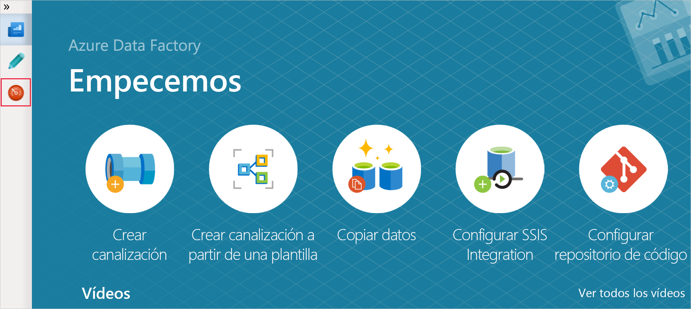
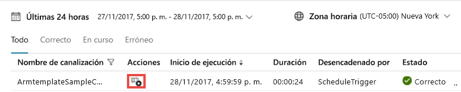
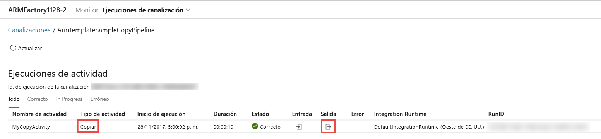

# <a name="tutorial-create-an-azure-data-factory-using-azure-resource-manager-template"></a>Tutorial: Creación de una instancia de Azure Data Factory mediante una plantilla de Azure Resource Manager

> [!div class="op_single_selector" title1="Seleccione la versión del servicio Data Factory que usa:"]
> * [Versión 1](v1/data-factory-build-your-first-pipeline-using-arm.md)
> * [Versión actual](quickstart-create-data-factory-resource-manager-template.md)

En esta guía de inicio rápido se describe cómo usar una plantilla de Azure Resource Manager para crear una instancia de Azure Data Factory. La canalización que ha creado en esta factoría de datos **copia** los datos de una carpeta a otra en Azure Blob Storage. Para ver un tutorial acerca de cómo **transformar** datos mediante Azure Data Factory, consulte [Tutorial: Transformación de datos con Spark](transform-data-using-spark.md).

> [!NOTE]
> En este artículo no se ofrece una introducción detallada al servicio Data Factory. Para ver una introducción al servicio Azure Data Factory, consulte [Introducción al servicio Azure Data Factory](introduction.md).

[!INCLUDE [data-factory-quickstart-prerequisites](../../includes/data-factory-quickstart-prerequisites.md)]

### <a name="azure-powershell"></a>Azure PowerShell

[!INCLUDE [updated-for-az](../../includes/updated-for-az.md)]

Instale los módulos de Azure PowerShell siguiendo las instrucciones de [Cómo instalar y configurar Azure PowerShell](/powershell/azure/install-Az-ps).

## <a name="resource-manager-templates"></a>Plantillas de Resource Manager

Para más información acerca de las plantillas de Azure Resource Manager en general, consulte [Nociones sobre la estructura y la sintaxis de las plantillas de Azure Resource Manager](../azure-resource-manager/resource-group-authoring-templates.md).

En la siguiente sección se proporciona la plantilla completa de Resource Manager para definir las entidades de Data Factory para que pueda ejecutar el tutorial rápidamente y probar la plantilla. Para entender cómo se define cada entidad de Data Factory, consulte la sección [Entidades de Data Factory en la plantilla](#data-factory-entities-in-the-template).

Para obtener información sobre la sintaxis y las propiedades de JSON para los recursos de la factoría de datos en una plantilla, consulte [Tipos de recurso Microsoft.DataFactory](/azure/templates/microsoft.datafactory/allversions).

## <a name="data-factory-json"></a>JSON de Data Factory

Cree un archivo JSON llamado **ADFTutorialARM.json** en la carpeta **C:\ADFTutorial** (cree esta carpeta previamente si no existe) con el siguiente contenido:

```json
{  
    "$schema":"http://schema.management.azure.com/schemas/2015-01-01/deploymentTemplate.json#",
    "contentVersion":"1.0.0.0",
    "parameters":{  
        "dataFactoryName":{  
            "type":"string",
            "metadata":"Data Factory Name"
        },
        "dataFactoryLocation":{  
            "type":"string",
            "defaultValue":"East US",
            "metadata":{  
                "description":"Location of the data factory. Currently, only East US, East US 2, and West Europe are supported. "
            }
        },
        "storageAccountName":{  
            "type":"string",
            "metadata":{  
                "description":"Name of the Azure storage account that contains the input/output data."
            }
        },
        "storageAccountKey":{  
            "type":"securestring",
            "metadata":{  
                "description":"Key for the Azure storage account."
            }
        },
        "triggerStartTime": {
            "type": "string",
            "metadata": {
                "description": "Start time for the trigger."
            }
        },
        "triggerEndTime": {
            "type": "string",
            "metadata": {
                "description": "End time for the trigger."
            }
        }
    },      
    "variables":{  
        "factoryId":"[concat('Microsoft.DataFactory/factories/', parameters('dataFactoryName'))]"
    },
    "resources":[  
        {  
            "name":"[parameters('dataFactoryName')]",
            "apiVersion":"2018-06-01",
            "type":"Microsoft.DataFactory/factories",
            "location":"[parameters('dataFactoryLocation')]",
            "identity":{  
                "type":"SystemAssigned"
            },
            "resources":[  
                {  
                    "name":"[concat(parameters('dataFactoryName'), '/ArmtemplateStorageLinkedService')]",
                    "type":"Microsoft.DataFactory/factories/linkedServices",
                    "apiVersion":"2018-06-01",
                    "properties":{  
                        "annotations":[  

                        ],
                        "type":"AzureBlobStorage",
                        "typeProperties":{  
                            "connectionString":"[concat('DefaultEndpointsProtocol=https;AccountName=',parameters('storageAccountName'),';AccountKey=',parameters('storageAccountKey'))]"
                        }
                    },
                    "dependsOn":[  
                        "[parameters('dataFactoryName')]"
                    ]
                },
                {  
                    "name":"[concat(parameters('dataFactoryName'), '/ArmtemplateTestDatasetIn')]",
                    "type":"Microsoft.DataFactory/factories/datasets",
                    "apiVersion":"2018-06-01",
                    "properties":{  
                        "linkedServiceName":{  
                            "referenceName":"ArmtemplateStorageLinkedService",
                            "type":"LinkedServiceReference"
                        },
                        "annotations":[  

                        ],
                        "type":"Binary",
                        "typeProperties":{  
                            "location":{  
                                "type":"AzureBlobStorageLocation",
                                "fileName":"emp.txt",
                                "folderPath":"input",
                                "container":"adftutorial"
                            }
                        }
                    },
                    "dependsOn":[  
                        "[parameters('dataFactoryName')]",
                        "[concat(variables('factoryId'), '/linkedServices/ArmtemplateStorageLinkedService')]"
                    ]
                },
                {  
                    "name":"[concat(parameters('dataFactoryName'), '/ArmtemplateTestDatasetOut')]",
                    "type":"Microsoft.DataFactory/factories/datasets",
                    "apiVersion":"2018-06-01",
                    "properties":{  
                        "linkedServiceName":{  
                            "referenceName":"ArmtemplateStorageLinkedService",
                            "type":"LinkedServiceReference"
                        },
                        "annotations":[  

                        ],
                        "type":"Binary",
                        "typeProperties":{  
                            "location":{  
                                "type":"AzureBlobStorageLocation",
                                "folderPath":"output",
                                "container":"adftutorial"
                            }
                        }
                    },
                    "dependsOn":[  
                        "[parameters('dataFactoryName')]",
                        "[concat(variables('factoryId'), '/linkedServices/ArmtemplateStorageLinkedService')]"
                    ]
                },
                {  
                    "name":"[concat(parameters('dataFactoryName'), '/ArmtemplateSampleCopyPipeline')]",
                    "type":"Microsoft.DataFactory/factories/pipelines",
                    "apiVersion":"2018-06-01",
                    "properties":{  
                        "activities":[  
                            {  
                                "name":"MyCopyActivity",
                                "type":"Copy",
                                "dependsOn":[  

                                ],
                                "policy":{  
                                    "timeout":"7.00:00:00",
                                    "retry":0,
                                    "retryIntervalInSeconds":30,
                                    "secureOutput":false,
                                    "secureInput":false
                                },
                                "userProperties":[  

                                ],
                                "typeProperties":{  
                                    "source":{  
                                        "type":"BinarySource",
                                        "storeSettings":{  
                                            "type":"AzureBlobStorageReadSettings",
                                            "recursive":true
                                        }
                                    },
                                    "sink":{  
                                        "type":"BinarySink",
                                        "storeSettings":{  
                                            "type":"AzureBlobStorageWriteSettings"
                                        }
                                    },
                                    "enableStaging":false
                                },
                                "inputs":[  
                                    {  
                                        "referenceName":"ArmtemplateTestDatasetIn",
                                        "type":"DatasetReference",
                                        "parameters":{  

                                        }
                                    }
                                ],
                                "outputs":[  
                                    {  
                                        "referenceName":"ArmtemplateTestDatasetOut",
                                        "type":"DatasetReference",
                                        "parameters":{  

                                        }
                                    }
                                ]
                            }
                        ],
                        "annotations":[  

                        ]
                    },
                    "dependsOn":[  
                        "[parameters('dataFactoryName')]",
                        "[concat(variables('factoryId'), '/datasets/ArmtemplateTestDatasetIn')]",
                        "[concat(variables('factoryId'), '/datasets/ArmtemplateTestDatasetOut')]"
                    ]
                },
                {  
                    "name":"[concat(parameters('dataFactoryName'), '/ArmTemplateTestTrigger')]",
                    "type":"Microsoft.DataFactory/factories/triggers",
                    "apiVersion":"2018-06-01",
                    "properties":{  
                        "annotations":[  

                        ],
                        "runtimeState":"Started",
                        "pipelines":[  
                            {  
                                "pipelineReference":{  
                                    "referenceName":"ArmtemplateSampleCopyPipeline",
                                    "type":"PipelineReference"
                                },
                                "parameters":{  

                                }
                            }
                        ],
                        "type":"ScheduleTrigger",
                        "typeProperties":{  
                            "recurrence":{  
                                "frequency":"Hour",
                                "interval":1,
                                "startTime":"[parameters('triggerStartTime')]",
                                "endTime":"[parameters('triggerEndTime')]",
                                "timeZone":"UTC"
                            }
                        }
                    },
                    "dependsOn":[  
                        "[parameters('dataFactoryName')]",
                        "[concat(variables('factoryId'), '/pipelines/ArmtemplateSampleCopyPipeline')]"
                    ]
                }
            ]
        }
    ]
}
```
## <a name="parameters-json"></a>Parámetros JSON

Cree un archivo JSON denominado **ADFTutorialARM Parameters.json** que contenga parámetros para la plantilla de Azure Resource Manager.

> [!IMPORTANT]
> - Especifique el nombre y la clave de la cuenta de Azure Storage para los parámetros **storageAccountName** y **storageAccountKey** en este archivo de parámetros. Ha creado el contenedor adftutorial y ha cargado el archivo de ejemplo (emp.txt) en la carpeta de entrada en esta instancia de Azure Blob Storage.
> - Especifique un nombre globalmente único para el generador de datos para el parámetro **dataFactoryName**. Por ejemplo:  ARMTutorialFactoryJohnDoe11282017.
> - En **triggerStartTime**, especifique el día actual con el formato: `2019-09-08T00:00:00`.
> - En **triggerEndTime**, especifique el día siguiente con el formato: `2019-09-09T00:00:00`. También puede comprobar la hora UTC actual y especificar la hora, o dos horas, siguiente como hora de finalización. Por ejemplo, si la hora UTC actual es 1:32 a. m., especifique `2019-09-09:03:00:00` como la hora de finalización. En ese caso, el desencadenador ejecuta la canalización dos veces (a las 2 a. m. y a las 3 a. m.).

```json
{  
    "$schema":"https://schema.management.azure.com/schemas/2015-01-01/deploymentParameters.json#",
    "contentVersion":"1.0.0.0",
    "parameters":{  
        "dataFactoryName":{  
            "value":"<datafactoryname>"
        },
        "dataFactoryLocation":{  
            "value":"East US"
        },
        "storageAccountName":{  
            "value":"<yourstorageaccountname>"
        },
        "storageAccountKey":{  
            "value":"<yourstorageaccountkey>"
        },
        "triggerStartTime":{  
            "value":"2019-09-08T11:00:00"
        },
        "triggerEndTime":{  
            "value":"2019-09-08T14:00:00"
        }
    }
}
```

> [!IMPORTANT]
> Puede tener archivos JSON de parámetros independientes para los entornos de desarrollo, pruebas y producción, que puede usar con la misma plantilla JSON de Data Factory. Al usar un script de PowerShell, puede automatizar la implementación de las entidades de Data Factory en estos entornos.

## <a name="deploy-data-factory-entities"></a>Implementación de entidades de Data Factory

En PowerShell, ejecute el siguiente comando para implementar las entidades de Data Factory en el grupo de recursos (en este caso, tome AdFTutorialResourceGroup como ejemplo) mediante la plantilla de Resource Manager que ha creado en este inicio rápido.

```powershell
New-AzResourceGroupDeployment -Name MyARMDeployment -ResourceGroupName ADFTutorialResourceGroup -TemplateFile C:\ADFTutorial\ADFTutorialARM.json -TemplateParameterFile C:\ADFTutorial\ADFTutorialARM-Parameters.json
```

El resultado se parecerá al del ejemplo siguiente:

```console
DeploymentName          : MyARMDeployment
ResourceGroupName       : ADFTutorialResourceGroup
ProvisioningState       : Succeeded
Timestamp               : 9/8/2019 10:52:29 AM
Mode                    : Incremental
TemplateLink            : 
Parameters              : 
                          Name                   Type                       Value     
                          =====================  =========================  ==========
                          dataFactoryName        String                     <data factory name>
                          dataFactoryLocation    String                     East US   
                          storageAccountName     String                     <storage account name>
                          storageAccountKey      SecureString                         
                          triggerStartTime       String                     9/8/2019 11:00:00 AM
                          triggerEndTime         String                     9/8/2019 2:00:00 PM
                          
Outputs                 : 
DeploymentDebugLogLevel : 
```

## <a name="start-the-trigger"></a>Inicio del desencadenador

La plantilla implementa las siguientes entidades de Data Factory:

- Servicio vinculado de Azure Storage
- Conjuntos de datos binarios (entrada y salida)
- Canalización con actividad de copia
- Desencadenador para desencadenar la canalización

El desencadenador implementado está en estado detenido. Una de las formas de iniciar el desencadenador consiste en usar el cmdlet de PowerShell **Start-AzDataFactoryV2Trigger**. El procedimiento siguiente proporciona los pasos detallados:

1. En la ventana de PowerShell, cree una variable que contenga el nombre del grupo de recursos. Copie el siguiente comando en la ventana de PowerShell y presione ENTRAR. Si ha especificado otro nombre de grupo de recursos en el comando New-AzResourceGroupDeployment, actualice el valor aquí.

    ```powershell
    $resourceGroupName = "ADFTutorialResourceGroup"
    ```
2. Cree una variable que contenga el nombre de la factoría de datos. Especifique el mismo nombre que especificó en el archivo ADFTutorialARM Parameters.json.

    ```powershell
    $dataFactoryName = "<yourdatafactoryname>"
    ```
3. Establezca una variable para el nombre del desencadenador. El nombre del desencadenador está codificado de forma rígida en el archivo de plantilla de Resource Manager (ADFTutorialARM.json).

    ```powershell
    $triggerName = "ArmTemplateTestTrigger"
    ```
4. Obtenga el **estado del desencadenador**, para lo que debe ejecutar el siguiente comando de PowerShell después de especificar el nombre de la factoría de datos y del desencadenador:

    ```powershell
    Get-AzDataFactoryV2Trigger -ResourceGroupName $resourceGroupName -DataFactoryName $dataFactoryName -Name $triggerName
    ```

    Este es la salida de ejemplo:

    ```json

    TriggerName       : ArmTemplateTestTrigger
    ResourceGroupName : ADFTutorialResourceGroup
    DataFactoryName   : ADFQuickstartsDataFactory0905
    Properties        : Microsoft.Azure.Management.DataFactory.Models.ScheduleTrigger
    RuntimeState      : Stopped
    ```
    
    Tenga en cuenta que el estado del runtime del desencadenador es **Detenido**.
5. **Inicio del desencadenador**. El desencadenador ejecuta la canalización que se define en la plantilla a la hora. Es decir, si este comando se ejecutó a las 2:25 p. m., el desencadenador ejecuta la canalización la primera vez a las 3 p. m. Luego, ejecuta la canalización cada hora hasta la hora de finalización que se especificó para el desencadenador.

    ```powershell
    Start-AzDataFactoryV2Trigger -ResourceGroupName $resourceGroupName -DataFactoryName $dataFactoryName -TriggerName $triggerName
    ```
    
    Este es la salida de ejemplo:
    
    ```console
    Confirm
    Are you sure you want to start trigger 'ArmTemplateTestTrigger' in data factory 'ARMFactory1128'?
    [Y] Yes  [N] No  [S] Suspend  [?] Help (default is "Y"): y
    True
    ```
6. Confirme que el desencadenador se ha iniciado, para lo que debe volver a ejecutar el comando Get-AzDataFactoryV2Trigger.

    ```powershell
    Get-AzDataFactoryV2Trigger -ResourceGroupName $resourceGroupName -DataFactoryName $dataFactoryName -TriggerName $triggerName
    ```
    
    Este es la salida de ejemplo:
    
    ```console
    TriggerName       : ArmTemplateTestTrigger
    ResourceGroupName : ADFTutorialResourceGroup
    DataFactoryName   : ADFQuickstartsDataFactory0905
    Properties        : Microsoft.Azure.Management.DataFactory.Models.ScheduleTrigger
    RuntimeState      : Started
    ```

## <a name="monitor-the-pipeline"></a>Supervisar la canalización

1. Después de iniciar sesión en [Azure Portal](https://portal.azure.com/), haga clic en **Todos los servicios**, busque la palabra clave, como **data fa**, y seleccione **Factorías de datos**.

2. En la página **Factorías de datos**, haga clic en la factoría de datos que ha creado. Si es necesario, filtre la lista por el nombre de su factoría de datos.

3. En la página Data Factory, haga clic en el icono de **creación y supervisión**.

4. En la página **Comencemos**, seleccione la **pestaña Supervisar**.  

    > [!IMPORTANT]
    > Verá que la canalización se ejecuta solo en a las horas en punto (por ejemplo, 4 a. m., 5 a. m., 6 a. m., etc). Haga clic en **Actualizar** en la barra de herramientas para actualizar la lista cuando la hora que alcance la hora siguiente.

5. Haga clic en el vínculo **View Activity Runs** (Ver ejecuciones de actividad) en la columna **Actions** (Acciones).

    

6. Vea las ejecuciones de actividad asociadas con la ejecución de la canalización. En este inicio rápido, la canalización tiene solo una actividad del tipo: Copy. Por consiguiente, se ve una ejecución de dicha actividad.

    
7. Haga clic en el vínculo de **salida** en la columna Actions (Acciones). Se ve el resultado de la operación de copia en la ventana de **salida**. Haga clic en el botón de maximizar para ver la salida completa. Puede cerrar la ventana de salida maximizada.

8. Una vez que vea que la ejecución se ha realizado correctamente o se ha producido errores, detenga el desencadenador. El desencadenador ejecuta la canalización cada hora. La canalización copia el mismo archivo de la carpeta de entrada a la carpeta de salida en cada ejecución. Para detener el desencadenador, escriba el siguiente comando en la ventana de PowerShell.
    
    ```powershell
    Stop-AzDataFactoryV2Trigger -ResourceGroupName $resourceGroupName -DataFactoryName $dataFactoryName -Name $triggerName
    ```

[!INCLUDE [data-factory-quickstart-verify-output-cleanup.md](../../includes/data-factory-quickstart-verify-output-cleanup.md)]

## <a name="data-factory-entities-in-the-template"></a>Definiciones de JSON para entidades

Las siguientes entidades de Data Factory se definen en la plantilla JSON:

- [Servicio vinculado de Azure Storage](#azure-storage-linked-service)
- [Conjunto de datos de entrada binarios](#binary-input-dataset)
- [Conjunto de datos de salida binarios](#binary-output-dataset)
- [Canalización de datos con una actividad de copia](#data-pipeline)
- [Desencadenador](#trigger)

#### <a name="azure-storage-linked-service"></a>Servicio vinculado de Azure Storage

AzureStorageLinkedService vincula una cuenta de Azure Storage a la factoría de datos. Como parte de los requisitos previos, ha creado un contenedor y ha cargado datos en esta cuenta de almacenamiento. Especifique el nombre y la clave de la cuenta de almacenamiento de Azure en esta sección. Consulte [Servicio vinculado de Azure Storage](connector-azure-blob-storage.md#linked-service-properties) para más información sobre las propiedades JSON usadas para definir un servicio vinculado de Azure Storage.

```json
{  
    "name":"[concat(parameters('dataFactoryName'), '/ArmtemplateStorageLinkedService')]",
    "type":"Microsoft.DataFactory/factories/linkedServices",
    "apiVersion":"2018-06-01",
    "properties":{  
        "annotations":[  

        ],
        "type":"AzureBlobStorage",
        "typeProperties":{  
            "connectionString":"[concat('DefaultEndpointsProtocol=https;AccountName=',parameters('storageAccountName'),';AccountKey=',parameters('storageAccountKey'))]"
        }
    },
    "dependsOn":[  
        "[parameters('dataFactoryName')]"
    ]
}
```

ConnectionString utiliza los parámetros storageAccountName y storageAccountKey. Los valores de estos parámetros se pasan mediante el uso de un archivo de configuración. La definición también usa las variables azureStroageLinkedService y dataFactoryName definidas en la plantilla.

#### <a name="binary-input-dataset"></a>Conjunto de datos de entrada binarios

El servicio vinculado Azure Storage especifica la cadena de conexión que el servicio Data Factory utiliza en tiempo de ejecución para conectarse a su cuenta de Azure Storage. En la definición del conjunto de datos binarios, especifique los nombres del contenedor de blobs, la carpeta y el archivo que contiene los datos de entrada. Consulte las [propiedades del conjunto de datos binarios](format-binary.md#dataset-properties) para más información sobre las propiedades JSON usadas para definir un conjunto de datos binario.

```json
{  
    "name":"[concat(parameters('dataFactoryName'), '/ArmtemplateTestDatasetIn')]",
    "type":"Microsoft.DataFactory/factories/datasets",
    "apiVersion":"2018-06-01",
    "properties":{  
        "linkedServiceName":{  
            "referenceName":"ArmtemplateStorageLinkedService",
            "type":"LinkedServiceReference"
        },
        "annotations":[  

        ],
        "type":"Binary",
        "typeProperties":{  
            "location":{  
                "type":"AzureBlobStorageLocation",
                "fileName":"emp.txt",
                "folderPath":"input",
                "container":"adftutorial"
            }
        }
    },
    "dependsOn":[  
        "[parameters('dataFactoryName')]",
        "[concat(variables('factoryId'), '/linkedServices/ArmtemplateStorageLinkedService')]"
    ]
}
```

#### <a name="binary-output-dataset"></a>Conjunto de datos de salida binarios

Especifique el nombre de la carpeta en la instancia de Azure Blob Storage que contiene los datos copiados desde la carpeta de entrada. Consulte las [propiedades del conjunto de datos binarios](format-binary.md#dataset-properties) para más información sobre las propiedades JSON usadas para definir un conjunto de datos binario.

```json
{  
    "name":"[concat(parameters('dataFactoryName'), '/ArmtemplateTestDatasetOut')]",
    "type":"Microsoft.DataFactory/factories/datasets",
    "apiVersion":"2018-06-01",
    "properties":{  
        "linkedServiceName":{  
            "referenceName":"ArmtemplateStorageLinkedService",
            "type":"LinkedServiceReference"
        },
        "annotations":[  

        ],
        "type":"Binary",
        "typeProperties":{  
            "location":{  
                "type":"AzureBlobStorageLocation",
                "folderPath":"output",
                "container":"adftutorial"
            }
        }
    },
    "dependsOn":[  
        "[parameters('dataFactoryName')]",
        "[concat(variables('factoryId'), '/linkedServices/ArmtemplateStorageLinkedService')]"
    ]
}
```

#### <a name="data-pipeline"></a>Canalización de datos

Defina una canalización que copie los datos de un conjunto de datos binario a otro. Consulte [JSON de canalización](concepts-pipelines-activities.md#pipeline-json) para obtener descripciones de elementos JSON que se usan para definir una canalización en este ejemplo.

```json
{  
    "name":"[concat(parameters('dataFactoryName'), '/ArmtemplateSampleCopyPipeline')]",
    "type":"Microsoft.DataFactory/factories/pipelines",
    "apiVersion":"2018-06-01",
    "properties":{  
        "activities":[  
            {  
                "name":"MyCopyActivity",
                "type":"Copy",
                "dependsOn":[  

                ],
                "policy":{  
                    "timeout":"7.00:00:00",
                    "retry":0,
                    "retryIntervalInSeconds":30,
                    "secureOutput":false,
                    "secureInput":false
                },
                "userProperties":[  

                ],
                "typeProperties":{  
                    "source":{  
                        "type":"BinarySource",
                        "storeSettings":{  
                            "type":"AzureBlobStorageReadSettings",
                            "recursive":true
                        }
                    },
                    "sink":{  
                        "type":"BinarySink",
                        "storeSettings":{  
                            "type":"AzureBlobStorageWriteSettings"
                        }
                    },
                    "enableStaging":false
                },
                "inputs":[  
                    {  
                        "referenceName":"ArmtemplateTestDatasetIn",
                        "type":"DatasetReference",
                        "parameters":{  

                        }
                    }
                ],
                "outputs":[  
                    {  
                        "referenceName":"ArmtemplateTestDatasetOut",
                        "type":"DatasetReference",
                        "parameters":{  

                        }
                    }
                ]
            }
        ],
        "annotations":[  

        ]
    },
    "dependsOn":[  
        "[parameters('dataFactoryName')]",
        "[concat(variables('factoryId'), '/datasets/ArmtemplateTestDatasetIn')]",
        "[concat(variables('factoryId'), '/datasets/ArmtemplateTestDatasetOut')]"
    ]
}
```

#### <a name="trigger"></a>Desencadenador

Defina un desencadenador que ejecute la canalización cada hora. El desencadenador implementado está en estado detenido. Inicie el desencadenador mediante el cmdlet **Start-AzDataFactoryV2Trigger**. Para más información acerca de los desencadenadores, consulte el artículo [Ejecución y desencadenadores de canalización en Azure Data Factory](concepts-pipeline-execution-triggers.md#triggers).

```json
{  
    "name":"[concat(parameters('dataFactoryName'), '/ArmTemplateTestTrigger')]",
    "type":"Microsoft.DataFactory/factories/triggers",
    "apiVersion":"2018-06-01",
    "properties":{  
        "annotations":[  

        ],
        "runtimeState":"Started",
        "pipelines":[  
            {  
                "pipelineReference":{  
                    "referenceName":"ArmtemplateSampleCopyPipeline",
                    "type":"PipelineReference"
                },
                "parameters":{  

                }
            }
        ],
        "type":"ScheduleTrigger",
        "typeProperties":{  
            "recurrence":{  
                "frequency":"Hour",
                "interval":1,
                "startTime":"[parameters('triggerStartTime')]",
                "endTime":"[parameters('triggerEndTime')]",
                "timeZone":"UTC"
            }
        }
    },
    "dependsOn":[  
        "[parameters('dataFactoryName')]",
        "[concat(variables('factoryId'), '/pipelines/ArmtemplateSampleCopyPipeline')]"
    ]
}
```

## <a name="reuse-the-template"></a>Reutilización de la plantilla

En el tutorial, ha creado una plantilla para definir las entidades de Data Factory y una plantilla para pasar valores de parámetros. Para usar la misma plantilla para implementar las entidades de Data Factory en distintos entornos, cree un archivo de parámetros para cada entorno y utilícelo al implementarla en ese entorno.

Ejemplo:

```powershell
New-AzResourceGroupDeployment -Name MyARMDeployment -ResourceGroupName ADFTutorialResourceGroup -TemplateFile ADFTutorialARM.json -TemplateParameterFile ADFTutorialARM-Parameters-Dev.json

New-AzResourceGroupDeployment -Name MyARMDeployment -ResourceGroupName ADFTutorialResourceGroup -TemplateFile ADFTutorialARM.json -TemplateParameterFile ADFTutorialARM-Parameters-Test.json

New-AzResourceGroupDeployment -Name MyARMDeployment -ResourceGroupName ADFTutorialResourceGroup -TemplateFile ADFTutorialARM.json -TemplateParameterFile ADFTutorialARM-Parameters-Production.json
```

Tenga en cuenta que el primer comando usa el archivo de parámetros para el entorno de desarrollo, el segundo para el entorno de prueba y el tercero para el entorno de producción.

También puede volver a usar la plantilla para llevar a cabo tareas repetidas. Por ejemplo, cree muchas factorías de datos con una o varias canalizaciones que implementen la misma lógica, pero cada factoría de datos usa cuentas de Azure Storage diferentes. En este escenario, usa la misma plantilla en el mismo entorno (desarrollo, prueba o producción) con distintos archivos de parámetros para crear factorías de datos.

## <a name="next-steps"></a>Pasos siguientes

La canalización de este ejemplo copia los datos de una ubicación a otra en una instancia de Azure Blob Storage. Consulte los [tutoriales](tutorial-copy-data-dot-net.md) para obtener información acerca del uso de Data Factory en otros escenarios.
