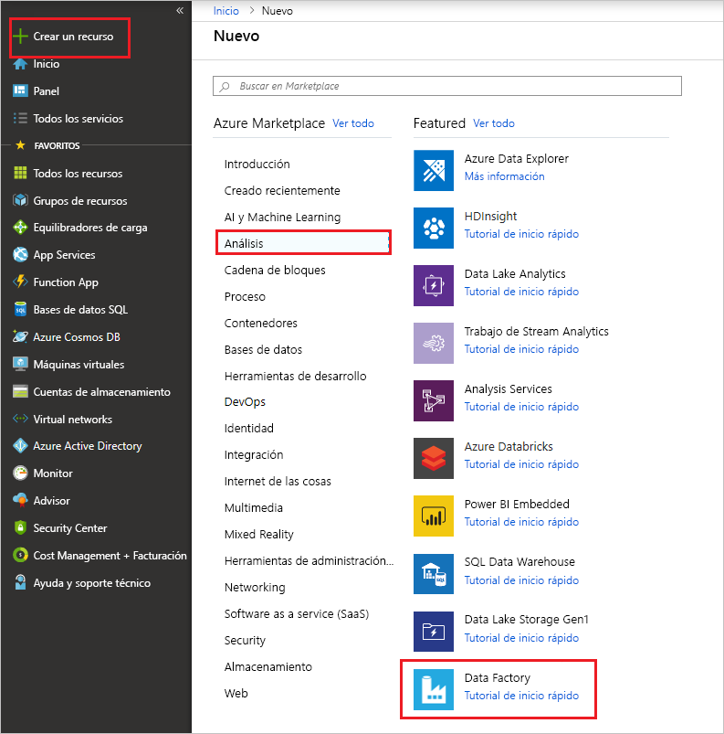

# <a name="copy-multiple-tables-in-bulk-by-using-azure-data-factory"></a>Copia de varias tablas en bloque mediante Azure Data Factory

En este tutorial se muestra cómo puede **copiar varias tablas de Azure SQL Database a Azure Synapse Analytics (anteriormente, SQL DW)** . Además, puede aplicar el mismo patrón en otros escenarios de copia. Por ejemplo, para copiar tablas de SQL Server u Oracle a Azure SQL Database, Azure Synapse Analytics (anteriormente SQL DW) o el blob de Azure, o bien para copiar diferentes rutas de acceso de blob a tablas de Azure SQL Database.

> [!NOTE]
> - Si no está familiarizado con Azure Data Factory, consulte [Introducción a Azure Data Factory](introduction.md).

A grandes rasgos, este tutorial incluye los pasos siguientes:

> [!div class="checklist"]
> * Creación de una factoría de datos.
> * Cree los servicios vinculados de Azure SQL Database, Azure Synapse Analytics (anteriormente SQL DW) y Azure Storage.
> * Cree los conjuntos de datos de Azure SQL Database y Azure Synapse Analytics (anteriormente SQL DW).
> * Creación de una canalización para buscar las tablas que se deben copiar y otra canalización para realizar la operación de copia real. 
> * Inicio de la ejecución de una canalización.
> * Supervisión de las ejecuciones de canalización y actividad.

En este tutorial se usa Azure Portal. Para obtener información sobre el uso de otras herramientas o SDK para crear una factoría de datos, consulte los [inicios rápidos](quickstart-create-data-factory-dot-net.md). 

## <a name="end-to-end-workflow"></a>Flujo de trabajo de un extremo a otro
En este escenario, tenemos varias tablas en Azure SQL Database que queremos copiar en Azure Synapse Analytics (anteriormente, SQL DW). Esta es la secuencia lógica de pasos del flujo de trabajo que se realiza en las canalizaciones:


* La primera canalización busca la lista de tablas que debe copiarse en los almacenes de datos del receptor.  También puede mantener una tabla de metadatos que muestre todas las tablas que se deben copiar en el almacén de datos receptor. A continuación, la canalización desencadena otra canalización, que itera en todas las tablas de la base de datos y realiza la operación de copia de datos.
* La segunda canalización realiza la copia real. Toma la lista de tablas como un parámetro. Para cada tabla de la lista, copie la tabla específica de Azure SQL Database a la tabla correspondiente de Azure Synapse Analytics (anteriormente, SQL DW) con la [copia almacenada provisionalmente mediante Blob Storage y PolyBase](connector-azure-sql-data-warehouse.md#use-polybase-to-load-data-into-azure-sql-data-warehouse) a fin de obtener el mejor rendimiento. En este ejemplo, la primera canalización pasa la lista de tablas como un valor para el parámetro. 

Si no tiene una suscripción a Azure, cree una [cuenta gratuita](https://azure.microsoft.com/free/) antes de empezar.

## <a name="prerequisites"></a>Prerrequisitos
* **Cuenta de Azure Storage**. La cuenta de Azure Storage se usa como almacenamiento de blobs de almacenamiento provisional en la operación de copia masiva. 
* **Azure SQL Database**. Esta base de datos contiene los datos de origen. 
* **Azure Synapse Analytics (anteriormente SQL DW)** . Este almacén de datos contiene los datos que se copian de SQL Database. 

### <a name="prepare-sql-database-and-azure-synapse-analytics-formerly-sql-dw"></a>Preparación de SQL Database y Azure Synapse Analytics (anteriormente SQL DW)

**Preparación de la base de datos de Azure SQL de origen**:

Siga el artículo [Creación de una base de datos de Azure SQL](../sql-database/sql-database-get-started-portal.md) para crear una base de datos de Azure SQL con los datos de ejemplo de Adventure Works LT. En este tutorial se copian todas las tablas de esta base de datos de ejemplo a una instancia de Azure Synapse Analytics (anteriormente SQL DW).

**Prepare el receptor de Azure Synapse Analytics (anteriormente SQL DW)** :

1. si no tiene ninguna instancia de Azure Synapse Analytics (anteriormente SQL DW), consulte en el artículo [Creación de una instancia de SQL Data Warehouse](../sql-data-warehouse/sql-data-warehouse-get-started-tutorial.md) los pasos para crearla.

1. Cree los esquemas de tabla correspondientes en Azure Synapse Analytics (anteriormente SQL DW). Debe usar Azure Data Factory para migrar o copiar datos en un paso posterior.

## <a name="azure-services-to-access-sql-server"></a>Servicios de Azure para acceder a SQL Server

En el caso de SQL Database y Azure Synapse Analytics (anteriormente SQL DW), permita que los servicios de Azure accedan a SQL Server. Asegúrese de que la opción **Permitir que los servicios y recursos de Azure accedan a este servidor** esté **activada** para Azure SQL Server. Esta configuración permite al servicio Data Factory leer los datos de Azure SQL Database y escribir datos en la instancia de Azure Synapse Analytics (anteriormente SQL DW). 

Para verificar y activar esta configuración, vaya a Azure SQL Server > Seguridad > Firewalls y redes virtuales, y establezca la opción **Permitir que los servicios y recursos de Azure accedan a este servidor** en **Activada**.

## <a name="create-a-data-factory"></a>Crear una factoría de datos
1. Inicie el explorador web **Microsoft Edge** o **Google Chrome**. Actualmente, la interfaz de usuario de Data Factory solo se admite en los exploradores web Microsoft Edge y Google Chrome.
1. Vaya a [Azure Portal](https://portal.azure.com). 
1. A la izquierda del menú de Azure Portal, seleccione **Crear un recurso** > **Análisis** > **Data Factory**. 
   
1. En la página **Nueva factoría de datos**, escriba **ADFTutorialBulkCopyDF** como **nombre**. 
 
   El nombre de la instancia de Azure Data Factory debe ser **único de forma global**. Si ve el siguiente error en el campo del nombre, cambie el nombre de la factoría de datos (por ejemplo, yournameADFTutorialBulkCopyDF). Consulte el artículo [Azure Data Factory: reglas de nomenclatura](naming-rules.md) para conocer las reglas de nomenclatura de los artefactos de Data Factory.
  
       `Data factory name “ADFTutorialBulkCopyDF” is not available`
1. Seleccione la **suscripción** de Azure donde desea crear la factoría de datos. 
1. Para el **grupo de recursos**, realice uno de los siguientes pasos:
     
   - Seleccione en primer lugar **Usar existente**y después un grupo de recursos de la lista desplegable. 
   - Seleccione **Crear nuevo**y escriba el nombre de un grupo de recursos.   
         
     Para obtener más información sobre los grupos de recursos, consulte [Uso de grupos de recursos para administrar los recursos de Azure](../azure-resource-manager/management/overview.md).  
1. Seleccione **V2** para la **versión**.
1. Seleccione la **ubicación** de Data Factory. Para una lista de las regiones de Azure en las que Data Factory está disponible actualmente, seleccione las regiones que le interesen en la página siguiente y expanda **Análisis** para poder encontrar **Data Factory**: [Productos disponibles por región](https://azure.microsoft.com/global-infrastructure/services/). Los almacenes de datos (Azure Storage, Azure SQL Database, etc.) y los procesos (HDInsight, etc.) que usa la factoría de datos pueden encontrarse en otras regiones.
1. Haga clic en **Crear**.
1. Una vez que finalice la creación, seleccione **Ir al recurso** para ir a la página de **Data Factory**. 
   
1. Haga clic en el icono **Author & Monitor** (Creación y supervisión) para iniciar la aplicación de la interfaz de usuario de Data Factory en una pestaña independiente.
1. En la página **Comencemos**, cambie a la pestaña **Author** (Autor) del panel izquierdo tal como se muestra en la siguiente imagen:

     

## <a name="create-linked-services"></a>Crear servicios vinculados
Los servicios vinculados se crean para vincular los almacenes de datos y los procesos con una factoría de datos. Un servicio vinculado tiene la información de conexión que usa el servicio Data Factory para conectarse al almacén de datos en el runtime. 

En este tutorial se vinculan sus almacenes de datos de Azure SQL Database, Azure Synapse Analytics (anteriormente SQL DW) y Azure Blob Storage a la factoría de datos. El almacén de datos de origen es el de Azure SQL Database. Azure Synapse Analytics (anteriormente SQL DW) es el almacén de datos receptor o destino. Azure Blob Storage sirve para almacenar provisionalmente los datos antes de cargarlos en Azure Synapse Analytics (anteriormente SQL DW) mediante PolyBase. 

### <a name="create-the-source-azure-sql-database-linked-service"></a>Creación del servicio vinculado de Azure SQL Database de origen
En este paso, creará un servicio vinculado para vincular su base de datos de Azure SQL con la factoría de datos. 

1. Seleccione **Conexiones** en la parte inferior de la ventana y haga clic en **+ Nuevo** en la barra de herramientas. El botón **Conexiones** se encuentra en la parte inferior de la columna izquierda debajo de **Factory Resources** (Recursos de fábrica). 

1. En la ventana **New Linked Service** (Nuevo servicio vinculado), seleccione **Azure SQL Database** y haga clic en **Continue** (Continuar). 
1. En la ventana **New Linked Service (Azure SQL Database)** [Nuevo servicio vinculado (Azure SQL Database)], realice los siguientes pasos: 

    a. Escriba **AzureSqlDatabaseLinkedService** en **Name** (Nombre).
    
    b. Seleccione el servidor de Azure SQL Server en **Server name** (Nombre del servidor).
    
    c. Seleccione su base de datos de Azure SQL en **Database name** (Nombre de la base de datos). 
    
    d. Escriba el **nombre del usuario** para conectarse a Azure SQL Database. 
    
    e. Escriba la **contraseña** del usuario. 

    f. Para probar la conexión a Azure SQL Database con la información indicada, haga clic en **Test connection** (Prueba de conexión).
  
    g. Haga clic en **Create** (Crear) para guardar el servicio vinculado.


### <a name="create-the-sink-azure-synapse-analytics-formerly-sql-dw-linked-service"></a>Creación del servicio vinculado de Azure Synapse Analytics (anteriormente SQL DW) de receptor

1. En la pestaña **Connections** (Conexiones), haga clic en **+ New** (+ Nuevo) en la barra de herramientas de nuevo. 
1. En la ventana **New Linked Service** (Nuevo servicio vinculado), seleccione **Azure Synapse Analytics (anteriormente SQL DW)** y haga clic en **Continue** (Continuar). 
1. En la ventana **New Linked Service (Azure Synapse Analytics (formerly SQL DW))** (Nuevo servicio vinculado [Azure Synapse Analytics (Anteriormente SQL DW)]), siga estos pasos: 
   
    a. Escriba **AzureSqlDWLinkedService** en **Name** (Nombre).
     
    b. Seleccione el servidor de Azure SQL Server en **Server name** (Nombre del servidor).
     
    c. Seleccione su base de datos de Azure SQL en **Database name** (Nombre de la base de datos). 
     
    d. En **User name**, escriba un nombre de usuario para conectarse a Azure SQL Database. 
     
    e. En **Password**, escriba la contraseña del usuario. 
     
    f. Para probar la conexión a Azure SQL Database con la información indicada, haga clic en **Test connection** (Prueba de conexión).
     
    g. Haga clic en **Crear**.

### <a name="create-the-staging-azure-storage-linked-service"></a>Creación del servicio vinculado de Azure Storage de almacenamiento provisional
En este tutorial, debe usar Azure Blob Storage como un área de almacenamiento provisional para habilitar PolyBase a fin de mejorar el rendimiento de copia.

1. En la pestaña **Connections** (Conexiones), haga clic en **+ New** (+ Nuevo) en la barra de herramientas de nuevo. 
1. En la ventana **New Linked Service** (Nuevo servicio vinculado), seleccione **Azure Blob Storage** y haga clic en **Continue** (Continuar). 
1. En la ventana **New Linked Service (Azure Blob Storage)** [Nuevo servicio vinculado (Azure Blob Storage)], realice los siguientes pasos: 

    a. Escriba **AzureStorageLinkedService** en **Name** (Nombre).                                                 
    b. Seleccione la **cuenta de Azure Storage** de **Storage account name** (Nombre de la cuenta de Storage).
    
    c. Haga clic en **Crear**.


## <a name="create-datasets"></a>Creación de conjuntos de datos
En este tutorial creará los conjuntos de datos de origen y recepción, que especifican la ubicación de almacenamiento de los datos. 

El conjunto de datos de entrada **AzureSqlDatabaseDataset** hace referencia a **AzureSqlDatabaseLinkedService**. El servicio vinculado especifica la cadena de conexión para conectarse a la base de datos. El conjunto de datos especifica el nombre de la base de datos y la tabla que contienen los datos de origen. 

El conjunto de datos de salida **AzureSqlDWDataset** hace referencia a **AzureSqlDWLinkedService**. El servicio vinculado especifica la cadena de conexión para conectarse a Azure Synapse Analytics (anteriormente SQL DW). El conjunto de datos especifica la base de datos y la tabla donde se copian los datos. 

En este tutorial, las tablas de origen y destino SQL no están codificadas en las definiciones de los conjuntos de datos. En su lugar, la actividad ForEach (Para cada uno) pasa el nombre de la tabla en tiempo de ejecución a la actividad de copia. 

### <a name="create-a-dataset-for-source-sql-database"></a>Creación de un conjunto de datos de la instancia de SQL Database de origen

1. Haga clic en el **signo + (más)** en el panel izquierdo y en **Dataset** (Conjunto de datos). 

    
1. En la ventana **New Dataset** (Nuevo conjunto de datos), seleccione **Azure SQL Database** y luego seleccione **Continue** (Continuar). 
    
1. En la ventana **Set properties** (Establecer propiedades), en **Name** (Nombre), escriba **AzureSqlDatabaseDataset**. En **Linked service** (Servicio vinculado), seleccione **AzureSqlDatabaseLinkedService**. A continuación, haga clic en **Aceptar**.

1. Cambie a la pestaña **Connection** (Conexión) y seleccione cualquier tabla para **Table** (Tabla). Esta tabla es ficticia. Especifique una consulta en el conjunto de datos de origen al crear una canalización. La consulta se utilizará para extraer datos de Azure SQL Database. Como alternativa, puede hacer clic en la casilla **Edit** (Editar) y escribir **dbo.dummyName** como nombre de la tabla. 
 

### <a name="create-a-dataset-for-sink-azure-synapse-analytics-formerly-sql-dw"></a>Creación de un conjunto de datos para el receptor de Azure Synapse Analytics (anteriormente SQL DW)

1. Haga clic en el **signo + (más)** en el panel izquierdo y en **Dataset** (Conjunto de datos). 
1. En la ventana **New Dataset** (Nuevo conjunto de datos), seleccione **Azure Synapse Analytics (formerly SQL DW)** (Azure Synapse Analytics [anteriormente SQL DW]) y haga clic en **Continue** (Continuar).
1. En la ventana **Set properties** (Establecer propiedades), en **Name** (Nombre), escriba **AzureSqlDWDataset**. En **Linked service** (Servicio vinculado), seleccione **AzureSqlDWLinkedService**. A continuación, haga clic en **Aceptar**.
1. Vaya a la pestaña **Parameters** (Parámetros), haga clic en **+ New** (+ Nuevo) y escriba **DWTableName** como nombre del parámetro. Si copia y pega este nombre desde la página, asegúrese de que no hay ningún **carácter de espacio final** al final de **DWTableName**.
1. Cambie a la pestaña **Connection** (Conexión), 

    a. En **Table** (Tabla), active la opción **Edit** (Editar). Escriba **dbo** en el cuadro de entrada del nombre de la primera tabla. A continuación, seleccione el segundo cuadro de entrada y haga clic en el vínculo **Add dynamic content** (Agregar contenido dinámico) debajo. 

    

    b. En la página **Agregar contenido dinámico**, haga clic en **DWTAbleName** en **Parameters** (Parámetros) y se rellenará automáticamente el cuadro de texto de expresiones de la parte superior `@dataset().DWTableName`, finalmente, haga clic en **Finalizar**. La propiedad **tableName** del conjunto de datos se establece en el valor que se pasa como argumento del parámetro **DWTableName**. La actividad ForEach (Para cada uno) recorre en iteración una lista de tablas y las pasa una a una a la actividad de copia. 

    
 
## <a name="create-pipelines"></a>Creación de canalizaciones
En este tutorial, creará dos canalizaciones: **IterateAndCopySQLTables** y **GetTableListAndTriggerCopyData**. 

La canalización **GetTableListAndTriggerCopyData** lleva a cabo dos acciones:

* Busca la tabla del sistema de Azure SQL Database para obtener la lista de tablas que se copiará.
* Desencadena la canalización **IterateAndCopySQLTables** para realizar la copia de datos real.

La canalización **IterateAndCopySQLTables** toma una lista de tablas como parámetro. Para cada tabla de la lista, copia datos de la tabla de Azure SQL Database a Azure Synapse Analytics (anteriormente SQL DW) mediante la copia almacenada provisionalmente y PolyBase.

### <a name="create-the-pipeline-iterateandcopysqltables"></a>Creación de la canalización IterateAndCopySQLTables

1. En el panel izquierdo, haga clic en el **signo + (más)** y en **Pipeline** (Canalización).

    
1. En la pestaña **General**, especifique **IterateAndCopySQLTables** como nombre. 

1. Cambie a la pestaña **Parameters** (Parámetros) y realice las siguientes acciones: 

    a. Haga clic en **+ Nuevo**. 
    
    b. Escriba **tableList** en el parámetro **Name** (Nombre).
    
    c. Seleccione **Matriz** como **tipo**.

1. En el cuadro de herramientas **Activities** (Actividades), expanda **Iteration & Conditions** (Iteraciones y condiciones), arrastre la actividad **ForEach** (Para cada uno) y colóquela en la superficie del diseñador de canalizaciones. También puede buscar actividades en el cuadro de herramientas **Activities** (Actividades). 

    a. En la pestaña **General** de la parte inferior escriba **IterateSQLTables** como **Nombre**. 

    b. Cambie a la pestaña **Settings** (Configuración), haga clic en el cuadro de entrada **Items** (Elementos) y, finalmente, haga clic en el vínculo **Add dynamic content** (Agregar contenido dinámico) que aparece a continuación. 

    c. En la página **Add dynamic content** (Agregar contenido dinámico), contraiga las secciones **System Variables** (Variables del sistema) y **Functions** (Funciones), y haga clic en la **tableList** (Lista de tabla) bajo **Parameters** (Parámetros), que rellenará automáticamente el cuadro de texto de expresiones de la parte superior como `@pipeline().parameter.tableList`. Haga clic en **Finalizar**. 

    
    
    d. Cambie a la pestaña **Activities** (Actividades), haga clic en el **icono de lápiz** para agregar una actividad secundaria a la actividad **ForEach**.
    

1. En el cuadro de herramientas **Activities** (Actividades), expanda **Move & Transfer** (Mover y transferir), arrastre la actividad **Copy data** (Copiar datos) y colóquela en la superficie del diseñador de canalizaciones. Tenga en cuenta el menú de la ruta de navegación de la parte superior. **IterateAndCopySQLTable** es el nombre de la canalización y **IterateSQLTables** es el nombre de la actividad ForEach. El diseñador está en el ámbito de la actividad. Para volver al editor de canalización desde el editor de la actividad ForEach (Para cada uno), puede hacer clic en el vínculo del menú de la ruta de navegación. 

    

1. Cambie a la pestaña **Source** (Origen) y realice los pasos siguientes:

    1. Seleccione **AzureSqlDatabaseDataset** en **Source Dataset** (Conjunto de datos de origen). 
    1. Seleccione la opción **Query** (Consulta) en **Use query** (Usar consulta). 
    1. Haga clic en el cuadro de entrada **Query** (Consulta) -> seleccione el vínculo **Agregar contenido dinámico** que aparece a continuación -> escriba la siguiente expresión para **Query** (Consulta) -> seleccione **Finalizar**.

        ```sql
        SELECT * FROM [@{item().TABLE_SCHEMA}].[@{item().TABLE_NAME}]
        ``` 


1. Cambie a la pestaña **Sink** (Receptor) y realice los pasos siguientes: 

    1. Seleccione **AzureSqlDWDataset** en **Sink Dataset** (Conjunto de datos receptor).
    1. Haga clic en el cuadro de entrada VALUE del parámetro DWTableName -> seleccione **Add dynamic content** (Agregar contenido dinámico) que aparece a continuación, escriba la expresión `[@{item().TABLE_SCHEMA}].[@{item().TABLE_NAME}]` como script, -> seleccione **Finish** (Finalizar).
    1. Como método de copia, seleccione **PolyBase**. 
    1. Desactive la opción **Use type default** (Usar tipo predeterminado). 
    1. Haga clic en el cuadro de entrada **Script previo a la copia** -> seleccione el vínculo **Agregar contenido dinámico** que aparece a continuación -> escriba la siguiente expresión como script -> seleccione **Finalizar**. 

        ```sql
        TRUNCATE TABLE [@{item().TABLE_SCHEMA}].[@{item().TABLE_NAME}]
        ```

        
1. Cambie a la pestaña **Settings** (Configuración) y realice los pasos siguientes: 

    1. Active la casilla de **Enable Staging** (Habilitar almacenamiento provisional).
    1. Seleccione **AzureStorageLinkedService** como **Store Account Linked Service** (Servicio vinculado a la cuenta de almacenamiento).

1. Para comprobar la configuración de la canalización, haga clic en **Validar** en la barra de herramientas de la canalización. Asegúrese de que no haya errores de validación. Para cerrar **Pipeline Validation Report** (Informe de comprobación de la canalización), haga clic en **>>** .

### <a name="create-the-pipeline-gettablelistandtriggercopydata"></a>Creación de la canalización GetTableListAndTriggerCopyData

Esta canalización realiza dos acciones:

* Busca la tabla del sistema de Azure SQL Database para obtener la lista de tablas que se copiará.
* Desencadena la canalización "IterateAndCopySQLTables" para realizar la copia de datos real.

1. En el panel izquierdo, haga clic en el **signo + (más)** y en **Pipeline** (Canalización).
1. En la pestaña **General**, cambie el nombre de la canalización a **GetTableListAndTriggerCopyData**. 

1. En el cuadro de herramientas **Activities** (Actividades), expanda **General** (General), arrastre la actividad **Lookup** (Búsqueda) a la superficie del diseñador de canalizaciones y realice los pasos siguientes:

    1. Escriba **LookupTableList** en **Name** (Nombre). 
    1. Escriba **Retrieve the table list from Azure SQL Database** (Recuperar la lista de tablas de Azure SQL Database) en **Description** (Descripción).

1. Cambie a la pestaña **Settings** (Configuración) y realice los pasos siguientes:

    1. Seleccione **AzureSqlDatabaseDataset** en **Source Dataset** (Conjunto de datos de origen). 
    1. Seleccione **Query** (Consulta) en **Use query** (Usar consulta). 
    1. Escriba la siguiente consulta SQL en el campo **Query** (Consulta).

        ```sql
        SELECT TABLE_SCHEMA, TABLE_NAME FROM information_schema.TABLES WHERE TABLE_TYPE = 'BASE TABLE' and TABLE_SCHEMA = 'SalesLT' and TABLE_NAME <> 'ProductModel'
        ```
    1. Desactive la casilla del campo **First row only** (Solo la primera fila).

        
1. Arrastre la actividad **Execute Pipeline** (Ejecutar canalización) del cuadro de herramientas de actividades y colóquela en la superficie del diseñador de canalizaciones; después, establezca el nombre en **TriggerCopy**.

1. Para **conectar**  la actividad **Lookup** (Búsqueda) a la actividad **Execute Pipeline** (Ejecutar canalización), arrastre el **cuadro verde** vinculado a la actividad de búsqueda a la izquierda de la actividad Execute Pipeline (Ejecución de canalización).

    

1. Cambie a la pestaña **Settings** (Configuración) de la actividad **Execute Pipeline** (Ejecutar canalización) y realice los pasos siguientes: 

    1. Seleccione **IterateAndCopySQLTables** en **Invoked pipeline** (Canalización invocada). 
    1. Expanda la sección **Advanced** (Avanzado) y desactive la casilla **Wait on completion** (Esperar a que se complete).
    1. Haga clic en **+ New** (+ Nuevo) en la sección **Parameters** (Parámetros). 
    1. Escriba **tableList** en el parámetro **Name** (Nombre).
    1. Haga clic en el cuadro de entrada VALOR -> seleccione el vínculo **Agregar contenido dinámico** que aparece a continuación -> escriba `@activity('LookupTableList').output.value` como valor del nombre de tabla -> seleccione **Finalizar**. Estamos configurando la lista de resultados de la actividad de búsqueda como entrada de la segunda canalización. La lista de resultados contiene la lista de tablas cuyos datos deben copiarse en el destino. 

        

1. Para comprobar la canalización, haga clic en **Validate** (Comprobar) en la barra de herramientas. Confirme que no haya errores de comprobación. Para cerrar **Pipeline Validation Report** (Informe de comprobación de la canalización), haga clic en **>>** .

1. Para publicar entidades (conjuntos de datos, canalizaciones, etc.) en el servicio Data Factory, haga clic en **Publicar todo** en la parte superior de la ventana. Espere hasta que la publicación se realice correctamente. 

## <a name="trigger-a-pipeline-run"></a>Desencadenamiento de una ejecución de la canalización

1. Vaya a la canalización **GetTableListAndTriggerCopyData**, haga clic en **Add Trigger** (Agregar desencadenador) y haga clic en **Trigger Now** (Desencadenar ahora). 

1. Confirme la ejecución en la página **Pipeline run** (Ejecución de canalización) y, a continuación, seleccione **Finish** (Finalizar).

## <a name="monitor-the-pipeline-run"></a>Supervisión de la ejecución de la canalización

1. Vaya a la pestaña **Monitor** (Supervisar). Haga clic en **Refresh** (Actualizar) hasta que vea las ejecuciones de las canalizaciones de la solución. Continúe la actualización de la lista hasta que vea el estado **Succeeded** (Correcto). 

1. Para ver las ejecuciones de actividad asociadas a la canalización **GetTableListAndTriggerCopyData**, haga clic en el vínculo de nombre de canalización de esa canalización. Debería ver dos ejecuciones de actividad para esta ejecución de canalización. 
    
1. Para ver la salida de la actividad **Lookup** (Búsqueda), haga clic en el vínculo **Output** (Salida) junto a la actividad en la columna **ACTIVITY NAME** (NOMBRE DE ACTIVIDAD). La ventana **Output** (Salida) se puede maximizar y restaurar. Después de la revisión, haga clic en la **X** para cerrar la ventana **Output** (Salida).

    ```json
    {
        "count": 9,
        "value": [
            {
                "TABLE_SCHEMA": "SalesLT",
                "TABLE_NAME": "Customer"
            },
            {
                "TABLE_SCHEMA": "SalesLT",
                "TABLE_NAME": "ProductDescription"
            },
            {
                "TABLE_SCHEMA": "SalesLT",
                "TABLE_NAME": "Product"
            },
            {
                "TABLE_SCHEMA": "SalesLT",
                "TABLE_NAME": "ProductModelProductDescription"
            },
            {
                "TABLE_SCHEMA": "SalesLT",
                "TABLE_NAME": "ProductCategory"
            },
            {
                "TABLE_SCHEMA": "SalesLT",
                "TABLE_NAME": "Address"
            },
            {
                "TABLE_SCHEMA": "SalesLT",
                "TABLE_NAME": "CustomerAddress"
            },
            {
                "TABLE_SCHEMA": "SalesLT",
                "TABLE_NAME": "SalesOrderDetail"
            },
            {
                "TABLE_SCHEMA": "SalesLT",
                "TABLE_NAME": "SalesOrderHeader"
            }
        ],
        "effectiveIntegrationRuntime": "DefaultIntegrationRuntime (East US)",
        "effectiveIntegrationRuntimes": [
            {
                "name": "DefaultIntegrationRuntime",
                "type": "Managed",
                "location": "East US",
                "billedDuration": 0,
                "nodes": null
            }
        ]
    }
    ```    
1. Para volver a la vista **Pipeline Runs** (Ejecuciones de canalización), haga clic en el vínculo **All Pipeline runs** (Todas las ejecuciones de canalización) en la parte superior del menú de la ruta de navegación. Haga clic en el vínculo **IterateAndCopySQLTables**, bajo la columna **PIPELINE NAME** (NOMBRE DE CANALIZACIÓN), para ver las ejecuciones de actividad de la canalización. Tenga en cuenta que hay una ejecución de la actividad **Copy** (Copiar) para cada tabla de la salida de la actividad **Lookup** (Búsqueda). 

1. Confirme que los datos se copiaron en la instancia de Azure Synapse Analytics (anteriormente SQL DW) de destino que se usó en este tutorial. 

## <a name="next-steps"></a>Pasos siguientes
En este tutorial, realizó los pasos siguientes: 

> [!div class="checklist"]
> * Creación de una factoría de datos.
> * Cree los servicios vinculados de Azure SQL Database, Azure Synapse Analytics (anteriormente SQL DW) y Azure Storage.
> * Cree los conjuntos de datos de Azure SQL Database y Azure Synapse Analytics (anteriormente SQL DW).
> * Creación de una canalización para buscar las tablas que se deben copiar y otra canalización para realizar la operación de copia real. 
> * Inicio de la ejecución de una canalización.
> * Supervisión de las ejecuciones de canalización y actividad.

Vaya al tutorial siguiente para obtener información sobre cómo copiar datos de forma incremental de un origen a un destino:
> [!div class="nextstepaction"]
>[Copia de datos de forma incremental](tutorial-incremental-copy-portal.md)
