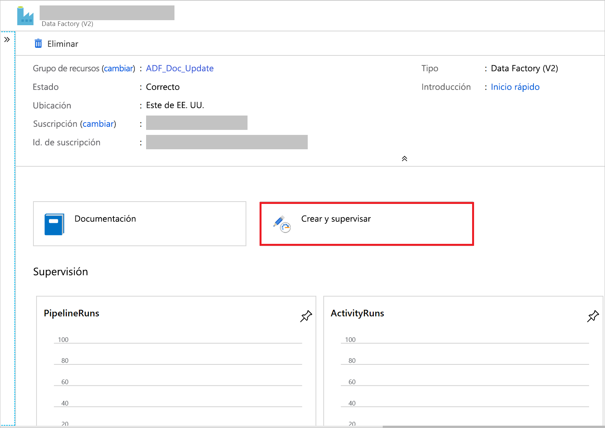

# <a name="copy-data-from-azure-blob-storage-to-a-sql-database-by-using-the-copy-data-tool"></a>Copia de datos de Azure Blob Storage a SQL Database con la herramienta Copy Data

> [!div class="op_single_selector" title1="Seleccione la versión del servicio Data Factory que usa:"]
> * [Versión 1](v1/data-factory-copy-data-from-azure-blob-storage-to-sql-database.md)
> * [Versión actual](tutorial-copy-data-tool.md)

En este tutorial, usará Azure Portal para crear una factoría de datos. A continuación, usará la herramienta Copy Data para crear una canalización que copia datos de una instancia de Azure Blob Storage a una instancia de SQL Database.

> [!NOTE]
> Si no está familiarizado con Azure Data Factory, consulte [Introducción a Azure Data Factory](introduction.md).

En este tutorial, realizará los siguientes pasos:
> [!div class="checklist"]
> * Creación de una factoría de datos.
> * Uso de la herramienta Copy Data para crear una canalización.
> * Supervisión de las ejecuciones de canalización y actividad.

## <a name="prerequisites"></a>Prerrequisitos

* **Suscripción de Azure**: Si no tiene una suscripción a Azure, cree una [cuenta gratuita](https://azure.microsoft.com/free/) antes de empezar.
* **Cuenta de Azure Storage**: use Blob Storage como almacén de datos de _origen_. Si no dispone de una cuenta de Azure Storage, consulte las instrucciones de [Creación de una cuenta de Azure Storage](../storage/common/storage-account-create.md).
* **Azure SQL Database**: use una instancia de SQL Database como almacén de datos _receptor_. Si no tiene una instancia de SQL Database, consulte las instrucciones de [Creación de una instancia de Azure SQL Database](../sql-database/sql-database-get-started-portal.md).

### <a name="create-a-blob-and-a-sql-table"></a>Creación de un blob y una tabla SQL

Prepare su instancia de Blob Storage y su instancia de SQL Storage para el tutorial mediante los pasos siguientes.

#### <a name="create-a-source-blob"></a>Creación de un blob de origen

1. Inicie el **Bloc de notas**. Copie el texto siguiente y guárdelo en un archivo llamado **inputEmp.txt** en el disco:

    ```
    FirstName|LastName
    John|Doe
    Jane|Doe
    ```

1. Cree un contenedor denominado **adfv2tutorial** y cargue el archivo inputEmp.txt en el contenedor. Puede usar Azure Portal o varias herramientas como el [Explorador de Azure Storage](https://storageexplorer.com/) para realizar estas tareas.

#### <a name="create-a-sink-sql-table"></a>Creación de una tabla SQL receptora

1. Use el siguiente script de SQL para crear una tabla llamada **dbo.emp** en la instancia de SQL Database:

    ```sql
    CREATE TABLE dbo.emp
    (
        ID int IDENTITY(1,1) NOT NULL,
        FirstName varchar(50),
        LastName varchar(50)
    )
    GO

    CREATE CLUSTERED INDEX IX_emp_ID ON dbo.emp (ID);
    ```

2. Permita que los servicios de Azure accedan a SQL Server. Compruebe que el valor **Permitir que los servicios y recursos de Azure accedan a este servidor** está habilitado para el servidor que ejecuta SQL Database. Esta configuración permite que Data Factory escriba datos en su instancia de base de datos. Para verificar y activar esta configuración, vaya a Azure SQL Server > Seguridad > Firewalls y redes virtuales, y establezca la opción **Permitir que los servicios y recursos de Azure accedan a este servidor** en **Activada**.

## <a name="create-a-data-factory"></a>Crear una factoría de datos

1. En el menú de la izquierda, seleccione **Crear un recurso** > **Analytics** > **Data Factory**:

    
1. En la página **Nueva factoría de datos**, en **Nombre**, escriba **ADFTutorialDataFactory**.

    El nombre de la factoría de datos debe ser _globalmente único_. Puede aparecer el siguiente mensaje de error:

    

    Si recibe un mensaje de error sobre el valor de nombre, escriba un nombre diferente para la factoría de datos. Por ejemplo, utilice _**suNombre**_ **ADFTutorialDataFactory**. Para conocer las reglas de nomenclatura de los artefactos de Data Factory, consulte [Data Factory: reglas de nomenclatura](naming-rules.md).
1. Seleccione la **suscripción** de Azure en la que quiere crear la nueva factoría de datos.
1. Para **Grupo de recursos**, realice uno de los siguientes pasos:

    a. Seleccione en primer lugar **Usar existente**y después un grupo de recursos de la lista desplegable.

    b. Seleccione **Crear nuevo**y escriba el nombre de un grupo de recursos.
    
    Para más información sobre los grupos de recursos, consulte [Uso de grupos de recursos para administrar los recursos de Azure](../azure-resource-manager/management/overview.md).

1. En **Versión**, seleccione **V2** como versión.
1. En **Ubicación**, seleccione la ubicación de la factoría de datos. Solo las ubicaciones admitidas se muestran en la lista desplegable. Los almacenes de datos (por ejemplo, Azure Storage y SQL Database) y los procesos (por ejemplo, Azure HDInsight) que usa la factoría de datos pueden estar en otras ubicaciones o regiones.
1. Seleccione **Crear**.

1. Una vez finalizada la creación, se muestra la página principal de **Data Factory**.

    
1. Para abrir la interfaz de usuario de Azure Data Factory en otra pestaña, seleccione el icono **Author & Monitor** (Creación y supervisión).

## <a name="use-the-copy-data-tool-to-create-a-pipeline"></a>Uso de la herramienta Copy Data para crear una canalización

1. En la página **Let's get started** (Introducción), seleccione el icono **Copy Data** (Copiar datos) para iniciar la herramienta Copy Data.

    
1. En la página **Properties** (Propiedades), en **Task name** (Nombre de la tarea), escriba **CopyFromBlobToSqlPipeline**. Luego, seleccione **Siguiente**. La interfaz de usuario de Data Factory crea una canalización con el nombre de la tarea especificado.
    

1. En la página **Almacén de datos de origen**, realice los pasos siguientes:

    a. Haga clic en **+ Crear nueva conexión** para agregar una conexión.

    b. Seleccione **Azure Blob Storage** en la galería y, a continuación, seleccione **Continue** (Continuar).

    c. En la página **New Linked Service** (Nuevo servicio vinculado), seleccione la suscripción de Azure y, luego, la cuenta de almacenamiento de la lista **Storage account name** (Nombre de la cuenta de almacenamiento). Pruebe la conexión y, después, seleccione **Create** (Crear).

    d. Seleccione el servicio vinculado recién creado como origen y, a continuación, haga clic en **Siguiente**.

    

1. En la página **Choose the input file or folder** (Elegir el archivo o la carpeta de entrada), complete los siguientes pasos:

    a. Haga clic en **Examinar** para ir a la carpeta **adfv2tutorial/input**, seleccione el archivo **inputEmp.txt** y, finalmente, haga clic en **Elegir**.

    b. Haga clic en **Siguiente** para ir al siguiente paso.

1. En la página **File format settings** (Configuración del formato de archivo), active la casilla para *First row as header* (Primera fila como encabezado). Observe que la herramienta detecta automáticamente los delimitadores de columna y fila. Seleccione **Next** (Siguiente). También puede obtener una vista previa de los datos y ver el esquema de los datos de entrada en esta página.

    
1. En la página **Almacén de datos de destino**, realice los pasos siguientes:

    a. Haga clic en **+ Crear nueva conexión** para agregar una conexión.

    b. Seleccione **Azure SQL Database** en la galería y, luego, elija **Continuar**.

    c. En la página **New Linked Service** (Nuevo servicio vinculado), seleccione el nombre del servidor y el de la base de datos en la lista desplegable, y especifique el nombre de usuario y la contraseña y, después, seleccione **Create** (Crear).

    

    d. Seleccione el servicio vinculado recién creado como receptor y, a continuación, haga clic en **Siguiente**.

1. En la página **Table mapping** (Asignación de tabla), seleccione la tabla **[dbo].[ emp]** y, a continuación, seleccione **Next** (Siguiente).

1. En la página **Column mapping** (Asignación de columnas), observe que las columnas segunda y tercera del archivo de entrada se asignan a las columnas **FirstName** y **LastName** de la tabla **emp**. Ajuste la asignación para asegurarse de que no haya ningún error y, después, seleccione **Next** (Siguiente).

    

1. En la página **Settings** (Configuración), seleccione **Next** (Siguiente).
1. En la página **Summary** (Resumen), revise la configuración y seleccione **Next** (Siguiente).
1. En la página **Deployment** (Implementación), seleccione **Monitor** (Supervisión) para supervisar la canalización (tarea).
 
    

1. En la página Pipeline runs (Ejecuciones de canalización), seleccione **Refresh** (Actualizar) para actualizar la lista. Haga clic en el vínculo en **PIPELINE NAME** (NOMBRE DE CANALIZACIÓN) para ver los detalles de la ejecución de actividad o volver a ejecutar la canalización. 
    

1. En la página Activity runs (Ejecuciones de actividad), seleccione el vínculo **Details** (Detalles) (icono de gafas) en la columna **ACTIVITY NAME** (NOMBRE DE ACTIVIDAD) para obtener más detalles sobre la operación de copia. Para volver a la vista Pipeline Runs (Ejecuciones de canalización), seleccione el vínculo **ALL pipeline runs** (Todas las ejecuciones de canalizaciones) en el menú de la ruta de navegación. Para actualizar la vista, seleccione **Refresh** (Actualizar).

    


1. Compruebe que los datos se insertan en la tabla **dbo.emp** de SQL Database.


1. Seleccione la pestaña **Author** (Crear) de la izquierda para cambiar al modo de edición. Con el editor puede actualizar los servicios vinculados, los conjuntos de datos y las canalizaciones creados mediante la herramienta. Para más información sobre la edición de estas entidades en la interfaz de usuario de Data Factory, consulte [la versión de Azure Portal de este tutorial](tutorial-copy-data-portal.md).

    

## <a name="next-steps"></a>Pasos siguientes
La canalización de este ejemplo copia los datos de una instancia de Blob Storage a una instancia de SQL Database. Ha aprendido a:

> [!div class="checklist"]
> * Creación de una factoría de datos.
> * Uso de la herramienta Copy Data para crear una canalización.
> * Supervisión de las ejecuciones de canalización y actividad.

Para aprender a copiar datos desde el entorno local a la nube, avance al tutorial siguiente:

>[!div class="nextstepaction"]
>[Copia de datos del entorno local a la nube](tutorial-hybrid-copy-data-tool.md)
