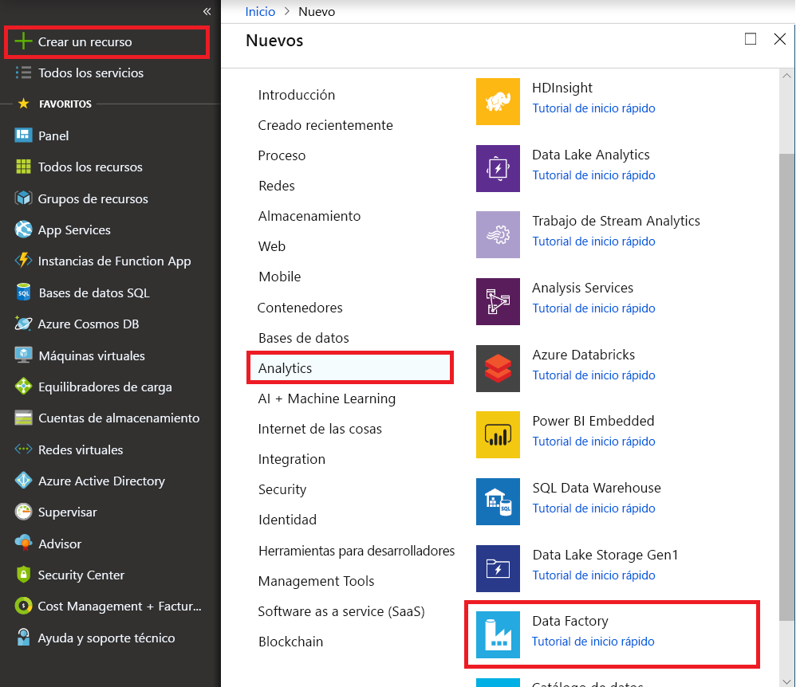

# Copia incremental de archivos nuevos y modificados según LastModifiedDate & gt; mediante la herramienta Copy Data

En este tutorial, usará Azure portal para crear una factoría de datos. A continuación, usará la herramienta Copy Data para crear una canalización que copia incremental únicamente, los archivos nuevos y modificados según sus **LastModifiedDate & gt;** desde Azure Blob storage a Azure Blob storage.

Al hacerlo, ADF examinará todos los archivos del almacén de origen, aplicar el filtro de archivos por su LastModifiedDate & gt; y copie el archivo nuevo y actualizado desde la última vez en el almacén de destino.  Tenga en cuenta que si permiten enormes cantidades de archivos de análisis ADF, pero solo copiar algunos archivos en destino, se sigue esperaría que también está lenta debido a la exploración de los archivos de larga duración.   

> [!NOTE]
> Si no está familiarizado con Azure Data Factory, consulte [Introducción a Azure Data Factory](introduction.md).

En este tutorial, realizará las tareas siguientes:

> [!div class="checklist"]
> * Creación de una factoría de datos.
> * Uso de la herramienta Copy Data para crear una canalización.
> * Supervisión de las ejecuciones de canalización y actividad.

## Requisitos previos

* **Suscripción de Azure**: Si no tiene una suscripción a Azure, cree una [cuenta gratuita](https://azure.microsoft.com/free/) antes de empezar.
* **Cuenta de Azure Storage**: Uso de Blob storage como el _origen_ y _receptor_ almacén de datos. Si no dispone de una cuenta de almacenamiento de Azure, consulte las instrucciones de [Creación de una cuenta de almacenamiento](../storage/common/storage-quickstart-create-account.md).

### Cree dos contenedores en Blob storage

Preparar el almacenamiento de blobs para el tutorial mediante los pasos siguientes.

1. Crear un contenedor denominado **origen**. Puede usar varias herramientas para realizar esta tarea, como [Explorador de Azure Storage](https://storageexplorer.com/).

2. Crear un contenedor denominado **destino**. 

## Crear una factoría de datos

1. En el menú de la izquierda, seleccione **Crear un recurso** > **Datos y análisis** > **Data Factory**: 
   
   

2. En la página **Nueva factoría de datos**, en **Nombre**, escriba **ADFTutorialDataFactory**. 
      
     
 
   El nombre de la factoría de datos debe ser _globalmente único_. Puede aparecer el siguiente mensaje de error:
   
   

   Si recibe un mensaje de error sobre el valor de nombre, escriba un nombre diferente para la factoría de datos. Por ejemplo, utilice _**suNombre**_**ADFTutorialDataFactory**. Para conocer las reglas de nomenclatura de los artefactos de Data Factory, consulte [Data Factory: reglas de nomenclatura](naming-rules.md).
3. Seleccione Azure **suscripción** en que se creará la nueva factoría de datos. 
4. Para **Grupo de recursos**, realice uno de los siguientes pasos:
     
    * Seleccione en primer lugar **Usar existente** y después un grupo de recursos de la lista desplegable.

    * Seleccione **Crear nuevo** y escriba el nombre de un grupo de recursos. 
         
    Para más información sobre los grupos de recursos, consulte [Uso de grupos de recursos para administrar los recursos de Azure](../azure-resource-manager/resource-group-overview.md).

5. En **versión**, seleccione **V2**.
6. En **Ubicación**, seleccione la ubicación de la factoría de datos. Solo las ubicaciones admitidas se muestran en la lista desplegable. Los almacenes de datos (por ejemplo, el almacenamiento de Azure y SQL Database) y los procesos (por ejemplo, Azure HDInsight) que usa la factoría de datos pueden estar en otras ubicaciones o regiones.
7. Seleccione **Anclar al panel**. 
8. Seleccione **Crear**.
9. En el panel, consulte el **Deploying Data Factory** icono para ver el estado del proceso.

    
10. Una vez finalizada la creación, se muestra la página principal de **Data Factory**.
   
    
11. Para abrir la interfaz de usuario (UI) de Azure Data Factory en una pestaña independiente, seleccione el **Author & Monitor** icono. 

## Uso de la herramienta Copy Data para crear una canalización

1. En el **Comencemos** página, seleccione el **Copy Data** título para abrir la herramienta Copy Data. 

   
   
2. En el **propiedades** página, realice los pasos siguientes:

     a. En **nombre de la tarea**, escriba **DeltaCopyFromBlobPipeline**.

    b. En **cadencia de la tarea** o **programación de tareas**, seleccione **ejecutarse periódicamente según programación**.

    c. En **tipo de desencadenador**, seleccione **Tumblingwindow**.
    
    d. En **periodicidad**, escriba **15 minutos**. 
    
    e. Seleccione **Next** (Siguiente). 
    
    La interfaz de usuario de Data Factory crea una canalización con el nombre de la tarea especificado. 

    
    
3. En la página **Almacén de datos de origen**, realice los pasos siguientes:

     a. Seleccione **+ crear nueva conexión**, para agregar una conexión.
    
    

    b. Seleccione **Azure Blob Storage** desde la galería y, a continuación, seleccione **continuar**.
    
    

    c. En el **nuevo servicio vinculado** , seleccione la cuenta de almacenamiento de la **nombredecuentadealmacenamiento** lista y, a continuación, seleccione **finalizar**.
    
    
    
    d. Seleccione el servicio vinculado recién creado y, a continuación, seleccione **siguiente**. 
    
   

4. En la página **Choose the input file or folder** (Elegir el archivo o la carpeta de entrada), complete los siguientes pasos:
    
     a. Busque y seleccione el **origen** carpeta y, a continuación, seleccione **elegir**.
    
    
    
    b. En **comportamiento de carga de archivo**, seleccione **carga Incremental: LastModifiedDate**.
    
    
    
    c. Comprobar **copia binaria** y seleccione **siguiente**.
    
     
     
5. En el **almacén de datos de destino** página, seleccione **AzureBlobStorage**. Se trata de la misma cuenta de almacenamiento que el almacén de datos de origen. Luego, seleccione **Siguiente**.

    
    
6. En la página **Choose the output file or folder** (Elegir el archivo o la carpeta de salida), complete los siguientes pasos:
    
     a. Busque y seleccione el **destino** carpeta y, a continuación, seleccione **elegir**.
    
    
    
    b. Seleccione **Next** (Siguiente).
    
     
    
7. En la página **Settings** (Configuración), seleccione **Next** (Siguiente). 

    
    
8. En el **resumen** , revise la configuración y, a continuación, seleccione **siguiente**.

    
    
9. En la página **Deployment** (Implementación), seleccione **Monitor** (Supervisión) para supervisar la canalización (tarea).

    
    
10. Observe que la pestaña **Monitor** (Supervisión) de la izquierda se selecciona automáticamente. La columna **Actions** (Acciones) incluye los vínculos para ver los detalles de la ejecución de actividad y volver a ejecutar la canalización. Seleccione **actualizar** para actualizar la lista y seleccione el **ver ejecuciones de actividad** vincular en el **acciones** columna. 

    

11. Hay sólo una actividad (la actividad de copia) en la canalización, verá solo una entrada. Para ver detalles sobre la operación de copia, seleccione el vínculo **Details** (Detalles) (icono de gafas) en la columna **Actions** (Acciones). 

    
    
    Porque no hay ningún archivo en el **origen** contenedor en su cuenta de almacenamiento de blobs, no verá ningún archivo copiado a la **destino** contenedor en su cuenta de almacenamiento de blobs.
    
    
    
12. Cree un archivo de texto vacío y asígnele el nombre **file1.txt**. Cargue este archivo de texto para el **origen** contenedor en su cuenta de almacenamiento. Puede usar varias herramientas para realizar estas tareas, como el [Explorador de Azure Storage](https://storageexplorer.com/).   

    
    
13. Para volver a la **ejecuciones de canalización** visualizarla, seleccione **todas las ejecuciones de canalización**y espere a que la misma canalización se activen de nuevo automáticamente.  

    

14. Seleccione **vista actividad ejecutar** para la segunda canalización que se ejecuta cuando lo vea. A continuación, revise los detalles de la misma manera que lo hizo para la primera ejecución de canalización.  

    

    Tendrá que vea una archivo (file1.txt) se han copiado desde el **origen** contenedor para el **destino** contenedor de la cuenta de almacenamiento de blobs.
    
    
    
15. Cree otro archivo de texto vacío y asígnele el nombre **file2.txt**. Cargue este archivo de texto para el **origen** contenedor en su cuenta de almacenamiento de blobs.   
    
16. Repita los pasos 13 y 14 para este segundo archivo de texto. Verá que solo el nuevo archivo (file2.txt) se han copiado desde el **origen** contenedor para el **destino** contenedor de la cuenta de almacenamiento en la siguiente ejecución de canalización.  
    
    

    También puede comprobar esto mediante [Explorador de Azure Storage](https://storageexplorer.com/) a analizar los archivos.
    
    

    
## Pasos siguientes
Pase al tutorial siguiente para obtener información acerca de cómo transformar datos mediante el uso de un clúster Apache Spark en Azure:

> [!div class="nextstepaction"]
>[Transformación de datos en la nube mediante el uso de un clúster Apache Spark](tutorial-transform-data-spark-portal.md)