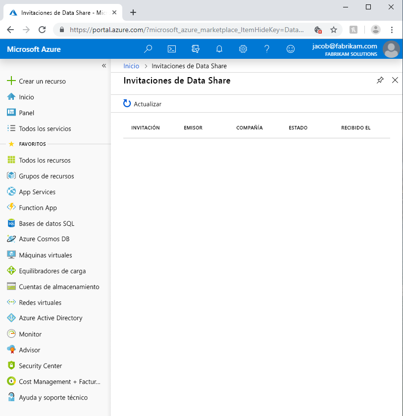

# <a name="troubleshoot-common-issues-in-azure-data-share"></a>Solución de problemas habituales de Azure Data Share 

En este artículo se muestra cómo solucionar problemas habituales de Azure Data Share. 

## <a name="azure-data-share-invitations"></a>Invitaciones de Azure Data Share 

En algunos casos, si un usuario nuevo hace clic en **Accept Invitation** (Aceptar invitación) en la invitación de correo electrónico que se envió, pueden aparecer una lista vacía de invitaciones. 



Esto puede deberse a los siguientes motivos:

* **El servicio Azure Data Share no está registrado como proveedor de recursos de ninguna suscripción de Azure en el inquilino de Azure.** Tendrá este problema si no hay ningún recurso compartido de datos en su inquilino de Azure. Cuando se crea un recurso de Azure Data Share, se registra automáticamente el proveedor de recursos en la suscripción de Azure. También puede registrar manualmente el servicio Data Share si sigue estos pasos. Para completar estos pasos, debe tener el rol Colaborador de Azure.

    1. En Azure Portal, vaya a **Suscripciones**
    1. Seleccione la suscripción de Azure que quiere usar para crear un recurso de Azure Data Share
    1. Haga clic en **Proveedores de recursos**
    1. Busque **Microsoft.DataShare**
    1. Haga clic en **Registrar**. 

    Es preciso que tenga el [rol RBAC Colaborador de Azure](https://docs.microsoft.com/azure/role-based-access-control/built-in-roles#contributor) para completar estos pasos. 

* **La invitación se envía a su alias de correo electrónico en lugar de a su correo electrónico de inicio de sesión de Azure.** Si ha registrado el servicio de Azure Data Share o ya ha creado un recurso compartido de datos en el inquilino de Azure, pero sigue sin poder ver la invitación, es posible que el proveedor haya escrito su alias de correo electrónico como destinatario en lugar de su dirección de correo electrónico de inicio de sesión de Azure. Póngase en contacto con el proveedor de datos y asegúrese de que ha enviado la invitación a su dirección de correo electrónico de inicio de sesión de Azure y no a su alias de correo electrónico.

* **Ya se aceptó la invitación.** El vínculo del correo electrónico le lleva a la página Invitación de recurso compartido de datos en Azure Portal, que solo muestra las invitaciones pendientes. Si ha aceptado la invitación, ya no aparecerá en la página Invitación de recurso compartido de datos. Continúe con el recurso compartido de datos que usó para aceptar la invitación para ver los recursos compartidos recibidos y configurar la opción del clúster de Azure Data Explorer.

## <a name="error-when-creating-or-receiving-a-new-share"></a>Error al crear o recibir un nuevo recurso compartido

"No se pudo agregar conjuntos de datos"

"No se pudo asignar conjuntos de datos"

"No se puede conceder acceso de x para x al recurso de Data Share"

"No tiene los permisos apropiados para x"

"No hemos podido agregar permisos de escritura para la cuenta de Azure Data Share en uno o más de los recursos seleccionados"

Si recibe un error similar a los anteriores al crear un nuevo recurso compartido o asignar conjuntos de datos, podría deberse a la falta de permisos en el almacén de datos de Azure. Consulte [Roles y requisitos](concepts-roles-permissions.md) para obtener los permisos necesarios. 

Necesita permiso de escritura para compartir o recibir datos de un almacén de datos de Azure, que normalmente existe en el rol Colaborador. 

Si esta es la primera vez que va a compartir o recibir datos del almacén de datos de Azure, también necesita el permiso *Microsoft.Authorization/role assignments/write* (asignación de roles o escritura), que normalmente existe en el rol Propietario. Aunque haya creado el recurso del almacén de datos de Azure, ello NO le convierte automáticamente el propietario del recurso. Con el permiso adecuado, el servicio de Azure Data Share concede automáticamente a la identidad administrada del recurso compartido de datos acceso al almacén de datos. Ese proceso podría tardar unos minutos en surtir efecto. Si experimenta un error debido a este retraso, vuelva a intentarlo en unos minutos.

El uso compartido basado en SQL requiere permisos adicionales. Consulte Solución de problemas de uso compartido basado en SQL para más información.

## <a name="troubleshooting-sql-based-sharing"></a>Solución de problemas de uso compartido basado en SQL

"El usuario x no existe en la base de datos SQL"

Si recibe un error similar al agregar un conjunto de datos desde un origen basado en SQL, puede deberse a que no creó un usuario para la identidad administrada de Azure Data Share en SQL Server.  Para resolver este problema, ejecute el siguiente script:

```sql
    create user "<share_acct_name>" from external provider; 
    exec sp_addrolemember db_datareader, "<share_acct_name>";
```      
Si recibe este error al asignar un conjunto de datos desde un origen basado en SQL, puede deberse a que no creó un usuario para la identidad administrada de Azure Data Share en SQL Server.  Para resolver este problema, ejecute el siguiente script:

```sql
    create user "<share_acc_name>" from external provider; 
    exec sp_addrolemember db_datareader, "<share_acc_name>"; 
    exec sp_addrolemember db_datawriter, "<share_acc_name>"; 
    exec sp_addrolemember db_ddladmin, "<share_acc_name>";
```
Tenga en cuenta que *<share_acc_name>* es el nombre del recurso compartido de datos.      

Asegúrese de que ha seguido todos los requisitos previos que se enumeran en el tutorial [Uso compartido de datos](share-your-data.md) y [Aceptación y recepción de datos con Azure Data Share](subscribe-to-data-share.md).

## <a name="snapshot-failed"></a>La instantánea generó un error
La instantánea podría generar un error debido a diversos motivos. Puede encontrar un mensaje de error detallado si hace clic en la hora de inicio de la instantánea y, a continuación, en el estado de cada conjunto de datos. 

Si el mensaje de error está relacionado con el permiso, compruebe que el servicio Azure Data Share tiene el permiso necesario. Consulte [Roles y requisitos](concepts-roles-permissions.md) para más información. Si es la primera vez que toma una instantánea, podría llevar unos minutos conceder al recurso compartido de datos el acceso al almacén de datos de Azure. Espere y vuelva a intentarlo.

## <a name="next-steps"></a>Pasos siguientes

Para obtener información acerca de cómo empezar a compartir datos, vaya al tutorial que cubre cómo [compartir sus datos](share-your-data.md). 

Para información sobre cómo recibir los datos, continúe con el tutorial [Aceptación y recepción de datos con Azure Data Share](subscribe-to-data-share.md).

