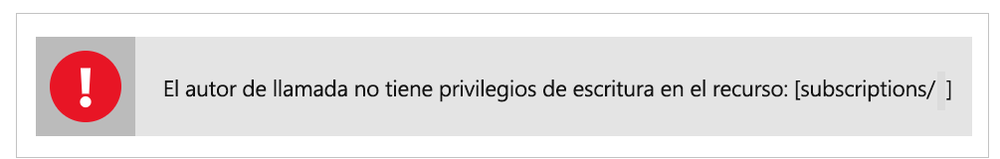

# Solución de problemas habituales de Azure Data Share, versión preliminar

En este artículo se muestra cómo solucionar problemas habituales de Azure Data Share, versión preliminar. 

## Invitaciones de Azure Data Share 

En algunos casos, si un usuario nuevo hace clic en **Accept Invitation** (Aceptar invitación) en la invitación de correo electrónico que se envió, pueden aparecer una lista vacía de invitaciones. 

El error anterior es un problema conocido del servicio y se está solucionando. Como alternativa, siga los pasos que se indican a continuación. 

1. En Azure Portal, vaya a **Suscripciones**
1. Seleccione la suscripción que va a usar para Azure Data Share
1. Haga clic en **Proveedores de recursos**
1. Busque Microsoft.DataShare
1. Haga clic en **Registrar**.

Es preciso que tenga el [rol RBAC Colaborador de Azure](https://docs.microsoft.com/azure/role-based-access-control/built-in-roles#contributor) para completar estos pasos. 

Si todavía no puede ver una invitación de recurso compartido de datos, póngase en contacto con el proveedor de datos y asegúrese de que ha enviado la invitación a su dirección de correo electrónico de inicio de sesión de Azure, *no* a su alias de correo electrónico. 

> [!IMPORTANT]
> Si ya ha aceptado una invitación de Azure Data Share y ha salido del servicio antes de configurar el almacenamiento, siga las instrucciones que encontrará en la guía paso a paso para [configurar una asignación de conjuntos de datos](how-to-configure-mapping.md) para aprender a finalizar la configuración del recurso compartido de datos recibidos y a empezar a recibir datos. 

## Error al crear o recibir un nuevo recurso compartido de datos

"Error: Operation returned an invalid status code "BadRequest"" (la operación devolvió el código de estado no válido "BadRequest")

"Error: AuthorizationFailed"

"Error: role assignment to storage account" (Error: asignación de rol a la cuenta de almacenamiento)

Si aparece cualquiera de los errores anteriores tanto al crear como al recibir un recurso compartido de datos, se debe a que no hay permisos suficientes en la cuenta de almacenamiento. El permiso requerido es *Microsoft.Authorization/role assignments/write*, que existe en el rol de propietario de almacenamiento o se puede asignar a un rol personalizado. Aunque haya creado la cuenta de Azure Storage, ello NO le convierte automáticamente en propietario de dicha cuenta. Siga estos pasos para concederse el rol de propietario de la cuenta de almacenamiento. También puede crear un rol personalizado con este permiso y, posteriormente, agregarse a él.  

1. Vaya a la cuenta de Azure Storage en Azure Portal
1. Seleccione **Access Control (IAM)**
1. Haga clic en **Agregar**.
1. Agréguese como propietario.

## Pasos siguientes

Para obtener información acerca de cómo empezar a compartir datos, vaya al tutorial que cubre cómo [compartir sus datos](share-your-data.md).

