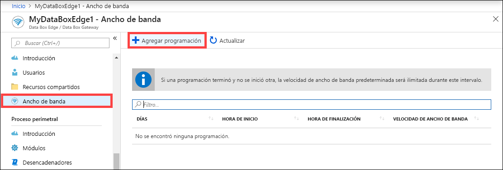
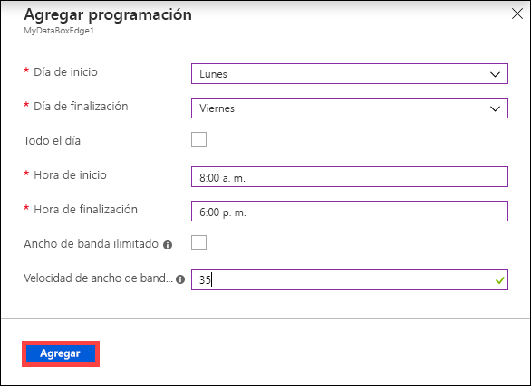
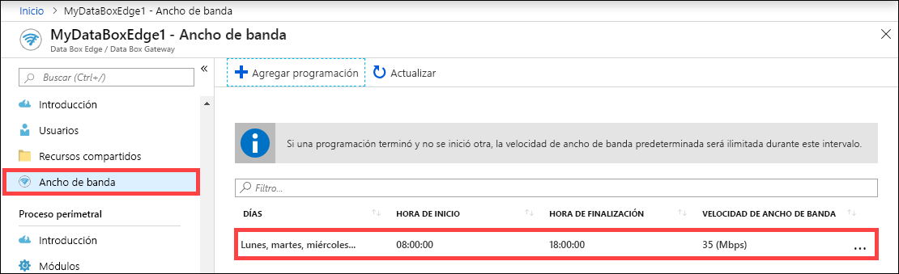
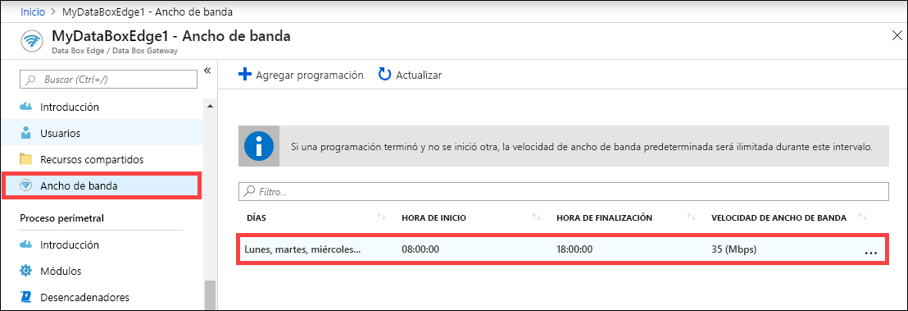
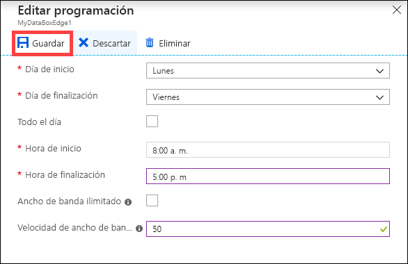
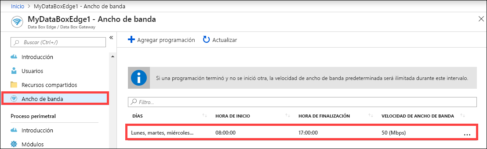
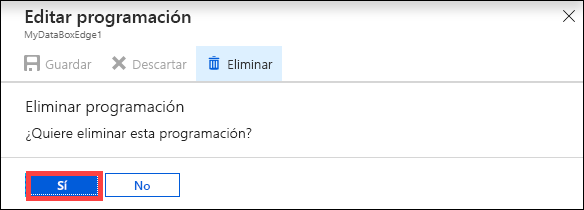

# Uso de Azure Portal para administrar las programaciones de ancho de banda en Azure Data Box Edge  

En este artículo se describe cómo administrar usuarios en Azure Data Box Edge. Las programaciones del ancho de banda le permiten configurar el uso del ancho de banda de red en programaciones en varias horas del día. Dichas programaciones se pueden aplicar a las operaciones de carga y descarga desde el dispositivo a la nube.

Puede agregar, modificar o eliminar las programaciones de ancho de banda de Data Box Edge a través de Azure Portal.

> [!IMPORTANT]
> Data Box Edge se encuentra en versión preliminar. Antes de solicitar e implementar esta solución revise los [términos del servicio de Azure para la versión preliminar](https://azure.microsoft.com/support/legal/preview-supplemental-terms/).

En este artículo, aprenderá a:

> [!div class="checklist"]
> * Adición de una programación
> * Modificar una programación
> * Eliminar una programación

## Adición de una programación

Para agregar una programación siga estos pasos en Azure Portal.

1. En la instancia de Azure Portal para el recurso de Data Box Edge, vaya a **Ancho de banda**.
2. En el panel derecho, seleccione **+ Agregar programación**.

    

3. En **Agregar programación**: 

   1. Especifique los valores de **Día de inicio**, **Día de finalización**, **Hora de inicio** y **Hora de finalización** de la programación.
   2. Seleccione la opción **Todo el día** si esta programación se debe ejecutar todo el día.
   3. **Velocidad de ancho de banda** es el ancho de banda, en Megabits por segundo (Mbps), que utiliza el dispositivo en operaciones que afectan a la nube (tanto cargas como descargas). Proporcione un número entre 20 y 1.000.000.007 para este campo.
   4. Seleccione el ancho de banda **Ilimitado** si no desea regular la carga y la descarga de la fecha.
   5. Seleccione **Agregar**.

      

3. Se crea una programación con los parámetros especificados. Esta programación se muestra en la lista de programaciones de ancho de banda del portal.

    

## Edición de programación

Siga estos pasos para editar una programación del ancho de banda.

1. En Azure Portal, vaya al recurso Data Box Edge y, después, a **Ancho de banda**. 
2. En la lista de programaciones de ancho de banda, seleccione y haga clic en la programación que desee modificar.
    

3. Realice los cambios deseados y guárdelos.

    

4. Después de que se modifique la programación, se actualiza la lista de programaciones para reflejar la programación modificada.

    

## Eliminación de una programación

Siga estos pasos para eliminar una programación de ancho de banda asociada a un dispositivo de Data Box Edge.

1. En Azure Portal, vaya al recurso Data Box Edge y, después, a **Ancho de banda**.  

2. En la lista de programaciones de ancho de banda, seleccione la programación que desea eliminar. En **Editar programación**, seleccione **Eliminar**. Cuando se le pida confirmación, seleccione **Sí**.

   

3. Después de que se elimina la programación se actualiza la lista de programaciones.

## Pasos siguientes

- Aprenda a [administrar los recursos compartidos](data-box-edge-manage-shares.md).
