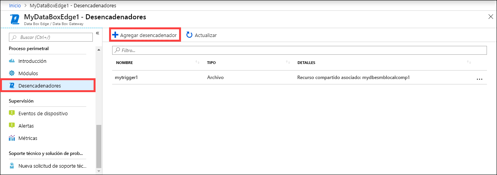
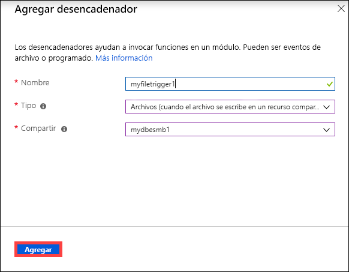
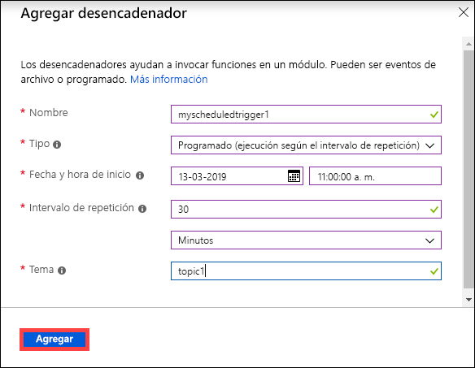
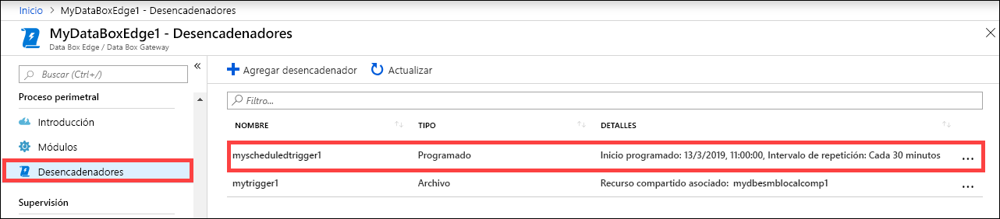
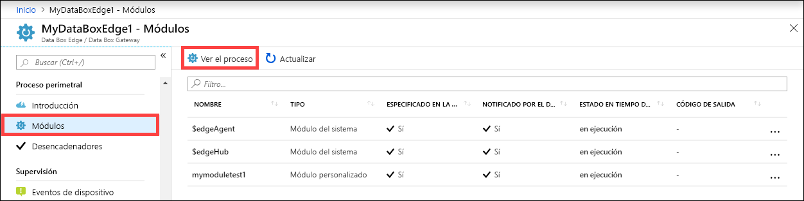
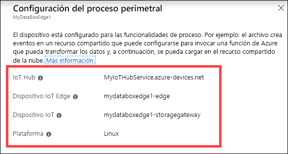
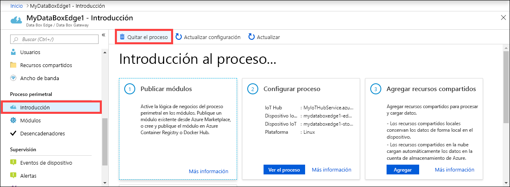
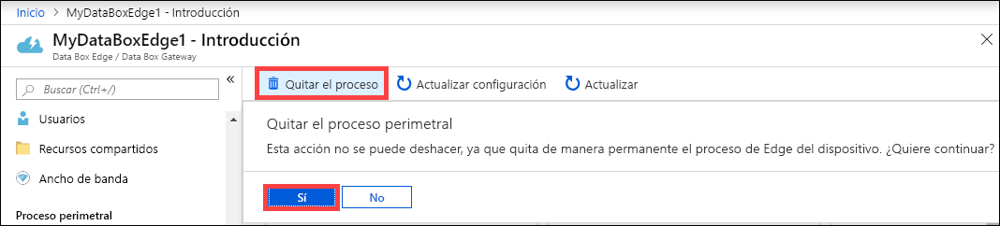
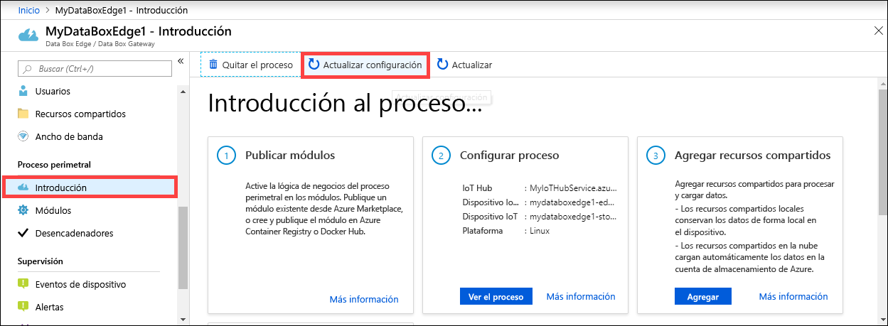
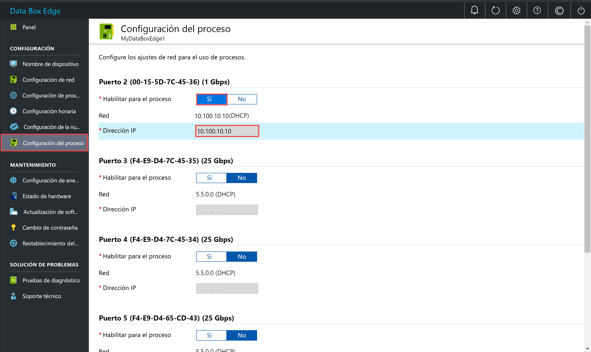

# Administración de proceso en una instancia de Azure Data Box Edge

En este artículo se describe cómo administrar el proceso en una instancia de Azure Data Box Edge. Puede administrar el proceso a través de Azure Portal o mediante la interfaz de usuario web local. Use Azure Portal para administrar los módulos, los desencadenadores y la configuración de proceso, y la interfaz de usuario web local para administrar los valores del proceso.

En este artículo, aprenderá a:

> [!div class="checklist"]
> * Administrar desencadenadores
> * Administrar la configuración del proceso

## Administración de desencadenadores

Los eventos son cosas que ocurren dentro del entorno de nube o en el dispositivo sobre las cuales quizás quiera tomar medidas. Por ejemplo, cuando se crea un archivo en un recurso compartido, hablamos de un evento. Los desencadenadores provocan los eventos. En Data Box Edge, los desencadenadores pueden surgir en respuesta a eventos de archivo o según una programación.

- **Archivo**: estos desencadenadores surgen en respuesta a eventos de archivo como la creación de un archivo o su modificación.
- **Scheduled**: estos desencadenadores surgen en respuesta a una programación que puede definir con una fecha de inicio, una hora de inicio y el intervalo de repetición.

### Agregar un desencadenador

Para crear un desencadenador, siga estos pasos en Azure Portal.

1. En Azure Portal, vaya al recurso Data Box Edge y luego a **Proceso perimetral > Desencadenador**. Seleccione **+ Agregar desencadenador** en la barra de comandos.

    

2. En la hoja **Agregar desencadenador**, escriba un nombre único para el desencadenador.
    
    <!--Trigger names can only contain numbers, lowercase letters, and hyphens. The share name must be between 3 and 63 characters long and begin with a letter or a number. Each hyphen must be preceded and followed by a non-hyphen character.-->

3. Seleccione un **Tipo** para el desencadenador. Elija **Archivo** cuando el desencadenador sea la respuesta a un evento de archivo. Seleccione **Scheduled** (Programado) cuando quiera que el desencadenador se inicie a una hora determinada y se ejecuta según un intervalo de repetición especificado. Según la selección que haga, verá un conjunto distinto de opciones.

    - **File trigger** (Desencadenador de archivo): elija un recurso compartido montado en la lista desplegable. Cuando se active un evento de archivo en este recurso compartido, el desencadenador podría invocar una función de Azure.

        

    - **Scheduled trigger** (Desencadenador programado): especifique la fecha y hora de inicio y el intervalo de repetición en horas, minutos o segundos. Escriba también el nombre para un tema. Un tema le brindará la flexibilidad que necesita para enrutar el desencadenador a un módulo implementado en el dispositivo.

        Una cadena de ruta de ejemplo es: `"route3": "FROM /* WHERE topic = 'topicname' INTO BrokeredEndpoint("modules/modulename/inputs/input1")"`.

        

4. Seleccione **Agregar** para crear el desencadenador. Una notificación muestra que la creación del desencadenador está en curso. Una vez creado el desencadenador, la hoja se actualiza para reflejar el desencadenador nuevo.
 
    

### Eliminación de un desencadenador

Para eliminar un desencadenador, siga estos pasos en Azure Portal.

1. En la lista de desencadenadores, seleccione el desencadenador que quiere eliminar.

    

2. Haga clic con el botón derecho y seleccione **Eliminar**.

    

3. Cuando se le pida confirmación, haga clic en **Sí**.

    

La lista de desencadenadores se actualiza para reflejar la eliminación.

## Administración de la configuración del proceso

Use Azure Portal para ver la configuración del proceso, quitar una configuración de proceso existente o actualizar la configuración del proceso para sincronizar las claves de acceso del dispositivo IoT y el dispositivo IoT Edge de Data Box Edge.

### Vista de la configuración de proceso

Para ver la configuración de proceso del dispositivo, siga estos pasos en Azure Portal.

1. En Azure Portal, vaya al recurso Data Box Edge y luego a **Proceso perimetral > Módulos**. Seleccione **View compute** (Ver proceso) en la barra de comandos.

    

2. Tome nota de la configuración de proceso del dispositivo. Cuando configuró el proceso, creó un recurso de IoT Hub. En ese recurso de IoT Hub, se configuró un dispositivo IoT y un dispositivo IoT Edge. Solo los módulos de Linux se admiten para ejecución en el dispositivo IoT Edge.

    

### Eliminación de la configuración de proceso

Para quitar la configuración de proceso perimetral existente del dispositivo, siga estos pasos en Azure Portal.

1. En Azure Portal, vaya al recurso Data Box Edge y luego a **Proceso perimetral > Get started** (Empezar). Seleccione **Remove compute** (Quitar proceso) en la barra de comandos.

    

2. Si quita la configuración de proceso, deberá volver a configurar el dispositivo en caso de que nuevamente necesite usar el proceso. Cuando se le pida confirmación, seleccione **Sí**.

    

### Sincronización de las claves de acceso de dispositivo IoT y dispositivo IoT Edge

Cuando se configura el proceso en una instancia de Data Box Edge, se crea un dispositivo IoT y un dispositivo IoT Edge. A estos dispositivos se les asigna automáticamente claves de acceso simétricas. Como procedimiento recomendado de seguridad, estas claves se rotan de manera periódica a través del servicio IoT Hub.

Para rotar estas claves, puede ir al servicio IoT Hub que creó y seleccionar el dispositivo IoT o el dispositivo IoT Edge. Cada dispositivo tiene una clave de acceso primaria y una clave de acceso secundaria. Asigne la clave de acceso primaria a la clave de acceso secundario y luego vuelva a generar la clave de acceso primaria.

Si las claves del dispositivo IoT y del dispositivo IoT Edge se rotaron, deberá actualizar la configuración en Data Box Edge para tener las claves de acceso más recientes. La sincronización permite que el dispositivo obtenga las claves más recientes del dispositivo IoT y del dispositivo IoT Edge. Data Box Edge solo usa las claves de acceso primarias.

Para sincronizar las claves de acceso del dispositivo, siga estos pasos en Azure Portal.

1. En Azure Portal, vaya al recurso Data Box Edge y luego a **Proceso perimetral > Get started** (Empezar). Seleccione **Refresh configuration** (Actualizar configuración) en la barra de comandos.

    

2. Seleccione **Sí** cuando se pida confirmación.

     

3. Salga del cuadro de diálogo cuando haya finalizado la sincronización.

## Habilitación de una interfaz de red para proceso

Es posible que en algún momento necesite acceder a cualquiera de los módulos que se ejecuta en el dispositivo de Data Box Edge. Para acceder al módulo externamente, deberá asignar una dirección IP a una interfaz de red en el dispositivo. Esta configuración del proceso se puede administrar desde la interfaz de usuario web local.

Realice los pasos siguientes en la interfaz de usuario web local para configurar el proceso.

1. En la interfaz de usuario web local, vaya a **Configuración > Configuración del proceso**.  

2. **Habilite** la interfaz de red que desea usar para conectarse a los módulos del proceso en el dispositivo. 

    - Si usa direcciones IP estáticas, escriba una dirección IP para la interfaz de red.
    - Si usa DHCP, las direcciones IP se asignarán automáticamente.

3. Seleccione **Aplicar** para aplicar la configuración.

    

## Pasos siguientes

- Aprenda a [administrar usuarios desde Azure Portal](data-box-edge-manage-users.md).
