# Uso de Azure Portal para administrar recursos compartidos en Azure Data Box Edge

En este artículo se describe cómo administrar recursos compartidos en Azure Data Box Edge. Azure Data Box Edge se puede administrar a través de Azure Portal o de la interfaz de usuario web local. Use Azure Portal para agregar, eliminar y actualizar recursos compartidos o sincronizar la clave de almacenamiento para la cuenta de almacenamiento asociada con los recursos compartidos.

## Acerca de los recursos compartidos

Para transferir datos a Azure, es preciso crear recursos compartidos en Azure Data Box Edge. Los recursos compartidos que agrega en el dispositivo de Data Box Edge pueden ser recursos compartidos locales o recursos compartidos que insertan datos en la nube.

 - **Recursos compartidos locales**: use estos recursos compartidos cuando quiera procesar los datos localmente en el dispositivo.
 - **Recursos compartidos**: use estos recursos compartidos cuando quiera que los datos del dispositivo se inserten automáticamente en su cuenta de almacenamiento en la nube. Todas las funciones de la nube, como la **actualización** y la **sincronización de claves de almacenamiento** se aplican a los recursos compartidos.

En este artículo, aprenderá a:

> [!div class="checklist"]
> * Agregar un recurso compartido
> * Eliminación de un recurso compartido
> * Actualización de recursos compartidos
> * Sincronizar clave de almacenamiento

## Agregar un recurso compartido

Siga estos pasos en Azure Portal para crear un recurso compartido.

1. En Azure Portal, vaya al recurso de Data Box Edge y luego a **Gateway > Recursos compartidos**. Seleccione **+ Agregar recurso compartido** en la barra de comandos.

    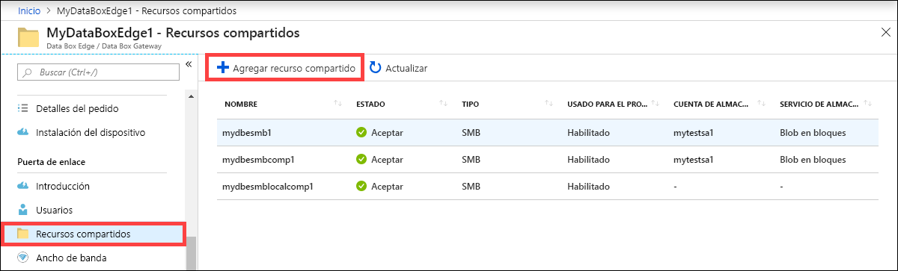

2. En **Agregar recurso compartido**, especifique la configuración del recurso compartido. Proporcione un nombre exclusivo para el recurso compartido.
    
    Los nombres de recursos compartidos solo pueden contener letras minúsculas, números y guiones. El nombre del recurso compartido debe tener entre 3 y 63 caracteres y empezar por una letra o un número. Antes y después de cada guion debe ir un carácter que no sea otro guión.

3. Seleccione un **tipo** de recurso compartido. El tipo puede ser **SMB** o **NFS** (SMB es el predeterminado). SMB es el estándar para los clientes de Windows y se usa NFS para los clientes de Linux. Dependiendo de si elige recursos compartidos SMB o NFS, las opciones que se presentan son ligeramente diferentes.

4. Especifique la **cuenta de almacenamiento** en que se encuentra el recurso compartido. Se crea un contenedor en la cuenta de almacenamiento con el nombre del recurso compartido si el contenedor no existía previamente. Si el contenedor ya existe, se usará este.

5. En la lista desplegable, elija el **servicio de almacenamiento** entre blob en bloques, blob en páginas o archivos. El tipo de servicio elegido depende de en qué formato desea que los datos residan en Azure. Por ejemplo, en este caso, queremos que los datos residan como **blobs en bloques** en Azure y, por tanto, seleccionamos esa opción. Si elige **Blob en páginas**, debe asegurarse de que los datos tienen 512 bytes alineados. Use **Blob en páginas** para VHD o VHDX que siempre tienen 512 bytes alineados.

6. Este paso depende de si está creando un recurso compartido SMB o NFS.
    - **Si crea un recurso compartido SMB**: en el campo **Usuario local con todos los privilegios**, elija entre **Crear nuevo** o **Usar existente**. Si va a crear un nuevo usuario local, indique el **nombre de usuario** y la **contraseña** y, después, confirme la contraseña. Esto asigna los permisos al usuario local. Después de haber asignado los permisos aquí, puede utilizar el Explorador de archivos para modificarlos.

        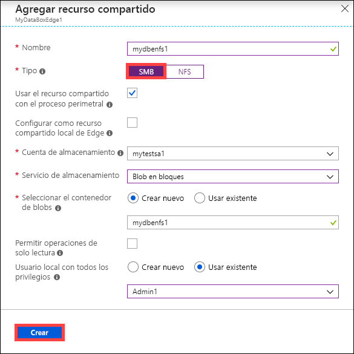

        Si selecciona que se permitan operaciones de solo lectura en los datos de este recurso compartido, puede especificar usuarios de solo lectura.
    - **Si crea un recurso compartido NFS**: debe indicar las **direcciones IP de los clientes autorizados** que pueden acceder al recurso compartido.

        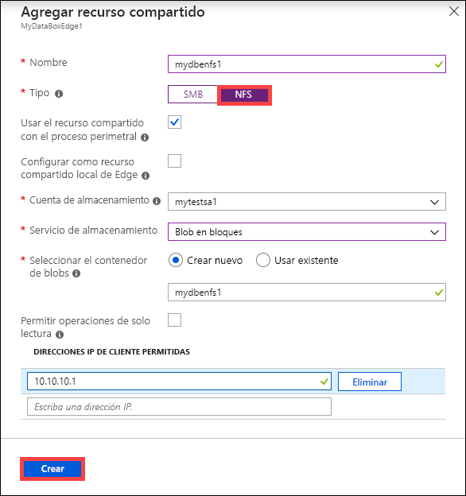

7. Para acceder fácilmente a los recursos compartidos de los módulos de proceso perimetral, use el punto de montaje local. Seleccione **Usar el recurso compartido con el proceso perimetral** para que el recurso compartido se monte automáticamente después de que se cree. Cuando se selecciona esta opción, el módulo Edge también puede usar el proceso con el punto de montaje local.

8. Haga clic en **Crear** para crear el recurso compartido. Se le notifica que la creación del recurso compartido está en curso. Una vez creado el recurso compartido con la configuración especificada, la hoja **Recursos compartidos** se actualiza para reflejar el nuevo recurso compartido.

## Incorporación de un recurso compartido local

1. En Azure Portal, vaya al recurso de Data Box Edge y luego a **Gateway > Recursos compartidos**. Seleccione **+ Agregar recurso compartido** en la barra de comandos.

    

2. En **Agregar recurso compartido**, especifique la configuración del recurso compartido. Proporcione un nombre exclusivo para el recurso compartido.
    
    Los nombres de recursos compartidos solo pueden contener letras minúsculas, números y guiones. El nombre del recurso compartido debe tener entre 3 y 63 caracteres y empezar por una letra o un número. Antes y después de cada guion debe ir un carácter que no sea otro guión.

3. Seleccione un **tipo** de recurso compartido. El tipo puede ser **SMB** o **NFS** (SMB es el predeterminado). SMB es el estándar para los clientes de Windows y se usa NFS para los clientes de Linux. Dependiendo de si elige recursos compartidos SMB o NFS, las opciones que se presentan son ligeramente diferentes.

4. Para acceder fácilmente a los recursos compartidos de los módulos de proceso perimetral, use el punto de montaje local. Seleccione **Use the share with Edge compute** (Usar el recurso compartido con el proceso perimetral) para que el módulo de Edge pueda usar el proceso con el punto de montaje local.

5. Seleccione **Configure as Edge local shares** (Configurar como recursos compartidos locales de Edge). Los datos de los recursos compartidos locales se quedarán en el dispositivo. Puede procesar estos datos de manera local.

6. En el campo **Usuario local con todos los privilegios**, elija entre **Crear nuevo** o **Usar existente**.

7. Seleccione **Crear**. 

    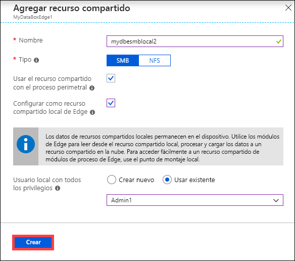

    Verá una notificación de que la creación del recurso compartido está en curso. Una vez creado el recurso compartido con la configuración especificada, la hoja **Recursos compartidos** se actualiza para reflejar el nuevo recurso compartido.

    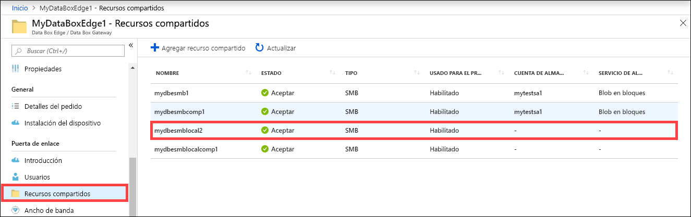
    
    Seleccione el recurso compartido para ver el punto de montaje local para los módulos de proceso perimetral de este recurso compartido.

    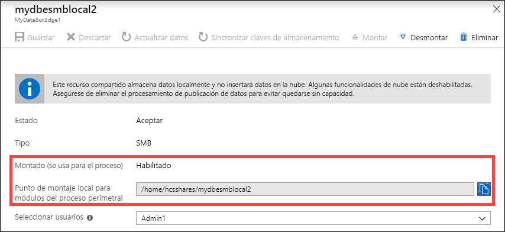

## Montaje de un recurso compartido

Si creó un recurso compartido antes de configurar el proceso en un dispositivo con Data Box Edge, deberá montar el recurso compartido. Realice los siguientes pasos para montar un recurso compartido.

1. En Azure Portal, vaya al recurso de Data Box Edge y luego a **Gateway > Recursos compartidos**. En la lista de recursos compartidos, seleccione el que desee montar. En la columna **Usado para el proceso**, el estado del recurso compartido seleccionado aparecerá como **Deshabilitado**.

    

2. Seleccione **Montar**.

    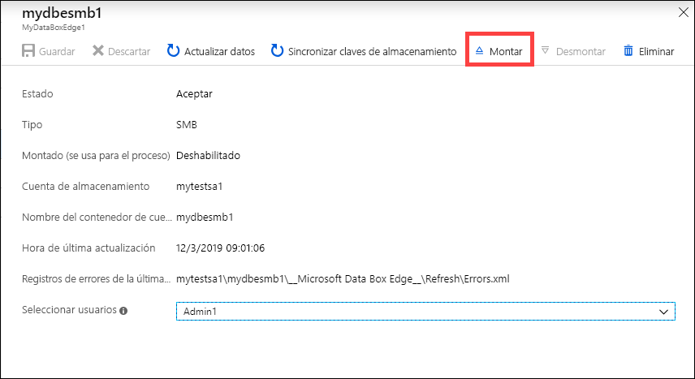

3. Cuando se le pida confirmación, seleccione **Sí**. Se montará el recurso compartido.

    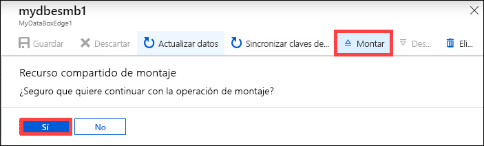

4. Después de que se monte el recurso compartido, vaya a la lista de recursos compartidos. Verá que la columna **Usado para el proceso** muestra el estado del recurso compartido como **Habilitado**.

    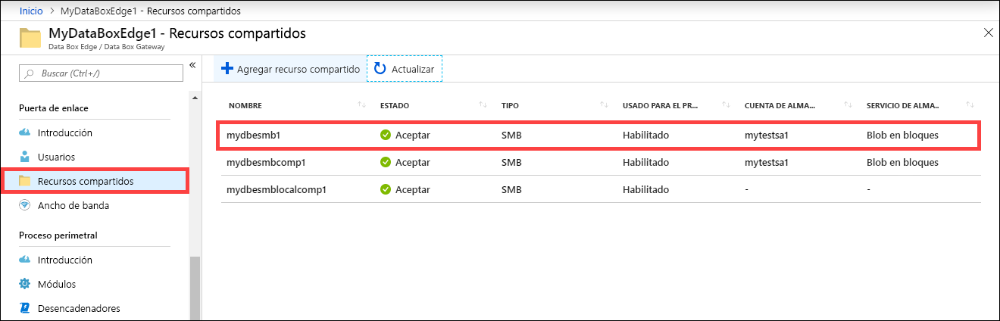

5. Vuelva a seleccionar el recurso compartido para ver el punto de montaje local del recurso compartido. El módulo del proceso perimetral usa este punto de montaje local para el recurso compartido.

    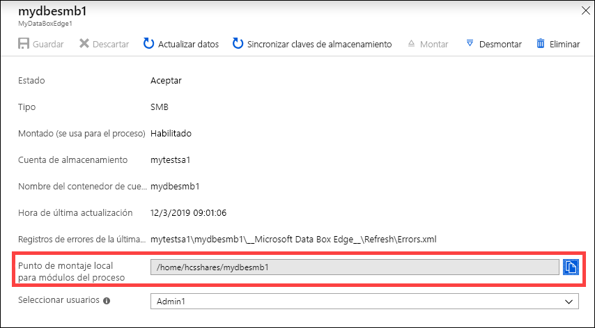

## Desmontaje de un recurso compartido

Siga estos pasos en Azure Portal para desmontar un recurso compartido.

1. En Azure Portal, vaya al recurso de Data Box Edge y luego a **Gateway > Recursos compartidos**.

    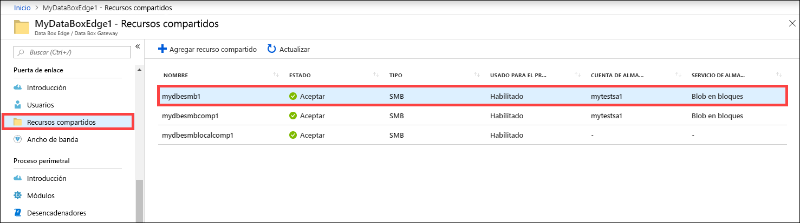

2. En la lista de recursos compartidos, seleccione el que desee desmontar. Desea asegurarse de que ningún módulo usa el recurso compartido que desmonta. Si un módulo usa el recurso compartido, verá que aparecen problemas con este módulo. Seleccione **Desmontar**.

    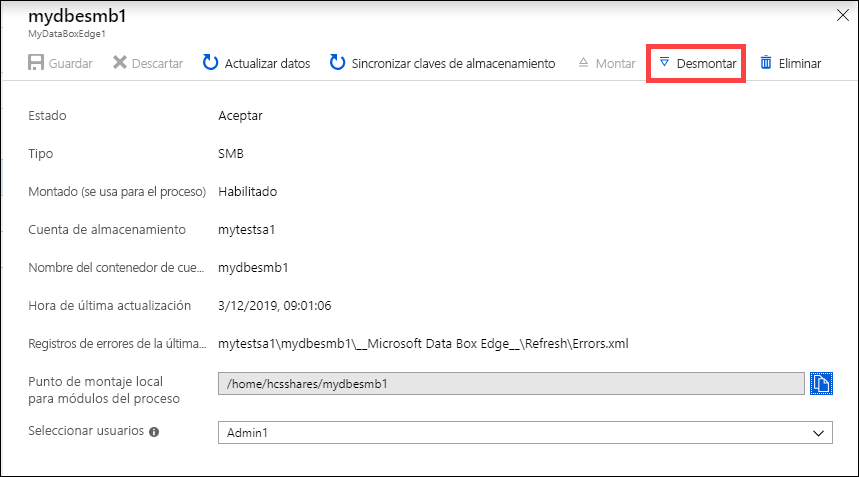

3. Cuando se le pida confirmación, seleccione **Sí**. Se desmontará el recurso compartido.

    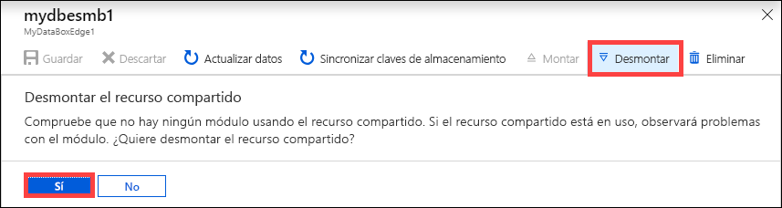

4. Después de que se desmonte el recurso compartido, vaya a la lista de recursos compartidos. Verá que la columna **Usado para el proceso** muestra el estado del recurso compartido como **Deshabilitado**.

    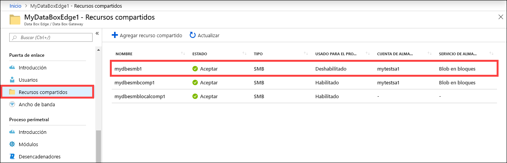

## Eliminación de un recurso compartido

Siga estos pasos en Azure Portal para eliminar un recurso compartido.

1. En la lista de recursos compartidos, seleccione y haga clic en el recurso compartido que desea eliminar.

    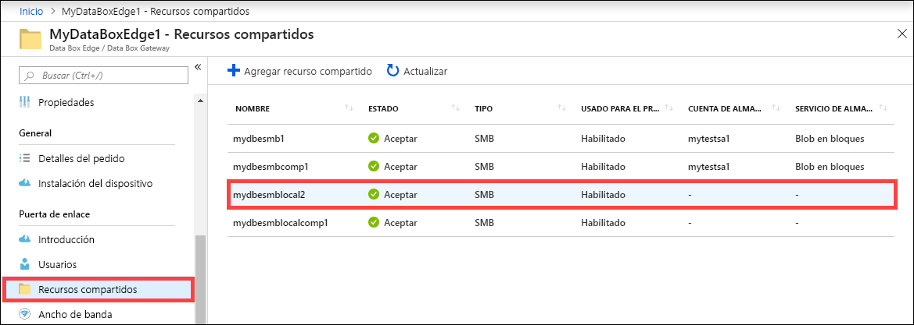

2. Hacer clic en **Eliminar**.

    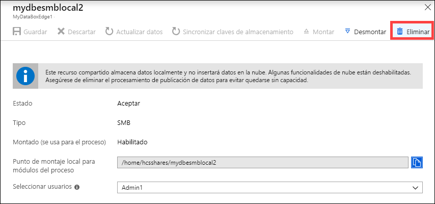

3. Cuando se le pida confirmación, haga clic en **Sí**.

    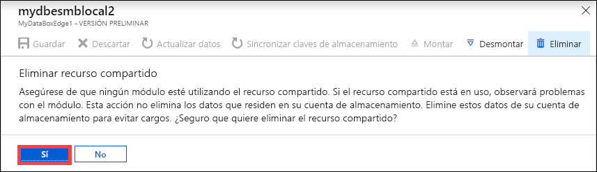

La lista de recursos compartidos se actualiza para reflejar la eliminación.

## Actualización de recursos compartidos

La característica de actualización permite actualizar el contenido de un recurso compartido. Al actualizar un recurso compartido, se inicia una búsqueda para encontrar todos los objetos de Azure, lo que incluye los blobs y archivos que se agregaron a la nube desde la última actualización. Luego, estos archivos adicionales se descargan para actualizar el contenido del recurso compartido en el dispositivo.

> [!IMPORTANT]
> - Los recursos compartidos locales no se pueden actualizar.
> - En una operación de actualización, no se conservan los permisos y las listas de control de acceso (ACL). 

Siga estos pasos en Azure Portal para actualizar un recurso compartido.

1.  En Azure Portal, vaya a **Recursos compartidos**. Seleccione y haga clic en el recurso compartido que desea actualizar.

    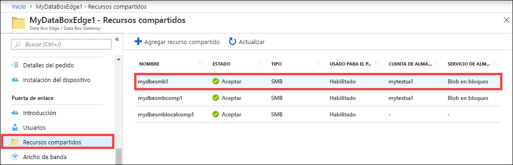

2.  Haga clic en **Actualizar**. 

    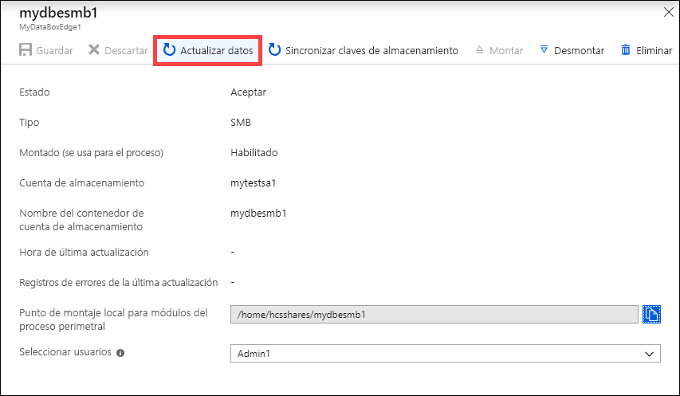
 
3.  Cuando se le pida confirmación, haga clic en **Sí**. Se inicia el trabajo de actualización del contenido del recurso compartido local.

    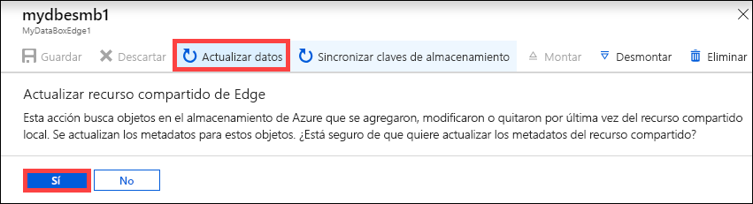
 
4.  Mientras la actualización está en curso, la opción de actualización está deshabilitada en el menú contextual. Haga clic en la notificación para ver el estado del trabajo de actualización.

5.  El tiempo que tarde en completarse la actualización dependerá del número de archivos que haya en el contenedor de Azure, así como de los archivos del dispositivo. Cuando la actualización se haya completado correctamente, se actualizará la marca de tiempo del recurso compartido. Aunque la actualización tenga errores parciales, la operación se considerará correcta y se actualizará la marca de tiempo. También se actualizan los registros de errores de actualización.

    
 
Si se produce un error, se genera una alerta, en la que se indica la causa del error y se proporciona una recomendación para solucionarlo. La alerta también incluye vínculos a un archivo que contiene el resumen completo de los errores, incluidos los archivos que no se pudieron actualizar o eliminar.

## Sincronización de claves de almacenamiento

Si las claves de la cuenta de almacenamiento han rotado, deberá sincronizar las claves del acceso al almacenamiento. La sincronización ayuda al dispositivo a obtener las claves de almacenamiento más recientes de su cuenta de almacenamiento.

Realice los pasos siguientes en Azure Portal para sincronizar la clave de acceso al almacenamiento.

1. Vaya a **Información general** en el recurso. En la lista de recursos compartidos, elija y haga clic en un recurso compartido asociado con la cuenta de almacenamiento que necesita sincronizar.

    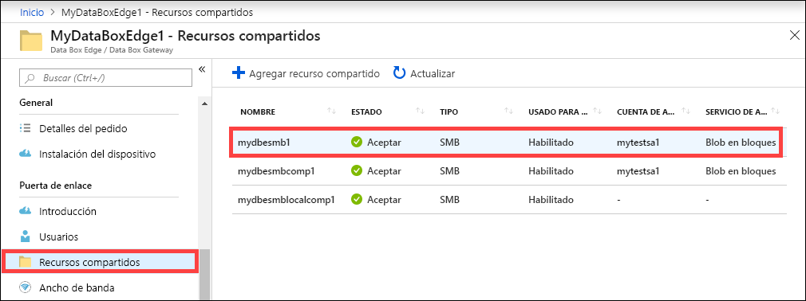

2. Haga clic en **Sincronizar clave de almacenamiento**. Haga clic en **Sí** cuando se pida confirmación.

     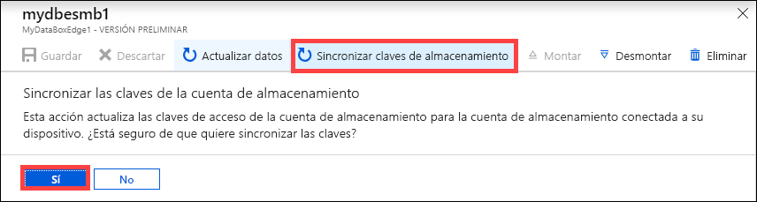

3. Salga del cuadro de diálogo cuando haya finalizado la sincronización.

>[!NOTE]
> Esta operación solo debe realizarse una vez en cada cuenta de almacenamiento. No es necesario repetir la acción para todos los recursos compartidos asociados con la misma cuenta de almacenamiento.

## Pasos siguientes

- Aprenda a [administrar usuarios desde Azure Portal](data-box-edge-manage-users.md).
