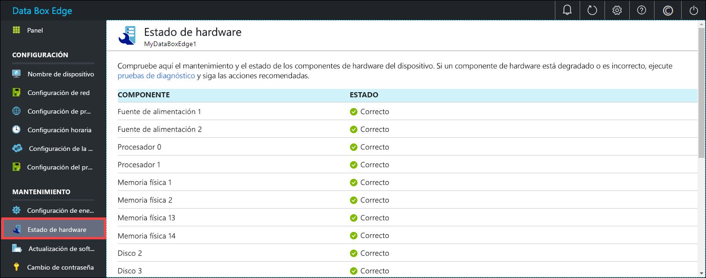

# Supervisión de Azure Data Box Edge

En este artículo se describe cómo supervisar Azure Data Box Edge. Para supervisar el dispositivo, puede usar Azure Portal o la interfaz de usuario web local. Use Azure Portal para ver los eventos de dispositivo, configurar y administrar las alertas, y ver las métricas. Use la interfaz de usuario web local en el dispositivo físico para ver el estado del hardware de los distintos componentes del dispositivo.

En este artículo, aprenderá a:

> [!div class="checklist"]
> * Ver los eventos de dispositivo y las alertas correspondientes
> * Ver el estado del hardware de los componentes del dispositivo
> * Ver las métricas de transacciones y de capacidad del dispositivo
> * Configurar y administrar las alertas

## Ver los eventos de dispositivo

[!INCLUDE [Supported OS for clients connected to device](../../includes/data-box-edge-gateway-view-device-events.md)]

## Visualización del estado del hardware

Realice los pasos siguientes en la interfaz de usuario web local para ver el estado del hardware de los componentes del dispositivo.

1. Conéctese a la interfaz de usuario web local del dispositivo.
2. Vaya a **Mantenimiento > Estado de hardware**. Puede ver el estado de los distintos componentes del dispositivo.

    

## Visualización de métricas

[!INCLUDE [Supported OS for clients connected to device](../../includes/data-box-edge-gateway-view-metrics.md)]

## Administrar alertas

[!INCLUDE [Supported OS for clients connected to device](../../includes/data-box-edge-gateway-manage-alerts.md)]

## Pasos siguientes 

Aprenda a [administrar el ancho de banda](data-box-edge-manage-bandwidth-schedules.md).