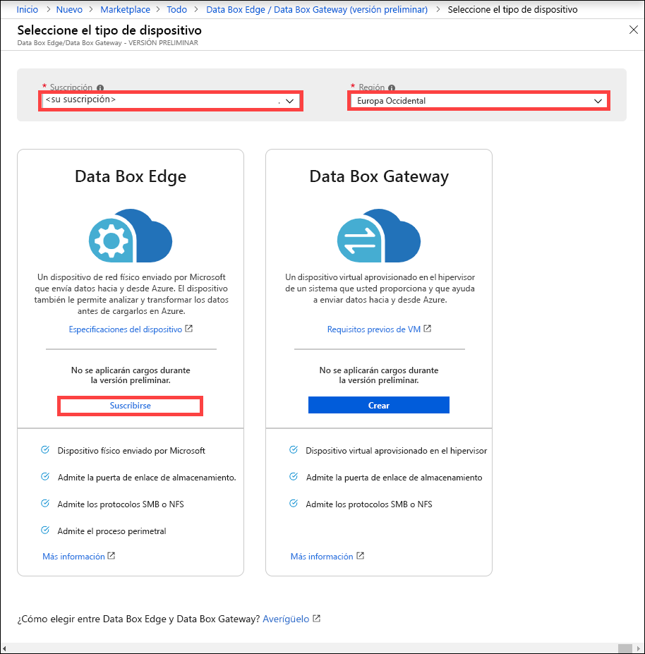
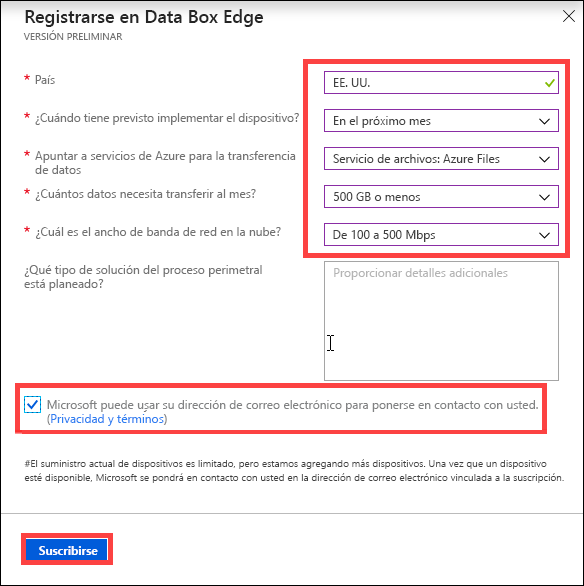

# ¿Qué es Azure Data Box Edge (versión preliminar)? 

Azure Data Box Edge es una solución de almacenamiento que le permite procesar datos y enviarlos a través de la red a Azure. En este artículo se proporciona información general acerca de la solución de Data Box Edge, sus ventajas, funcionalidades clave y los escenarios donde puede implementar este dispositivo. 

Data Box Edge usa un dispositivo físico proporcionado por Microsoft para acelerar la transferencia de datos segura. El dispositivo físico reside en su entorno local y se pueden escribir datos en él mediante los protocolos SMB y NFS. 

Data Box Edge tiene todas las capacidades de puerta de enlace de Data Box Gateway. Además, Data Box está equipado con funcionalidades de procesamiento perimetral habilitadas para inteligencia artificial que ayudan a analizar, procesar o filtrar los datos mientras se desplazan a un blob en bloques de Azure, blob en páginas o a Azure Files.  

> [!IMPORTANT]
> - Data Box Edge se encuentra en versión preliminar. [Suscríbase ](#sign-up) a este servicio.
> - Revise las [condiciones de uso de la versión preliminar](https://azure.microsoft.com/support/legal/preview-supplemental-terms/) antes de implementar esta solución.

## Casos de uso

Azure Data Box Edge es un dispositivo informático perimetral habilitado para inteligencia artificial con funcionalidades de transferencia de datos de red. Estos son los distintos escenarios donde se puede usar Data Box Edge para la transferencia de datos.

- **Preprocesar los datos** : analice datos desde un entorno local o dispositivos de IoT para obtener un resultado rápido mientras se mantiene cerca del origen de los datos. Data Box Edge transfiere conjuntos de datos perimetrales enteros a la nube para llevar a cabo un procesamiento más avanzado o un análisis más profundo.  El preprocesamiento se puede usar para: 

    - Agregar datos.
    - Modificar los datos, por ejemplo, para quitar información de identificación personal (DCP).
    - Crear un subconjunto de los datos necesarios para realizar un análisis más profundo en la nube y transferirlos.
    - Analizar y reaccionar a los eventos de IoT. 

- **Inferencias de Azure Machine Learning**: con Data Box Edge, puede ejecutar modelos de Machine Learning (ML) para obtener resultados rápidos sobre los que se puede actuar antes de que los datos se envían a la nube. El conjunto de datos completo se transfiere para seguir entrenando y mejorando los modelos de Machine Learning.

- **Transferir datos a través de red a Azure**: use Data Box Edge para transferir datos a Azure de forma rápida y sencilla para poder realizar más procesos y análisis o para fines de archivado. 

## Ventajas

Data Box Edge tiene las siguientes ventajas:

- **Transferencia de datos sencilla**: permite mover datos hacia y desde el almacenamiento de Azure tan fácilmente como si estuviera trabajando con un recurso compartido de red local.  
- **Alto rendimiento**: permite las transferencias de alto rendimiento hacia y desde Azure. 
- **Acceso rápido**: almacena en caché los archivos más recientes para agilizar el acceso a los archivos de entornos locales.  
- **Uso de ancho de banda limitado**: se pueden escribir datos en Azure incluso cuando la red limita el uso durante las horas punta comerciales.  
- **Transformación de datos**: habilita el análisis, procesamiento o filtrado de datos cuando se mueven a Azure.

## Principales capacidades

Data Box Edge tiene las siguientes funcionalidades:

|Capacidad |DESCRIPCIÓN  |
|---------|---------|
|Alto rendimiento     | Transferencia de datos y ancho de banda totalmente automatizados y altamente optimizados.|
|Protocolos admitidos     | Compatibilidad con los protocolos estándar SMB y NFS para la ingesta de datos.   Para más información sobre las versiones compatibles, vaya a [Requisitos del sistema de Azure Data Box Edge](https://aka.ms/dbe-docs).|
|Procesamiento       |Permite el análisis, procesamiento y filtrado de datos.|
|Acceso a datos     | Ofrece acceso directo a los datos de Azure Storage Blob y Azure Files mediante las API en la nube para un procesamiento de datos adicional en la nube.|
|Acceso rápido     | Memoria caché local en el dispositivo para agilizar el acceso a los archivos usados más recientemente.|
|Carga sin conexión     | El modo sin conexión es compatible con escenarios de carga sin conexión.|
|Actualización de datos     | Capacidad para actualizar los archivos locales con la versión más reciente de la nube.|
|Cifrado    | Compatibilidad con BitLocker para, localmente, cifrar los datos y proteger las transferencias de datos hacia la nube a través de *https*.       |
|Resistencia     | Resistencia de red integrada.        |

## Características y especificaciones

El dispositivo físico de Data Box Edge tiene las siguientes características:

| Características y especificaciones                                          | DESCRIPCIÓN              |
|---------------------------------------------------------|--------------------------|
| Dimensiones   | Ancho: 17,25 pulg. (438,15 mm) Profundidad: 27,25 pulg. (692,15 mm) Alto: 1,75 pulg. (44,45 mm) (solo medidas de la unidad sin incluir aletas ni elementos de la fuente de alimentación)  |            
| Espacio en bastidor|1U cuando se coloca en el bastidor|
| Cables| 2 cables de alimentación 2 cables RJ45 de 1 Gbps 2 cables de cobre SFP+ de 10 Gbps|
| Componentes|2 fuentes de alimentación (PSU) integradas|
| CPU|2 procesadores Intel Xeon con 10 núcleos cada uno  |
| Memoria| 64 GB de RAM|
| Discos| 8 SSD de NVMe, cada disco de 1,6 TB   Se produce un error en el sistema si se produce un error en uno de los SSD de NVMe. |
| Capacidad de almacenamiento local| 12,8 TB de capacidad total|
| Interfaces de red| 2 interfaces de 1 GbE: 1 administración, no es configurable por el usuario y se usa para la configuración inicial. El usuario puede configurar las otras interfaces de datos y son DHCP de forma predeterminada.  2 interfaces de 25 GbE: estas pueden funcionar como interfaces de 10 GbE. El usuario puede configurar estas interfaces como DHCP (predeterminado) o estáticas.   2 interfaces de 25 GbE: el usuario puede configurar estas interfaces como DHCP (predeterminado) o estáticas.|

## Componentes

La solución Data Box Edge consta de un recurso Data Box Edge, un dispositivo físico Data Box Edge y una interfaz de usuario web local.

* **Dispositivo físico Data Box Edge**: un servidor de montaje en bastidor 1U proporcionado por Microsoft que se puede configurar para enviar datos a Azure. 
    
* **Recurso Data Box Edge**: es un recurso de Azure Portal que le permite administrar un dispositivo Data Box Edge desde una interfaz web a la cual puede acceder desde diferentes ubicaciones geográficas. Use el recurso Data Box Edge para crear y administrar recursos, ver y administrar dispositivos y alertas y administrar recursos compartidos.  

    <!---->

    Para obtener más información, consulte [Use the Data Box Edge service to administer your Data Box device](https://aka.ms/dbe-docs) (Uso del servicio Data Box para administrar su dispositivo Data Box Edge).

* **Interfaz de usuario web local de Data Box**: use la interfaz de usuario web local para ejecutar diagnósticos, apagar y reiniciar el dispositivo Data Box Edge, ver registros de copia y ponerse en contacto con el Soporte técnico de Microsoft para realizar una solicitud de servicio.

    <!---->

    Para más información acerca de cómo usar la interfaz de usuario basada en web, consulte [Use the web-based UI to administer your Data Box](https://aka.ms/dbe-docs) (Uso de la interfaz de usuario web para administrar Data Box).

## Disponibilidad en regiones

El dispositivo físico Data Box Edge, el recurso de Azure y la cuenta de almacenamiento de destino a la que transferirá los datos no tienen que estar en la misma región.

- **Disponibilidad del recurso**: para esta versión, el recurso Data Box Edge está disponible en las siguientes regiones:
    - **Estados Unidos**: Oeste de EE. UU. 2 y Este de EE. UU.
    - **Unión Europea**: Europa Occidental
    - **Asia Pacífico**: Sudeste de Asia

- **Cuentas de almacenamiento de destino**: las cuentas de almacenamiento que almacenan los datos están disponibles en todas las regiones de Azure. 

    Las regiones en las que las cuentas de almacenamiento almacenan los datos de Data Box deben estar ubicadas cerca de la ubicación del dispositivo para un rendimiento óptimo. Una cuenta de almacenamiento que se encuentra lejos del dispositivo causa latencias largas y un rendimiento más lento. 

## Suscripción

Data Box Edge está en versión preliminar y es preciso registrarse. Siga estos pasos para registrarse en el servicio Data Box Gateway:

1. Inicie sesión en Azure Portal en: [https://aka.ms/databox-edge](https://aka.ms/databox-edge).

2. Seleccione la suscripción que desea usar para la versión preliminar de Data Box Edge. Seleccione la región donde desea implementar el recurso Data Box Edge. En la opción de Data Box Edge, haga clic en **Registrarse**.

    

3.  Responda a las preguntas relativas al país de residencia de los datos, período de tiempo, servicio de Azure de destino para la transferencia de datos, ancho de banda y frecuencia de transferencia de datos. Revise los **Términos y privacidad** y seleccione la casilla **Microsoft can use your email address to contact you** (Microsoft puede usar su dirección de correo electrónico para ponerse en contacto con usted).

    

4. Una vez que se haya registrado y esté habilitado para la versión preliminar, puede solicitar Data Box Edge.

## Pasos siguientes

- Revise [los requisitos del sistema Data Box Edge](https://aka.ms/dbe-docs).
- Información acerca de los [límites de Data Box Edge](https://aka.ms/dbe-docs).
- Implemente rápidamente [Azure Data Box Edge](https://aka.ms/dbe-docs) en Azure Portal.

