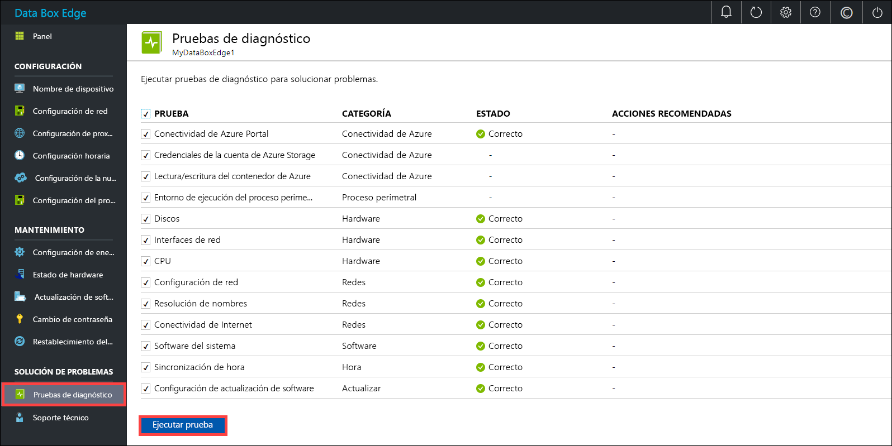
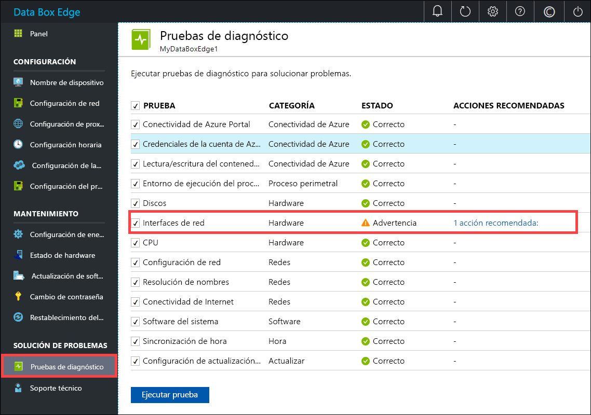
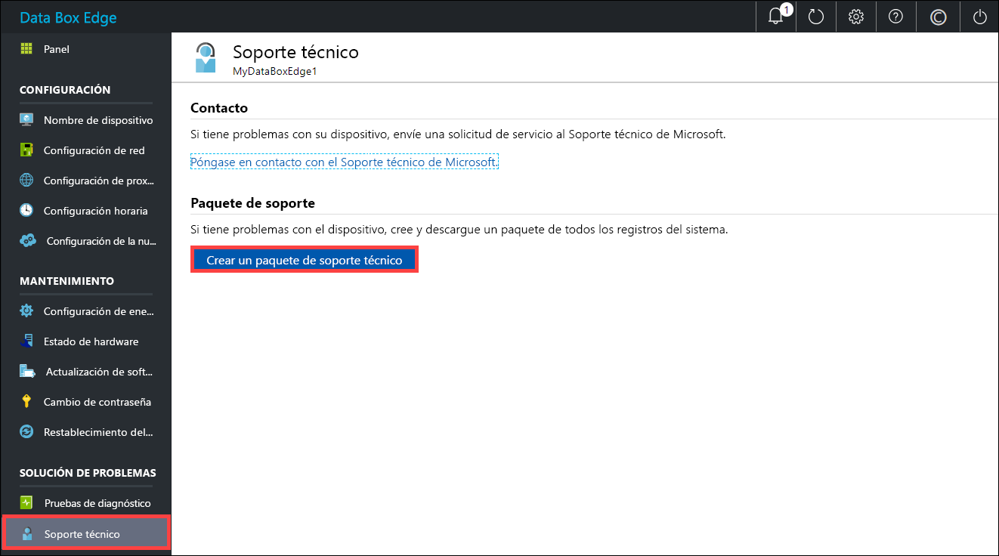
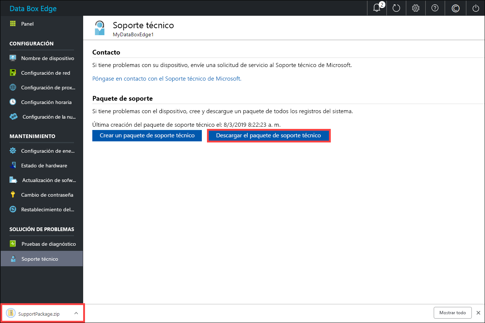
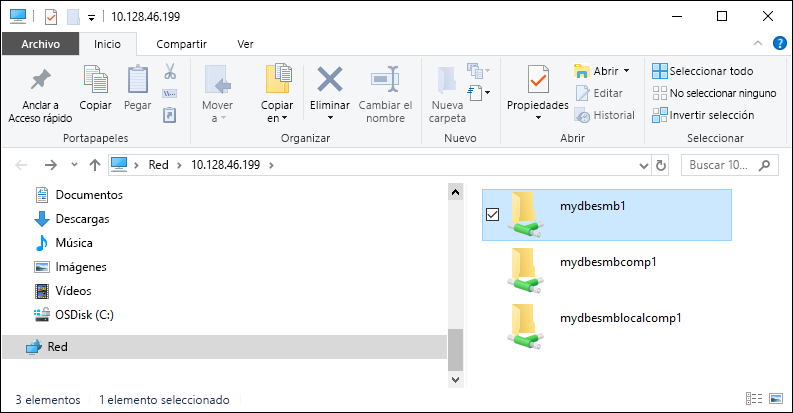

# <a name="troubleshoot-your-azure-data-box-edge-issues"></a>Solución de problemas de Azure Data Box Edge 

En este artículo se describe cómo solucionar los problemas de Azure Data Box Edge. 

En este artículo, aprenderá a:

> [!div class="checklist"]
> * Ejecución de diagnósticos
> * Recopilar un paquete de soporte
> * Usar registros para solucionar problemas


## <a name="run-diagnostics"></a>Ejecución de diagnósticos

Para diagnosticar y solucionar los errores de cualquier dispositivo, puede ejecutar las pruebas de diagnóstico. Realice los pasos siguientes en la interfaz de usuario web local del dispositivo para ejecutar las pruebas de diagnóstico.

1. En la interfaz de usuario de web local, vaya a **Solución de problemas > Pruebas de diagnóstico en**. Seleccione la prueba que desea ejecutar y haga clic en **Ejecutar prueba**. Así se ejecutan las pruebas necesarias para diagnosticar posibles problemas en la red, el dispositivo, el proxy web, la hora o la configuración de la nube. Aparece una notificación que indica que hay algunas pruebas en ejecución en el dispositivo.

    
 
2. Al terminar las pruebas, se muestran los resultados. 

    

    Si se produce un error en una prueba, se especifica una dirección URL en la que se muestra la acción recomendada. Puede hacer clic en dicha dirección para ver la acción recomendada.
 
    


## <a name="collect-support-package"></a>Recopilación de un paquete de soporte

Los paquetes de registros contienen todos los registros pertinentes que pueden ayudar al equipo de soporte técnico de Microsoft a solucionar los problemas de cualquier dispositivo. Los paquetes de registros se pueden generar a través de la interfaz de usuario web local.

Siga estos pasos para recopilar un paquete de soporte. 

1. En la interfaz de usuario web local, vaya a **Solución de problemas > Soporte**. Haga clic en **Crear un paquete de soporte técnico**. El sistema empieza a recopilar el paquete de soporte. Dicha recopilación puede tardar varios minutos.

    
 
2. Una vez que se cree el paquete, haga clic en **Descargar el paquete de soporte técnico**. Se descarga un paquete comprimido en la ruta de acceso que eligió. Puede descomprimir el paquete de registro y ver los archivos de registro del sistema.

    

## <a name="use-logs-to-troubleshoot"></a>Uso de registros para solucionar problemas

Los errores encontrados durante los procesos de carga y actualización se incluyen en los archivos de error respectivos.

1. Para ver los archivos de error, vaya al recurso compartido y haga clic en el recurso compartido para ver el contenido. 

      

2. Haga clic en la _carpeta Microsoft Azure Data Box Edge_. Esta carpeta tiene dos subcarpetas:

    - Cargue la que contiene los archivos de registro de errores de carga.
    - Actualice la carpeta para ver los errores durante la actualización.

    Este es un archivo de registro de ejemplo de actualización.

    ```
    <root container="test1" machine="VM15BS020663" timestamp="03/18/2019 00:11:10" />
    <file item="test.txt" local="False" remote="True" error="16001" />
    <summary runtime="00:00:00.0945320" errors="1" creates="2" deletes="0" insync="3" replaces="0" pending="9" />
    ``` 

3. Cuando vea un error en este archivo (resaltado en el ejemplo), anote el código de error, en este caso el 16001. Busque la descripción del código de error en la siguiente referencia de errores.

    [!INCLUDE [data-box-edge-edge-upload-error-reference](../../includes/data-box-edge-gateway-upload-error-reference.md)]


## <a name="next-steps"></a>Pasos siguientes

- Más información acerca de los [problemas conocidos de esta versión](data-box-gateway-release-notes.md).
