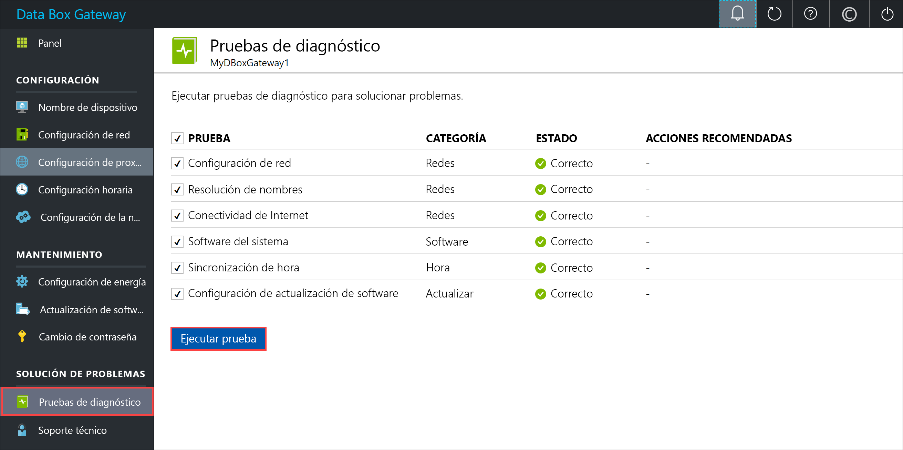
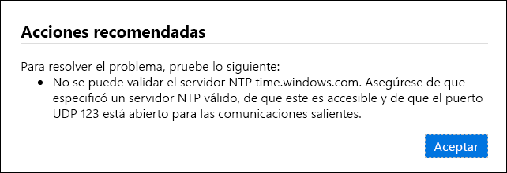
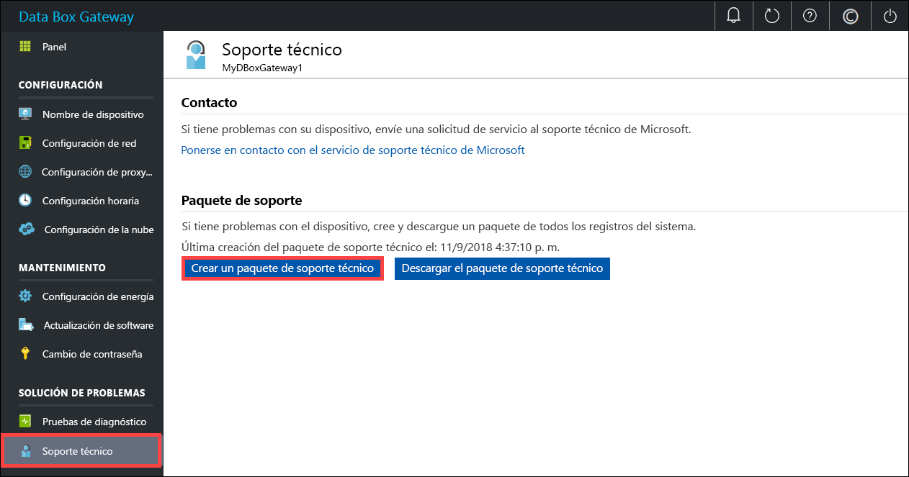
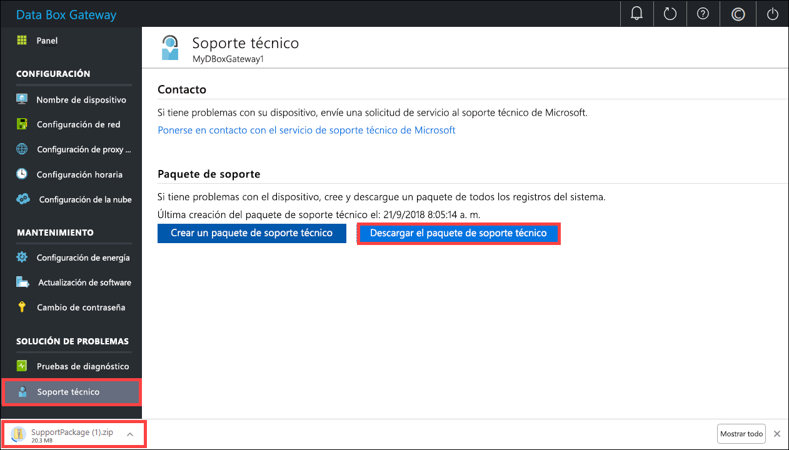
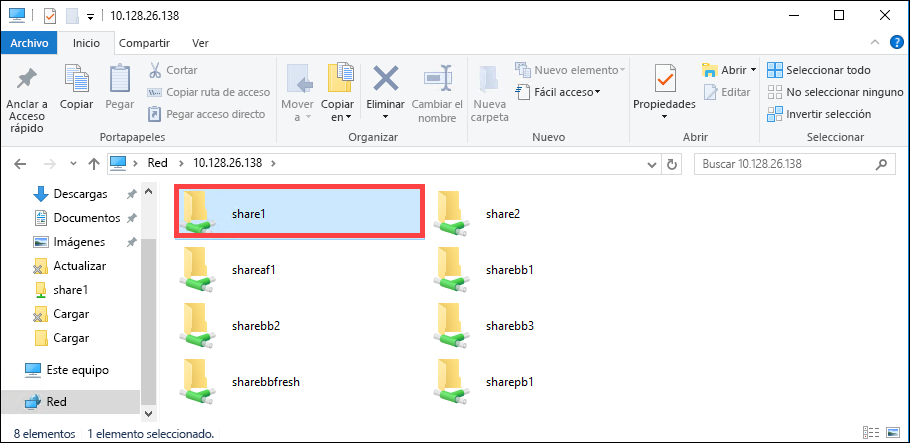

# <a name="troubleshoot-your-azure-data-box-gateway-issues"></a>Solución de problemas de Azure Data Box Gateway 

En este artículo se describe cómo solucionar los problemas de Azure Data Box Gateway. 

> [!IMPORTANT]
> - Data Box Gateway está en versión preliminar. Antes de solicitar e implementar esta solución revise los [términos del servicio de Azure para la versión preliminar](https://azure.microsoft.com/support/legal/preview-supplemental-terms/).

En este artículo, aprenderá a:

> [!div class="checklist"]
> * Ejecución de diagnósticos
> * Recopilar un paquete de soporte
> * Usar registros para solucionar problemas


## <a name="run-diagnostics"></a>Ejecución de diagnósticos

Para diagnosticar y solucionar los errores de cualquier dispositivo, puede ejecutar las pruebas de diagnóstico. Realice los pasos siguientes en la interfaz de usuario web local del dispositivo para ejecutar las pruebas de diagnóstico.

1. En la interfaz de usuario de web local, vaya a **Solución de problemas > Pruebas de diagnóstico en**. Seleccione la prueba que desea ejecutar y haga clic en **Ejecutar prueba**. Así se ejecutan las pruebas necesarias para diagnosticar posibles problemas en la red, el dispositivo, el proxy web, la hora o la configuración de la nube. Aparece una notificación que indica que hay algunas pruebas en ejecución en el dispositivo.

    
 
2. Al terminar las pruebas, se muestran los resultados. Si se produce un error en una prueba, se especifica una dirección URL en la que se muestra la acción recomendada. Puede hacer clic en dicha dirección para ver la acción recomendada. 
 
    


## <a name="collect-support-package"></a>Recopilación de un paquete de soporte

Los paquetes de registros contienen todos los registros pertinentes que pueden ayudar al equipo de soporte técnico de Microsoft a solucionar los problemas de cualquier dispositivo. Los paquetes de registros se pueden generar a través de la interfaz de usuario web local.

Siga estos pasos para recopilar un paquete de soporte. 

1. En la interfaz de usuario web local, vaya a **Solución de problemas > Soporte**. Haga clic en **Crear un paquete de soporte técnico**. El sistema empieza a recopilar el paquete de soporte. Dicha recopilación puede tardar varios minutos.

    
 
2. Una vez que se cree el paquete, haga clic en **Descargar el paquete de soporte técnico**. Se descarga un paquete comprimido en la ruta de acceso que eligió. Puede descomprimir el paquete de registro y ver los archivos de registro del sistema.

    

## <a name="use-logs-to-troubleshoot"></a>Uso de registros para solucionar problemas

Los errores encontrados durante los procesos de carga y actualización se incluyen en los archivos de error respectivos.

1. Para ver los archivos de error, vaya al recurso compartido y haga clic en el recurso compartido para ver el contenido. 

      

2. Haga clic en la _carpeta Microsoft Azure Data Box Gateway_. Esta carpeta tiene dos subcarpetas:

   - Cargue la que contiene los archivos de registro de errores de carga.
   - Actualice la carpeta para ver los errores durante la actualización.

     Este es un archivo de registro de ejemplo de actualización.

     ```
     <root container="brownbag1" machine="VM15BS020663" timestamp="07/18/2018 00:11:10" />
     <file item="test.txt" local="False" remote="True" error="16001" />
     <summary runtime="00:00:00.0945320" errors="1" creates="2" deletes="0" insync="3" replaces="0" pending="9" />
     ``` 

3. Cuando vea un error en este archivo (resaltado en el ejemplo), anote el código de error, en este caso el 16001. Busque la descripción del código de error en la siguiente referencia de errores.

    |     Código de error     |     Nombre de excepción                                         |     Descripción del error                                                                                                                                                                                                                     |
    |--------------------|------------------------------------------------------------|-------------------------------------------------------------------------------------------------------------------------------------------------------------------------------------------------------------------------------------------|
    |    100             |    ERROR_CONTAINER_OR_SHARE_NAME_LENGTH                    |    El nombre del contenedor o recurso compartido debe tener entre 3 y 63 caracteres.                                                                                                                                                                     |
    |    101             |    ERROR_CONTAINER_OR_SHARE_NAME_ALPHA_NUMERIC_DASH        |    El nombre del contenedor o recurso compartido debe constar solo de letras, números o guiones.                                                                                                                                                       |
    |    102             |    ERROR_CONTAINER_OR_SHARE_NAME_IMPROPER_DASH             |    El nombre del contenedor o recurso compartido debe constar solo de letras, números o guiones.                                                                                                                                                       |
    |    103             |    ERROR_BLOB_OR_FILE_NAME_CHARACTER_CONTROL               |    El nombre del blob o archivo contiene caracteres de control no admitidos.                                                                                                                                                                       |
    |    104             |    ERROR_BLOB_OR_FILE_NAME_CHARACTER_ILLEGAL               |    El nombre del blob o archivo contiene caracteres no válidos.                                                                                                                                                                                   |
    |    105             |    ERROR_BLOB_OR_FILE_NAME_SEGMENT_COUNT                   |    El nombre de archivo o blob contiene demasiados segmentos (cada segmento está separado por una barra diagonal: /).                                                                                                                                              |
    |    106             |    ERROR_BLOB_OR_FILE_NAME_AGGREGATE_LENGTH                |    El nombre de blob o archivo es demasiado largo.                                                                                                                                                                                                     |
    |    107             |    ERROR_BLOB_OR_FILE_NAME_COMPONENT_LENGTH                |    Uno de los segmentos del nombre de blob o archivo es demasiado largo.                                                                                                                                                                            |
    |    108             |    ERROR_BLOB_OR_FILE_SIZE_LIMIT                           |    El tamaño del archivo supera el tamaño máximo para la carga.                                                                                                                                                                              |
    |    109             |    ERROR_BLOB_OR_FILE_SIZE_ALIGNMENT                       |    El blob o archivo no está alineado correctamente.                                                                                                                                                                                               |
    |    110             |    ERROR_NAME_NOT_VALID_UNICODE                            |    El nombre de archivo con código Unicode o el blob no son válidos.                                                                                                                                                                                  |
    |    111             |    ERROR_RESERVED_NAME_NOT_ALLOWED                         |    El nombre o el prefijo del archivo o blob es un nombre reservado que no se admite (por ejemplo, COM1).                                                                                                                             |
    |    2000            |    ERROR_ETAG_MISMATCH                                     |    Un error de coincidencia de ETag indica que hay un conflicto entre un blob en bloques que se encuentra en la nube y otro que se encuentra en el dispositivo. Para resolver este conflicto, elimine uno de los archivos, ya sea la versión en la nube o la versión en el dispositivo.    |
    |    2001            |    ERROR_UNEXPECTED_FINALIZE_FAILURE                       |    Se ha producido un problema inesperado al procesar un archivo después de que se cargara el archivo.    Si ve este error y no desaparece antes de 24 horas, póngase en contacto con el equipo de soporte técnico.                                                      |
    |    2002            |    ERROR_ALREADY_OPEN                                      |    El archivo está abierto en otro proceso y no se puede cargar hasta que se cierre el manipulador.                                                                                                                                       |
    |    2003            |    ERROR_UNABLE_TO_OPEN                                    |    No se pudo abrir el archivo para cargarlo. Si ve este error, póngase en contacto con el servicio de soporte técnico de Microsoft.                                                                                                                                                |
    |    2004            |    ERROR_UNABLE_TO_CONNECT                                 |    No se pudo conectar al contenedor para cargar datos en él.                                                                                                                                                                             |
    |    2005            |    ERROR_INVALID_CLOUD_CREDENTIALS                         |    No se pudo conectar al contenedor porque los permisos de la cuenta están obsoletos o no son correctos. Compruebe los derechos de acceso.                                                                                                               |
    |    2006            |    ERROR_CLOUD_ACCOUNT_DISABLED                            |    No se pudieron cargar datos en la cuenta porque la cuenta o el recurso compartido están deshabilitados.                                                                                                                                                            |
    |    2007            |    ERROR_CLOUD_ACCOUNT_PERMISSIONS                         |    No se pudo conectar al contenedor porque los permisos de la cuenta están obsoletos o no son correctos. Compruebe los derechos de acceso.                                                                                                               |
    |    2008            |    ERROR_CLOUD_CONTAINER_SIZE_LIMIT_REACHED                |    No se pudieron agregar datos nuevos porque el contenedor está lleno. Consulte en las especificaciones de Azure los tamaños de contenedor admitidos en función del tipo. Por ejemplo, Azure Files solo admite un tamaño máximo de 5 TB.                                     |
    |    2009            |    ERROR_CLOUD_CONTAINER_MISSING                |     No se pudieron cargar los datos porque no existe el contenedor asociado con el recurso compartido.                                     |    
    |    2997            |    ERROR_ITEM_CANCELED                                     |    Se ha producido un error inesperado. Este es un error transitorio que se resolverá automáticamente.                                                                           |
    |    2998            |    ERROR_UNMAPPED_FAILURE                                  |    Se ha producido un error inesperado. El error se puede solucionar por sí solo, pero si persiste durante más de 24 horas, póngase en contacto con el Soporte técnico de Microsoft.                                                                                                     |
    |    16000           |    RefreshException                                        |    No se pudo eliminar este archivo.                                                                                                                                                                                                        |
    |    16001           |    RefreshAlreadyExistsException                           |    No se pudo eliminar este archivo porque ya existe en el sistema local.                                                                                                                                                         |
    |    16002           |    RefreshWorkNeededException                              |    No se pudo actualizar este archivo, ya que no está totalmente cargado.                                                                                                                                                                          | 


## <a name="next-steps"></a>Pasos siguientes

- Más información acerca de los [problemas conocidos de esta versión](data-box-gateway-release-notes.md).
