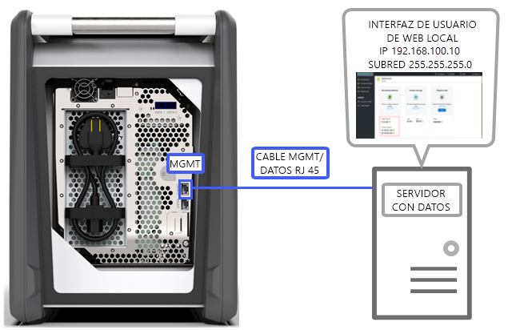
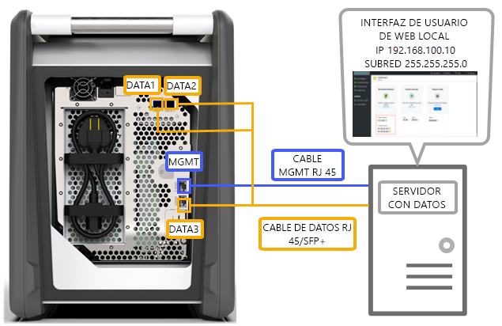
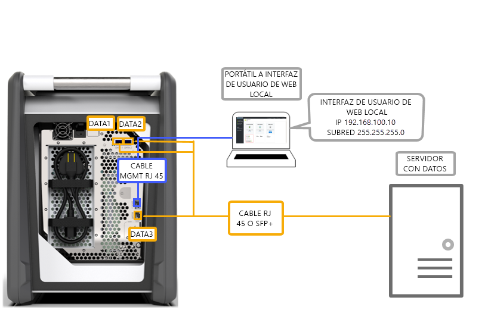
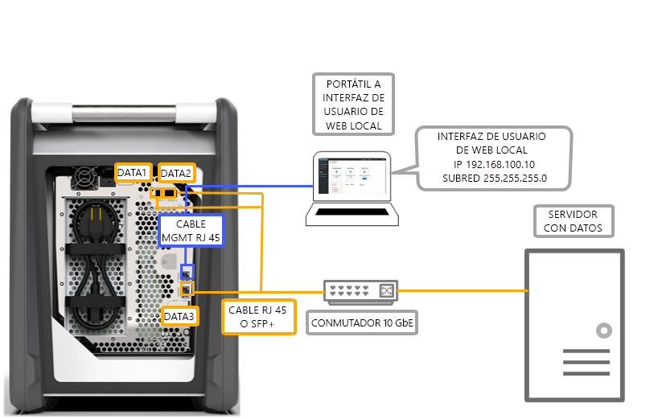
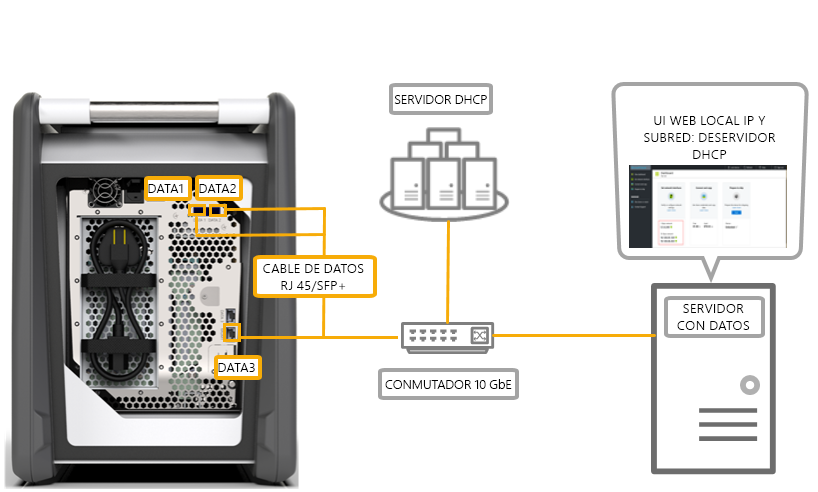

# Opciones de cableado para Azure Data Box

En este artículo se describen las distintas formas de cableado de Azure Data Box para la transferencia de datos.

## Transferencia mediante el puerto MGMT

Esta opción es la configuración mínima absoluta de Data Box. Solo puede configurar el puerto MGMT para administración y datos.

Antes de comenzar, asegúrese de que tiene:

- Un cable Ethernet RJ45 para el puerto MGMT.
- Un origen de datos que ejecute un [sistema operativo admitido](data-box-system-requirements.md#supported-operating-systems-for-clients).

Realice los pasos siguientes para cablear el dispositivo.

1. Utilice un cable RJ45 para conectar el puerto MGMT al servidor que contiene los datos.

    

2. En el servidor, establezca:

    - **Dirección IP** en 192.168.100.5
    - **Subred** en 255.255.255.0

3. Acceda a la interfaz de usuario web local del dispositivo en: 192.168.100.10. Inicie sesión y desbloquee el dispositivo Data Box con la contraseña de desbloqueo de Azure Portal.

## Transferencia mediante el puerto DATA con direcciones IP estáticas

Puede configurar dos puertos para Data Box, el puerto MGMT para el tráfico de administración y uno de los puertos de datos para los datos. Los puertos de datos pueden ser DATA 1, DATA 2 o DATA 3.

Se recomienda que, si configura un solo puerto de datos, utilice un puerto de 10 GbE como DATA 1 o DATA 2. Un puerto de 1 GbE aumentaría drásticamente el tiempo que tarda la transferencia de datos.

Antes de comenzar, asegúrese de que tiene:

- Un cable Ethernet RJ45 para el puerto MGMT.
- Un cable de cobre SFP+ Twinax de 10 GbE para cada puerto de datos de 10 GbE que desea conectar.
- Uno o varios orígenes de datos que ejecuten un [sistema operativo admitido](data-box-system-requirements.md#supported-operating-systems-for-clients).

### Opción 1: instalación inicial mediante servidor

Realice los pasos siguientes para cablear el dispositivo.

1. Use un cable Ethernet RJ45 directamente desde el servidor al puerto MGMT para configuración.
2. Utilice un cable RJ45 para DATA 3 o cables SFP+ para conectar DATA 1 o DATA 2 al servidor que actúa como origen de datos. Se recomienda usar los puertos DATA 1 o DATA 2 de 10 GbE para un buen rendimiento.
3. En el servidor, establezca:

   - **Dirección IP** en 192.168.100.5
   - **Subred** en 255.255.255.0

     

3. Acceda a la interfaz de usuario web local del dispositivo en: 192.168.100.10. Inicie sesión y desbloquee el dispositivo Data Box con la contraseña de desbloqueo de Azure Portal.
4. Asigne direcciones IP estáticas a los puertos de datos que ha configurado.

### Opción 2: instalación inicial mediante equipo independiente

Realice los pasos siguientes para cablear el dispositivo.

1. Use un cable Ethernet RJ45 directamente desde el equipo independiente al puerto MGMT para la configuración.
2. Utilice un cable RJ45 para DATA 3 o cables SFP+ para conectar DATA 1 o DATA 2 al servidor. Se recomienda usar los puertos DATA 1 o DATA 2 de 10 GbE para un buen rendimiento. Los puertos de datos se conectan mediante un conmutador de 10 GbE al servidor que tiene los datos.
3. Configure el adaptador Ethernet del portátil que usa para conectarse al dispositivo con:

   - **Dirección IP** establecida en 192.168.100.5
   - **Subred** establecida en 255.255.255.0

     

3. Acceda a la interfaz de usuario web local del dispositivo en: 192.168.100.10. Inicie sesión y desbloquee el dispositivo Data Box con la contraseña de desbloqueo de Azure Portal.
4. Identifique las direcciones IP asignadas por el servidor DHCP.

## Transferencia mediante el puerto DATA con direcciones IP estáticas y un conmutador 

Use esta configuración para varios orígenes de datos en redes de 1 GbE y de 10 GbE.

Antes de comenzar, asegúrese de que tiene:

- Un cable Ethernet RJ45 para el puerto MGMT.
- Un cable de cobre SFP+ Twinax de 10 GbE para cada puerto de datos de 10 GbE que desea conectar.
- Uno o varios orígenes de datos que ejecuten un [sistema operativo admitido](data-box-system-requirements.md#supported-operating-systems-for-clients). Estos orígenes de datos pueden estar en redes diferentes, como redes de 1 GbE o de 10 GbE.

Realice los pasos siguientes para cablear el dispositivo.

1. Use un cable Ethernet RJ45 directamente desde el servidor al puerto MGMT para configuración.
2. Utilice un cable RJ45 para DATA 3 o cables SFP+ para conectar DATA 1 o DATA 2 al servidor. Se recomienda usar los puertos DATA 1 o DATA 2 de 10 GbE para un buen rendimiento.
3. Configure el adaptador Ethernet del portátil que usa para conectarse al dispositivo con:

   - **Dirección IP** establecida en 192.168.100.5
   - **Subred** establecida en 255.255.255.0

     

3. Acceda a la interfaz de usuario web local del dispositivo en: 192.168.100.10. Inicie sesión y desbloquee el dispositivo Data Box con la contraseña de desbloqueo de Azure Portal.
4. Asigne direcciones IP estáticas a los puertos de datos que ha configurado.

## Transferencia mediante el puerto DATA en un entorno con DHCP

Use esta configuración si el dispositivo va a estar en un entorno con DHCP.

Antes de comenzar, asegúrese de que tiene:

- Un cable RJ45 si desea conectar DATA 1.
- Un cable de cobre SFP+ Twinax de 10 GbE para cada puerto de datos de 10 GbE que desea conectar.
- Uno o varios orígenes de datos que ejecuten un [sistema operativo admitido](data-box-system-requirements.md#supported-operating-systems-for-clients). Estos orígenes de datos pueden estar en redes diferentes, como redes de 1 GbE o de 10 GbE.

Realice los pasos siguientes para cablear el dispositivo.

1. Utilice un cable RJ45 o SFP+ con un conmutador (en el que el servidor DHCP está accesible) al servidor.

    
2. Use un servidor DHCP o un servidor DNS para identificar la dirección IP.
3. Desde un servidor en la misma red, acceda a la interfaz de usuario web local del dispositivo con la dirección IP asignada por el servidor DHCP. Inicie sesión y desbloquee el dispositivo Data Box con la contraseña de desbloqueo de Azure Portal.

## Pasos siguientes

- Una vez que ha cableado el dispositivo, vaya a [Copia de datos en Azure Data Box](data-box-deploy-copy-data.md).
