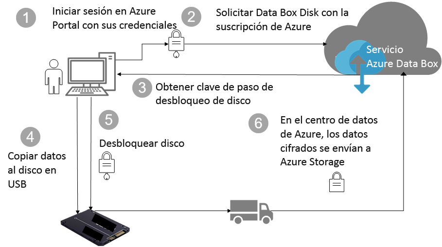

# Protección de datos y seguridad de Azure Data Box Disk

En este artículo se describen las características de seguridad de Azure Data Box Disk que ayudan a proteger cada uno de los componentes de la solución Data Box y los datos almacenados en ellos. 

## Flujo de datos a través de componentes

La solución Microsoft Azure Data Box consta de cuatro componentes principales que interactúan entre sí:

- **Servicio Azure Data Box hospedado en Azure**: el servicio de administración que se usa para crear el pedido del disco, configurar los discos y, a continuación, controlar el pedido hasta que se realiza.
- **Data Box Disks**: los discos físicos que se envían para importar los datos del entorno local a Azure. 
- **Clientes/hosts conectados al dispositivo**: los clientes en la infraestructura que se conectan al disco de Data Box sobre USB y contienen los datos que se deben proteger.
- **Almacenamiento en la nube** : la ubicación en la nube de Azure donde se almacenan los datos. Suele ser la cuenta de almacenamiento vinculada al recurso de Azure Data Box que ha creado.

El diagrama siguiente indica el flujo de datos a través de la solución Azure Data Box Disk desde el entorno local a Azure.

## Características de seguridad

Data Box Disk proporciona una solución segura para proteger los datos al garantizar que solo las entidades autorizadas puedan ver, modificar o eliminar los datos. Las características de seguridad de esta solución están destinadas al disco y al servicio asociado, lo que garantiza la seguridad de los datos almacenados.

### Protección de Data Box Disk

Data Box Disk se protege mediante las siguientes características:

- Cifrado BitLocker AES de 128 bits para el disco en todo momento.
- Funcionalidad de actualización segura para los discos.
- Los discos se envían en estado bloqueado y solo se pueden desbloquear mediante una herramienta de desbloqueo de Data Box Disk. La herramienta de desbloqueo está disponible en el portal de servicio de Data Box Disk.

### Protección de datos de Data Box Disk

Los datos que fluyen en Data Box Disk se protegen mediante las siguientes características:

- Cifrado BitLocker de los datos en todo momento.
- Eliminación segura de los datos desde el disco una vez completada la carga de datos en Azure. La eliminación de datos se realiza según los estándares de NIST 800-88r1.

### Protección del servicio Data Box

El servicio Data Box se protege mediante las siguientes características:

- El acceso al servicio Data Box Disk requiere que la organización tenga una suscripción de Azure que incluya dicho servicio. Su suscripción regula las características a las que puede tener acceso en Azure Portal.
- Dado que el servicio Data Box está hospedado en Azure, se encuentra protegido por las características de seguridad de Azure. Para obtener más información acerca de las características de seguridad que proporciona Microsoft Azure, visite el [Centro de confianza de Microsoft Azure](https://www.microsoft.com/TrustCenter/Security/default.aspx).
- Data Box Disk almacena la clave de paso del disco que se usa para desbloquearlo en el servicio. 
- El servicio Data Box Disk almacena los detalles del pedido y del estado en el servicio. Esta información se elimina cuando se elimina el pedido.

## Administración de datos personales

[!INCLUDE [GDPR-related guidance](../../includes/gdpr-intro-sentence.md)]

Azure Data Box Disk recopila y muestra la información personal en las siguientes instancias claves en el servicio:

- **Configuración de notificaciones**: cuando se crea un pedido, se configura la dirección de correo electrónico de los usuarios en la configuración de notificación. El administrador puede ver esta información. El servicio elimina esta información cuando el trabajo alcanza el estado terminal o al eliminar el pedido.

- **Detalles de pedidos**: una vez creado el pedido, la dirección de envío, el correo electrónico y la información de contacto de los usuarios se almacenan en Azure Portal. Entre la información guardada se incluyen los siguientes datos:

  - Nombre de contacto
  - Número de teléfono
  - Email
  - Dirección
  - City
  - Código postal
  - State
  - País/región/provincia
  - Id. de unidad
  - Número de cuenta del transportista
  - Número de seguimiento del envío

    El servicio Data Box elimina los detalles del pedido cuando el trabajo se completa o al eliminar el pedido.

- **Dirección de envío**: después de realizar el pedido, el servicio Data Box proporciona la dirección de envío a compañías de transporte como UPS o DHL. 

Para obtener más información, revise la directiva de privacidad de Microsoft en el [Centro de confianza](https://www.microsoft.com/trustcenter).

## Pasos siguientes

- Revise los [requisitos de Data Box Disk](data-box-disk-system-requirements.md).
- Información acerca de los [límites de Data Box Disk](data-box-disk-limits.md).
- Implemente rápidamente [Azure Data Box Disk](data-box-disk-quickstart-portal.md) en Azure Portal.
