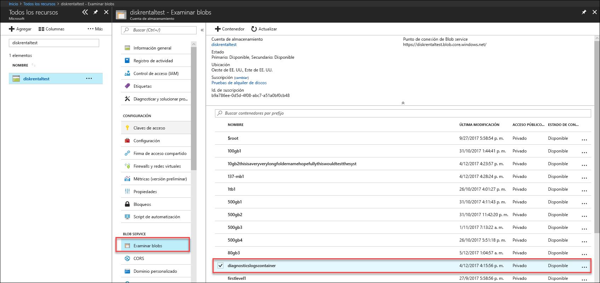
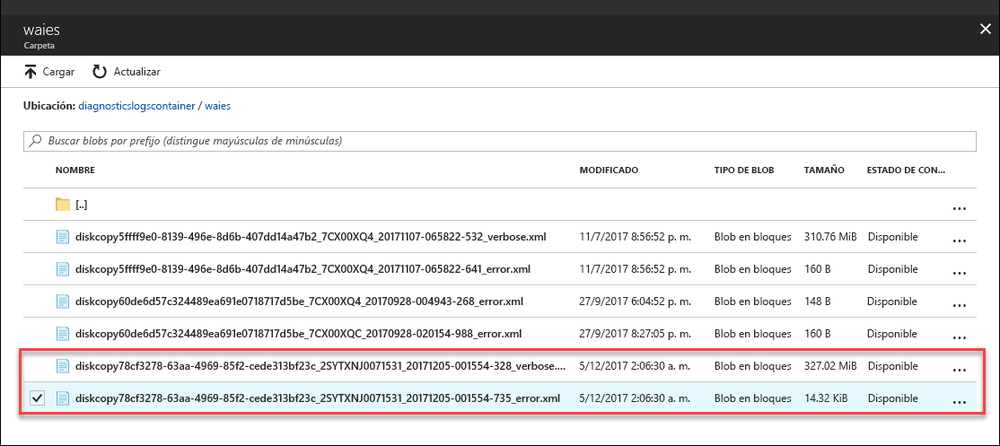

# Solución de problemas de Azure Data Box Disk

Este artículo se aplica a Microsoft Azure Data Box Disk y describe los flujos de trabajo que se usan para solucionar cualquier problema que se encuentre al implementar esta solución. 

En este artículo se incluyen las secciones siguientes:

- Descarga de los registros de diagnóstico
- Consulta de los registros de actividad
- Errores de la herramienta Data Box Disk Unlock
- Errores de la herramienta Data Box Disk Split Copy

## Descarga de los registros de diagnóstico

Si existen errores durante el proceso de copia de los datos, en el portal se muestra la ruta de acceso a la carpeta donde se encuentran los registros de diagnóstico. 

Los registros de diagnóstico pueden ser:
- Registros de error
- Registros detallados  

Para navegar a la ruta de acceso del registro de copia, vaya a la cuenta de almacenamiento asociada con el pedido de Data Box. 

1.  Vaya a **General > Detalles del pedido** y tome nota de la cuenta de almacenamiento asociada con su pedido.
 

2.  Vaya a **Todos los recursos** y busque la cuenta de almacenamiento identificada en el paso anterior. Seleccione la cuenta de almacenamiento y haga clic en ella.

    

3.  Vaya a **Blob service > Examinar blobs** y busque el blob correspondiente a la cuenta de almacenamiento. Vaya a **diagnosticslogcontainer > waies**. 

    

    Verá los registros de errores y los registros detallados de la copia de los datos. Seleccione cada archivo y haga clic en él y luego descargue una copia local.

## Consulta de los registros de actividad

Use los registros de actividad para encontrar errores al solucionar problemas o para supervisar cómo un usuario de su organización modificó un recurso. Mediante los registros de actividad, puede determinar:

- Qué operaciones se realizaron en los recursos de la suscripción.
- La persona que inicia la operación. 
- Cuándo tuvo lugar la operación.
- Estado de la operación.
- Los valores de otras propiedades que podrían ayudarle en la investigación de la operación.

El registro de actividad contiene todas las operaciones de escritura (por ejemplo, PUT, POST, DELETE) realizadas en los recursos, pero no las operaciones de lectura (por ejemplo, GET). 

Los registros de actividad se conservan 90 días. Puede consultar cualquier intervalo de fechas, siempre que no hayan transcurrido más de 90 días desde la fecha inicial. También puede filtrar por una de las consultas integradas en Insights. Por ejemplo, haga clic en el error y, luego, seleccione y haga clic en los errores específicos para entender la causa.

## Errores de la herramienta Data Box Disk Unlock

| Comportamiento de la herramienta o mensaje de error      | Recomendaciones                                                                                               |
|-------------------------------------------------------------------------------------------------------------------------------------|------------------------------------------------------------------------------------------------------|
| None  La herramienta de desbloqueo de Data Box Disk se bloquea.                                                                            | BitLocker no está instalado. Asegúrese de que el equipo host en el que se ejecuta la herramienta de desbloqueo de Data Box Disk tenga instalado BitLocker.                                                                            |
| No se admite la versión actual de .NET Framework. Las versiones compatibles son 4.5 y posteriores.  La herramienta se cierra con un mensaje.  | .NET 4.5 no está instalado. Instale .NET 4.5 o posterior en el equipo host donde se ejecuta la herramienta de desbloqueo de Data Box Disk.                                                                            |
| No se ha podido desbloquear ni verificar ningún volumen. Póngase en contacto con el soporte técnico de Microsoft    La herramienta no puede desbloquear ni verificar ninguna unidad bloqueada. | La herramienta no ha podido desbloquear ninguna de las unidades bloqueadas con la clave de paso proporcionada. Póngase en contacto con el servicio de soporte técnico de Microsoft para conocer los pasos siguientes.                                                |
| Los siguientes volúmenes están desbloqueados y comprobados.  Letras de unidad de volumen: E: No se ha podido desbloquear ningún volumen con las siguientes claves de paso: werwerqomnf, qwerwerqwdfda.   La herramienta desbloquea algunas unidades y enumera las letras de unidad correctas e incorrectas.| Parcialmente correcto. No se han podido desbloquear algunas de las unidades con la clave de paso proporcionada. Póngase en contacto con el servicio de soporte técnico de Microsoft para conocer los pasos siguientes. |
| No se han podido encontrar los volúmenes bloqueados. Compruebe que el disco recibido de Microsoft está conectado correctamente y se encuentra en estado bloqueado.          | La herramienta no puede encontrar ninguna unidad bloqueada. O las unidades están ya desbloqueadas o no se han detectado. Asegúrese de que las unidades están conectadas y bloqueadas.                                                           |
| Error irrecuperable: parámetro no válido Nombre del parámetro: invalid_arg USO: DataBoxDiskUnlock /PassKeys:<passkey_list_separated_by_semicolon>  Ejemplo: DataBoxDiskUnlock /PassKeys:passkey1;passkey2;passkey3 Ejemplo: DataBoxDiskUnlock /SystemCheck Ejemplo: DataBoxDiskUnlock /Help  /PassKeys:       obtenga esta clave de paso del pedido de Azure Data Box Disk. La clave de paso desbloquea los discos. /Help:           esta opción proporciona ayuda sobre el uso del cmdlet y ejemplos. /SystemCheck:    esta opción comprueba si el sistema cumple los requisitos para ejecutar la herramienta.  Presione cualquier tecla para salir. | Parámetro no válido especificado. Los únicos parámetros permitidos son /SystemCheck, /PassKey y /Help.                                                                            |

## Errores de la herramienta Data Box Disk Split Copy

|Mensaje de error o advertencias  |Recomendaciones |
|---------|---------|
|[Información] Recuperación de contraseña de BitLocker del volumen: m  [Error] Excepción detectada al recuperar la clave de BitLocker para el volumen m:  La secuencia no contiene elementos.|Este error se produce si el disco de Data Box Disk de destino está sin conexión.   Use la herramienta `diskmgmt.msc` en discos en línea.|
|[Error] Se produjo una excepción: no se pudo realizar la operación WMI:  Method=UnlockWithNumericalPassword, ReturnValue=2150694965,  Win32Message=El formato de la contraseña de recuperación que se proporciona no es válida.  Las contraseñas de recuperación de BitLocker son 48 dígitos.  Compruebe que la contraseña de recuperación tiene el formato correcto e inténtelo de nuevo.|Utilice la herramienta Data Box Disk Unlock para desbloquear por primera vez los discos y vuelva a intentar el comando. Para más información, vaya a: <li> [Desbloqueo de Data Box Disk en clientes Windows](data-box-disk-deploy-set-up.md#unlock-disks-on-windows-client). </li><li> [Desbloqueo de Data Box Disk en clientes Linux](data-box-disk-deploy-set-up.md#unlock-disks-on-linux-client). </li>|
|[Error] Excepción producida: existe un archivo DriveManifest.xml en la unidad de destino.   Esto indica que la unidad de destino se puede haber preparado con otro archivo de diario.  Para agregar más datos a la misma unidad, use el archivo de diario anterior. Para eliminar los datos existentes y volver a usar la unidad de destino para un nuevo trabajo de importación, elimine DriveManifest.xml de la unidad. Vuelva a ejecutar este comando con un nuevo archivo de diario.| Este error se recibe al intentar utilizar el mismo conjunto de unidades para varias sesiones de importación.   Use un conjunto de unidades solo para una sesión de división y copia.|
|[Error] Excepción producida: CopySessionId importdata-septiembre-test-1 hace referencia a una sesión de copia anterior y no se puede reutilizar para una nueva sesión de copia.|Este error se notifica al intentar usar el mismo nombre para un nuevo trabajo como un trabajo anterior completado correctamente.  Asigne un nombre exclusivo para el trabajo nuevo.|
|[Info] El nombre del directorio o del archivo de destino supera el límite de longitud de NTFS. |Este mensaje se notifica cuando se ha cambiado el archivo de destino porque la ruta de acceso del archivo es larga.  Modifique la opción de disposición en el archivo `config.json` para controlar este comportamiento.|
|[Error] Excepción producida: secuencia de escape JSON no válida. |Este mensaje se notifica cuando el archivo config.json tiene un formato que no es válido.   Valide `config.json` mediante [JSONlint](https://jsonlint.com/) antes de guardar el archivo.|

## Problemas de implementación de Linux

En esta sección se detallan algunos de los principales problemas que se enfrentan durante la implementación de Data Box Disk cuando se usa un cliente Linux para la copia de datos.

### Problema: la unidad se montó como solo lectura
 
**Causa** 

Puede deberse a un sistema de archivos no limpio. 

Volver a montar una unidad como de lectura y escritura no funciona con Data Box Disk. Este escenario no es compatible con las unidades descifradas por dislocker. Es posible que haya vuelto a montar correctamente el dispositivo con el comando siguiente: 

    `# mount -o remount, rw / mnt / DataBoxDisk / mountVol1 ß`

Si bien el nuevo montaje se completó correctamente, los datos no se conservarán.

**Resolución**

Si se encuentra con el error anterior, podría probar con una de las resoluciones siguientes:

- Instale [`ntfsfix`](https://linux.die.net/man/8/ntfsfix) (disponible en el paquete `ntfsprogs`) y ejecútelo en la partición pertinente.

- Si tiene acceso a un sistema Windows

    - Cargue la unidad en el sistema Windows.
    - Abra un símbolo del sistema con privilegio de administración. Ejecute `chkdsk` en el volumen.
    - Quite de manera segura el volumen y vuelva a intentarlo.
 
### Problema: error con datos que no se conservan después de la copia
 
**Causa** 

Si ve que la unidad no tiene datos después de desmontarla (a pesar de que se hayan copiado datos en ella), es posible que haya vuelto a montarla como de lectura-escritura una vez que se montó como de solo lectura.

**Resolución**
 
Si ese es el caso, consulte la resolución para las [unidades que se montan como de solo lectura](#issue-drive-getting-mounted-as-read-only).

Si ese no era el caso, copie los registros de la carpeta que tiene la herramienta de desbloqueo de Data Box Disk y [póngase en contacto con el Soporte técnico de Microsoft](data-box-disk-contact-microsoft-support.md).

## Problemas de implementación de Windows

En esta sección se detallan algunos de los principales problemas que se enfrentan durante la implementación de Data Box Disk cuando se usa un cliente Windows para la copia de datos.

### Problema: no se pudo desbloquear la unidad desde BitLocker
 
**Causa** 

usó la contraseña en el cuadro de diálogo de BitLocker e intentó desbloquear el disco a través del cuadro de diálogo para desbloquear unidades de BitLocker. Esta acción no funcionará. 

**Resolución**

Para desbloquear las unidades de Data Box Disk, debe usar la herramienta de desbloqueo de Data Box Disk y escribir la contraseña desde Azure Portal. Para más información, vaya a [Tutorial: Desempaquetado, conexión y desbloqueo de Azure Data Box Disk](data-box-disk-deploy-set-up.md#connect-to-disks-and-get-the-passkey) en la documentación.
 
### Problema: no se pudieron desbloquear ni comprobar algunos volúmenes. Póngase en contacto con el soporte técnico de Microsoft
 
**Causa** 

Es posible que se encuentre con el error siguiente en el registro de errores y que no pueda desbloquear ni comprobar algunos volúmenes.

`Exception System.IO.FileNotFoundException: Could not load file or assembly 'Microsoft.Management.Infrastructure, Version=1.0.0.0, Culture=neutral, PublicKeyToken=31bf3856ad364e35' or one of its dependencies. The system cannot find the file specified.`
 
Esto indica que es posible que no se encuentre la versión adecuada de Windows PowerShell en el cliente Windows.

**Resolución**

Puede instalar la [versión 5.0 de Windows PowerShell](https://www.microsoft.com/download/details.aspx?id=54616) y volver a intentar la operación.
 
Si todavía no puede desbloquear los volúmenes, copie los registros de la carpeta que tiene la herramienta de desbloqueo de Data Box Disk y [póngase en contacto con el Soporte técnico de Microsoft](data-box-disk-contact-microsoft-support.md).

## Pasos siguientes

- Aprenda a [administrar Data Box Disk mediante Azure Portal](data-box-portal-ui-admin.md).
