# <a name="use-the-local-web-ui-to-administer-your-data-box-and-data-box-heavy"></a>Use la interfaz de usuario web local para administrar los dispositivos Data Box y Data Box Heavy

En este artículo se describen algunas de las tareas de administración y configuración que se pueden realizar en los dispositivos Data Box y Data Box Heavy. Puede administrar los dispositivos Data Box y Data Box Heavy a través de la interfaz de usuario de Azure Portal y de la interfaz de usuario web local para el dispositivo. En este artículo nos centraremos en las tareas que puede realizar mediante la interfaz de usuario web.

La interfaz de usuario web local para Data Box y Data Box Heavy se usa para la configuración inicial del dispositivo. También puede usar la interfaz de usuario web local para apagar o reiniciar el dispositivo, ejecutar pruebas de diagnóstico, actualizar el software, ver registros de copia y generar un paquete de registro para el Soporte técnico de Microsoft. En un dispositivo Data Box Heavy con dos nodos independientes, puede acceder a dos interfaces de usuario web local independientes correspondientes a cada nodo del dispositivo.

Este artículo incluye los siguientes tutoriales:

- Generar un paquete de soporte técnico
- Apagar o reiniciar el dispositivo
- Descarga de los archivos del manifiesto o la lista de materiales
- Ver la capacidad disponible del dispositivo
- Omitir la validación de la suma de comprobación

## <a name="generate-support-package"></a>Generar un paquete de soporte técnico

Si experimenta los problemas con el dispositivo, puede crear un paquete de soporte técnico de los registros del sistema. El Soporte técnico de Microsoft usa este paquete para solucionar el problema. Para generar un paquete de soporte técnico, realice los pasos siguientes:

1. En la interfaz de usuario web local, vaya a **Contacto con soporte técnico** y haga clic en **Crear un paquete de soporte técnico**.

    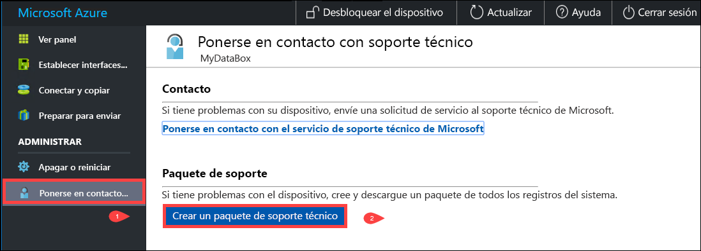

2. Se recopila un paquete de soporte técnico. Esta operación tarda unos minutos.

    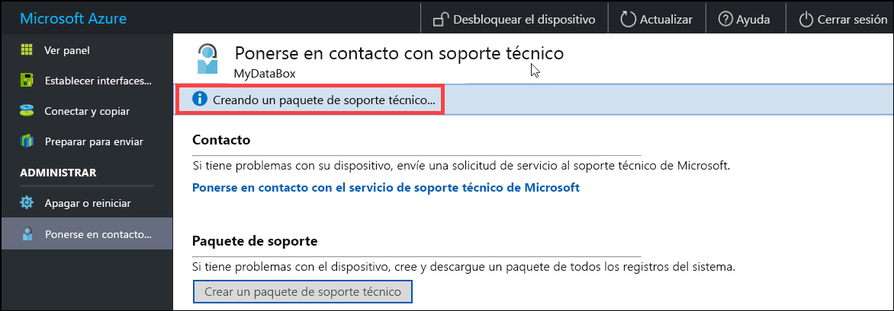

3. Una vez completada la creación del paquete de soporte técnico, haga clic en **Descargar el paquete de soporte técnico**. 

    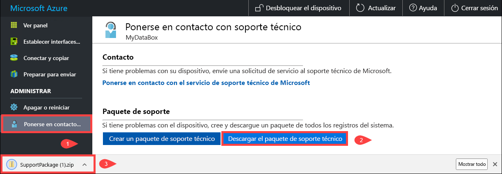

4. Busque y elija la ubicación de descarga. Abra la carpeta para ver el contenido.

    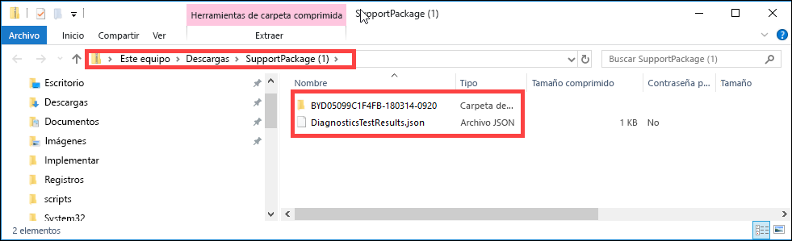


## <a name="shut-down-or-restart-your-device"></a>Apagar o reiniciar el dispositivo

Puede apagar o reiniciar el dispositivo virtual mediante la interfaz de usuario web local. Se recomienda que antes de reiniciar, desconecte los recursos compartidos del host y, luego, el dispositivo. Esto minimizará la posibilidad de daños en los datos. Asegúrese de que la copia de datos no esté en curso al apagar el dispositivo.

Para apagar el dispositivo, siga estos pasos.

1. En la interfaz de usuario web local, vaya a **Apagar o reiniciar**.
2. Haga clic en **Apagar**.

    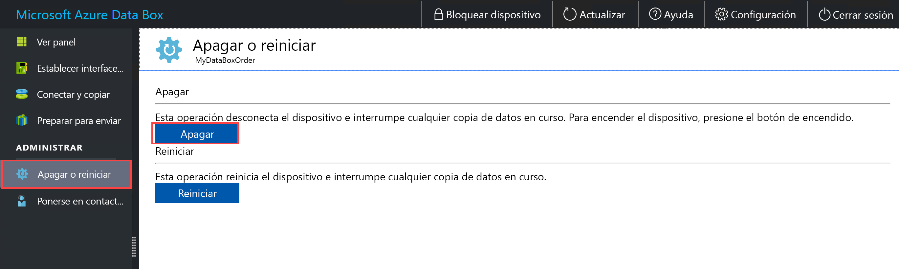

3. Cuando se le pida confirmación, haga clic en **Aceptar** para continuar.

    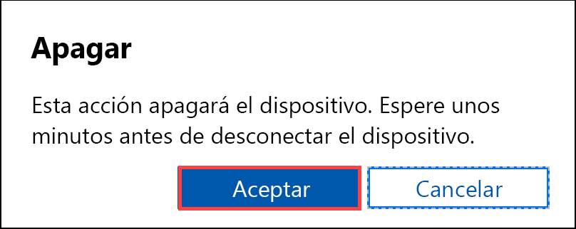

Una vez que el dispositivo se apague, use el botón de encendido del panel frontal para activar el dispositivo.

Para reiniciar su Data Box, realice los pasos siguientes.

1. En la interfaz de usuario web local, vaya a **Apagar o reiniciar**.
2. Haga clic en **Restart**(Reiniciar).

    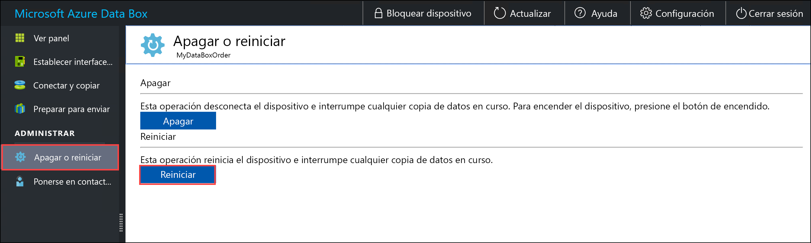

3. Cuando se le pida confirmación, haga clic en **Aceptar** para continuar.

   El dispositivo se apaga y, a continuación, se reinicia.

## <a name="download-bom-or-manifest-files"></a>Descarga de los archivos del manifiesto o la lista de materiales

Los archivos del manifiesto o la lista de materiales (BOM) contienen la lista de archivos que se copian en Data Box o en Data Box Heavy. Estos archivos se generan al preparar el dispositivo para el envío.

Antes de comenzar, asegúrese de completar en el dispositivo el paso **Preparación para el envío**. Siga estos pasos para descargar los archivos del manifiesto o la lista de materiales:

1. Vaya a la interfaz de usuario web local de su dispositivo. Ahí podrá ver si el dispositivo ha completado la preparación para el envío. Una vez completada la preparación del dispositivo, su estado se muestra como **Listo para el envío**.

    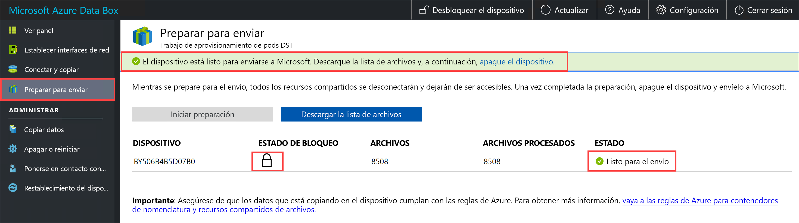

2. Haga clic en **Download list of files** (Descargar lista de archivos) para descargar la lista de archivos que se copiaron en Data Box.

    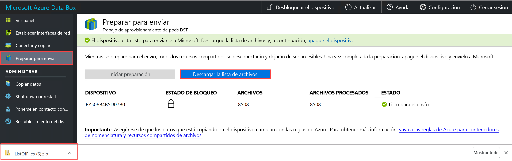

3. En el Explorador de archivos, verá que se generan listas de archivos independientes según el protocolo utilizado para conectarse al dispositivo y el tipo de instancia de Azure Storage empleado.

    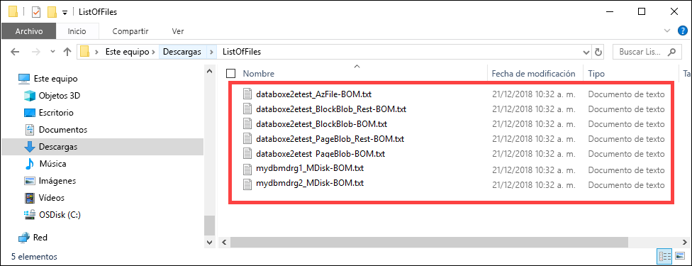

   La tabla siguiente asigna los nombres de archivo al tipo de instancia de Azure Storage y al protocolo de conexión utilizados.

    |Nombre de archivo  |Tipo de instancia de Azure Storage  |Protocolo de conexión utilizado |
    |---------|---------|---------|
    |databoxe2etest_BlockBlob.txt     |Blobs en bloques         |SMB/NFS         |
    |databoxe2etest_PageBlob.txt     |Blobs en páginas         |SMB/NFS         |
    |databoxe2etest_AzFile-BOM.txt    |Archivos de Azure         |SMB/NFS         |
    |databoxe2etest_PageBlock_Rest-BOM.txt     |Blobs en páginas         |REST        |
    |databoxe2etest_BlockBlock_Rest-BOM.txt    |Blobs en bloques         |REST         |
    |mydbmdrg1_MDisk-BOM.txt    |Disco administrado         |SMB/NFS         |
    |mydbmdrg2_MDisk-BOM.txt     |Disco administrado         |SMB/NFS         |

Esta lista sirve para comprobar qué archivos se han cargado en la cuenta de Azure Storage después de que Data Box vuelva al centro de datos de Azure. A continuación, se muestra un archivo de manifiesto de ejemplo.

> [!NOTE]
> En un dispositivo Data Box Heavy, los dos conjuntos de la lista de archivos (BOM) están presentes, correspondientes a los dos nodos en el dispositivo.

```xml
<file size="52689" crc64="0x95a62e3f2095181e">\databox\media\data-box-deploy-copy-data\prepare-to-ship2.png</file>
<file size="22117" crc64="0x9b160c2c43ab6869">\databox\media\data-box-deploy-copy-data\connect-shares-file-explorer2.png</file>
<file size="57159" crc64="0x1caa82004e0053a4">\databox\media\data-box-deploy-copy-data\verify-used-space-dashboard.png</file>
<file size="24777" crc64="0x3e0db0cd1ad438e0">\databox\media\data-box-deploy-copy-data\prepare-to-ship5.png</file>
<file size="162006" crc64="0x9ceacb612ecb59d6">\databox\media\data-box-cable-options\cabling-dhcp-data-only.png</file>
<file size="155066" crc64="0x051a08d36980f5bc">\databox\media\data-box-cable-options\cabling-2-port-setup.png</file>
<file size="150399" crc64="0x66c5894ff328c0b1">\databox\media\data-box-cable-options\cabling-with-switch-static-ip.png</file>
<file size="158082" crc64="0xbd4b4c5103a783ea">\databox\media\data-box-cable-options\cabling-mgmt-only.png</file>
<file size="148456" crc64="0xa461ad24c8e4344a">\databox\media\data-box-cable-options\cabling-with-static-ip.png</file>
<file size="40417" crc64="0x637f59dd10d032b3">\databox\media\data-box-portal-admin\delete-order1.png</file>
<file size="33704" crc64="0x388546569ea9a29f">\databox\media\data-box-portal-admin\clone-order1.png</file>
<file size="5757" crc64="0x9979df75ee9be91e">\databox\media\data-box-safety\japan.png</file>
<file size="998" crc64="0xc10c5a1863c5f88f">\databox\media\data-box-safety\overload_tip_hazard_icon.png</file>
<file size="5870" crc64="0x4aec2377bb16136d">\databox\media\data-box-safety\south-korea.png</file>
<file size="16572" crc64="0x05b13500a1385a87">\databox\media\data-box-safety\taiwan.png</file>
<file size="999" crc64="0x3f3f1c5c596a4920">\databox\media\data-box-safety\warning_icon.png</file>
<file size="1054" crc64="0x24911140d7487311">\databox\media\data-box-safety\read_safety_and_health_information_icon.png</file>
<file size="1258" crc64="0xc00a2d5480f4fcec">\databox\media\data-box-safety\heavy_weight_hazard_icon.png</file>
<file size="1672" crc64="0x4ae5cfa67c0e895a">\databox\media\data-box-safety\no_user_serviceable_parts_icon.png</file>
<file size="3577" crc64="0x99e3d9df341b62eb">\databox\media\data-box-safety\battery_disposal_icon.png</file>
<file size="993" crc64="0x5a1a78a399840a17">\databox\media\data-box-safety\tip_hazard_icon.png</file>
<file size="1028" crc64="0xffe332400278f013">\databox\media\data-box-safety\electrical_shock_hazard_icon.png</file>
<file size="58699" crc64="0x2c411d5202c78a95">\databox\media\data-box-deploy-ordered\data-box-ordered.png</file>
<file size="46816" crc64="0x31e48aa9ca76bd05">\databox\media\data-box-deploy-ordered\search-azure-data-box1.png</file>
<file size="24160" crc64="0x978fc0c6e0c4c16d">\databox\media\data-box-deploy-ordered\select-data-box-option1.png</file>
<file size="115954" crc64="0x0b42449312086227">\databox\media\data-box-disk-deploy-copy-data\data-box-disk-validation-tool-output.png</file>
<file size="6093" crc64="0xadb61d0d7c6d4deb">\databox\data-box-cable-options.md</file>
<file size="6499" crc64="0x080add29add367d9">\databox\data-box-deploy-copy-data-via-nfs.md</file>
<file size="11089" crc64="0xc3ce6b13a4fe3001">\databox\data-box-deploy-copy-data-via-rest.md</file>
<file size="9126" crc64="0x820856b5a54321ad">\databox\data-box-overview.md</file>
<file size="10963" crc64="0x5e9a14f9f4784fd8">\databox\data-box-safety.md</file>
<file size="5941" crc64="0x8631d62fbc038760">\databox\data-box-security.md</file>
<file size="12536" crc64="0x8c8ff93e73d665ec">\databox\data-box-system-requirements-rest.md</file>
<file size="3220" crc64="0x7257a263c434839a">\databox\data-box-system-requirements.md</file>
<file size="2823" crc64="0x63db1ada6fcdc672">\databox\index.yml</file>
<file size="4364" crc64="0x62b5710f58f00b8b">\databox\data-box-local-web-ui-admin.md</file>
<file size="3603" crc64="0x7e34c25d5606693f">\databox\TOC.yml</file>
```

Este archivo contiene la lista de todos los archivos que se copiaron en Data Box o en Data Box Heavy. En este archivo, el valor *crc64* está relacionado con la suma de comprobación que se genera para el archivo correspondiente.

## <a name="view-available-capacity-of-the-device"></a>Ver la capacidad disponible del dispositivo

Puede usar el panel del dispositivo para ver la capacidad disponible y utilizada del dispositivo.

1. En la interfaz de usuario web local, vaya a **Ver panel**.
2. En **Conectar y copiar**, se muestra el espacio disponible y utilizado del dispositivo.

    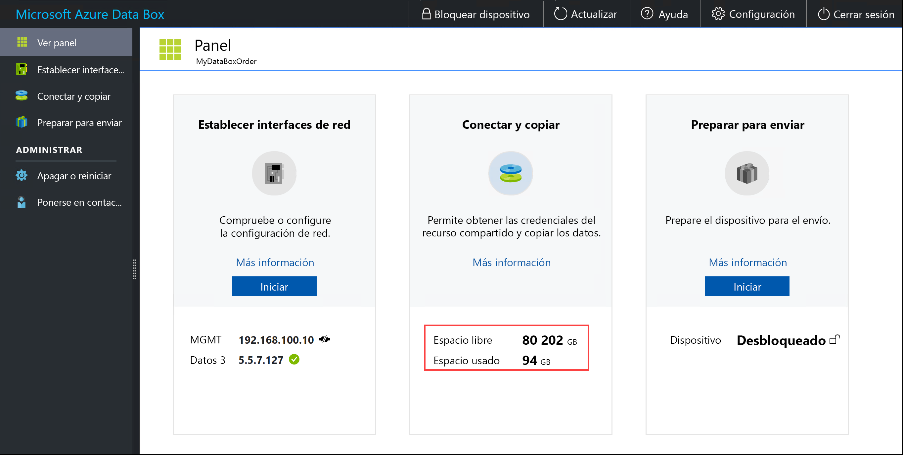

## <a name="skip-checksum-validation"></a>Omitir la validación de la suma de comprobación

Las sumas de comprobación se generan para sus datos de forma predeterminada cuando se prepara el envío. En algunos casos poco frecuentes, según el tipo de datos (tamaños de archivo reducidos), el rendimiento puede ser lento. En tales casos, puede omitir la suma de comprobación.

Recomendamos encarecidamente que no deshabilite la suma de comprobación, a menos que el rendimiento se vea afectado considerablemente.

1. En la esquina superior derecha de la interfaz de usuario web local del dispositivo, vaya a **Configuración**.

    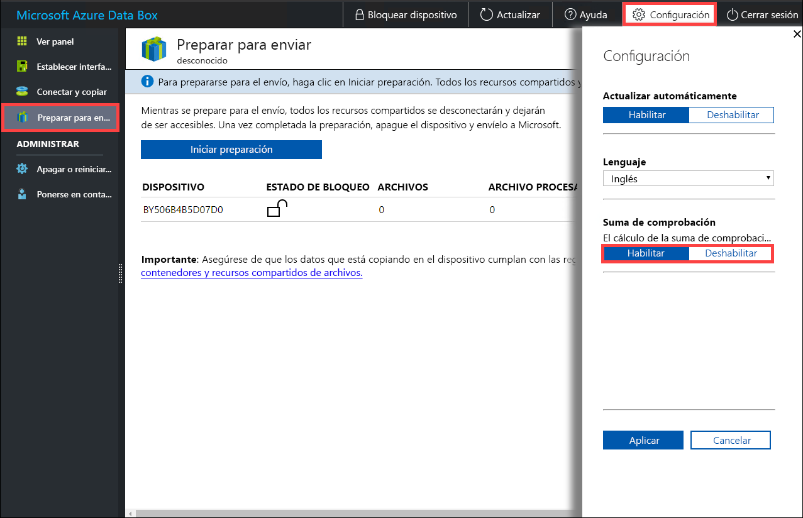

2. **Deshabilite** la validación de la suma de comprobación.
3. Haga clic en **Aplicar**.

## <a name="next-steps"></a>Pasos siguientes

- Obtenga información sobre cómo [administrar Data Box y Data Box Heavy mediante Azure Portal](data-box-portal-admin.md).

