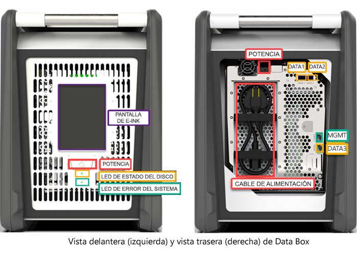
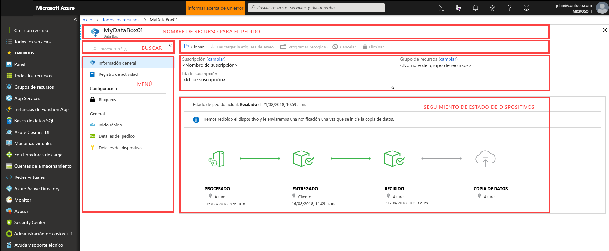
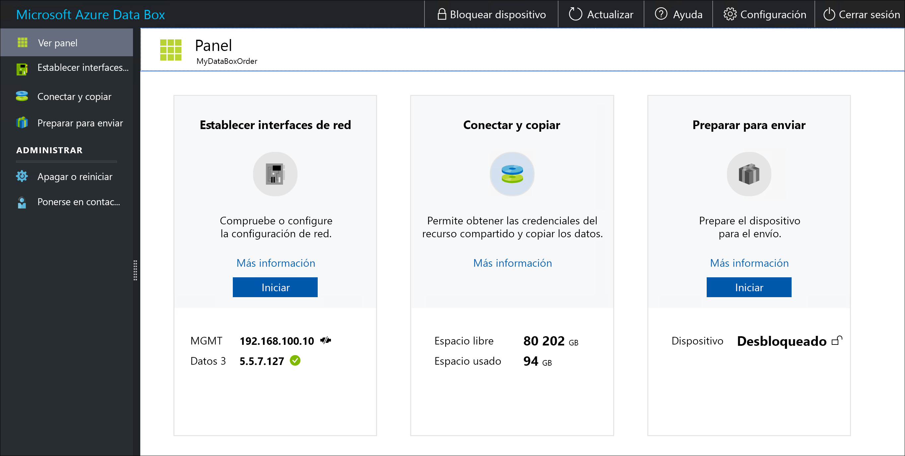

# ¿Qué es Azure Data Box?

La solución en la nube Microsoft Azure Data Box le permite enviar terabytes de datos a Azure de forma rápida, económica y confiable. La transferencia de datos segura se acelera mediante el envío de un dispositivo de almacenamiento de Data Box de propiedad. Cada dispositivo de almacenamiento tiene una capacidad de almacenamiento máximo utilizable de 80 TB y se transporta al centro de datos a través de un operador regional. El dispositivo tiene un sólido uso de mayúsculas y minúsculas para proteger los datos durante el tránsito.

Puede pedir el dispositivo Data Box en Azure Portal. Una vez recibido el dispositivo, puede configurarlo rápidamente mediante la interfaz de usuario web local. Copie los datos de los servidores en el dispositivo y envíelo de nuevo a Azure. En el centro de datos de Azure, los datos se cargan automáticamente del dispositivo a Azure. El servicio de Data Box se encarga de realizar el seguimiento de todo el proceso en Azure Portal.

## Casos de uso

Data Box es ideal para transferir tamaños de datos con más de 40 TB en escenarios sin conectividad de red limitada. El movimiento de datos puede ser único, periódico o una transferencia de datos masiva inicial seguida de transferencias periódicas. Estos son los distintos escenarios donde se puede usar Data Box para la transferencia de datos.

 - **Migración única**: cuando se mueve gran cantidad de datos locales a Azure. 
     - Traslado de una biblioteca multimedia de cintas sin conexión a Azure para crear una biblioteca multimedia en línea.
     - Migración de la granja de máquinas virtuales, SQL server y aplicaciones a Azure.
     - Traslado de los datos históricos a Azure para un análisis exhaustivo y generación de informes con HDInsight.

 - **Transferencia masiva inicial**: cuando se realiza una transferencia masiva inicial con Data Box (inicialización) seguida de transferencias incrementales a través de la red. 
     - Por ejemplo, los asociados de soluciones de copia de seguridad, como Commvault y Data Box, se usan para mover la copia de seguridad histórica de gran tamaño inicial a Azure. Una vez completado, los datos incrementales se transfieren a través de la red a Azure Storage.

- **Cargas periódicas**: cuando se genera periódicamente una gran cantidad de datos y es necesario moverlos a Azure. Por ejemplo, en la exploración de energía, donde el contenido de vídeo se genera en plataformas petrolíferas y parques eólicos.      

## Ventajas

Data Box está pensado para mover grandes cantidades de datos a Azure sin que afecte casi a la red. La solución tiene las siguientes ventajas:

- **Velocidad**: Data Box usa interfaces de red de 1 Gbps o 10 Gbps para mover hasta 80 TB de datos en Azure.

- **Protección**: Data Box tiene protecciones de seguridad integradas para el dispositivo, los datos y el servicio.
    - El dispositivo tiene un sólido uso de mayúsculas y minúsculas protegido por tornillos resistentes a alteraciones y adhesivos de alteración evidente. 
    - Los datos en el dispositivo se protegen con un cifrado AES de 256 bits en todo momento.
    - El dispositivo solo se puede desbloquear con una contraseña proporcionada en Azure Portal.
    - El servicio está protegido por las características de seguridad de Azure.
    - Cuando los datos se cargan en Azure, los discos se limpian en el dispositivo, según las normas NIST 800-88r1.
    
    Para más información, vaya a [Azure Data Box security and data protection](data-box-security.md) (Protección de datos y seguridad de Azure Data Box).

## Características y especificaciones

El dispositivo Data Box tiene las siguientes características en esta versión.

| Especificaciones                                          | DESCRIPCIÓN              |
|---------------------------------------------------------|--------------------------|
| Peso                                                  | < 50 libras                |
| Dimensiones                                              | Dispositivo: ancho 309,0 mm; alto 430,4 mm; profundidad: 502,0 mm |            
| Espacio en bastidor                                              | 7 U cuando se coloca en el bastidor en su lado (no se puede montar en bastidor)|
| Se necesitan cables                                         | 1 cable de alimentación (incluido)   2 cables RJ45   2 cables de cobre X SFP + Twinax|
| Capacidad de almacenamiento                                        | 100 TB   80 TB de capacidad utilizable tras aplicar la protección de RAID 5|
| Interfaces de red                                      | Interfaz GbE de 2 X 1: MGMT y DATA 3.   MGMT: para la administración, no es configurable por el usuario y se usar para la configuración inicial   Data3: para los datos, es configurable por el usuario y es dinámico de forma predeterminada   MGMT y DATA 3 también pueden funcionar como 10 GbE   Interfaz GbE de 2 X 10: DATA 1 y DATA 2   Ambas son para los datos, se pueden configurar como estáticas o dinámicas (valor predeterminado) |
| Transferencia de datos multimedia                                     | Cable de cobre RJ45 SFP+ y Ethernet de 10 GbE  |
| Seguridad                                                | Uso resistente de mayúsculas y minúsculas con tornillos personalizados a prueba de alteraciones   Adhesivos de alteración evidente colocados en la parte inferior del dispositivo|
| Velocidad de transferencia de datos                                      | Hasta 80 TB en un día a través de una interfaz de red de 10 GbE        |
| Administración                                              | Interfaz de usuario de web local: configuración inicial y única   Azure Portal: administración diaria de dispositivos        |

## Componentes de Data Box

Data Box incluye los siguientes componentes:

* **Dispositivo Data Box**: un dispositivo físico que le proporciona un espacio de almacenamiento principal, administra la comunicación con el almacenamiento en la nube y le ayuda a garantizar la seguridad y confidencialidad de todos los datos que están almacenados en el dispositivo. El dispositivo Data Box tiene una capacidad de almacenamiento utilizable de 80 TB. 

    

    
* **Servicio Data Box**: es una extensión de Azure Portal que le permite administrar un dispositivo Data Box desde una interfaz web a la cual puede acceder desde diferentes ubicaciones geográficas. Use el servicio Data Box para realizar la administración diaria del dispositivo Data Box. Las tareas de servicio incluyen cómo crear y administrar pedidos, ver y administrar alertas y administrar recursos compartidos.  

    

    Para obtener más información, consulte [Use the Data Box service to administer your Data Box device](data-box-portal-ui-admin.md) (Uso del servicio Data Box para administrar su dispositivo Data Box).

* **Interfaz de usuario web local**: es una interfaz de usuario basada en web que se usa para configurar el dispositivo; de esta manera, se podrá conectar a la red local y registrar el dispositivo con el servicio Data Box. Use también la interfaz de usuario web local para apagar y reiniciar el dispositivo Data Box, ver registros de copia y ponerse en contacto con el Soporte técnico de Microsoft para realizar una solicitud de servicio.

    

    Para más información acerca de cómo usar la interfaz de usuario basada en web, consulte [Use the web-based UI to administer your Data Box](data-box-portal-ui-admin.md) (Uso de la interfaz de usuario web para administrar Data Box).

## El flujo de trabajo

Un flujo típico incluye los siguientes pasos:

1. **Solicitar**: cree un pedido en Azure Portal, proporcione la información de envío y la cuenta de almacenamiento de Azure de destino para los datos. Si el dispositivo está disponible, Azure lo prepara y lo envía con un identificador de seguimiento del envío.

2. **Recibir**: una vez entregado el dispositivo, conéctelo a la red y enciéndalo con los cables especificados. Active el dispositivo y conéctese a él. Configure la red del dispositivo y monte los recursos compartidos en el equipo host desde donde desea copiar los datos.

3. **Copiar los datos**: copie los datos en los recursos compartidos de Data Box.

4. **Devolver**: prepare, desactive y devuelva el dispositivo a los centros de datos de Azure.

5. **Cargar**: los datos se copian automáticamente del dispositivo a Azure. Los discos del dispositivo se borran de forma segura según las directrices del Instituto Nacional de Normas y Tecnología (NIST).

Durante este proceso, se le notificará por correo electrónico de todos los cambios de estado. Para más información sobre el flujo detallado, consulte [Cómo implementar instancias de Data Box en Azure Portal](data-box-deploy-ordered.md).

## Disponibilidad en regiones

Data Box puede transferir datos en función de la región en la que se implementa el servicio, del país al que se envía el dispositivo y de la cuenta de Azure Storage en la que transfiere los datos. 

- **Disponibilidad del servicio**: para esta versión, el servicio Data Box está disponible en las siguientes regiones:
    - Todas las regiones de Estados Unidos: Centro occidental de EE. UU., Oeste de EE. UU. 2, Oeste de EE. UU., Centro-Sur de EE. UU, Centro de EE. UU., Centro-Norte de EE. UU., Este de EE. UU. y Este de EE. UU. 2.
    - Unión Europea: Europa Occidental y Europa del Norte.
    - Reino Unido: Sur de Reino Unido y Oeste de Reino Unido.
    - Francia: Centro de Francia y Sur de Francia.

- **Cuentas de almacenamiento de destino**: las cuentas de almacenamiento que almacenan los datos están disponibles en todas las regiones de Azure donde está disponible el servicio.  

## Pasos siguientes

- Revise [los requisitos del sistema Data Box](data-box-system-requirements.md).
- Información acerca de los [límites de Data Box](data-box-limits.md).
- Implemente rápidamente [Azure Data Box](data-box-quickstart-portal.md) en Azure Portal.

