# <a name="use-the-azure-portal-to-administer-your-azure-data-box-and-azure-data-box-heavy"></a>Use Azure Portal para administrar Azure Data Box y Azure Data Box Heavy

La información de este artículo se aplica tanto a Azure Data Box como a Azure Data Box Heavy. En este artículo se describen algunas de las tareas de administración y los flujos de trabajo complejos que se pueden realizar en el dispositivo Azure Data Box. Puede administrar el dispositivo Data Box a través de Azure Portal o de la interfaz de usuario web local.

Este artículo se centra en las tareas que se pueden realizar mediante Azure Portal. Use Azure Portal para administrar los pedidos y el dispositivo Data Box, y realizar un seguimiento del estado del pedido hasta que se completa.


## <a name="cancel-an-order"></a>Cancelación de un pedido

Es posible que deba cancelar un pedido por diversos motivos después de realizarlo. Solo puede cancelar el pedido antes de que se procese. Una vez que el pedido se haya procesado y el dispositivo Data Box esté preparado, no es posible cancelarlo.

Realice los pasos siguientes para cancelar un pedido.

1.  Vaya a **Overview > Cancel** (Información general > Cancelar).

    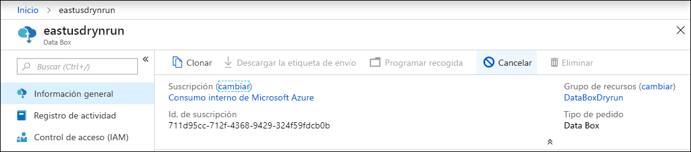

2.  Indique un motivo para cancelar el pedido.  

    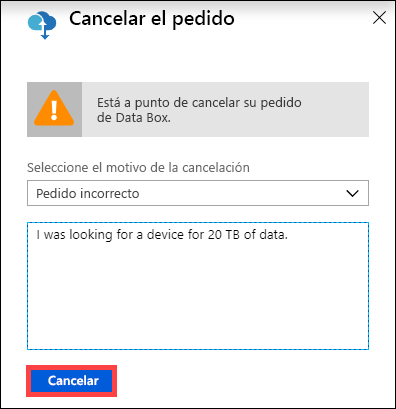

3.  Una vez que se cancela el pedido, el portal actualiza su estado y lo muestra como **Canceled** (Cancelado).

## <a name="clone-an-order"></a>Clonación de un pedido

La clonación es útil en determinadas situaciones. Por ejemplo, un usuario ha usado Data Box para transferir algunos datos. A medida que se generan más datos, se necesita otro dispositivo Data Box para transferirlos a Azure. En este caso, simplemente se puede clonar el mismo pedido.

Realice los pasos siguientes para clonar un pedido.

1.  Vaya a **Overview > Clone** (Información general > Clonar). 

    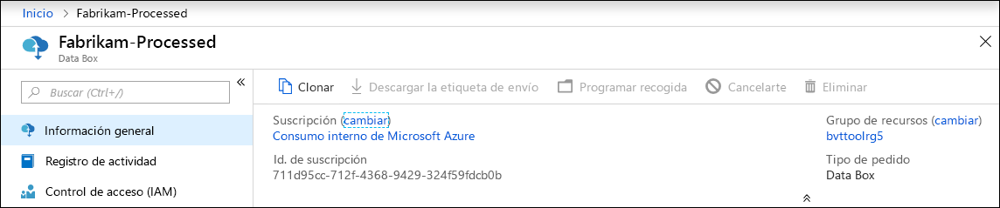

2.  Todos los detalles del pedido permanecen iguales. El nombre del pedido es el del pedido original seguido de *-Clone*. Seleccione la casilla para confirmar que ha revisado la información de privacidad. Haga clic en **Create**(Crear).

El clon se crea en unos minutos y el portal se actualiza para mostrar el nuevo pedido.


## <a name="delete-order"></a>Eliminación del pedido

Es posible que desee eliminar un pedido cuando se complete. El pedido contiene información personal, como su nombre, dirección e información de contacto. Esta información personal se elimina cuando se elimina el pedido.

Solo se pueden eliminar pedidos completados o cancelados. Realice los siguientes pasos para eliminar un pedido.

1. Vaya a **Todos los recursos**. Busque su pedido.

2. Haga clic en el pedido que desee eliminar y vaya a **Overview** (Información general). En la barra de comandos, haga clic en **Delete** (Eliminar).

    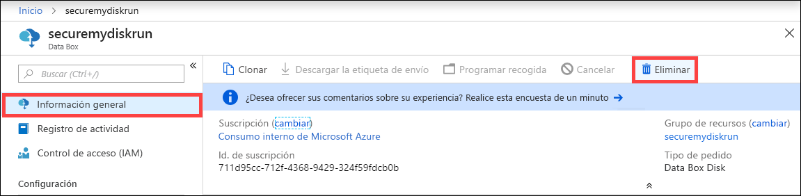

3. Escriba el nombre del pedido cuando se le pida que confirme su eliminación. Hacer clic en **Eliminar**.

## <a name="download-shipping-label"></a>Descarga de la etiqueta de envío

Deberá descargar la etiqueta de envío si no funciona la pantalla de tinta electrónica de su Data Box y no muestra la etiqueta de envío de devolución. No hay ninguna pantalla de E-ink en Data Box Heavy y, por tanto, este flujo de trabajo no es aplicable a Data Box Heavy.

Siga estos pasos para descargar una etiqueta de envío.

1.  Vaya a **Overview > Download shipping label** (Información general > Descargar etiqueta de envío). Esta opción está disponible solo una vez enviado el dispositivo. 

    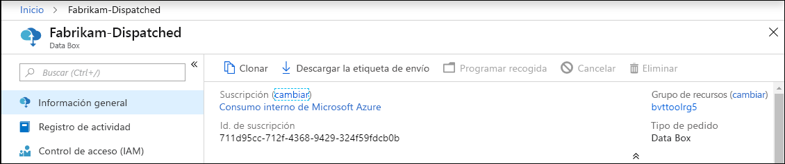

2.  Se descargará la siguiente etiqueta de envío devuelto. Guarde la etiqueta e imprímala. Doble e inserte la etiqueta en la funda transparente del dispositivo. Asegúrese de que la etiqueta está visible. Quite cualquier etiqueta del envío anterior que aún se encuentre en el dispositivo.

    

## <a name="edit-shipping-address"></a>Edición de la dirección de envío

Puede que tenga que editar la dirección de envío, una vez que se haya realizado el pedido. Esta opción solo está disponible hasta que se envía el dispositivo. Después, deja de estarlo.

Realice los pasos siguientes para editar el pedido.

1. Vaya a **Order details > Edit shipping address** (Detalles del pedido > Editar dirección de envío).

    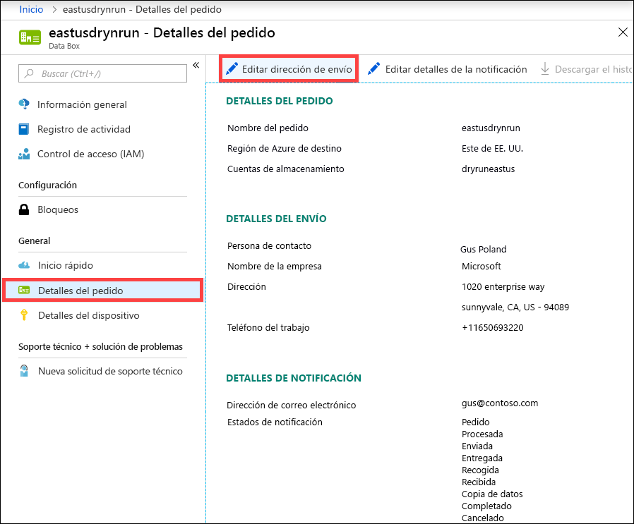

2. Edite y valide la dirección de envío y, a continuación, guarde los cambios.

    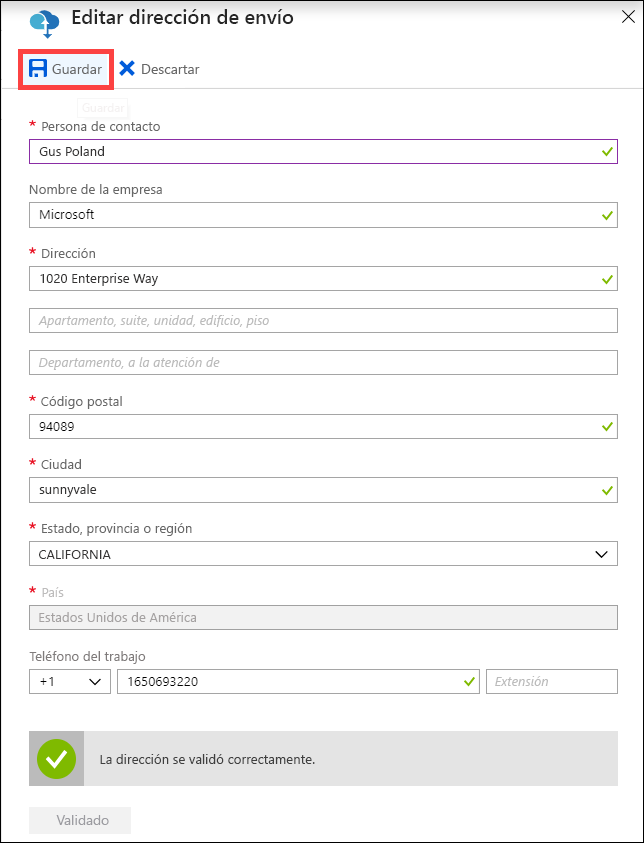

## <a name="edit-notification-details"></a>Edición de los detalles de la notificación

Es posible que deba cambiar los usuarios que desea que reciban los mensajes de estado del pedido. Por ejemplo, hay que informar a un usuario cuando se entrega o recoge el dispositivo. Puede que sea necesario informar a otro usuario cuando se completa la copia de datos para que pueda comprobar que están en la cuenta de almacenamiento de Azure antes de eliminarlos del origen. En estos casos, puede editar los detalles de notificación.

Realice los siguientes pasos para editar una plantilla de notificación.

1. Vaya a **Order details > Edit notification details** (Detalles de pedidos > Editar detalles de la notificación).

    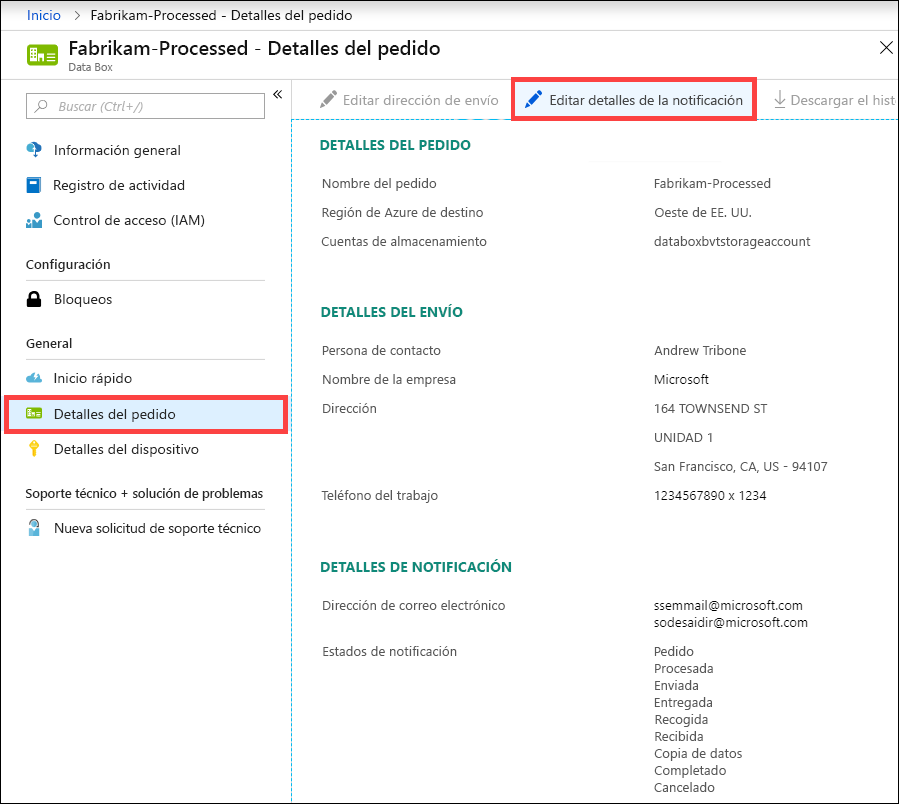

2. Ahora puede editar los detalles de la notificación y, a continuación, guardar los cambios.
 
    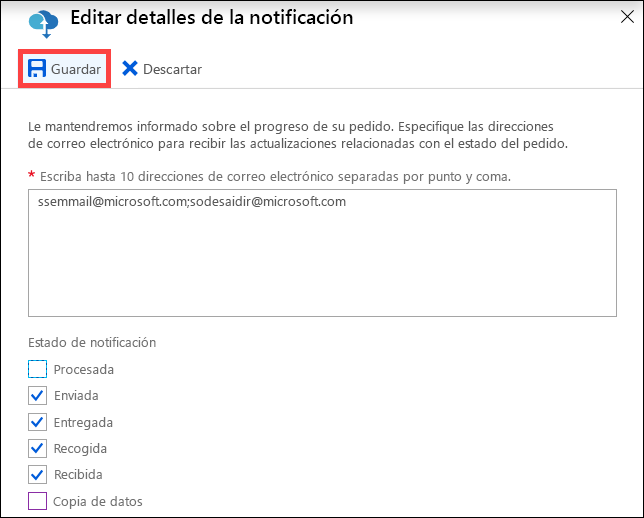


## <a name="download-order-history"></a>Descarga del historial de pedidos

Una vez completado el pedido a Data Box, se eliminan los datos de los discos del dispositivo. Una vez limpio el dispositivo, puede descargar el historial de pedidos de Azure Portal.

Realice los siguientes pasos para descargar el historial de pedidos.

1. En el pedido de Data Box, vaya a **Introducción**. Asegúrese de que el pedido se haya completado. Con el pedido completado y el dispositivo limpio, vaya a **Detalles del pedido**. La opción **Descargar el historial de pedidos** está disponible.

    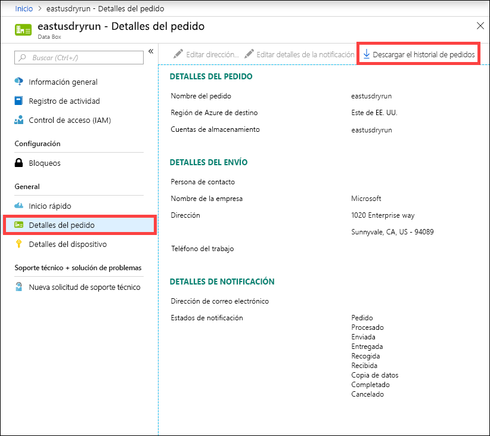

2. Haga clic en **Descargar el historial de pedidos**. En el historial descargado verá un registro de las entradas de seguimiento del transportista. Habrá dos conjuntos de registros correspondientes a los dos nodos en un dispositivo Data Box Heavy. Al desplazarse hasta el final de este registro verá los vínculos a:
    
   - **Registros de copia**: lista de los archivos sin errores durante la copia de datos de Data Box a la cuenta de almacenamiento de Azure.
   - **Registros de auditoría**: contienen información sobre el encendido y el acceso compartido en Data Box cuando está fuera del centro de datos de Azure.
   - **BOM files**(Archivos de listas de materiales): lista de archivos (también conocida como el manifiesto de archivos) que puede descargar durante el proceso de **Preparación para el envío** y que tiene los nombres de archivo, los tamaños de archivo y las sumas de comprobación de archivo.

       ```
       -------------------------------
       Microsoft Data Box Order Report
       -------------------------------
       Name                                               : DataBoxTestOrder                              
       StartTime(UTC)                                     : 10/31/2018 8:49:23 AM +00:00                       
       DeviceType                                         : DataBox                                           
       -------------------
       Data Box Activities
       -------------------
       Time(UTC)                 | Activity                       | Status          | Description  
       
       10/31/2018 8:49:26 AM     | OrderCreated                   | Completed       |                                                   
       11/2/2018 7:32:53 AM      | DevicePrepared                 | Completed       |                                                   
       11/3/2018 1:36:43 PM      | ShippingToCustomer             | InProgress      | Shipment picked up. Local Time : 11/3/2018 1:36:43        PM at AMSTERDAM-NLD                                                                                
       11/4/2018 8:23:30 PM      | ShippingToCustomer             | InProgress      | Processed at AMSTERDAM-NLD. Local Time : 11/4/2018        8:23:30 PM at AMSTERDAM-NLD                                                                        
       11/4/2018 11:43:34 PM     | ShippingToCustomer             | InProgress      | Departed Facility in AMSTERDAM-NLD. Local Time :          11/4/2018 11:43:34 PM at AMSTERDAM-NLD                                                               
       11/5/2018 1:38:20 AM      | ShippingToCustomer             | InProgress      | Arrived at Sort Facility LEIPZIG-DEU. Local Time :        11/5/2018 1:38:20 AM at LEIPZIG-DEU                                                                
       11/5/2018 2:31:07 AM      | ShippingToCustomer             | InProgress      | Processed at LEIPZIG-DEU. Local Time : 11/5/2018          2:31:07 AM at LEIPZIG-DEU                                                                            
       11/5/2018 4:05:58 AM      | ShippingToCustomer             | InProgress      | Departed Facility in LEIPZIG-DEU. Local Time :            11/5/2018 4:05:58 AM at LEIPZIG-DEU                                                                    
       11/5/2018 4:35:43 AM      | ShippingToCustomer             | InProgress      | Transferred through LUTON-GBR. Local Time :              11/5/2018 4:35:43 AM at LUTON-GBR                                                                         
       11/5/2018 4:52:15 AM      | ShippingToCustomer             | InProgress      | Departed Facility in LUTON-GBR. Local Time :              11/5/2018 4:52:15 AM at LUTON-GBR                                                                        
       11/5/2018 5:47:58 AM      | ShippingToCustomer             | InProgress      | Arrived at Sort Facility LONDON-HEATHROW-GBR.            Local Time : 10/5/2018 5:47:58 AM at LONDON-HEATHROW-GBR                                                
       11/5/2018 6:27:37 AM      | ShippingToCustomer             | InProgress      | Processed at LONDON-HEATHROW-GBR. Local Time :            11/5/2018 6:27:37 AM at LONDON-HEATHROW-GBR                                                            
       11/5/2018 6:39:40 AM      | ShippingToCustomer             | InProgress      | Departed Facility in LONDON-HEATHROW-GBR. Local          Time : 11/5/2018 6:39:40 AM at LONDON-HEATHROW-GBR                                                    
       11/5/2018 8:13:49 AM      | ShippingToCustomer             | InProgress      | Arrived at Delivery Facility in LAMBETH-GBR. Local        Time : 11/5/2018 8:13:49 AM at LAMBETH-GBR                                                         
       11/5/2018 9:13:24 AM      | ShippingToCustomer             | InProgress      | With delivery courier. Local Time : 11/5/2018            9:13:24 AM at LAMBETH-GBR                                                                               
       11/5/2018 12:03:04 PM     | ShippingToCustomer             | Completed       | Delivered - Signed for by. Local Time : 11/5/2018        12:03:04 PM at LAMBETH-GBR                                                                          
       1/25/2019 3:19:25 PM      | ShippingToDataCenter           | InProgress      | Shipment picked up. Local Time : 1/25/2019 3:19:25        PM at LAMBETH-GBR                                                                                       
       1/25/2019 8:03:55 PM      | ShippingToDataCenter           | InProgress      | Processed at LAMBETH-GBR. Local Time : 1/25/2019          8:03:55 PM at LAMBETH-GBR                                                                            
       1/25/2019 8:04:58 PM      | ShippingToDataCenter           | InProgress      | Departed Facility in LAMBETH-GBR. Local Time :            1/25/2019 8:04:58 PM at LAMBETH-GBR                                                                    
       1/25/2019 9:06:09 PM      | ShippingToDataCenter           | InProgress      | Arrived at Sort Facility LONDON-HEATHROW-GBR.            Local Time : 1/25/2019 9:06:09 PM at LONDON-HEATHROW-GBR                                                
       1/25/2019 9:48:54 PM      | ShippingToDataCenter           | InProgress      | Processed at LONDON-HEATHROW-GBR. Local Time :            1/25/2019 9:48:54 PM at LONDON-HEATHROW-GBR                                                            
       1/25/2019 10:30:20 PM     | ShippingToDataCenter           | InProgress      | Departed Facility in LONDON-HEATHROW-GBR. Local          Time : 1/25/2019 10:30:20 PM at LONDON-HEATHROW-GBR                                                   
       1/26/2019 2:17:10 PM      | ShippingToDataCenter           | InProgress      | Arrived at Sort Facility BRUSSELS-BEL. Local Time        : 1/26/2019 2:17:10 PM at BRUSSELS-BEL                                                              
       1/26/2019 2:31:57 PM      | ShippingToDataCenter           | InProgress      | Processed at BRUSSELS-BEL. Local Time : 1/26/2019        2:31:57 PM at BRUSSELS-BEL                                                                          
       1/26/2019 3:37:53 PM      | ShippingToDataCenter           | InProgress      | Processed at BRUSSELS-BEL. Local Time : 1/26/2019        3:37:53 PM at BRUSSELS-BEL                                                                          
       1/27/2019 11:01:45 AM     | ShippingToDataCenter           | InProgress      | Departed Facility in BRUSSELS-BEL. Local Time :          1/27/2019 11:01:45 AM at BRUSSELS-BEL                                                                 
       1/28/2019 7:11:35 AM      | ShippingToDataCenter           | InProgress      | Arrived at Delivery Facility in AMSTERDAM-NLD.            Local Time : 1/28/2019 7:11:35 AM at AMSTERDAM-NLD                                                     
       1/28/2019 9:07:57 AM      | ShippingToDataCenter           | InProgress      | With delivery courier. Local Time : 1/28/2019            9:07:57 AM at AMSTERDAM-NLD                                                                             
       1/28/2019 1:35:56 PM      | ShippingToDataCenter           | InProgress      | Scheduled for delivery. Local Time : 1/28/2019            1:35:56 PM at AMSTERDAM-NLD                                                                            
       1/28/2019 2:57:48 PM      | ShippingToDataCenter           | Completed       | Delivered - Signed for by. Local Time : 1/28/2019        2:57:48 PM at AMSTERDAM-NLD                                                                         
       1/29/2019 2:18:43 PM      | PhysicalVerification           | Completed       |                                              
       1/29/2019 3:49:50 PM      | DeviceBoot                     | Completed       | Appliance booted up successfully                  
       1/29/2019 3:49:51 PM      | AnomalyDetection               | Completed       | No anomaly detected.                               
       1/29/2019 4:55:00 PM      | DataCopy                       | Started         |                                                 
       2/2/2019 7:07:34 PM       | DataCopy                       | Completed       | Copy Completed.                                   
       2/4/2019 7:47:32 PM       | SecureErase                    | Started         |                                                  
       2/4/2019 8:01:10 PM      | SecureErase                    | Completed       | Azure Data Box:DEVICESERIALNO has been sanitized          according to NIST 800-88 Rev 1.                                                                       

       ------------------
       Data Box Log Links
       ------------------

       Account Name         : Gus                                                       
       Copy Logs Path       : databoxcopylog/DataBoxTestOrder_CHC533180024_CopyLog_73a81b2d613547a28ecb7b1612fe93ca.xml
       Audit Logs Path      : azuredatabox-chainofcustodylogs\7fc6cac9-9cd6-4dd8-ae22-1ce479666282\chc533180024
       BOM Files Path       : azuredatabox-chainofcustodylogs\7fc6cac9-9cd6-4dd8-ae22-1ce479666282\chc533180024      
       ```
     A continuación, puede ir a la cuenta de almacenamiento y ver los registros de copia.

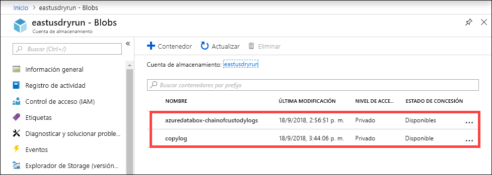

También puede ver la cadena de los registros de custodia que incluyen los registros de auditoría y los archivos de la lista de materiales.

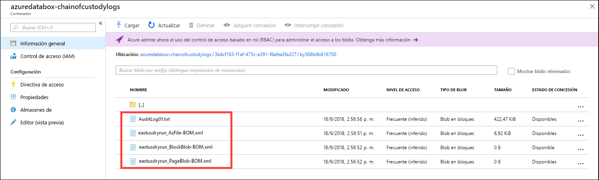

## <a name="view-order-status"></a>Visualización del estado del pedido

Cuando cambie el estado del dispositivo en el portal, se le notificará por correo electrónico.

|Estado del pedido |DESCRIPCIÓN |
|---------|---------|
|Ordered (Realizado)     | Se ha realizado correctamente un pedido. <br>Si el dispositivo está disponible, Microsoft identifica uno para el envío y lo prepara. <br> Si el dispositivo no está disponible inmediatamente, el pedido se procesará cuando el dispositivo esté disponible. El pedido puede tardar varios días o un par de meses en procesarse. Si el pedido no se puede completar en 90 días, se cancela el pedido y se le notifica.         |
|Processed (Procesado)     | El procesamiento del pedido está completado. Según su pedido, el dispositivo se prepara para su envío en el centro de datos.         |
|Dispatched (Enviado)     | Ha enviado el pedido. Use el identificador de seguimiento que se muestra en el pedido del portal para realizar un seguimiento del envío.        |
|Delivered (Entregado)     | El envío se entregó a la dirección especificada.        |
|Picked up (Recogido)     |El transportista recogió y analizó el envío de devolución.         |
|Received     | El dispositivo se recibió y examinó en el centro de datos de Azure. <br> Una vez que se inspecciona el envío, se iniciará la carga del dispositivo.      |
|Copia de datos     | La copia de datos está en curso. Realice un seguimiento del progreso de la copia del pedido en Azure Portal. <br> Espere hasta que se complete. |
|Completed       |El pedido se realizó correctamente.<br> Compruebe que los datos están en Azure antes de eliminarlos en el entorno local de los servidores.         |
|Completed with errors (Completado con errores)| Se completó la copia de datos pero se produjeron errores durante la copia. <br> Revise los registros de copia con la ruta de acceso proporcionada en Azure Portal.   |
|Canceled            |El pedido se ha cancelado. <br> Se canceló el pedido o se produjo un error y el servicio lo canceló. Si el pedido no se puede completar en 90 días, también se cancela el pedido y se le notifica.     |
|Limpieza | Se borran los datos en los discos del dispositivo. La limpieza del dispositivo se considera completa cuando el historial de pedidos está disponible para su descarga en Azure Portal.|


## <a name="next-steps"></a>Pasos siguientes

- Obtenga información sobre cómo [solucionar problemas relacionados con Azure Data Box y Azure Data Box Heavy](data-box-troubleshoot.md).
