# Uso de Azure Portal para administrar Data Box Disk

Los tutoriales de este artículo se aplican a Microsoft Azure Data Box Disk durante la versión preliminar. En este artículo se describen algunas de las tareas de administración y los flujos de trabajo complejos que se pueden realizar en Data Box Disk. 

Puede administrar Data Box Disk mediante Azure Portal. Este artículo se centra en las tareas que se pueden realizar mediante Azure Portal. Use Azure Portal para administrar pedidos, administrar discos y realizar el seguimiento del estado del pedido mientras pasa a la fase terminal.

## Cancelación de un pedido

Es posible que deba cancelar un pedido por diversos motivos después de realizarlo. Solo puede cancelar el pedido antes de que comience la preparación del disco. Una vez que se preparan los discos y se procesa el pedido, no es posible cancelarlo. 

Realice los pasos siguientes para cancelar un pedido.

1.  Vaya a **Overview > Cancel** (Información general > Cancelar). 

    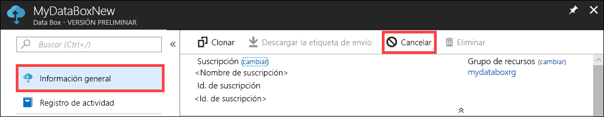

2.  Indique un motivo para cancelar el pedido.  

    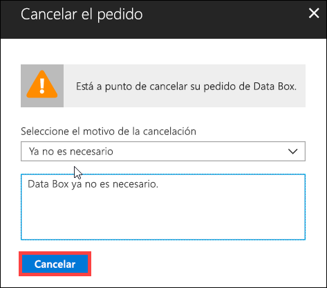

3.  Una vez que se cancela el pedido, el portal actualiza su estado y lo muestra como **Canceled** (Cancelado).

    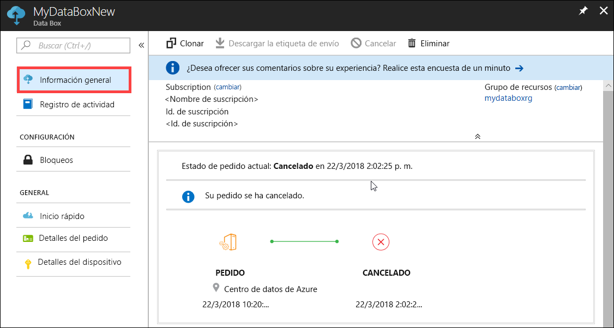

No recibirá una notificación por correo electrónico cuando se cancele el pedido.

## Clonación de un pedido

La clonación es útil en determinadas situaciones. Por ejemplo, un usuario ha usado Data Box Disk para transferir algunos datos. A medida que se generan más datos, se necesitan más discos para transferirlos en Azure. En este caso, simplemente se puede clonar el mismo pedido.

Realice los pasos siguientes para clonar un pedido.

1.  Vaya a **Overview > Clone** (Información general > Clonar). 

    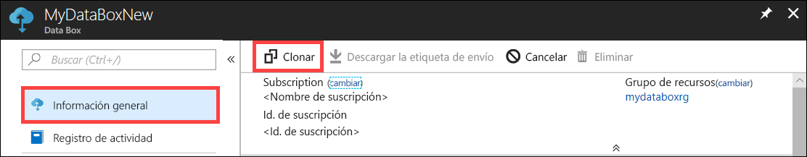

2.  Todos los detalles del pedido permanecen iguales. El nombre del pedido es el del pedido original seguido de *-Clone*. Seleccione la casilla para confirmar que ha revisado la información de privacidad. Haga clic en **Crear**.    

El clon se crea en unos minutos y el portal se actualiza para mostrar el nuevo pedido.

[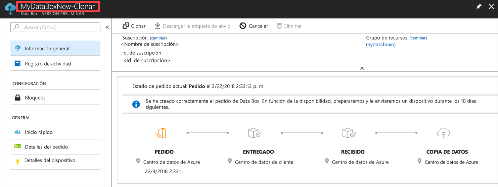](media/data-box-portal-ui-admin/clone-order3.png#lightbox) 

## Eliminación del pedido

Es posible que desee eliminar un pedido cuando se complete. El pedido contiene información personal, como su nombre, dirección e información de contacto. Esta información personal se elimina cuando se elimina el pedido.

Solo se pueden eliminar pedidos completados o cancelados. Realice los siguientes pasos para eliminar un pedido.

1. Vaya a **Todos los recursos**. Busque su pedido.

    

2. Haga clic en el pedido que desee eliminar y vaya a **Overview** (Información general). En la barra de comandos, haga clic en **Delete** (Eliminar).

    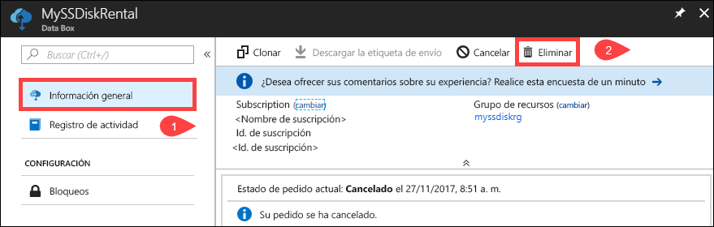

3. Escriba el nombre del pedido cuando se le pida que confirme su eliminación. Haga clic en **Eliminar**.

     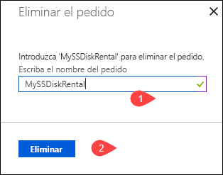

## Descarga de la etiqueta de envío

Es posible que tenga que descargar la etiqueta de envío si se extravía o se pierde la etiqueta de envío de devolución que se incluye con los discos. 

Siga estos pasos para descargar una etiqueta de envío.
1.  Vaya a **Overview > Download shipping label** (Información general > Descargar etiqueta de envío). Esta opción está disponible solo una vez enviado el disco. 

    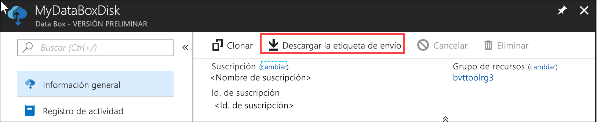

2.  Se descargará la siguiente etiqueta de envío devuelto. Guarde la etiqueta, imprímala horizontalmente y péguela al envío de devolución.

    

## Edición de la dirección de envío

Puede que tenga que editar la dirección de envío, una vez que se haya realizado el pedido. Esta opción solo está disponible hasta que se envía el disco. Después, dejará de estarlo.

Realice los pasos siguientes para editar el pedido.

1. Vaya a **Order details > Edit shipping address** (Detalles del pedido > Editar dirección de envío).

    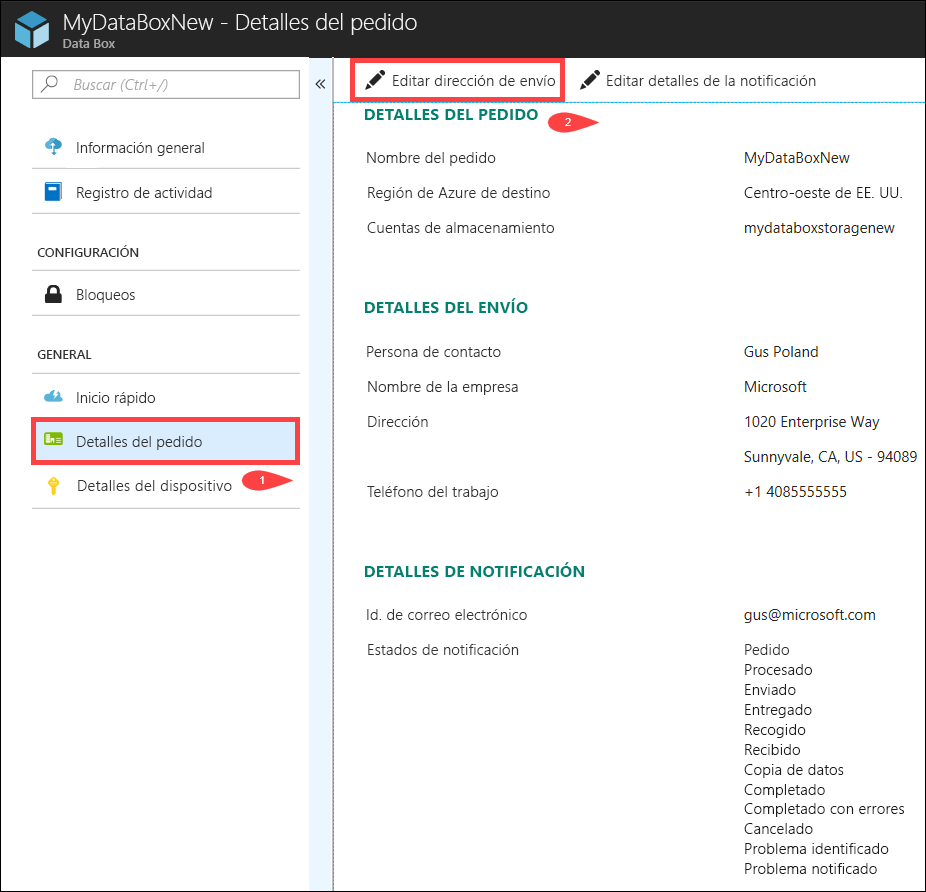

2. Ahora puede editar la dirección de envío y, a continuación, guardar los cambios.

    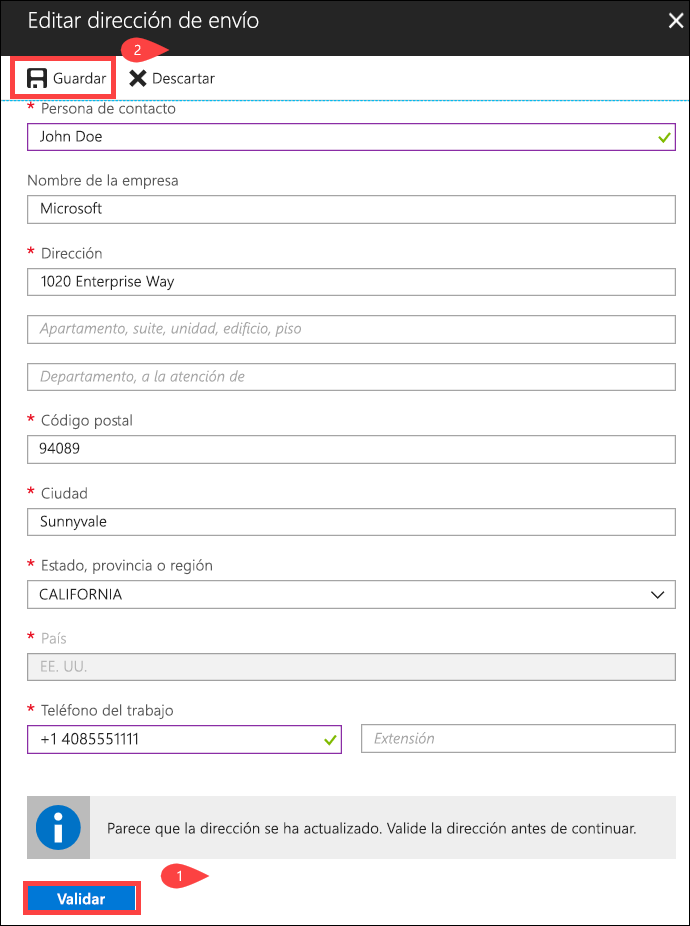

## Edición de los detalles de la notificación

Es posible que deba cambiar los usuarios que desea que reciban los mensajes de estado del pedido. Por ejemplo, hay que informar a un usuario cuando se entrega o recoge el disco. Puede que sea necesario informar a otro usuario cuando se completa la copia de datos para que pueda comprobar que están en la cuenta de almacenamiento de Azure antes de eliminarlos del origen. En estos casos, puede editar los detalles de notificación.

Realice los siguientes pasos para editar una plantilla de notificación.

1. Vaya a **Order details > Edit notification details** (Detalles de pedidos > Editar detalles de la notificación).

    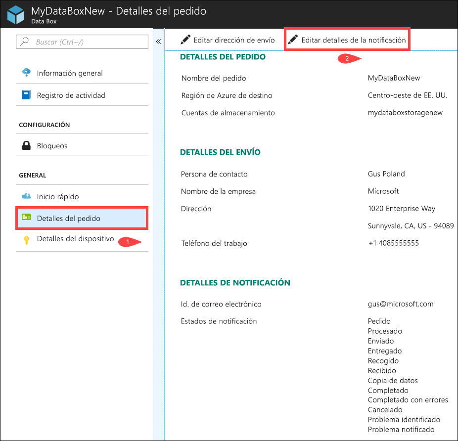

2. Ahora puede editar los detalles de la notificación y, a continuación, guardar los cambios.
 
    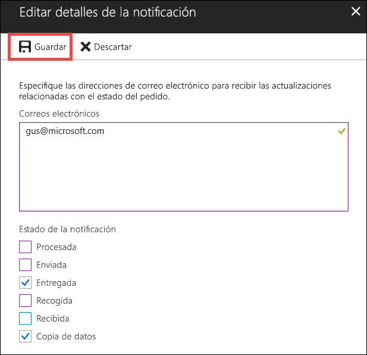

## Visualización del estado del pedido

|Estado del pedido |Descripción |
|---------|---------|
|Ordered (Realizado)     | Se ha realizado correctamente un pedido.   Si los discos no están disponibles, recibirá una notificación.  Si los discos están disponibles, Microsoft identifica un disco para el envío y prepara el paquete.        |
|Processed (Procesado)     | El procesamiento del pedido está completado.   Durante el procesamiento del pedido, se producen las acciones siguientes:<li>Con los discos se usa el cifrado BitLocker AES-128. </li> <li>Data Box Disk se bloquea para evitar el acceso no autorizado.</li><li>Durante este proceso se genera la clave de paso que desbloquea los discos.</li>        |
|Dispatched (Enviado)     | Ha enviado el pedido. Debería recibirlo en 1 o 2 días.        |
|Delivered (Entregado)     | El pedido se entregó a la dirección especificada.        |
|Picked up (Recogido)     |El envío de devolución se recogió.   Una vez recibido el envío en el centro de datos de Azure, los datos se cargarán automáticamente en Azure.         |
|Received     | Se han recibido los discos en el centro de datos de Azure. La copia de datos comenzará en breve.        |
|Data copied (Datos copiados)     |La copia de datos está en curso.  Espere hasta que se complete.         |
|Completed       |El pedido se realizó correctamente.  Compruebe que los datos están en Azure antes de eliminarlos en el entorno local de los servidores.         |
|Completed with errors (Completado con errores)| Se completó la copia de datos, pero se han recibido errores.   Revise los registros de errores de carga con la ruta de acceso que se proporciona en la **información general**. Para más información, vaya a la sección sobre la [descarga de los registros de errores de carga](data-box-disk-troubleshoot-upload.md#download-logs).   |
|Canceled            |El pedido se ha cancelado.   Se canceló el pedido o se produjo un error y el servicio lo canceló.     |

## Pasos siguientes

- Obtenga información sobre cómo [Solucionar problemas de Data Box Disk](data-box-disk-troubleshoot.md).
