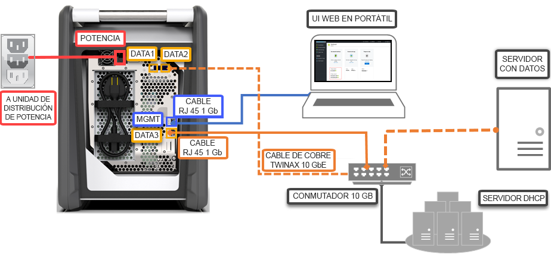

# Inicio rápido: Implementación de Azure Data Box mediante Azure Portal

En esta guía de inicio rápido se describe cómo implementar Azure Data Box mediante Azure Portal. Los pasos incluyen cómo cablear, configurar y copiar datos en Data Box para que se cargan en Azure. La guía de inicio rápido se realiza en Azure Portal y en la interfaz de usuario web local del dispositivo.

Para obtener las instrucciones para realizar una implementación paso a paso y el seguimiento del proceso, vaya a [Tutorial: Pedido de Azure Data Box](data-box-deploy-ordered.md).

## Requisitos previos

Antes de empezar:

- Asegúrese de que la suscripción que utilice para el servicio Data Box sea de uno de los siguientes tipos:
    - Contrato Enterprise (EA) de Microsoft. Más información sobre [las suscripciones de EA](https://azure.microsoft.com/pricing/enterprise-agreement/).
    - Proveedor de soluciones en la nube (CSP). Más información sobre el [programa Azure CSP](https://docs.microsoft.com/azure/cloud-solution-provider/overview/azure-csp-overview).
    - Consumo: pago por uso. Más información sobre las [suscripciones de pago por uso de Azure](https://azure.microsoft.com/offers/ms-azr-0003p/).

- Asegúrese de que tiene acceso de propietario o colaborador a la suscripción para crear un pedido de Data Box.
- Revise las [directrices de seguridad para su Data Box](data-box-safety.md).
- Tiene un equipo host que incluye los datos que quiere copiar en Data Box. El equipo host debe:
    - Ejecutar un [sistema operativo admitido](data-box-system-requirements.md).
    - Estar conectado a una red de alta velocidad. Se recomienda tener una conexión de 10 GbE como mínimo. Si no hay disponible una conexión 10 GbE, se puede usar un vínculo de datos de 1 GbE, pero se ven afectadas las velocidades de copia. 
- Debe tener acceso a una superficie plana en la puede colocar su Data Box. Si quiere colocar el dispositivo en un bastidor estándar, necesitará una ranura de 7U en el bastidor del centro de datos. Puede colocar el dispositivo en posición horizontal o vertical en el bastidor.
- Cuenta con los cables siguientes para conectar su Data Box al equipo host.
    - Dos cables de cobre 10 GbE SFP+ Twinax (uso con las interfaces de red DATA 1, DATA 2)
    - Un cable de red RJ-45 cat. 6 (se usa con la interfaz de red MGMT)
    - Un cable de red RJ-45 cat. 6A o RJ-45 cat. 6 (uso con la interfaz de red DATA 3 configurada como 10 Gbps o 1 Gbps, respectivamente)

## Inicio de sesión en Azure

Inicie sesión en Azure Portal en [http://portal.azure.com](http://portal.azure.com).

## Orden

Este paso tarda aproximadamente 5 minutos.

1. Cree un nuevo recurso de Azure Data Box en Azure Portal.
2. Seleccione una suscripción existente habilitada para este servicio y elija el tipo de transferencia como de **importación**. Proporcione el **país de origen** donde residen los datos y la **región de destino de Azure** para la transferencia de datos.
3. Seleccione **Data Box**. La capacidad máxima utilizable es de 80 TB y puede crear varios pedidos para tamaños de datos mayores.
4. Escriba los detalles del pedido y la información de envío. Si el servicio está disponible en su región, proporcione las direcciones de correo electrónico de notificación, revise el resumen y, a continuación, cree el pedido.

Una vez que se creó el pedido, el dispositivo está preparado para su envío.

## Cable 

Este paso tarda aproximadamente 10 minutos.

Cuando reciba su Data Box, siga los pasos a continuación para cablear, conectar y encender el dispositivo. Este paso tarda aproximadamente 10 minutos.

1. Si hay cualquier evidencia de que el dispositivo ha sido manipulado o está dañado, no continúe. Póngase en contacto con el Soporte técnico de Microsoft para recibir un dispositivo de reemplazo.
2. Antes de cablear el dispositivo, asegúrese de tener los cables siguientes:
    
    - Cable de alimentación con tierra (incluido) con calificación de 10 A o más, con un conector IEC60320 C-13 en un extremo para conectar al dispositivo.
    - Un cable de red RJ-45 cat. 6 (se usa con la interfaz de red MGMT)
    - Dos cables de cobre 10 GbE SFP+ Twinax (uso con las interfaces de red DATA 1, DATA 2 de 10 Gbps)
    - Un cable de red RJ-45 cat. 6A o RJ-45 cat. 6 (uso con la interfaz de red DATA 3 configurada como 10 Gbps o 1 Gbps, respectivamente)

3. Retire el dispositivo y colóquelo en una superficie plana. 
    
4. Cablee el dispositivo como se muestra a continuación.  

      

    1. Conecte el cable de alimentación al dispositivo.
    2. Use el cable de red RJ-45 cat. 6 para conectar el equipo host al puerto de administración (MGMT) del dispositivo. 
    3. Use el cable de cobre SFP+ Twinax para conectar al menos una interfaz de red de 10 Gbps (se prefiere frente a la de 1 Gbps), DATA1 o DATA2 para los datos. 
    4. Encienda el dispositivo. El botón de encendido se encuentra en el panel frontal del dispositivo.

## Conectar

Este paso tarda entre 5 y 7 minutos en completarse.

1. Para obtener la contraseña del dispositivo, vaya a **General > Detalles del dispositivo** en [Azure Portal](http://portal.azure.com).
2. Asigne una dirección IP estática 192.168.100.5 y la subred 255.255.255.0 al adaptador Ethernet en el equipo que usa para conectarse a Data Box. Acceda a la interfaz de usuario web local del dispositivo en `https://192.168.100.10`. La conexión puede tardar hasta 5 minutos tras encender el dispositivo. 
3. Inicie sesión con la contraseña desde Azure Portal. Ve un error que indica un problema con el certificado de seguridad del sitio web. Siga las instrucciones específicas del explorador para continuar a la página web.
4. De manera predeterminada, la configuración de red para la interfaz de datos de 10 Gbps (o 1 Gbps) se establece como DHCP. Si es necesario, puede configurar esta interfaz como estática y proporcionar una dirección IP. 

## Copia de datos

El tiempo en completar esta operación depende del tamaño de los datos y la velocidad de la red.
 
1. Si utiliza un host Windows, use una herramienta de copia de archivos compatible con SMB, como Robocopy. Para el host NFS, use el comando `cp` o `rsync` para copiar los datos. Conecte la herramienta al dispositivo y empiece a copiar los datos a los recursos compartidos. Para obtener más información sobre cómo usar Robocopy para copiar los datos, vaya a [Robocopy](https://technet.microsoft.com/library/ee851678.aspx).
2. Conéctese a los recursos compartidos con la ruta de acceso:`\\<IP address of your device>\ShareName`. Para obtener las credenciales de acceso a los recursos compartidos, vaya a la página **Connect & copy** (Conectar y copiar) de la interfaz de usuario web local de Data Box.
3. Asegúrese de que los nombres de los recursos compartidos y las carpetas, y los datos sigan las directrices descritas en los [límites de servicio de Azure Storage y Data Box](data-box-limits.md).

## Envío a Azure 

Esta operación tarda unos 10 a 15 minutos en completarse.

1. Vaya a la página **Preparar para enviar** de la interfaz de usuario web local y comience la preparación del envío. 
2. Desactive el dispositivo desde la interfaz de usuario web local. Quite los cables del dispositivo. 
3. La etiqueta de envío para devolución debe verse en la pantalla de tinta electrónica. Si la etiqueta de tinta electrónica no muestra la visualización, descargue la etiqueta de envío de Azure Portal y introdúzcala en la funda transparente junto al dispositivo.
4. Cierre la caja y envíela a Microsoft. 

## Comprobación de datos

El tiempo en completar esta operación depende del tamaño de los datos.

1. Cuando el dispositivo Data Box se conecta a la red del centro de datos de Azure, se inicia automáticamente la carga de datos en Azure. 
2. El servicio Azure Data Box le notifica a través de Azure Portal que la copia de datos se ha completado. 

    1. Compruebe en los registros de errores si hay errores y tome las medidas adecuadas.
    2. Compruebe que los datos estén en las cuentas de almacenamiento antes de eliminarlos del origen.

## Limpieza de recursos

Este paso tarda de 2 a 3 minutos en completarse.

- Puede cancelar el pedido de Data Box en Azure Portal antes de procesar el pedido. Una vez que el pedido se procesa, no se puede cancelar. El pedido sigue su curso hasta que alcanza la fase de finalización. Para cancelar el pedido, vaya a **Información general** y haga clic en **Cancelar** desde la barra de comandos.

- Podrá eliminar el pedido una vez que el estado se muestre como **Completed** (Completado) o **Canceled** (Cancelado) en Azure Portal. Para eliminar el pedido, vaya a **Información general** y haga clic en **Eliminar** desde la barra de comandos.

## Pasos siguientes

En esta guía de inicio rápido, ha implementado Azure Data Box para ayudar a importar los datos en Azure. Para más información sobre la administración de Azure Data Box, pase al tutorial siguiente: 

> [!div class="nextstepaction"]
> [Uso de Azure Portal para administrar Azure Data Box](data-box-portal-admin.md)

