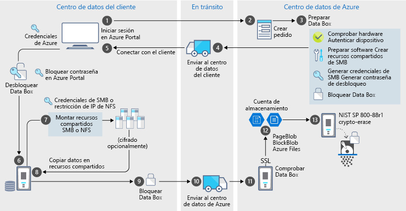

# Protección de datos y seguridad de Azure Data Box

Data Box proporciona una solución segura para proteger los datos al garantizar que solo las entidades autorizadas puedan ver, modificar o eliminar los datos. En este artículo se describen las características de seguridad de Azure Data Box que ayudan a proteger cada uno de los componentes de la solución Data Box y los datos almacenados en ellos. 

[!INCLUDE [GDPR-related guidance](../../includes/gdpr-intro-sentence.md)]

## Flujo de datos a través de componentes

La solución Microsoft Azure Data Box consta de cuatro componentes principales que interactúan entre sí:

- **Servicio Azure Data Box hospedado en Azure**: el servicio de administración que se usa para crear el pedido del dispositivo, configurar el dispositivo y, a continuación, supervisar el pedido hasta que se realiza.
- **Dispositivo de Data Box**: el dispositivo de transferencia que se envía para importar los datos del entorno local a Azure. 
- **Clientes/hosts conectados al dispositivo**: los clientes en la infraestructura que se conectan al dispositivo de Data Box y contienen los datos que se deben proteger.
- **Almacenamiento en la nube** : la ubicación en la nube de Azure donde se almacenan los datos. Suele ser la cuenta de almacenamiento vinculada al recurso de Azure Data Box que ha creado.

El diagrama siguiente indica el flujo de datos a través de la solución Azure Data Box desde el entorno local a Azure.

Mientras los datos fluyen a través de esta solución, se registran los eventos y se generan registros. Para obtener más información, vaya a [Seguimiento y registro de eventos para Azure Data Box](data-box-logs.md).

## Características de seguridad

Data Box proporciona una solución segura para proteger los datos al garantizar que solo las entidades autorizadas puedan ver, modificar o eliminar los datos. Las características de seguridad de esta solución están destinadas al disco y al servicio asociado, lo que garantiza la seguridad de los datos almacenados. 

### Protección del dispositivo Data Box

El dispositivo Data Box se protege mediante las siguientes características:

- Una carcasa resistente para el dispositivo, capaz de resistir impactos, transporte adverso y condiciones ambientales. 
- Sellos a prueba de manipulaciones para indicar cualquier alteración hecha al dispositivo durante el transporte.
- Detección de manipulaciones en hardware y software que impide más operaciones en el dispositivo.
- Ejecuta solo el software específico para Data Box.
- Arranca en un estado bloqueado.
- Controla el dispositivo a través de una contraseña de desbloqueo de dispositivo.
- Credenciales de acceso para copiar datos hacia y desde el dispositivo. Todos los accesos a la página **Credenciales del dispositivo** en Azure Portal quedan registrados en los [registros de actividad](data-box-logs.md#query-activity-logs-during-setup).

### Protección de datos de Data Box

Los datos que fluyen en Data Box se protegen mediante las siguientes características:

- Cifrado AES de 256 bits para datos en reposo.
- Se pueden usar protocolos cifrados para los datos en movimiento.
- Eliminación segura de los datos desde el dispositivo una vez completada la carga de datos en Azure. La eliminación de datos se ha establecido de acuerdo con las instrucciones del [Apéndice A para las unidades de disco duro ATA en el estándar NIST 800-88r1](https://nvlpubs.nist.gov/nistpubs/SpecialPublications/NIST.SP.800-88r1.pdf). El evento de eliminación de datos se registra en el [historial de pedidos](data-box-logs.md#download-order-history).

### Protección del servicio Data Box

El servicio Data Box se protege mediante las siguientes características:

- El acceso al servicio Data Box requiere que la organización tenga una suscripción de Azure que incluya dicho servicio. Su suscripción regula las características a las que puede tener acceso en Azure Portal.
- Dado que el servicio Data Box está hospedado en Azure, se encuentra protegido por las características de seguridad de Azure. Para obtener más información acerca de las características de seguridad que proporciona Microsoft Azure, visite el [Centro de confianza de Microsoft Azure](https://www.microsoft.com/TrustCenter/Security/default.aspx).
- El acceso al pedido de Data Box puede controlarse mediante el uso de los roles del control de acceso basado en rol. Para obtener más información, consulte [Set up access control for Data Box order](data-box-logs.md#set-up-access-control-on-the-order) (Configuración del control de accesos para el pedido de Data Box).
- El servicio de Data Box almacena la contraseña de desbloqueo que se usa para desbloquear el dispositivo en el servicio.
- El servicio Data Box almacena los detalles del pedido y del estado en el servicio. Esta información se elimina cuando se elimina el pedido.

## Administración de datos personales

Azure Data Box recopila y muestra la información personal en las siguientes instancias claves en el servicio:

- **Configuración de notificaciones**: cuando se crea un pedido, se configura la dirección de correo electrónico de los usuarios en la configuración de notificación. El administrador puede ver esta información. El servicio elimina esta información cuando el trabajo alcanza el estado terminal o al eliminar el pedido.

- **Detalles de pedidos**: una vez creado el pedido, la dirección de envío, el correo electrónico y la información de contacto de los usuarios se almacenan en Azure Portal. Entre la información guardada se incluyen los siguientes datos:

  - Nombre de contacto
  - Número de teléfono
  - Email
  - Dirección
  - City
  - Código postal
  - State
  - País/región/provincia
  - Número de cuenta del transportista
  - Número de seguimiento del envío

    El servicio Data Box elimina los detalles del pedido cuando el trabajo se completa o al eliminar el pedido.

- **Dirección de envío**: después de realizar el pedido, el servicio Data Box proporciona la dirección de envío a compañías de transporte como UPS o DHL. 

Para obtener más información, revise la directiva de privacidad de Microsoft en el [Centro de confianza](https://www.microsoft.com/trustcenter).

## Referencia de directrices de seguridad

Las siguientes directrices de seguridad están implementadas en Data Box: 

|Directrices   |Descripción   |
|---------|---------|
|[IEC 60529 IP52](https://www.iec.ch/)    | Para la protección contra agua y polvo         |
|[ISTA 2A](https://ista.org/docs/2Aoverview.pdf)     | Para la resistencia ante las condiciones adversas de transporte          |
|[NIST SP 800-147](https://nvlpubs.nist.gov/nistpubs/Legacy/SP/nistspecialpublication800-147.pdf)      | Para la actualización segura del firmware         |
|[FIPS 140-2 nivel 2](https://csrc.nist.gov/csrc/media/publications/fips/140/2/final/documents/fips1402.pdf)      | Para la protección de datos         |
|Apéndice A, para unidades de disco duro ATA en [NIST SP 800-88r1](https://nvlpubs.nist.gov/nistpubs/SpecialPublications/NIST.SP.800-88r1.pdf)      | Para el saneamiento de los datos         |

## Pasos siguientes

- Revise los [requisitos de Data Box](data-box-system-requirements.md).
- Información acerca de los [límites de Data Box](data-box-limits.md).
- Implemente rápidamente [Azure Data Box](data-box-quickstart-portal.md) en Azure Portal.
