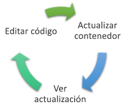
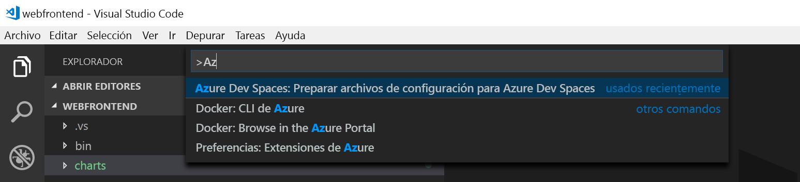
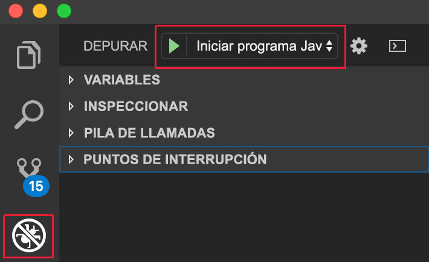
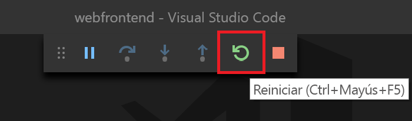

# <a name="create-a-kubernetes-dev-space-visual-studio-code-and-java-with-azure-dev-spaces"></a>Creación de un espacio de desarrollo de Kubernetes: Visual Studio Code y Java con Azure Dev Spaces

En esta guía, aprenderá a:

- Crear un entorno basado en Kubernetes en Azure que esté optimizado para el desarrollo (un _espacio de desarrollo_).
- Desarrollar código de forma iterativa en contenedores con VS Code y la línea de comandos.
- Desarrollar y probar de forma productiva el código en un entorno de equipo.

> [!Note]
> **Si se queda bloqueado** en cualquier momento, consulte la sección [Solución de problemas](troubleshooting.md).

## <a name="install-the-azure-cli"></a>Instalación de la CLI de Azure
Azure Dev Spaces requiere una configuración mínima de la máquina local. La mayor parte de la configuración del espacio de desarrollo se almacena en la nube y se puede compartir con otros usuarios. Para comenzar, descargue y ejecute la [CLI de Azure](/cli/azure/install-azure-cli?view=azure-cli-latest).

### <a name="sign-in-to-azure-cli"></a>Inicio de sesión en la CLI de Azure
Inicie sesión en Azure. Escriba el siguiente comando en una ventana de terminal:

```cmd
az login
```

> [!Note]
> Si no tiene una suscripción a Azure, puede crear una [cuenta gratuita](https://azure.microsoft.com/free).

#### <a name="if-you-have-multiple-azure-subscriptions"></a>Si tiene varias suscripciones a Azure...
Para ver sus suscripciones, ejecute: 

```cmd
az account list --output table
```

Busque la suscripción que tiene *True* para *IsDefault*.
Si esta no es la suscripción que desea usar, puede cambiar la suscripción predeterminada:

```cmd
az account set --subscription <subscription ID>
```

## <a name="create-a-kubernetes-cluster-enabled-for-azure-dev-spaces"></a>Creación de un clúster de Kubernetes habilitado para Azure Dev Spaces

En el símbolo del sistema, cree el grupo de recursos en una [región que admita Azure Dev Spaces][supported-regions].

```cmd
az group create --name MyResourceGroup --location <region>
```

Crear un clúster de Kubernetes con el siguiente comando:

```cmd
az aks create -g MyResourceGroup -n MyAKS --location <region> --disable-rbac --generate-ssh-keys
```

La operación de creación del clúster tarda unos minutos.

### <a name="configure-your-aks-cluster-to-use-azure-dev-spaces"></a>Configuración del clúster de AKS para usar Azure Dev Spaces

Escriba el siguiente comando de la CLI de Azure, mediante el grupo de recursos que contiene el clúster de AKS, y su nombre del clúster de AKS. El comando configura el clúster para la compatibilidad con Azure Dev Spaces.

   ```cmd
   az aks use-dev-spaces -g MyResourceGroup -n MyAKS
   ```

> [!IMPORTANT]
> El proceso de configuración de Azure Dev Spaces quitará el espacio de nombres `azds` del clúster, si existe.

## <a name="get-kubernetes-debugging-for-vs-code"></a>Obtención de depuración de Kubernetes para VS Code
Hay características enriquecidas, como la depuración de Kubernetes, disponibles para los desarrolladores de .NET Core y Node.js que usan VS Code.

1. Si no lo tiene, instale [VS Code](https://code.visualstudio.com/Download).
1. Descargue e instale la [extensión para VS de Azure Dev Spaces](https://marketplace.visualstudio.com/items?itemName=azuredevspaces.azds). Haga clic en Instalar una vez que se encuentre en la página de Marketplace de la extensión, y de nuevo en VS Code. 

Para depurar aplicaciones Java con Azure Dev Spaces, descargue e instale la extensión del [depurador de Java para Azure Dev Spaces](https://marketplace.visualstudio.com/items?itemName=vscjava.vscode-java-debugger-azds) para VS Code. Haga clic en Instalar una vez que se encuentre en la página de Marketplace de la extensión, y de nuevo en VS Code.

## <a name="create-a-web-app-running-in-a-container"></a>Crear una aplicación web que se ejecuta en un contenedor

En esta sección, va a crear una aplicación web de Java y a ejecutarla en un contenedor de Kubernetes.

### <a name="create-a-java-web-app"></a>Crear una aplicación web de Java
Descargue el código de GitHub en [https://github.com/Azure/dev-spaces](https://github.com/Azure/dev-spaces) y seleccione **Clone or Download** (Clonar o descargar) para descargar el repositorio de GitHub en su entorno local. El código de esta guía se encuentra en `samples/java/getting-started/webfrontend`.

## <a name="preparing-code-for-docker-and-kubernetes-development"></a>Preparación del código para el desarrollo de Docker y Kubernetes
Hasta ahora, tiene una aplicación web básica que se puede ejecutar localmente. Ahora podrá incluirla en contenedores creando activos que definen el contenedor de la aplicación y cómo se implementará en Kubernetes. Esta tarea es fácil de hacer con Azure Dev Spaces: 

1. Ejecute VS Code y abra la carpeta `webfrontend`. (Puede omitir cualquier mensaje predeterminado para agregar recursos de depuración o restaurar el proyecto).
1. Abra el terminal integrado en VS Code (mediante el menú **Ver | Terminal integrado**.
1. Ejecute este comando (asegúrese de que **webfrontend** es la carpeta actual):

    ```cmd
    azds prep --public
    ```

El comando `azds prep` de la CLI de Azure comando genera recursos de Docker y Kubernetes con la configuración predeterminada:
* `./Dockerfile` describe la imagen de contenedor de la aplicación y cómo el código fuente se compila y se ejecuta dentro del contenedor.
* A [gráfico de Helm](https://docs.helm.sh) bajo `./charts/webfrontend` describe cómo implementar el contenedor en Kubernetes.

> [!TIP]
> Azure Dev Spaces usa [Dockerfile y el gráfico de Helm](how-dev-spaces-works.md#prepare-your-code) del proyecto para compilar y ejecutar el código, pero el usuario puede modificar estos archivos si desea cambiar la forma en que se compila y se ejecuta el proyecto.

Por ahora, no es necesario comprender todo el contenido de estos archivos. Sin embargo, vale la pena señalar que **los mismos recursos de configuración como código de Kubernetes y Docker se pueden usar desde el desarrollo hasta la producción, lo que proporciona una mejor coherencia entre diferentes entornos.**
 
Un archivo denominado `./azds.yaml` también se genera mediante el comando `prep`; se trata del archivo de configuración para Azure Dev Spaces. Complementa los artefactos de Docker y Kubernetes sin configuración adicional que posibilita una experiencia de desarrollo iterativo en Azure.

## <a name="build-and-run-code-in-kubernetes"></a>Compilación y ejecución de código en Kubernetes
Vamos a ejecutar el código. En la ventana de terminal, ejecute este comando desde la **carpeta de código raíz** WebFrontEnd:

```cmd
azds up
```

Esté atento en la salida del comando, ya que observará varios aspectos a medida que avanza:
- El código fuente se sincroniza con el espacio de desarrollo en Azure.
- Se crea una imagen de contenedor en Azure según lo que especifiquen los recursos de Docker en la carpeta de código.
- Los objetos de Kubernetes que se crean utilizan la imagen de contenedor según lo que especifica el gráfico de Helm en la carpeta de código.
- Se muestra información acerca de los puntos de conexión del contenedor. En nuestro caso, se espera una dirección URL HTTP pública.
- Suponiendo que las fases anteriores se completen correctamente, debería empezar a ver la salida `stdout` (y `stderr`) a medida que se inicia el contenedor.

> [!Note]
> Estos pasos tardarán más tiempo la primera vez que se ejecute el comando `up`, pero las ejecuciones posteriores deberían ser más rápidas.

### <a name="test-the-web-app"></a>Prueba de la aplicación web
Examine la salida de la consola para obtener información sobre la dirección URL pública que creó el comando `up`. Tendrá el formato siguiente: 

```
(pending registration) Service 'webfrontend' port 'http' will be available at <url>
Service 'webfrontend' port 'http' is available at http://webfrontend.1234567890abcdef1234.eus.azds.io/
Service 'webfrontend' port 80 (TCP) is available at 'http://localhost:<port>'
```

Identifique la dirección URL pública para el servicio en la salida desde el comando `up`. Finaliza en `.azds.io`. En el ejemplo anterior, la dirección URL pública es `http://webfrontend.1234567890abcdef1234.eus.azds.io/`.

Para ver la aplicación web, abra la dirección URL pública en un explorador. Además, tenga en cuenta que la salida `stdout` y `stderr` se transmite a la ventana del terminal *azds-trace* a medida que interactúa con su aplicación web. También verá la información de seguimiento de las solicitudes HTTP a medida que pasan por el sistema. Esto le facilita el seguimiento de llamadas complejas de múltiples servicios durante el desarrollo. La instrumentación agregada por Dev Spaces proporciona este seguimiento de las solicitudes.

> [!Note]
> Además de la dirección URL pública, puede usar la dirección URL alternativa `http://localhost:<portnumber>` que se muestra en la salida de la consola. Si utiliza la dirección URL del host local, puede parecer que el contenedor se ejecuta localmente, pero en realidad se ejecuta en AKS. Azure Dev Spaces usa la funcionalidad de *reenvío de puerto* de Kubernetes para asignar el puerto localhost al contenedor que se ejecuta en AKS. Esto facilita la interacción con el servicio desde la máquina local.

### <a name="update-a-content-file"></a>Actualización de un archivo de contenido
Con Azure Dev Spaces no se trata solo de conseguir que el código se ejecute en Kubernetes, sino de permitirle ver rápida e iterativamente que los cambios de código surtan efecto en un entorno de Kubernetes en la nube.

1. En la ventana de terminal, presione `Ctrl+C` (para detener `azds up`).
1. Abra `src/main/java/com/ms/sample/webfrontend/Application.java` y edite el mensaje de saludo en la [línea 19](https://github.com/Azure/dev-spaces/blob/master/samples/java/getting-started/webfrontend/src/main/java/com/ms/sample/webfrontend/Application.java#L19):

    ```java
    return "Hello from webfrontend in Azure!";
    ```

1. Guarde el archivo.
1. Ejecute `azds up` en la ventana de terminal.

Este comando vuelve a crear la imagen del contenedor y vuelve a implementar el gráfico de Helm. Para que los cambios de código surtan efecto en la aplicación en ejecución solo tiene que actualizar el explorador.

Pero hay un método *más rápido* para desarrollar código, que se verá en la siguiente sección. 

## <a name="debug-a-container-in-kubernetes"></a>Depuración de un contenedor en Kubernetes

En esta sección, usará VS Code para depurar directamente el contenedor que se ejecuta en Azure. También aprenderá a obtener un bucle de edición-ejecución-prueba más rápido.



> [!Note]
> **Si se queda bloqueado** en cualquier momento, consulte la sección [Solución de problemas](troubleshooting.md) o publique un comentario en esta página.

### <a name="initialize-debug-assets-with-the-vs-code-extension"></a>Inicialización de activos de depuración con la extensión de VS Code
En primer lugar, debe configurar el proyecto de código para que VS Code se comunique con nuestro espacio de desarrollo en Azure. La extensión de VS Code para Azure Dev Spaces proporciona un comando auxiliar para establecer la configuración de depuración. 

Abra la **Paleta de comandos** (mediante el menú **Vista | Paleta de comandos**) y use Autocompletar para escribir y seleccionar este comando: `Azure Dev Spaces: Prepare configuration files for Azure Dev Spaces`. 

Esto agrega la configuración de depuración para los espacios de Azure Dev Spaces en la carpeta `.vscode`. Este comando no se debe confundir con el comando `azds prep`, que configura el proyecto para la implementación.



### <a name="select-the-azds-debug-configuration"></a>Selección de la configuración de depuración de AZDS
1. Para abrir la vista de depuración, haga clic en el icono de depuración en la **barra de actividad** en el lateral de VS Code.
1. Seleccione **Launch Java Program (AZDS)** [Iniciar programa Java (AZDS)] como la configuración de depuración activa.



> [!Note]
> Si no ve ningún comando de Azure Dev Spaces en la paleta de comandos, asegúrese de haber instalado la extensión de Visual Studio Code para Azure Dev Spaces. Asegúrese de que el área de trabajo que abre en VS Code es la carpeta que contiene `azds.yaml`.

### <a name="debug-the-container-in-kubernetes"></a>Depuración del contenedor en Kubernetes
Presione **F5**  para depurar el código en Kubernetes.

De forma similar al comando `up`, el código se sincroniza con el espacio de desarrollo y se crea un contenedor que se implementa en Kubernetes. En esta ocasión, por supuesto, el depurador se asocia al contenedor remoto.

> [!Tip]
> La barra de estado de VS Code se volverá de color naranja, lo que indica que el depurador se ha asociado. También mostrará una dirección URL interactiva, que puede usar para abrir la aplicación.


Establezca un punto de interrupción en un archivo de código del lado servidor, por ejemplo en la función `greeting()` del archivo de origen `src/main/java/com/ms/sample/webfrontend/Application.java`. Al actualizar la página del navegador, el punto de interrupción se activa.

Tiene acceso completo a la información de depuración, igual que si el código se ejecutara localmente, como la pila de llamadas, las variables locales o la información de excepción, por ejemplo.

### <a name="edit-code-and-refresh"></a>Edición del código y actualización
Con el depurador activo, realice una edición del código. Por ejemplo, modifique el saludo en `src/main/java/com/ms/sample/webfrontend/Application.java`. 

```java
public String greeting()
{
    return "I'm debugging Java code in Azure!";
}
```

Guarde el archivo y, en el **panel de acciones de depuración**, haga clic en el botón **Reiniciar**.



En lugar de volver a crear e implementar una nueva imagen de contenedor cada vez que se realizan modificaciones en el código, lo que a menudo lleva un tiempo considerable, Azure Dev Spaces volverá a compilar el código de manera incremental dentro del contenedor existente para proporcionar un bucle de modificación/depuración más rápido.

Actualice la aplicación web en el explorador. Verá que aparece el mensaje personalizado en la interfaz de usuario.

**Ahora tiene un método para iterar rápidamente el código y depurarlo directamente en Kubernetes.** A continuación, verá cómo puede crear y llamar a un segundo contenedor.

## <a name="next-steps"></a>Pasos siguientes

> [!div class="nextstepaction"]
> [Aprenda sobre el desarrollo de varios servicios](multi-service-java.md)


[supported-regions]: https://azure.microsoft.com/global-infrastructure/services/?products=kubernetes-service
