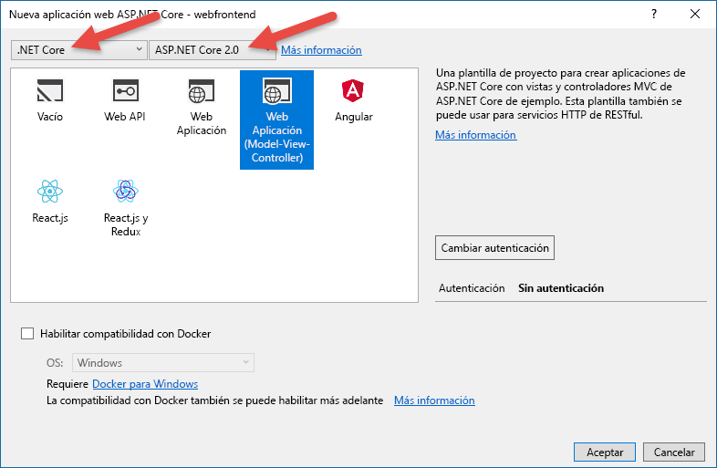
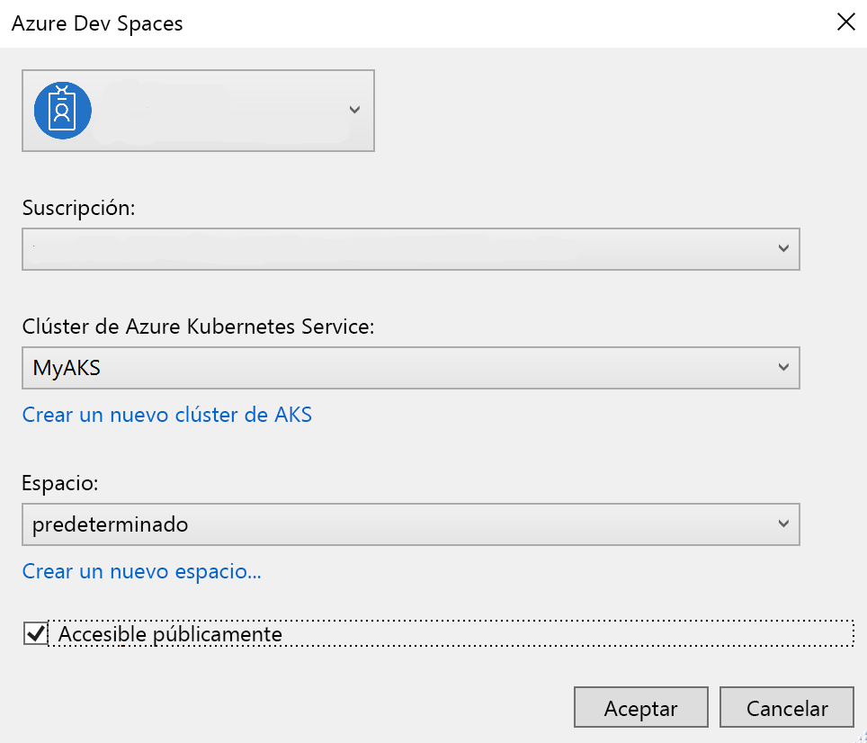
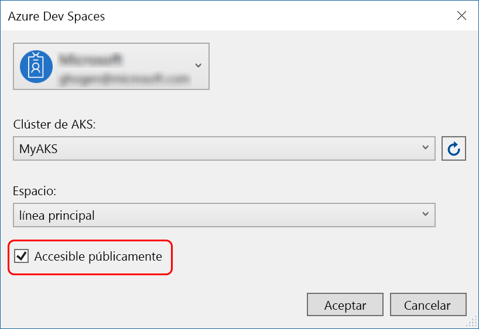
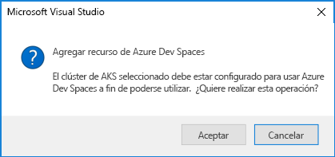
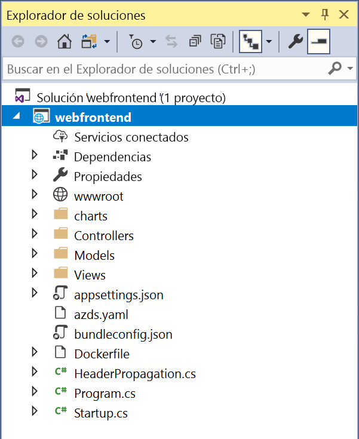

# Introducción a Azure Dev Spaces con .NET Core y Visual Studio

En esta guía, aprenderá a:

- Configurar Azure Dev Spaces con un clúster de Kubernetes administrado en Azure.
- Desarrollar código de forma iterativa en contenedores con Visual Studio
- Desarrollar de forma independiente dos servicios distintos y usar la detección de servicios DNS de Kubernetes para realizar una llamada a otro servicio
- Desarrollar y probar de forma productiva el código en un entorno de equipo.

> [!Note]
> **Si se queda bloqueado** en cualquier momento, consulte la sección [Solución de problemas](troubleshooting.md).

## Creación de un clúster de Kubernetes habilitado para Azure Dev Spaces

1. Inicie sesión en Azure Portal en https://portal.azure.com.
1. Elija **Crear un recurso** > busque **Kubernetes** > seleccione **Kubernetes Service** > **Crear**.

   Complete los pasos siguientes en cada encabezado del formulario *Creación de un clúster de Kubernetes* y compruebe que la [región seleccionada admite Azure Dev Spaces](https://docs.microsoft.com/azure/dev-spaces/#a-rapid,-iterative-kubernetes-development-experience-for-teams).

   - **DETALLES DEL PROYECTO**: seleccione una suscripción de Azure y un grupo de recursos de Azure nuevo o existente.
   - **DETALLES DEL CLÚSTER**: escriba un nombre, la región, la versión y el prefijo del nombre DNS para el clúster de AKS.
   - **Escala**: seleccione un tamaño de máquina virtual para los nodos de agente de AKS y el número de nodos. Si está empezando a trabajar con Azure Dev Spaces, un nodo es suficiente para explorar todas las características. El número de nodos se puede ajustar fácilmente en cualquier momento después de implementar el clúster. Tenga en cuenta que el tamaño de máquina virtual no se puede cambiar después de crear un clúster de AKS. Sin embargo, una vez que se ha implementado un clúster de AKS, puede crear fácilmente un nuevo clúster de AKS con máquinas virtuales más grandes y usar Dev Spaces para implementar de nuevo en ese clúster más grande si necesita escalar verticalmente.

   

   Seleccione **Siguiente: autenticación** cuando haya terminado.

1. Elija la configuración deseada para el control de acceso basado en rol (RBAC). Azure Dev Spaces admite los clústeres con RBAC habilitados o deshabilitados.

    

1. Seleccione **Review + create** (Revisar y crear) y, a continuación, **Create** cuando haya terminado.

## Obtención de las herramientas de Visual Studio
1. Instale la versión más reciente de [Visual Studio 2017](https://www.visualstudio.com/vs/).
1. En el instalador de Visual Studio, asegúrese de que está seleccionada la carga de trabajo siguiente:
    * ASP.NET y desarrollo web
1. Instalación de [Visual Studio Tools para Kubernetes](https://aka.ms/get-azds-visualstudio)

## Crear una aplicación web que se ejecuta en un contenedor

En esta sección, va a crear una aplicación web de ASP.NET Core y a ejecutarla en un contenedor de Kubernetes.

### Creación de una aplicación web de ASP.NET

En Visual Studio 2017, cree un nuevo proyecto. Actualmente, el proyecto debe ser una **aplicación web de ASP.NET Core**. Llame al proyecto "**webfrontend**".

Seleccione la plantilla **Aplicación web (controlador de vista de modelos)** y asegúrese de que apunta a **.NET Core** y **ASP.NET Core 2.0** en los dos menús desplegables en la parte superior del cuadro de diálogo. Haga clic en **Aceptar** para crear el proyecto.

### Habilitación de Dev Spaces para un clúster de AKS

Con el proyecto que acaba de crear, seleccione **Azure Dev Spaces**  en el menú desplegable de configuración de inicio, como se muestra a continuación.

En el cuadro de diálogo que se muestra a continuación, asegúrese de que ha iniciado sesión con la cuenta adecuada y, a continuación, seleccione un clúster de Kubernetes existente.

Por ahora, deje el menú desplegable **Espacio** con un valor predeterminado de `default`. Más adelante, aprenderá más acerca de esta opción. Active la casilla **Publicly Accessible** (Acceso público) para que la aplicación web esté accesible mediante un punto de conexión público. Esta configuración no es necesaria, pero será útil mostrar algunos conceptos más adelante en este tutorial. Pero no se preocupe, en cualquier caso podrá depurar el sitio web con Visual Studio.

Haga clic en **Aceptar** para seleccionar o crear el clúster.

Si elige un clúster que no ha sido habilitado para trabajar con Azure Dev Spaces, verá un mensaje que le pregunta si desea configurarlo.

Elija **Aceptar**.

> [!IMPORTANT]
> El proceso de configuración de Azure Dev Spaces quitará el espacio de nombres `azds` del clúster, si existe.

 Se inicia una tarea en segundo plano para realizar esto. Esta operación tarda unos minutos en completarse. Para ver si se ha creado, sitúe el puntero sobre el icono **Tareas en segundo plano**  en la esquina inferior izquierda de la barra de estado, como se muestra en la siguiente imagen.

> [!Note]
> Hasta que el espacio de desarrollo no se haya creado correctamente, no se puede depurar la aplicación.

### Examen de los archivos agregados al proyecto
Mientras espera a que se cree el espacio de desarrollo, mire los archivos que se han agregado al proyecto cuando eligió usar un espacio de desarrollo.

Primero, puede ver que se ha agregado una carpeta con el nombre `charts` y, dentro de ella, un [gráfico Helm](https://docs.helm.sh) para la aplicación a la que se ha aplicado la técnica scaffolding. Estos archivos se usan para implementar la aplicación en el espacio de desarrollo.

Verá que se ha agregado un archivo denominado `Dockerfile`. Este archivo contiene la información necesaria para empaquetar la aplicación en el formato estándar de Docker.

Por último, verá un archivo llamado `azds.yaml`, que contiene la configuración de tiempo de desarrollo necesaria para el espacio de desarrollo.

## Depuración de un contenedor en Kubernetes
Cuando el espacio de desarrollo se haya creado correctamente, puede depurar la aplicación. Establezca un punto de interrupción en el código, por ejemplo, en la línea 20 del archivo `HomeController.cs`, donde se establece la variable `Message`. Pulse **F5** para iniciar la depuración. 

Visual Studio se comunicará con el espacio de desarrollo para compilar e implementar la aplicación y, después, abrirá un explorador con la aplicación web en ejecución. Puede parecer que el contenedor se ejecuta localmente, pero en realidad lo hace en el espacio de desarrollo de Azure. La razón de la dirección de localhost es porque Azure Dev Spaces crea un túnel SSH temporal al contenedor que se ejecuta en AKS.

Haga clic en el vínculo **Acerca de** en la parte superior de la página para desencadenar el punto de interrupción. Tiene acceso completo a la información de depuración, tal como lo haría si el código se ejecutara localmente, como la pila de llamadas, las variables locales o la información de excepción, por ejemplo.

## Desarrollo de código de forma iterativa

Con Azure Dev Spaces no se trata solo de conseguir que el código se ejecute en Kubernetes, sino de permitirle ver rápida e iterativamente que los cambios de código surtan efecto en un entorno de Kubernetes en la nube.

### Actualización de un archivo de contenido
1. Busque el archivo `./Views/Home/Index.cshtml` y realice una edición en el código HTML. Por ejemplo, cambie la línea 70 que dice `<h2>Application uses</h2>` a algo como: `<h2>Hello k8s in Azure!</h2>`
1. Guarde el archivo.
1. Regrese al explorador y actualice la página. Debería ver la página web que muestra el código HTML actualizado.

¿Qué ha ocurrido? Las ediciones de archivos de contenido, como HTML y CSS, no requieren compilarlos de nuevo en una aplicación web de .NET Core, por lo que un sesión de F5 activa sincroniza automáticamente cualquier archivo de contenido modificado en el contenedor que se está ejecutando en AKS, para que pueda ver sus ediciones de contenido de inmediato.

### Actualización de un archivo de código
Actualizar archivos de código requiere un poco más de trabajo, porque una aplicación .NET Core necesita volver a crear y producir archivos binarios de aplicaciones actualizados.

1. Detenga el depurador en Visual Studio.
1. Abra el archivo de código denominado `Controllers/HomeController.cs` y edite el mensaje que se mostrará en la página Acerca de: `ViewData["Message"] = "Your application description page.";`
1. Guarde el archivo.
1. Pulse **F5** para iniciar la depuración de nuevo. 

En lugar de volver a crear e implementar una nueva imagen de contenedor cada vez que se realizan modificaciones en el código, lo que a menudo lleva un tiempo considerable, Azure Dev Spaces volverá a compilar el código de manera incremental dentro del contenedor existente para proporcionar un bucle de modificación/depuración más rápido.

Actualice la aplicación web en el explorador y vaya a la página Acerca de. Verá que aparece el mensaje personalizado en la interfaz de usuario.

## Pasos siguientes

> [!div class="nextstepaction"]
> [Aprenda sobre el desarrollo de varios servicios](multi-service-netcore-visualstudio.md)
