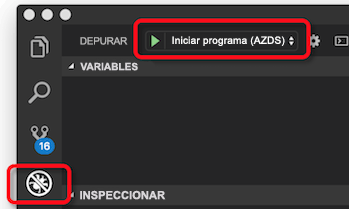

# <a name="how-azure-dev-spaces-works-and-is-configured"></a>Cómo funciona la espacios de desarrollo de Azure y está configurado

Desarrollar una aplicación de Kubernetes puede ser complicado. Necesita los archivos de configuración de Docker y Kubernetes. Deberá averiguar cómo probar su aplicación localmente e interactuar con otros servicios dependientes. Es posible que deba controlar desarrollar y probar en varios servicios a la vez y con un equipo de desarrolladores.

Espacios de desarrollo de Azure le ayuda a desarrollar, implementar y depurar aplicaciones de Kubernetes directamente en Azure Kubernetes Service (AKS). Espacios de desarrollo de Azure también permite que un equipo compartir un espacio de desarrollo. Uso compartido de un espacio de desarrollo en un equipo permite miembros individuales del equipo desarrollar de forma aislada sin tener que replicar ni simular dependencias u otras aplicaciones en el clúster.

Espacios de desarrollo de Azure crea y utiliza un archivo de configuración para implementar, ejecutar y depurar las aplicaciones de Kubernetes en AKS. Este archivo de configuración reside con código de la aplicación y se puede agregar a su sistema de control de versiones.

Este artículo describe los procesos que espacios de desarrollo de Azure power y cómo se configuran los procesos en el archivo de configuración de espacios de desarrollo de Azure. Para obtener los espacios de desarrollo de Azure rápidamente y verlo en la práctica, complete uno de los inicios rápidos:

* [Java con la CLI y el código de Visual Studio](quickstart-java.md)
* [.NET core con la CLI y el código de Visual Studio](quickstart-netcore.md)
* [.NET core con Visual Studio](quickstart-netcore-visualstudio.md)
* [Node.js con la CLI y el código de Visual Studio](quickstart-nodejs.md)

## <a name="how-azure-dev-spaces-works"></a>Funcionamiento de los espacios de desarrollo de Azure

Espacios de desarrollo de Azure tiene dos componentes distintos que interactúa con: el controlador y las herramientas de cliente.


El controlador realiza las acciones siguientes:

* Administra la creación de espacio de desarrollo y de selección.
* Gráfico de Helm de la aplicación se instala y crea objetos de Kubernetes.
* Compila la imagen de contenedor de la aplicación.
* Implemente la aplicación en AKS.
* No las compilaciones incrementales y se reinicia cuando se cambia el código fuente.
* Administra los registros y seguimientos HTTP.
* Reenvía stdout y stderr a las herramientas de cliente.
* Permite que los miembros del equipo crear espacios de desarrollo secundario derivados de un espacio de desarrollo principal.
* Configura el enrutamiento para las aplicaciones dentro de un espacio, así como entre espacios primarios y secundarios.

El controlador se encuentra fuera de AKS. Estos impulsan el comportamiento y la comunicación entre las herramientas de cliente y el clúster de AKS. El controlador se habilita mediante la CLI de Azure al preparar el clúster para usar espacios de desarrollo de Azure. Una vez habilitada, puede interactuar con él mediante las herramientas de cliente.

Las herramientas de cliente permite al usuario:
* Generar un archivo Dockerfile, gráfico de Helm y archivo de configuración de espacios de desarrollo de Azure para la aplicación.
* Crear espacios de desarrollo de primarios y secundarios.
* Indicar el controlador para compilar e iniciar la aplicación.

Mientras se ejecuta la aplicación, el cliente también herramientas:
* Recibe y muestra el stdout y stderr desde la aplicación en AKS.
* Usa [reenvío de puerto](https://kubernetes.io/docs/tasks/access-application-cluster/port-forward-access-application-cluster/) para permitir el acceso web a la aplicación mediante http:\//localhost.
* Asocia a un depurador a la aplicación en ejecución en AKS.
* Se sincroniza el código fuente para el espacio de desarrollo cuando se detecta un cambio para las compilaciones incrementales, lo que permite una iteración rápida.

Puede usar el cliente de herramientas desde la línea de comandos como parte de la `azds` comando. También puede usar el cliente de herramientas con:

* Visual Studio Code mediante la [extensión Azure Dev espacios](https://marketplace.visualstudio.com/items?itemName=azuredevspaces.azds).
* Visual Studio con [Visual Studio Tools para Kubernetes](https://aka.ms/get-vsk8stools).

Este es el flujo básico para configurar y usar espacios de desarrollo de Azure:
1. Preparar el clúster de AKS para espacios de desarrollo de Azure
1. Preparar el código para que se ejecutan en espacios de desarrollo de Azure
1. Ejecutar el código en un espacio de desarrollo
1. Depurar el código en un espacio de desarrollo
1. Compartir un espacio de desarrollo

Trataremos más detalles acerca de cómo funciona Azure Dev espacios en cada una de las siguientes secciones.

## <a name="prepare-your-aks-cluster"></a>Preparar el clúster de AKS

Preparar el clúster de AKS implica:
* Comprobando la AKS clúster está en una región [compatibles con Azure Dev espacios](https://docs.microsoft.com/azure/dev-spaces/#a-rapid,-iterative-kubernetes-development-experience-for-teams).
* Comprobando que ejecutan Kubernetes 1.10.3 o una versión posterior.
* Habilitación de espacios de desarrollo de Azure en el clúster con `az aks use-dev-spaces`

Para obtener más información sobre cómo crear y configurar un clúster de AKS para espacios de desarrollo de Azure, consulte uno de las guías de iniciación:
* [Introducción a espacios de desarrollo de Azure con Java](get-started-java.md)
* [Introducción a espacios de desarrollo de Azure con .NET Core y Visual Studio](get-started-netcore-visualstudio.md)
* [Introducción a espacios de desarrollo de Azure con .NET Core](get-started-netcore.md)
* [Introducción a espacios de desarrollo de Azure con Node.js](get-started-nodejs.md)

Cuando se habilita espacios de desarrollo de Azure en el clúster de AKS, instala el controlador para el clúster. El controlador es un recurso de Azure independiente fuera de su clúster y hace lo siguiente a los recursos del clúster:

* Crea o se designa un espacio de nombres de Kubernetes que se usará como un espacio de desarrollo.
* Quita cualquier espacio de nombres de Kubernetes denominado *azds*, si existe y crea uno nuevo.
* Implementa una configuración de webhook de Kubernetes.
* Implementa un servidor de admisión de webhook.
    

También usa a la misma entidad de servicio que usa el clúster de AKS para realizar llamadas de servicio a otros componentes de espacios de desarrollo de Azure.


Para poder usar espacios de desarrollo de Azure, debe haber al menos un espacio de desarrollo. Espacios de desarrollo de Azure usa los espacios de nombres de Kubernetes dentro del clúster AKS para los espacios de desarrollo. Cuando se instala un controlador, le pedirá que cree un nuevo espacio de nombres de Kubernetes o elija un espacio de nombres existente para usarla como el primer espacio de desarrollo. Cuando un espacio de nombres se designa como un espacio de desarrollo, el controlador agrega el *azds.io/space=true* etiqueta a ese espacio de nombres para identificarlo como un espacio de desarrollo. El espacio de desarrollo inicial, cree o designe está activado de forma predeterminada después de preparar el clúster. Cuando se selecciona un espacio, se usa por espacios del desarrollo de Azure para crear nuevas cargas de trabajo.

De forma predeterminada, el controlador crea un espacio de desarrollo denominado *predeterminada* actualizando existente *predeterminada* espacio de nombres de Kubernetes. Puede usar las herramientas de cliente para crear nuevos espacios de desarrollo y quitar los espacios de desarrollo existentes. Debido a una limitación en Kubernetes, el *predeterminada* no se puede quitar el espacio de desarrollo. El controlador también quita los espacios de nombres de Kubernetes existente denominado *azds* para evitar conflictos con el `azds` comando utilizado por las herramientas de cliente.

El servidor de admisión de webhook de Kubernetes se usa para insertar los pods con tres contenedores durante la implementación para la instrumentación: un contenedor devspaces proxy, un contenedor devspaces-proxy-init y un contenedor de compilación de devspaces. **Tres de estos contenedores se ejecutan con acceso a la raíz en el clúster de AKS.** También usan a la misma entidad de servicio que usa el clúster de AKS para realizar llamadas de servicio a otros componentes de espacios de desarrollo de Azure.


El contenedor de devspaces proxy es un contenedor sidecar que controla todo el tráfico TCP dentro y fuera del contenedor de aplicación y le ayuda a realizar el enrutamiento. El contenedor devspaces proxy redirige los mensajes HTTP si se usan determinados espacios. Por ejemplo, puede ayudar a enrutar los mensajes HTTP entre aplicaciones en espacios primarios y secundarios. Todo el tráfico HTTP que no sean pasa a través de proxy devspaces sin modificar. El contenedor devspaces proxy también registra todos los mensajes HTTP entrantes y salientes y las envía al lado de cliente de herramientas como seguimientos. Estos seguimientos se pueden ver, a continuación, el desarrollador para inspeccionar el comportamiento de la aplicación.

El contenedor devspaces-proxy-init es una [init contenedor](https://kubernetes.io/docs/concepts/workloads/pods/init-containers/) que agrega las reglas de enrutamiento adicionales en función de la jerarquía de espacio en el contenedor de la aplicación. Agrega las reglas de enrutamiento mediante la actualización del contenedor de la aplicación */etc/resolv.conf* iptables y archivos de configuración antes de que comience. Las actualizaciones de */etc/resolv.conf* permitir para la resolución DNS de servicios en los espacios del elemento primario. Las actualizaciones de configuración de iptables, asegúrese de todo el tráfico TCP en y fuera del contenedor de la aplicación se enrutan aunque devspaces proxy. Todas las actualizaciones de devspaces-proxy-init se producen además de las reglas que se agrega de Kubernetes.

El contenedor de compilación de devspaces es un contenedor de init y tiene el código fuente del proyecto y el socket Docker montado. El código fuente del proyecto y el acceso a Docker permite al contenedor de aplicación para que se compile directamente en el pod.

> [!NOTE]
> Espacios de desarrollo de Azure usa el mismo nodo para compilar el contenedor de la aplicación y ejecutarla. Como resultado, los espacios de desarrollo de Azure no es necesario un registro de contenedor externo para compilar y ejecutar la aplicación.

Escucha el servidor de admisión de webhook de Kubernetes para cualquier nuevo pod que se crea en el clúster de AKS. Si se implementa ese pod en cualquier espacio de nombres con el *azds.io/space=true* etiqueta, inserta ese pod con los contenedores adicionales. El contenedor de compilación de devspaces solo se aplica si el contenedor de la aplicación se ejecuta con las herramientas de cliente.

Una vez que haya preparado el clúster de AKS, puede usar las herramientas de cliente para preparar y ejecutar el código en el espacio de desarrollo.

## <a name="prepare-your-code"></a>Preparar el código

Para ejecutar la aplicación en un espacio de desarrollo, debe estar en el contenedor, y deberá definir cómo deben implementarse en Kubernetes. Para incluir la aplicación, necesita un Dockerfile. Para definir cómo se implementa la aplicación en Kubernetes, es necesario un [gráfico de Helm](https://docs.helm.sh/). Para ayudar a crear el archivo Dockerfile y Helm gráfico para la aplicación, las herramientas de cliente proporcionan el `prep` comando:

```cmd
azds prep --public
```

El `prep` comando consultará los archivos en el proyecto y vuelva a crear el gráfico de Dockerfile y Helm para ejecutar la aplicación en Kubernetes. Actualmente, el `prep` comando generará un gráfico de Dockerfile y Helm con los siguientes idiomas:

* Java
* Node.js
* .NET Core

Le *debe* ejecutar el `prep` comando desde un directorio que contiene el código fuente. Ejecuta el `prep` comando desde el directorio correcto permite a las herramientas de cliente identificar el lenguaje y crear un Dockerfile para incluir la aplicación adecuada. También puede ejecutar el `prep` comando desde un directorio que contiene un *pom.xml* archivo para los proyectos de Java.

Si ejecuta el `prep` comando desde el directorio que no contenga código fuente, las herramientas de cliente no generará un archivo Dockerfile. También mostrará un mensaje de error: *No se pudo generar el archivo Dockerfile debido a un idioma no admitido*. Este error también se produce si las herramientas de cliente no reconocen el tipo de proyecto.

Al ejecutar el `prep` comando, tendrá la opción de especificar el `--public` marca. Esta marca indica que el controlador para crear un punto de conexión accesibles desde internet para este servicio. Si no especifica esta marca, el servicio solo es accesible desde dentro del clúster o con el túnel de localhost crean mediante las herramientas de cliente. Puede habilitar o deshabilitar este comportamiento después de ejecutar el `prep` comando actualizando el gráfico de Helm generado.

El `prep` comando no reemplazará cualquier gráficos Dockerfiles o Helm existentes que tiene en su proyecto. Si un gráfico de Dockerfile o Helm existente usa la misma convención de nomenclatura como los archivos generados por el `prep` comando, el `prep` comando omitirá la generación de esos archivos. En caso contrario, el `prep` comando generará su propio Dockerfile o gráfico de Helm junto con los archivos existentes.

El `prep` comando también generará un `azds.yaml` archivo en la raíz del proyecto. Espacios de desarrollo de Azure usa este archivo para compilar, instalar, configurar y ejecutar la aplicación. Este archivo de configuración muestra la ubicación del gráfico Dockerfile y Helm y también proporciona una configuración adicional sobre estos artefactos.

Este es un ejemplo de archivo azds.yaml creado mediante [aplicación de ejemplo de .NET Core](https://github.com/Azure/dev-spaces/tree/master/samples/dotnetcore/getting-started/webfrontend):

```yaml
kind: helm-release
apiVersion: 1.1
build:
  context: .
  dockerfile: Dockerfile
install:
  chart: charts/webfrontend
  values:
  - values.dev.yaml?
  - secrets.dev.yaml?
  set:
    replicaCount: 1
    image:
      repository: webfrontend
      tag: $(tag)
      pullPolicy: Never
    ingress:
      annotations:
        kubernetes.io/ingress.class: traefik-azds
      hosts:
        # This expands to [space.s.][rootSpace.]webfrontend.<random suffix>.<region>.azds.io
        # Customize the public URL by changing the 'webfrontend' text between the $(rootSpacePrefix) and $(hostSuffix) tokens
        # For more information see https://aka.ms/devspaces/routing
        - $(spacePrefix)$(rootSpacePrefix)webfrontend$(hostSuffix)
configurations:
  develop:
    build:
      dockerfile: Dockerfile.develop
      useGitIgnore: true
      args:
        BUILD_CONFIGURATION: ${BUILD_CONFIGURATION:-Debug}
    container:
      sync:
      - "**/Pages/**"
      - "**/Views/**"
      - "**/wwwroot/**"
      - "!**/*.{sln,csproj}"
      command: [dotnet, run, --no-restore, --no-build, --no-launch-profile, -c, "${BUILD_CONFIGURATION:-Debug}"]
      iterate:
        processesToKill: [dotnet, vsdbg]
        buildCommands:
        - [dotnet, build, --no-restore, -c, "${BUILD_CONFIGURATION:-Debug}"]
```

El `azds.yaml` archivo generado por el `prep` comando debería funcionar bien para un escenario de desarrollo del proyecto simple, una sola. Si su proyecto específico ha aumentado la complejidad, es posible que deba actualizar este archivo después de ejecutar el `prep` comando. Por ejemplo, el proyecto puede requerir algunos ajustes a la compilación o iniciar el proceso basado en el desarrollo o la depuración debe. También podría tener varias aplicaciones en el proyecto, que requieren varios procesos de compilación o contenido de una compilación diferente.

## <a name="run-your-code"></a>Ejecutar el código

Para ejecutar el código en un espacio de desarrollo, emita el `up` comando en el mismo directorio que su `azds.yaml` archivo:

```cmd
azds up
```

El `up` comando carga los archivos de origen de la aplicación y otros artefactos necesarios para compilar y ejecutar el proyecto para el espacio de desarrollo. Desde allí, el controlador en el espacio de desarrollo:

1. Crea los objetos de Kubernetes para implementar la aplicación.
1. Crea el contenedor para la aplicación.
1. Implemente la aplicación en el espacio de desarrollo.
1. Crea un nombre DNS públicamente accesible para el punto de conexión de la aplicación si ha configurado.
1. Usa *reenvío de puerto* para proporcionar acceso a su punto de conexión de la aplicación mediante http://locahost.
1. Reenvía stdout y stderr a las herramientas de cliente.


### <a name="starting-a-service"></a>A partir de un servicio

Cuando se inicia un servicio en un espacio de desarrollo, las herramientas de cliente y controlador trabajan conjuntamente para sincronizar los archivos de origen, cree el contenedor y los objetos de Kubernetes y ejecutar la aplicación.

En un nivel más granular, aquí es lo que sucede al ejecutar `azds up`:

1. Los archivos se sincronizan desde el equipo del usuario a un almacenamiento de archivos de Azure que es único para el clúster de AKS del usuario. El código fuente, el gráfico de Helm y los archivos de configuración se cargan. Obtener más detalles sobre el proceso de sincronización están disponibles en la sección siguiente.
1. El controlador crea una solicitud para iniciar una nueva sesión. Esta solicitud contiene varias propiedades, incluido un identificador único, el nombre de espacio, ruta de acceso al código fuente y un indicador de depuración.
1. El controlador de reemplaza el *$(tag)* marcador de posición en el gráfico de Helm con el identificador de sesión único e instala frente del gráfico para el servicio. Agregando que una referencia al identificador de sesión único para el gráfico de Helm permite al contenedor implementado en el clúster de AKS para esta sesión concreta para asociarse a la solicitud de sesión y la información asociada.
1. Durante la instalación del gráfico de Helm, el servidor de admisión de webhook de Kubernetes agrega contenedores adicionales al pod de la aplicación para la instrumentación y el acceso al código fuente de su proyecto. Los contenedores de devspaces-proxy-init y devspaces proxy se agregan para proporcionar el seguimiento de HTTP y el enrutamiento de espacio. El contenedor de compilación de devspaces se agrega para proporcionar el pod con acceso a la instancia de Docker y el código fuente del proyecto para crear el contenedor de la aplicación.
1. Cuando se inicia el pod de la aplicación, el contenedor de compilación de devspaces y el contenedor de devspaces-proxy-init se utilizan para crear el contenedor de la aplicación. A continuación, se inician los contenedores de devspaces proxy y el contenedor de aplicaciones.
1. Una vez iniciado el contenedor de aplicaciones, la funcionalidad del lado cliente utiliza el Kubernetes *reenvío de puerto* funcionalidad para proporcionar acceso HTTP a la aplicación a través de http://localhost. El reenvío de puerto conecta el equipo de desarrollo para el servicio en el espacio de desarrollo.
1. Cuando se hayan iniciado todos los contenedores en el pod, el servicio se está ejecutando. En este momento, la funcionalidad del lado cliente comienza a transmitir el seguimiento HTTP, stdout y stderr. Esta información se muestra la funcionalidad del lado cliente para el desarrollador.

### <a name="updating-a-running-service"></a>Actualizar un servicio en ejecución

Mientras se ejecuta un servicio, espacios de desarrollo de Azure tiene la capacidad de ese servicio de actualización si cambia alguno de los archivos de origen del proyecto. Espacios de desarrollo también controla actualizando el servicio de manera diferente según el tipo de archivo que se modificó. Hay tres maneras de que espacios de desarrollo puede actualizar un servicio en ejecución:

* Actualizar directamente un archivo
* Volver a generar y reiniciar el proceso de la aplicación dentro del contenedor de la aplicación en ejecución
* Volver a generar e implementar el contenedor de la aplicación


Determinados archivos de proyecto que son recursos estáticos, como html, css y archivos cshtml, se pueden actualizar directamente en el contenedor de la aplicación sin tener que reiniciar nada. Si cambia un recurso estático, el nuevo archivo se sincronizan con el espacio de desarrollo y, a continuación, usa el contenedor en ejecución.

Reiniciando el proceso de la aplicación dentro del contenedor en ejecución, se pueden aplicar los cambios realizados en archivos como código fuente o los archivos de configuración de aplicación. Una vez que estos archivos se sincronizan, el proceso de la aplicación se reinicia en el contenedor en ejecución mediante el *devhostagent* proceso. Al crear inicialmente el contenedor de la aplicación, el controlador reemplaza el comando de inicio de la aplicación con un proceso diferente denominado *devhostagent*. Proceso real de la aplicación, a continuación, se ejecuta como un proceso secundario bajo *devhostagent*, y su salida se canalice mediante *devhostagent*de salida de. El *devhostagent* proceso también forma parte de los espacios de desarrollo y se puede ejecutar comandos en el contenedor en ejecución en nombre de espacios de desarrollo. Al realizar un reinicio, *devhostagent*:

* Detiene el proceso actual o los procesos asociados con la aplicación
* Vuelve a generar la aplicación
* Reinicia el proceso o procesos asociados con la aplicación

La manera *devhostagent* ejecuta los anteriores pasos se configura en el `azds.yaml` archivo de configuración. Esta configuración se detalla en una sección posterior.

Actualizaciones de archivos de proyecto como archivos Dockerfile, archivos csproj o cualquier parte del gráfico de Helm requieren el contenedor de la aplicación se vuelve a generar y volver a implementar. Cuando uno de estos archivos se sincroniza con el espacio de desarrollo, el controlador se ejecuta el [actualización de helm](https://helm.sh/docs/helm/#helm-upgrade) comando y el contenedor de la aplicación se vuelve a generar y volver a implementar.

### <a name="file-synchronization"></a>Sincronización de archivos

La primera vez que se inicia una aplicación en un espacio de desarrollo, se cargan los archivos de código fuente de toda la aplicación. Mientras se ejecuta la aplicación y en los reinicios posteriores, se cargan solamente los archivos cambiados. Para coordinar este proceso utiliza dos archivos: un archivo de cliente y un controlador de archivo.

El archivo de cliente se almacena en un directorio temporal y se denomina según un valor hash del directorio del proyecto que se ejecuta en espacios de desarrollo. Por ejemplo, en Windows tendría un archivo como *Users\USERNAME\AppData\Local\Temp\1234567890abcdef1234567890abcdef1234567890abcdef1234567890abcdef.synclog* para el proyecto. En Linux, el archivo de cliente se almacena en el */tmp* directory. Puede encontrar el directorio en macOS mediante la ejecución de la `echo $TMPDIR` comando.

Este archivo está en formato JSON y contiene:

* Una entrada para cada archivo de proyecto que se sincroniza con el espacio de desarrollo
* Un identificador de sincronización
* La marca de tiempo de la última operación de sincronización

Cada entrada del archivo de proyecto contiene una ruta de acceso al archivo y su marca de tiempo.

El archivo en el controlador se almacena en el clúster de AKS. Contiene el identificador de la sincronización y la marca de tiempo de la última sincronización.

Una sincronización se produce cuando no coinciden entre el cliente y los archivos de controlador de lado las marcas de tiempo de sincronización. Durante una sincronización, las herramientas de cliente recorre en iteración las entradas del archivo en el archivo del lado cliente. Si la marca de tiempo del archivo es posterior a la marca de tiempo de sincronización, ese archivo se sincroniza con el espacio de desarrollo. Una vez completada la sincronización, se actualizan las marcas de tiempo de sincronización en los archivos de cliente y el controlador.

Todos los archivos de proyecto se sincronizan si el archivo del lado cliente no está presente. Este comportamiento permite forzar una sincronización completa eliminando el archivo del lado cliente.

### <a name="how-routing-works"></a>Cómo funciona el enrutamiento

Un espacio de desarrollo se basa en AKS y usa la misma [conceptos de redes](../aks/concepts-network.md). Espacios de desarrollo de Azure también tiene un centralizada *ingressmanager* de servicio e implementa su propio controlador de entrada para el clúster de AKS. El *ingressmanager* monitores AKS clústeres con espacios de desarrollo y aumenta el controlador de entrada de espacios de desarrollo de Azure en el clúster con los objetos de entrada para el enrutamiento para los pods de aplicación de servicio. El contenedor devspaces proxy en cada pod agrega un `azds-route-as` encabezado HTTP para el tráfico HTTP a un espacio de desarrollo según la dirección URL. Por ejemplo, una solicitud a la dirección URL *http://azureuser.s.default.serviceA.fedcba09...azds.io* obtendría un encabezado HTTP con `azds-route-as: azureuser`. El contenedor devspaces proxy no agregará un `azds-route-as` encabezado si ya hay alguno.

Cuando se realiza una solicitud HTTP a un servicio desde fuera del clúster, la solicitud se pasa al controlador de entrada. El controlador de entrada enruta la solicitud directamente en el pod adecuado en función de sus objetos de entrada y reglas. El contenedor devspaces proxy en el pod recibe la solicitud, se agrega el `azds-route-as` encabezado según la dirección URL y, a continuación, enruta la solicitud en el contenedor de la aplicación.

Cuando se realiza una solicitud HTTP a un servicio de otro servicio en el clúster, la solicitud se pasa primero por contenedor de devspaces proxy del servicio que realiza la llamada. El contenedor proxy devspaces examina la solicitud HTTP y comprueba el `azds-route-as` encabezado. En función del encabezado, el contenedor proxy devspaces buscará la dirección IP del servicio asociado con el valor del encabezado. Si se encuentra una dirección IP, el contenedor devspaces proxy redirige la solicitud a esa dirección IP. Si no se encuentra una dirección IP, el contenedor devspaces proxy enruta la solicitud para el contenedor de la aplicación principal.

Por ejemplo, las aplicaciones *serviceA* y *serviceB* se implementan en un espacio de desarrollo primario denominado *predeterminada*. *serviceA* se basa en *serviceB* y realiza llamadas HTTP a ella. Usuario de Azure crea un espacio de desarrollo secundarios según el *predeterminada* espacio llamado *azureuser*. Usuario de Azure también implementa su propia versión de *serviceA* a su espacio de secundarios. Cuando se realiza una solicitud a *http://azureuser.s.default.serviceA.fedcba09...azds.io*:


1. Busca la dirección IP para el pod asociado con la dirección URL, que es el controlador de entrada *serviceA.azureuser*.
1. El controlador de entrada, busca la dirección IP para el pod en el espacio de desarrollo del usuario de Azure y enruta la solicitud a la *serviceA.azureuser* pod.
1. El contenedor devspaces proxy en el *serviceA.azureuser* pod recibe la solicitud y agrega `azds-route-as: azureuser` como un encabezado HTTP.
1. El contenedor devspaces proxy en el *serviceA.azureuser* pod enruta la solicitud a la *serviceA* contenedor aplicaciones en la *serviceA.azureuser* pod.
1. El *serviceA* aplicación en el *serviceA.azureuser* pod realiza una llamada a *serviceB*. El *serviceA* aplicación también contiene código para conservar la existente `azds-route-as` encabezado, que en este caso es `azds-route-as: azureuser`.
1. El contenedor devspaces proxy en el *serviceA.azureuser* pod recibe la solicitud y busca la dirección IP de *serviceB* según el valor de la `azds-route-as` encabezado.
1. El contenedor devspaces proxy en el *serviceA.azureuser* pod no encuentra una dirección IP para *serviceB.azureuser*.
1. El contenedor devspaces proxy en el *serviceA.azureuser* busca la dirección IP de pod *serviceB* en el espacio primario, que es *serviceB.default*.
1. El contenedor devspaces proxy en el *serviceA.azureuser* pod busca la dirección IP para *serviceB.default* y enruta la solicitud a la *serviceB.default* pod.
1. El contenedor devspaces proxy en el *serviceB.default* pod recibe la solicitud y enruta la solicitud a la *serviceB* contenedor aplicaciones en la *serviceB.default*pod.
1. El *serviceB* aplicación en el *serviceB.default* pod devuelve una respuesta a la *serviceA.azureuser* pod.
1. El contenedor devspaces proxy en el *serviceA.azureuser* pod recibe la respuesta y enruta la respuesta a la *serviceA* contenedor aplicaciones en la *serviceA.azureuser* pod.
1. El *serviceA* aplicación recibe la respuesta y, a continuación, devuelve su propia respuesta.
1. El contenedor devspaces proxy en el *serviceA.azureuser* pod recibe la respuesta de la *serviceA* contenedor de aplicaciones y los enruta la respuesta al llamador original fuera del clúster.

Todos los demás el tráfico TCP que no es HTTP pasa a través del controlador de entrada y los contenedores devspaces proxy sin modificar.

### <a name="how-running-your-code-is-configured"></a>Cómo se configura la ejecución del código

Espacios de desarrollo de Azure usa el `azds.yaml` archivo para instalar y configurar el servicio. Utiliza el controlador del `install` propiedad en el `azds.yaml` archivo para instalar el gráfico de Helm y crear los objetos de Kubernetes:

```yaml
...
install:
  chart: charts/webfrontend
  values:
  - values.dev.yaml?
  - secrets.dev.yaml?
  set:
    replicaCount: 1
    image:
      repository: webfrontend
      tag: $(tag)
      pullPolicy: Never
    ingress:
      annotations:
        kubernetes.io/ingress.class: traefik-azds
      hosts:
      # This expands to [space.s.][rootSpace.]webfrontend.<random suffix>.<region>.azds.io
      # Customize the public URL by changing the 'webfrontend' text between the $(rootSpacePrefix) and $(hostSuffix) tokens
      # For more information see https://aka.ms/devspaces/routing
      - $(spacePrefix)$(rootSpacePrefix)webfrontend$(hostSuffix)
...
```

De forma predeterminada, el `prep` comando generará el gráfico de Helm. También establece la *install.chart* propiedad en el directorio del gráfico de Helm. Si desea utilizar un gráfico de Helm en una ubicación diferente, puede actualizar esta propiedad para utilizar esa ubicación.

Al instalar los gráficos de Helm, espacios de desarrollo de Azure proporciona una forma de reemplazar los valores en el gráfico de Helm. Son los valores predeterminados para el gráfico de Helm en `charts/APP_NAME/values.yaml`.

Mediante el *install.values* propiedad, puede enumerar uno o varios archivos que definen los valores que desee reemplazar en el gráfico de Helm. Por ejemplo, si deseara una configuración de nombre de host o la base de datos en concreto cuando se ejecuta la aplicación en un espacio de desarrollo, puede usar esta funcionalidad de reemplazo. ¿También puede agregar un *?* al final de cualquiera de los nombres de archivo para establecerla como opcional.

El *install.set* propiedad le permite configurar uno o varios de los valores que desee reemplazado en el gráfico de Helm. Los valores configurados en *install.set* invalidará los valores configurados en los archivos enumerados en *install.values*. Las propiedades en *install.set* dependen de los valores en el gráfico de Helm y pueden variar según el gráfico de Helm generado.

En el ejemplo anterior, el *install.set.replicaCount* propiedad indica el controlador de número de instancias de la aplicación se ejecute en el espacio de desarrollo. Según el escenario, puede aumentar este valor, pero tendrán un impacto en asociar a un depurador al pod de la aplicación. Para obtener más información, consulte el [artículo de solución de problemas](troubleshooting.md).

En el gráfico de Helm generado, se establece la imagen de contenedor en *{{. Values.Image.Repository}} :{{. Values.Image.Tag}}*. El `azds.yaml` archivo define *install.set.image.tag* propiedad como *$(tag)* de forma predeterminada, que se usa como el valor de *{{. Values.Image.Tag}}*. Estableciendo el *install.set.image.tag* propiedad de este modo, permite la imagen de contenedor para la aplicación se etiqueten de una manera distinta cuando se ejecuta espacios de desarrollo de Azure. En este caso, la imagen está etiquetada como  *\<valor desde image.repository >: $(tag)*. Debe usar el *$(tag)* variable como el valor de *install.set.image.tag* en orden para los espacios de desarrollo, reconocer y busque el contenedor en el clúster de AKS.

En el ejemplo anterior, `azds.yaml` define *install.set.ingress.hosts*. El *install.set.ingress.hosts* propiedad define un formato de nombre de host para los puntos de conexión públicos. Esta propiedad también usa *$(spacePrefix)*, *$(rootSpacePrefix)*, y *$(hostSuffix)*, que son los valores proporcionados por el controlador. 

El *$(spacePrefix)* es el nombre del espacio de desarrollo secundarios, que adopta la forma de *SPACENAME.s*. El *$(rootSpacePrefix)* es el nombre del espacio primario. Por ejemplo, si *azureuser* es un espacio de secundarios de *predeterminada*, el valor de *$(rootSpacePrefix)* es *predeterminada* y el valor de *$(spacePrefix)* es *azureuser.s*. Si el espacio no es un espacio de secundarios *$(spacePrefix)* está en blanco. Por ejemplo, si la *predeterminada* espacio no tiene ningún espacio primario, el valor de *$(rootSpacePrefix)* es *predeterminada* y el valor de *$(spacePrefix)* está en blanco. El *$(hostSuffix)* es un sufijo DNS que señala el controlador de entrada de espacios de desarrollo de Azure que se ejecuta en el clúster de AKS. Este sufijo DNS corresponde a una entrada DNS de carácter comodín, por ejemplo  *\*. RANDOM_VALUE.eus.azds.IO*, que se creó cuando se agregó el controlador de espacios de desarrollo de Azure en el clúster de AKS.

En la fórmula anterior `azds.yaml` archivo, también podría actualizar *install.set.ingress.hosts* para cambiar el nombre de host de la aplicación. Por ejemplo, si quisiera simplificar el nombre de host de la aplicación de *$(spacePrefix)$(rootSpacePrefix)webfrontend$(hostSuffix)* a *$(spacePrefix)$(rootSpacePrefix)web$(hostSuffix)*.

Para crear el contenedor para la aplicación, se usa el controlador de la siguientes secciones de la `azds.yaml` archivo de configuración:

```yaml
build:
  context: .
  dockerfile: Dockerfile
...
configurations:
  develop:
    build:
      dockerfile: Dockerfile.develop
      useGitIgnore: true
      args:
        BUILD_CONFIGURATION: ${BUILD_CONFIGURATION:-Debug}
...
```

El controlador usa un Dockerfile para compilar y ejecutar la aplicación.

El *build.context* el directorio donde existe el Dockerfiles listas de propiedades. El *build.dockerfile* propiedad define el nombre del Dockerfile para compilar la versión de producción de la aplicación. El *configurations.develop.build.dockerfile* propiedad configura el nombre del Dockerfile para la versión de desarrollo de la aplicación.

Tener diferentes Dockerfiles para desarrollo y producción le permite habilitar ciertas cosas durante el desarrollo y deshabilitar los elementos para las implementaciones de producción. Por ejemplo, puede habilitar el registro más detallado durante el desarrollo y disable en un entorno de producción o depuración. También puede actualizar estas propiedades si los archivos de Docker con nombres diferentes o están en una ubicación diferente.

Para ayudarle a iterar rápidamente durante el desarrollo, espacios de desarrollo de Azure se sincroniza los cambios de su proyecto local y actualizar incrementalmente la aplicación. La siguiente sección en la `azds.yaml` archivo de configuración se utiliza para configurar la sincronización y actualizar:

```yaml
...
configurations:
  develop:
    ...
    container:
      sync:
      - "**/Pages/**"
      - "**/Views/**"
      - "**/wwwroot/**"
      - "!**/*.{sln,csproj}"
      command: [dotnet, run, --no-restore, --no-build, --no-launch-profile, -c, "${BUILD_CONFIGURATION:-Debug}"]
      iterate:
        processesToKill: [dotnet, vsdbg]
        buildCommands:
        - [dotnet, build, --no-restore, -c, "${BUILD_CONFIGURATION:-Debug}"]
...
```

Los archivos y directorios que se sincronizarán los cambios aparecen en la *configurations.develop.container.sync* propiedad. Estos directorios se sincronizan inicialmente cuando se ejecuta el `up` comando, así como cuando se detectan cambios. Si hay diferentes o adicionales los directorios que desea que se sincronizarán con su espacio de desarrollo, puede cambiar esta propiedad.

El *configurations.develop.container.iterate.buildCommands* propiedad especifica la forma de compilar la aplicación en un escenario de desarrollo. El *configurations.develop.container.command* propiedad proporciona el comando para ejecutar la aplicación en un escenario de desarrollo. Puede actualizar cualquiera de estas propiedades, si no hay marcas adicionales de compilación o en tiempo de ejecución o los parámetros que le gustaría usar durante el desarrollo.

El *configurations.develop.container.iterate.processesToKill* enumera los procesos que se va a eliminar para detener la aplicación. Es posible que desee actualizar esta propiedad si desea cambiar el comportamiento de reinicio de la aplicación durante el desarrollo. Por ejemplo, si ha actualizado el *configurations.develop.container.iterate.buildCommands* o *configurations.develop.container.command* propiedades para cambiar cómo se compila la aplicación o iniciado, es posible que deba cambiar qué procesos se detienen.

Al preparar el código utilizando la `azds prep` comando, tendrá la opción de agregar el `--public` marca. Agregar el `--public` marca crea una dirección URL accesible públicamente para su aplicación. Si se omite esta marca, la aplicación está accesible únicamente en el clúster o mediante el túnel de localhost. Después de ejecutar el `azds prep` de comandos, puede cambiar este valor modificando el *ingress.enabled* propiedad `charts/APPNAME/values.yaml`:

```yaml
ingress:
  enabled: true
```

## <a name="debug-your-code"></a>Depurar el código

Para las aplicaciones de Java, .NET y Node.js, puede depurar la aplicación que se ejecuta directamente en el espacio de desarrollo con Visual Studio Code o Visual Studio. Visual Studio Code y Visual Studio proporcionan herramientas para conectarse a su espacio de desarrollo, inicie la aplicación y adjuntar a un depurador. Después de ejecutar `azds prep`, puede abrir el proyecto en Visual Studio Code o Visual Studio. Visual Studio Code o Visual Studio generará sus propios archivos de configuración para la conexión que son independientes de ejecución `azds prep`. Desde dentro de Visual Studio Code o Visual Studio, puede establecer puntos de interrupción e iniciar la aplicación en su espacio de desarrollo.



Al iniciar la aplicación mediante Visual Studio Code o Visual Studio para la depuración, controlan y la conexión en el espacio de desarrollo de la misma manera como en ejecución `azds up`. Las herramientas de cliente en Visual Studio Code y Visual Studio también proporcionan un parámetro adicional con información específica para la depuración. El parámetro contiene el nombre de imagen de depurador, la ubicación del depurador dentro de la imagen del depurador y la ubicación de destino dentro del contenedor de la aplicación para montar la carpeta del depurador. 

La imagen de depurador se determina automáticamente las herramientas de cliente. Usa un método similar al utilizado durante el Dockerfile y gráfico de Helm generar cuando se ejecuta `azds prep`. Después de que el depurador está montado en la imagen de la aplicación, se ejecuta con `azds exec`.

## <a name="sharing-a-dev-space"></a>Uso compartido de un espacio de desarrollo

Cuando se trabaja con un equipo, puede [compartir un espacio de desarrollo en un equipo completo](how-to/share-dev-spaces.md) y crear desarrollo derivada espacios. Cualquier persona con acceso de colaborador al grupo de recursos del espacio de desarrollo, se puede usar un espacio de desarrollo.

También puede crear un nuevo espacio de desarrollo que se deriva de otro espacio de desarrollo. Cuando se crea un espacio de desarrollo derivada el *azds.io/primario-espacio = nombre de espacio primario* etiqueta se agrega al espacio de nombres del espacio de desarrollo derivada. Además, todas las aplicaciones desde el espacio de desarrollo primario se comparten con el espacio de desarrollo derivada. Si implementa una versión actualizada de una aplicación en el espacio de desarrollo derivadas, sólo existirá en el espacio de desarrollo derivada y el espacio de desarrollo principal no se ven afectado. Puede tener un máximo de tres niveles de espacios de desarrollo derivada o *primario principal* espacios.

El espacio de desarrollo derivada también inteligentemente enrutará las solicitudes entre sus propias aplicaciones y las aplicaciones compartidas de su elemento primario. El enrutamiento funciona al intentar enrutar la solicitud a una aplicación en el espacio de desarrollo derivada y revirtiendo a la aplicación compartida desde el espacio de desarrollo principal. El enrutamiento se revertirá a la aplicación compartida en el espacio del primario principal si la aplicación no está en el espacio del elemento primario.

Por ejemplo:
* El espacio de desarrollo *predeterminada* tiene aplicaciones *serviceA* y *serviceB* .
* El espacio de desarrollo *azureuser* se deriva de *predeterminada*.
* Una versión actualizada de *serviceA* se implementa en *azureuser*.

Cuando se usa *azureuser*, todas las solicitudes a *serviceA* se enrutará a la versión actualizada en *azureuser*. Una solicitud para *serviceB* intentará primero enrutarse a la *azureuser* verzi *serviceB*. Puesto que no existe, se enrutará a la *predeterminada* verzi *serviceB*. Si el *azureuser* verzi *serviceA* se quita, todas las solicitudes a *serviceA* recurrirá uso de la *predeterminada* versión de *serviceA*.

## <a name="next-steps"></a>Pasos siguientes

Para empezar a trabajar con espacios de desarrollo de Azure, vea los siguientes tutoriales:

* [Java con la CLI y el código de Visual Studio](quickstart-java.md)
* [.NET core con la CLI y el código de Visual Studio](quickstart-netcore.md)
* [.NET core con Visual Studio](quickstart-netcore-visualstudio.md)
* [Node.js con la CLI y el código de Visual Studio](quickstart-nodejs.md)

Para empezar a trabajar con el desarrollo en equipo, consulte los artículos de procedimientos siguientes:

* [Desarrollo en equipo - Java con la CLI y el código de Visual Studio](team-development-java.md)
* [Desarrollo en equipo - .NET Core con la CLI y el código de Visual Studio](team-development-netcore.md)
* [Desarrollo en equipo - .NET Core con Visual Studio](team-development-netcore-visualstudio.md)
* [Desarrollo en equipo - Node.js con la CLI y el código de Visual Studio](team-development-nodejs.md)
