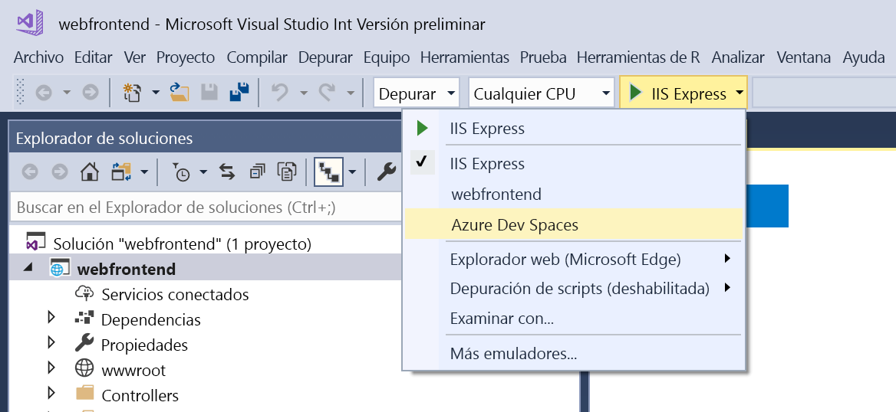

# Uso compartido de Azure Dev Spaces

Con Azure Dev Spaces, puede compartir el espacio de desarrollo con otras personas de su equipo. Cada programador puede trabajar en su propio espacio sin riesgo de interrumpir a los demás. Además, trabajar en conjunto en un solo espacio puede permitirle probar código de un extremo a otro sin tener que crear objetos ficticios ni simular dependencias. Consulte la guía de [información sobre el desarrollo en equipo](../team-development-nodejs.md) para obtener más información.

## Configuración de un espacio de desarrollo para varios desarrolladores

1. Cree una instancia de Dev Space en Azure. Elija [.NET Core y VS Code](../get-started-netcore.md), [.NET Core y Visual Studio](../get-started-netcore-visualstudio.md) o [Node.js y VS Code](../get-started-nodejs.md). Debe tener acceso de propietario o colaborador a la suscripción de Azure seleccionada.
1. Configure el **grupo de recursos** del espacio de Azure Dev Spaces para [conceder acceso de colaborador](/azure/active-directory/role-based-access-control-configure) a cada miembro del equipo. Puede comprobar el grupo de recursos de un espacio de desarrollo mediante la ejecución de este comando: `azds list-up`
1. Pida a los miembros del equipo que **seleccionen el espacio de desarrollo** para desarrollar en él.
     * **Línea de comandos o VS Code**: para ver los espacios de Azure Dev Spaces existentes a los que tiene acceso: `azds space list`. Para seleccionar un espacio de desarrollo: `azds space select`.
     * **IDE de Visual Studio**: abra un proyecto en Visual Studio y seleccione **Azure Dev Spaces** en la lista desplegable de configuración de inicio. En el cuadro de diálogo que se abre, seleccione un clúster existente.

    

## Pasos siguientes

Consulte sobre el [desarrollo en equipo](../team-development-nodejs.md) para más información.