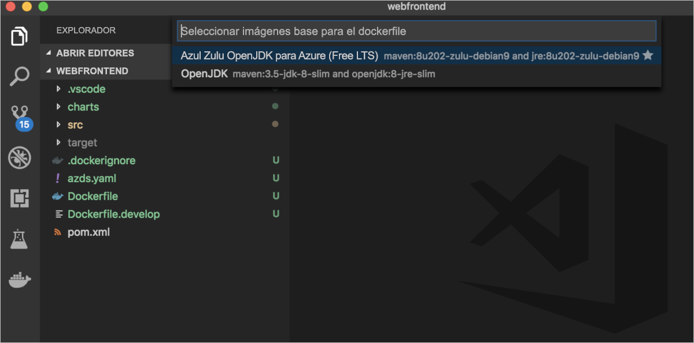
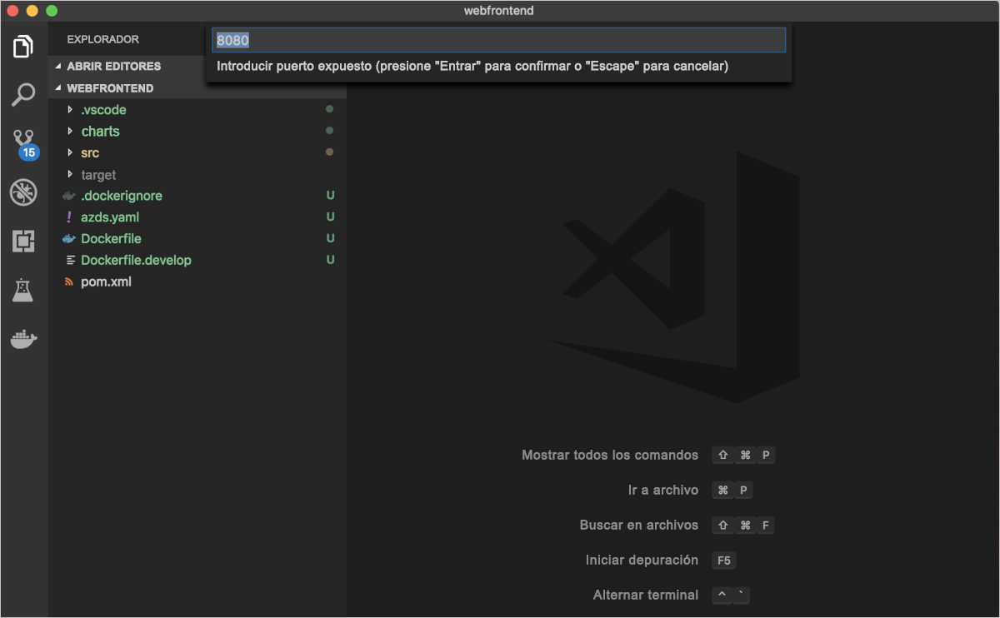

# <a name="quickstart-develop-with-java-on-kubernetes-using-azure-dev-spaces"></a>Inicio rápido: Desarrollo con Java en Kubernetes con Azure Dev Spaces

En esta guía, aprenderá a:

- Configurar Azure Dev Spaces con un clúster de Kubernetes administrado en Azure.
- Desarrollar código de forma iterativa en contenedores con Visual Studio Code y la línea de comandos.
- Depurar el código en el espacio de desarrollo de Visual Studio Code.


## <a name="prerequisites"></a>Requisitos previos

- Una suscripción de Azure. En caso de no tener ninguna, puede crear una [cuenta gratuita](https://azure.microsoft.com/free).
- [Tener Visual Studio Code instalado](https://code.visualstudio.com/download).
- Tener las extensiones [Azure Dev Spaces](https://marketplace.visualstudio.com/items?itemName=azuredevspaces.azds) y [Depurador de Java para Azure Dev Spaces](https://marketplace.visualstudio.com/items?itemName=vscjava.vscode-java-debugger-azds) instaladas para Visual Studio Code.
- [La CLI de Azure instalada](/cli/azure/install-azure-cli?view=azure-cli-latest).
- [Tener Maven instalado y configurado](https://maven.apache.org).

## <a name="create-an-azure-kubernetes-service-cluster"></a>Creación de un clúster de Azure Kubernetes Service

Debe crear un clúster de AKS en una [región admitida][supported-regions]. Los siguientes comandos permiten crear un grupo de recursos llamado *MyResourceGroup* y un clúster de AKS denominado *MyAKS*.

```cmd
az group create --name MyResourceGroup --location eastus
az aks create -g MyResourceGroup -n MyAKS --location eastus --node-vm-size Standard_DS2_v2 --node-count 1 --disable-rbac --generate-ssh-keys
```

## <a name="enable-azure-dev-spaces-on-your-aks-cluster"></a>Habilitar Azure Dev Spaces en el clúster de AKS

Use el comando `use-dev-spaces` para habilitar Dev Spaces en el clúster de AKS y siga las indicaciones. El siguiente comando permite habilitar Dev Spaces en el clúster *MyAKS* del grupo *MyResourceGroup* y crea un espacio de desarrollo *predeterminado*.

```cmd
$ az aks use-dev-spaces -g MyResourceGroup -n MyAKS

'An Azure Dev Spaces Controller' will be created that targets resource 'MyAKS' in resource group 'MyResourceGroup'. Continue? (y/N): y

Creating and selecting Azure Dev Spaces Controller 'MyAKS' in resource group 'MyResourceGroup' that targets resource 'MyAKS' in resource group 'MyResourceGroup'...2m 24s

Select a dev space or Kubernetes namespace to use as a dev space.
 [1] default
Type a number or a new name: 1

Kubernetes namespace 'default' will be configured as a dev space. This will enable Azure Dev Spaces instrumentation for new workloads in the namespace. Continue? (Y/n): Y

Configuring and selecting dev space 'default'...3s

Managed Kubernetes cluster 'MyAKS' in resource group 'MyResourceGroup' is ready for development in dev space 'default'. Type `azds prep` to prepare a source directory for use with Azure Dev Spaces and `azds up` to run.
```

## <a name="get-sample-application-code"></a>Obtención del código de la aplicación de ejemplo

En este artículo, puede usar la [aplicación de ejemplo de Azure Dev Spaces](https://github.com/Azure/dev-spaces) para demostrar el uso de Azure Dev Spaces.

Clone la aplicación desde GitHub y vaya al directorio *dev-spaces/samples/java/getting-started/webfrontend*:

```cmd
git clone https://github.com/Azure/dev-spaces
cd dev-spaces/samples/java/getting-started/webfrontend
```

## <a name="prepare-the-application"></a>Preparar la aplicación

Genere los recursos de Docker y del gráfico de Helm para ejecutar la aplicación en Kubernetes mediante el comando `azds prep`:

```cmd
azds prep --public
```

Debe ejecutar el comando `prep` desde el directorio *dev-spaces/samples/java/getting-started/webfrontend* para generar correctamente los recursos de Docker y del gráfico de Helm.

## <a name="build-and-run-code-in-kubernetes"></a>Compilación y ejecución de código en Kubernetes

Compile y ejecute el código en AKS mediante el comando `azds up`:

```cmd
$ azds up
Using dev space 'default' with target 'MyAKS'
Synchronizing files...3s
Installing Helm chart...8s
Waiting for container image build...28s
Building container image...
Step 1/8 : FROM maven:3.5-jdk-8-slim
Step 2/8 : EXPOSE 8080
Step 3/8 : WORKDIR /usr/src/app
Step 4/8 : COPY pom.xml ./
Step 5/8 : RUN /usr/local/bin/mvn-entrypoint.sh     mvn package -Dmaven.test.skip=true -Dcheckstyle.skip=true -Dmaven.javadoc.skip=true --fail-never
Step 6/8 : COPY . .
Step 7/8 : RUN mvn package -Dmaven.test.skip=true -Dcheckstyle.skip=true -Dmaven.javadoc.skip=true
Step 8/8 : ENTRYPOINT ["java","-jar","target/webfrontend-0.1.0.jar"]
Built container image in 37s
Waiting for container...57s
Service 'webfrontend' port 'http' is available at http://webfrontend.1234567890abcdef1234.eus.azds.io/
Service 'webfrontend' port 80 (http) is available at http://localhost:54256
...
```

Para ver el servicio que se está ejecutando, abra la dirección URL pública que aparece en la salida del comando `azds up`. En este ejemplo, la dirección URL pública es *http://webfrontend.1234567890abcdef1234.eus.azds.io/* .

Si detiene el comando `azds up` mediante *Ctrl + c*, el servicio continuará ejecutándose en AKS y la dirección URL pública seguirá estando disponible.

## <a name="update-code"></a>Actualización del código

Para implementar una versión actualizada del servicio, puede actualizar cualquier archivo del proyecto y volver a ejecutar el comando `azds up`. Por ejemplo:

1. Si `azds up` se está todavía ejecutando, presione *Ctrl + c*.
1. Actualice la [línea 19 en `src/main/java/com/ms/sample/webfrontend/Application.java`](https://github.com/Azure/dev-spaces/blob/master/samples/java/getting-started/webfrontend/src/main/java/com/ms/sample/webfrontend/Application.java#L19) a:
    
    ```java
    return "Hello from webfrontend in Azure!";
    ```

1. Guarde los cambios.
1. Vuelva a ejecutar el comando `azds up`:

    ```cmd
    $ azds up
    Using dev space 'default' with target 'MyAKS'
    Synchronizing files...1s
    Installing Helm chart...3s
    Waiting for container image build...
    ...    
    ```

1. Vaya al servicio en ejecución y observe los cambios.
1. Presione *Ctrl + C* para detener el comando `azds up`.

## <a name="enable-visual-studio-code-to-debug-in-kubernetes"></a>Habilitar Visual Studio Code para depurar en Kubernetes

Abra Visual Studio Code, haga clic en *Archivo*, *Abrir...*  y vaya al directorio *dev-spaces/samples/java/getting-started/webfrontend* y haga clic en *Abrir*.

Ahora ya tiene el proyecto *webfrontend* abierto en Visual Studio Code, que es el mismo servicio que ejecutó mediante el comando `azds up`. Para depurar este servicio en AKS mediante Visual Studio Code, en lugar de usar `azds up` directamente, debe preparar este proyecto para usar Visual Studio Code para comunicarse con su espacio de desarrollo.

Para abrir la paleta de comandos en Visual Studio Code, haga clic en *Ver* y en *Paleta de comandos*. Empiece a escribir `Azure Dev Spaces` y haga clic en `Azure Dev Spaces: Prepare configuration files for Azure Dev Spaces`.


Cuando Visual Studio Code le solicite que configure sus imágenes base y el puerto expuesto, elija `Azul Zulu OpenJDK for Azure (Free LTS)` como imagen base y `8080` como puerto expuesto.





Este comando prepara el proyecto para que se ejecute directamente en Azure Dev Spaces desde Visual Studio Code. También genera un directorio *.vscode* con la configuración de depuración en la raíz del proyecto.

## <a name="build-and-run-code-in-kubernetes-from-visual-studio"></a>Compilación y ejecución de código en Kubernetes desde Visual Studio

Haga clic en el icono *Depurar* situado a la izquierda y haga clic en *Launch Java Program (AZDS)* [Iniciar programa Java (AZDS)] en la parte superior.


Este comando compila y ejecuta el servicio en Azure Dev Spaces en modo de depuración. La ventana *Terminal* situada en la parte inferior muestra la salida y las direcciones URL de la compilación para el servicio que ejecuta Azure Dev Spaces. La *consola de depuración* muestra la salida del registro.

> [!Note]
> Si no ve ningún comando de Azure Dev Spaces en la *paleta de comandos*, asegúrese de que ha instalado la extensión de [Visual Studio Code para Azure Dev Spaces](https://marketplace.visualstudio.com/items?itemName=azuredevspaces.azds). Compruebe también que ha abierto el directorio *dev-spaces/samples/java/getting-started/webfrontend* en Visual Studio Code.

Haga clic en *Depurar* y en *Detener depuración* para detener el depurador.

## <a name="setting-and-using-breakpoints-for-debugging"></a>Establecimiento y uso de puntos de interrupción para la depuración

Inicie el servicio en el modo de depuración mediante *Launch Java Program (AZDS)* [Iniciar programa Java (AZDS)].

Vaya a la vista *Explorer*. Para ello haga clic en *Ver* y en *Explorer*. Abra `src/main/java/com/ms/sample/webfrontend/Application.java` y haga clic en algún lugar de la línea 19 para colocar ahí el cursor. Para establecer un punto de interrupción, pulse *F9* o haga clic en *Depurar* y en *Alternar punto de interrupción*.

Abra el servicio en un explorador y observe que no se muestra ningún mensaje. Vuelva a Visual Studio Code y observe que la línea 19 está resaltada. El punto de interrupción que estableció pausó el servicio en la línea 19. Para reanudar el servicio, pulse *F5* o haga clic en *Depurar* y en *Continuar*. Regrese al explorador y observe que ahora se muestra el mensaje.

Mientras se ejecuta el servicio en Kubernetes con un depurador asociado, tiene acceso completo a la información de depuración como, por ejemplo, la de la pila de llamadas, las variables locales y la información de excepciones.

Quite el punto de interrupción colocando el cursor en la línea 19 en `src/main/java/com/ms/sample/webfrontend/Application.java` y pulsando *F9*.

## <a name="update-code-from-visual-studio-code"></a>Actualización del código de Visual Studio Code

Mientras el servicio se ejecuta en modo de depuración, actualice la línea 19 en `src/main/java/com/ms/sample/webfrontend/Application.java`. Por ejemplo:
```java
return "Hello from webfrontend in Azure while debugging!";
```

Guarde el archivo. Haga clic en *Depurar* y en *Reiniciar depuración* o en la *barra de herramientas de depuración*, haga clic en el botón *Reiniciar depuración*.


Abra el servicio en un explorador y observe que se muestra el mensaje actualizado.

En lugar de volver a crear e implementar una nueva imagen de contenedor cada vez que se realizan modificaciones en el código, Azure Dev Spaces vuelve a compilar el código de manera incremental dentro del contenedor existente para proporcionar un bucle de modificación y depuración más rápido.

## <a name="clean-up-your-azure-resources"></a>Limpieza de los recursos de Azure

```cmd
az group delete --name MyResourceGroup --yes --no-wait
```

## <a name="next-steps"></a>Pasos siguientes

Obtenga información acerca de la forma en que Azure Dev Spaces le ayuda a desarrollar aplicaciones más complejas en varios contenedores y cómo puede simplificar el desarrollo en colaboración mediante el uso de distintas versiones o bifurcaciones del código en distintos espacios.

> [!div class="nextstepaction"]
> [Trabajo con varios contenedores y desarrollo en equipo](multi-service-java.md)


[supported-regions]: about.md#supported-regions-and-configurations