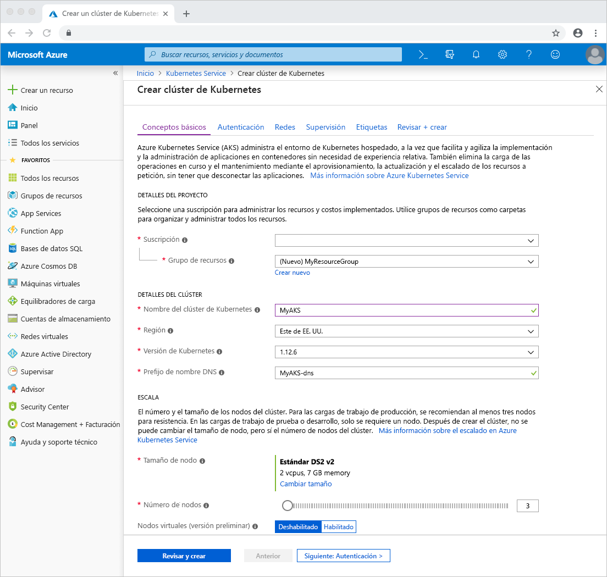
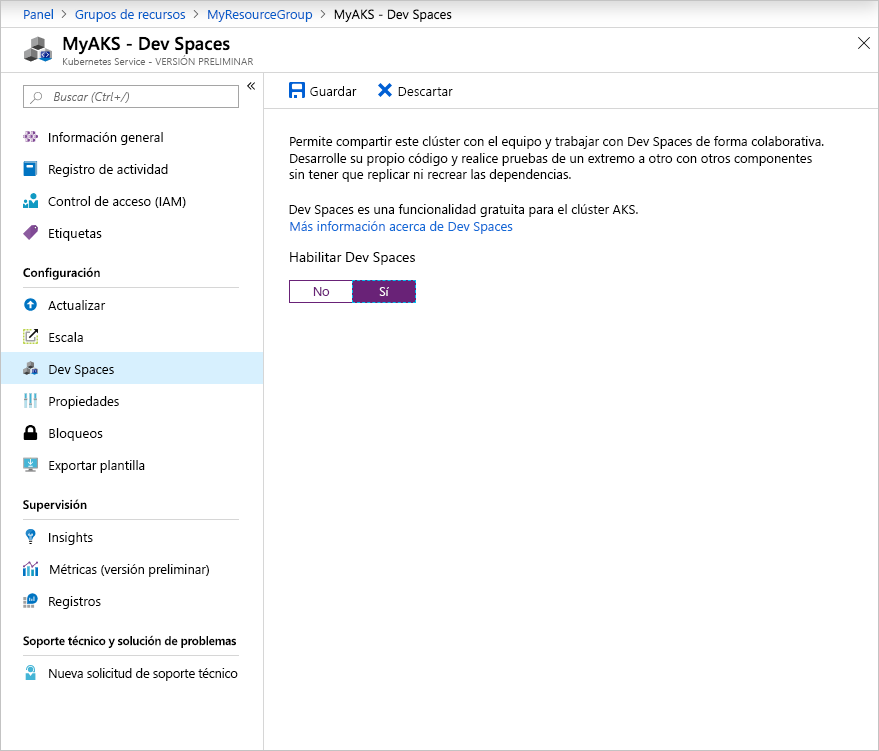

# <a name="quickstart-develop-with-net-core-on-kubernetes-with-azure-dev-spaces-visual-studio-2017"></a>Inicio rápido: Desarrollo con .NET Core en Kubernetes con Azure Dev Spaces (Visual Studio 2017)

En esta guía, aprenderá a:

- Configurar Azure Dev Spaces con un clúster de Kubernetes administrado en Azure.
- Desarrollar código de forma iterativa en contenedores con Visual Studio 2017.
- Depurar el código que se ejecuta en un clúster con Visual Studio 2017.

## <a name="prerequisites"></a>Requisitos previos

- Una suscripción de Azure. En caso de no tener ninguna, puede crear una [cuenta gratuita](https://azure.microsoft.com/free).
- Visual Studio 2017 en Windows con la carga de trabajo Desarrollo web instalada. Si no está instalada, descárguela [aquí](https://aka.ms/vsdownload?utm_source=mscom&utm_campaign=msdocs).
- [Visual Studio Tools para Kubernetes](https://aka.ms/get-vsk8stools) instalada.

## <a name="create-an-azure-kubernetes-service-cluster"></a>Creación de un clúster de Azure Kubernetes Service

Debe crear un clúster de AKS en una [región admitida](https://docs.microsoft.com/azure/dev-spaces/#a-rapid,-iterative-kubernetes-development-experience-for-teams). Para crear un clúster:

1. Inicie sesión en el [Portal de Azure](https://portal.azure.com)
1. Seleccione *+ Crear un recurso > Kubernetes Service*. 
1. Escriba la _suscripción_, el _grupo de recursos_, el _nombre del clúster de Kubernetes_, la _región_, la _versión de Kubernetes_ y el _prefijo del nombre DNS_.

    

1. Haga clic en *Revisar + crear*.
1. Haga clic en *Create*(Crear).

## <a name="enable-azure-dev-spaces-on-your-aks-cluster"></a>Habilitar Azure Dev Spaces en el clúster de AKS

Vaya a su clúster de AKS en Azure Portal y haga clic en *Dev Spaces*. Cambie *Enable Dev Spaces* (Habilitar Dev Spaces) a *Sí* y haga clic en *Guardar*.



## <a name="create-a-new-aspnet-web-app"></a>Crear una aplicación web ASP.NET

1. Abra Visual Studio 2017.
1. Crear un nuevo proyecto.
1. Elija *Aplicación web ASP.NET Core* y asigne al proyecto el nombre *webfrontend*.
1. Haga clic en *OK*.
1. Cuando se le solicite, elija *Aplicación web (Modelo-Vista-Controlador)* para la plantilla.
1. Seleccione *.NET Core* y *ASP.NET Core 2.0* en la parte superior.
1. Haga clic en *OK*.

## <a name="connect-your-project-to-your-dev-space"></a>Conexión del proyecto al espacio de desarrollo

En el proyecto, seleccione **Azure Dev Spaces**  en el menú desplegable de configuración de inicio, como se muestra a continuación.


En el cuadro de diálogo de Azure Dev Spaces, seleccione su *suscripción* y *un clúster de Azure Kubernetes*. Deje *Espacio* establecido en *predeterminado* y active la casilla *Accesible públicamente*. Haga clic en *OK*.


Este proceso implementa el servicio en el espacio de desarrollo *predeterminado* con una dirección URL accesible públicamente. Si elige un clúster que no ha sido configurado para trabajar con Azure Dev Spaces, verá un mensaje preguntando si desea configurarlo. Haga clic en *OK*.


La dirección URL pública para el servicio que se ejecuta en el espacio de desarrollo *predeterminado* aparece en la ventana *Salida*:

```cmd
Starting warmup for project 'webfrontend'.
Waiting for namespace to be provisioned.
Using dev space 'default' with target 'MyAKS'
...
Successfully built 1234567890ab
Successfully tagged webfrontend:devspaces-11122233344455566
Built container image in 39s
Waiting for container...
36s

Service 'webfrontend' port 'http' is available at http://webfrontend.1234567890abcdef1234.eus.azds.io/
Service 'webfrontend' port 80 (http) is available at http://localhost:62266
Completed warmup for project 'webfrontend' in 125 seconds.
```

En el ejemplo anterior, la dirección URL pública es http://webfrontend.1234567890abcdef1234.eus.azds.io/. Vaya a la dirección URL pública del servicio e interactúe con él mientras se ejecuta en el espacio de desarrollo.

## <a name="update-code"></a>Actualización del código

Si Visual Studio 2017 está conectado todavía a su espacio de desarrollo, haga clic en el botón Detener. Cambie la línea 20 en `Controllers/HomeController.cs` a:
    
```csharp
ViewData["Message"] = "Your application description page in Azure.";
```

Guarde los cambios e inicie el servicio mediante **Azure Dev Spaces** en la lista desplegable de configuración de inicio. Abra la dirección URL pública del servicio en un explorador y haga clic en *Acerca de*. Observe que aparece el mensaje actualizado.

En lugar de volver a crear e implementar una nueva imagen de contenedor cada vez que se realizan modificaciones en el código, Azure Dev Spaces vuelve a compilar el código de manera incremental dentro del contenedor existente para proporcionar un bucle de modificación y depuración más rápido.

## <a name="setting-and-using-breakpoints-for-debugging"></a>Establecimiento y uso de puntos de interrupción para la depuración

Si Visual Studio 2017 está conectado todavía a su espacio de desarrollo, haga clic en el botón Detener. Abra `Controllers/HomeController.cs` y haga clic en algún lugar de la línea 20 para colocar el cursor allí. Para establecer un punto de interrupción, pulse *F9* o haga clic en *Depurar* y en *Alternar punto de interrupción*. Para iniciar el servicio en modo de depuración en el espacio de desarrollo, pulse *F5* o haga clic en *Depurar* y en *Iniciar depuración*.

Abra el servicio en un explorador y observe que no se muestra ningún mensaje. Vuelva a Visual Studio 2017 y observe que la línea 20 está resaltada. El punto de interrupción que estableció ha detenido el servicio en la línea 20. Para reanudar el servicio, pulse *F5* o haga clic en *Depurar* y en *Continuar*. Regrese al explorador y observe que ahora se muestra el mensaje.

Mientras se ejecuta el servicio en Kubernetes con un depurador asociado, tiene acceso completo a la información de depuración como, por ejemplo, la de la pila de llamadas, las variables locales y la información de excepciones.

Quite el punto de interrupción colocando el cursor en la línea 20 en `Controllers/HomeController.cs` y pulsando *F9*.

## <a name="clean-up-your-azure-resources"></a>Limpieza de los recursos de Azure

Vaya al grupo de recursos en Azure Portal y haga clic en *Eliminar grupo de recursos*. Como alternativa, puede usar el comando [az aks delete](/cli/azure/aks#az-aks-delete):

```cmd
az group delete --name MyResourceGroup --yes --no-wait
```

## <a name="next-steps"></a>Pasos siguientes

> [!div class="nextstepaction"]
> [Trabajo con varios contenedores y desarrollo en equipo](multi-service-netcore-visualstudio.md)
