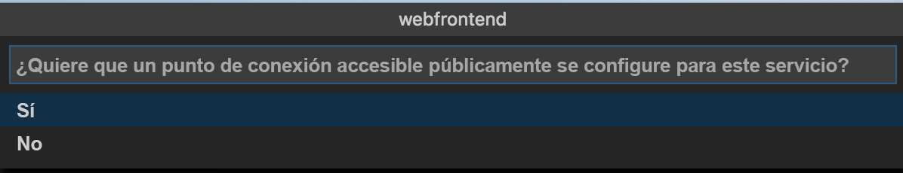
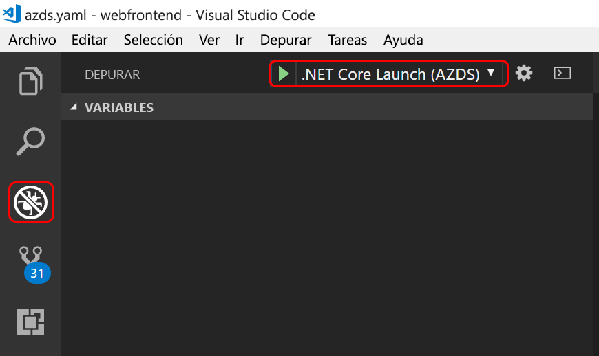

# <a name="quickstart-debug-and-iterate-on-kubernetes-visual-studio-code-and-net-core---azure-dev-spaces"></a>Inicio rápido: Depuración e iteración en Kubernetes: Visual Studio Code y .NET Core: Azure Dev Spaces

En esta guía, aprenderá a:

- Configurar Azure Dev Spaces con un clúster de Kubernetes administrado en Azure.
- Desarrollar código de forma iterativa en contenedores con Visual Studio Code.
- Depurar el código en el espacio de desarrollo de Visual Studio Code.

Azure Dev Spaces también le permite depurar e iterar mediante:
- [Java y Visual Studio Code](quickstart-java.md)
- [Node.js y Visual Studio Code](quickstart-nodejs.md)
- [.NET Core y Visual Studio](quickstart-netcore-visualstudio.md)

## <a name="prerequisites"></a>Prerrequisitos

- Suscripción a Azure. En caso de no tener ninguna, puede crear una [cuenta gratuita](https://azure.microsoft.com/free).
- [Tener Visual Studio Code instalado](https://code.visualstudio.com/download).
- Tener las extensiones de [Azure Dev Spaces](https://marketplace.visualstudio.com/items?itemName=azuredevspaces.azds) y [C#](https://marketplace.visualstudio.com/items?itemName=ms-dotnettools.csharp) para Visual Studio Code instalada.
- [La CLI de Azure instalada](/cli/azure/install-azure-cli?view=azure-cli-latest).

## <a name="create-an-azure-kubernetes-service-cluster"></a>Creación de un clúster de Azure Kubernetes Service

Debe crear un clúster de AKS en una [región admitida][supported-regions]. Los siguientes comandos permiten crear un grupo de recursos llamado *MyResourceGroup* y un clúster de AKS denominado *MyAKS*.

```azurecli
az group create --name MyResourceGroup --location eastus
az aks create -g MyResourceGroup -n MyAKS --location eastus --generate-ssh-keys
```

## <a name="enable-azure-dev-spaces-on-your-aks-cluster"></a>Habilitar Azure Dev Spaces en el clúster de AKS

Use el comando `use-dev-spaces` para habilitar Dev Spaces en el clúster de AKS y siga las indicaciones. El siguiente comando permite habilitar Dev Spaces en el clúster *MyAKS* del grupo *MyResourceGroup* y crea un espacio de desarrollo *predeterminado*.

> [!NOTE]
> El comando `use-dev-spaces` también instalará la CLI de Azure Dev Spaces si aún no se ha instalado. La CLI de Azure Dev Spaces no se puede instalar en Azure Cloud Shell.

```azurecli
az aks use-dev-spaces -g MyResourceGroup -n MyAKS
```

```output
'An Azure Dev Spaces Controller' will be created that targets resource 'MyAKS' in resource group 'MyResourceGroup'. Continue? (y/N): y

Creating and selecting Azure Dev Spaces Controller 'MyAKS' in resource group 'MyResourceGroup' that targets resource 'MyAKS' in resource group 'MyResourceGroup'...2m 24s

Select a dev space or Kubernetes namespace to use as a dev space.
 [1] default
Type a number or a new name: 1

Kubernetes namespace 'default' will be configured as a dev space. This will enable Azure Dev Spaces instrumentation for new workloads in the namespace. Continue? (Y/n): Y

Configuring and selecting dev space 'default'...3s

Managed Kubernetes cluster 'MyAKS' in resource group 'MyResourceGroup' is ready for development in dev space 'default'. Type `azds prep` to prepare a source directory for use with Azure Dev Spaces and `azds up` to run.
```

## <a name="get-sample-application-code"></a>Obtención del código de la aplicación de ejemplo

En este artículo, puede usar la [aplicación de ejemplo de Azure Dev Spaces](https://github.com/Azure/dev-spaces) para demostrar el uso de Azure Dev Spaces.

Clone la aplicación de GitHub.

```cmd
git clone https://github.com/Azure/dev-spaces
```

## <a name="prepare-the-sample-application-in-visual-studio-code"></a>Preparación de la aplicación de ejemplo en Visual Studio Code

Abra Visual Studio Code, haga clic en *Archivo*, *Abrir...*  y vaya al directorio *dev-spaces/samples/dotnetcore/getting-started/webfrontend* y haga clic en *Abrir*.

Ahora tiene el proyecto *webfrontend* abierto en Visual Studio Code. Para ejecutar la aplicación en el espacio de desarrollo, genere los recursos de Docker y del gráfico de Helm mediante la extensión de Azure Dev Spaces en la paleta de comandos.

Para abrir la paleta de comandos en Visual Studio Code, haga clic en *Ver* y en *Paleta de comandos*. Empiece a escribir `Azure Dev Spaces` y haga clic en `Azure Dev Spaces: Prepare configuration files for Azure Dev Spaces`.


Cuando Visual Studio Code le solicite también que configure el punto de conexión público, elija `Yes` para habilitar un punto de conexión público.



Este comando prepara el proyecto para que se ejecute en Azure Dev Spaces mediante la generación de un archivo Dockerfile y un gráfico de Helm. También genera un directorio *.vscode* con la configuración de depuración en la raíz del proyecto.

> [!TIP]
> Azure Dev Spaces usa [Dockerfile y el gráfico de Helm](how-dev-spaces-works.md#prepare-your-code) del proyecto para compilar y ejecutar el código, pero el usuario puede modificar estos archivos si desea cambiar la forma en que se compila y se ejecuta el proyecto.

## <a name="build-and-run-code-in-kubernetes-from-visual-studio-code"></a>Compilación y ejecución de código en Kubernetes desde Visual Studio Code

Haga clic en el icono *Depurar* situado a la izquierda y haga clic en *.NET Core Launch (AZDS)* [Inicio de .NET Core (AZDS)] en la parte superior.



Este comando compila y ejecuta el servicio en Azure Dev Spaces en modo de depuración. La ventana *Terminal* situada en la parte inferior muestra la salida y las direcciones URL de la compilación para el servicio que ejecuta Azure Dev Spaces. La *consola de depuración* muestra la salida del registro.

> [!Note]
> Si no ve ningún comando de Azure Dev Spaces en la *paleta de comandos*, asegúrese de que ha instalado la extensión de [Visual Studio Code para Azure Dev Spaces](https://marketplace.visualstudio.com/items?itemName=azuredevspaces.azds). Compruebe también que ha abierto el directorio *dev-spaces/samples/dotnetcore/getting-started/webfrontend* en Visual Studio Code.

Para ver el servicio en ejecución, abra la dirección URL pública.

> [!Note]
> Inicialmente, la dirección URL pública puede mostrar el error *Puerta de enlace no válida*. Espere unos segundos para actualizar la página web y debería ver que el servicio se está ejecutando.

Haga clic en *Depurar* y en *Detener depuración* para detener el depurador.

## <a name="update-code"></a>Actualización del código

Para implementar una versión actualizada del servicio, puede actualizar cualquier archivo del proyecto y volver a ejecutar *.NET Core Launch (AZDS)* . Por ejemplo:

1. Si la aplicación todavía se está ejecutando, haga clic en *Depurar* y, a continuación, en *Detener depuración* para detenerla.
1. Actualice la [línea 22 en `Controllers/HomeController.cs`](https://github.com/Azure/dev-spaces/blob/master/samples/dotnetcore/getting-started/webfrontend/Controllers/HomeController.cs#L22) a:
    
    ```csharp
    ViewData["Message"] = "Your application description page in Azure.";
    ```

1. Guarde los cambios.
1. Vuelva a ejecutar *.NET Core Launch (AZDS)* .
1. Vaya al servicio en ejecución y haga clic en *Acerca de*.
1. Observe los cambios.
1. Haga clic en *Depurar* y en *Detener depuración* para detener la aplicación.

## <a name="setting-and-using-breakpoints-for-debugging"></a>Establecimiento y uso de puntos de interrupción para la depuración

Inicie el servicio en el modo de depuración mediante *.NET Core Launch (AZDS)* [Inicio de .NET Core (AZDS)].

Vaya a la vista *Explorer*. Para ello haga clic en *Ver* y en *Explorer*. Abra `Controllers/HomeController.cs` y haga clic en algún lugar de la línea 22 para colocar ahí el cursor. Para establecer un punto de interrupción, pulse *F9* o haga clic en *Depurar* y en *Alternar punto de interrupción*.

Abra el servicio en un explorador y observe que no se muestra ningún mensaje. Vuelva a Visual Studio Code y observe que la línea 20 está resaltada. El punto de interrupción que estableció ha detenido el servicio en la línea 20. Para reanudar el servicio, pulse *F5* o haga clic en *Depurar* y en *Continuar*. Regrese al explorador y observe que ahora se muestra el mensaje.

Mientras se ejecuta el servicio en Kubernetes con un depurador asociado, tiene acceso completo a la información de depuración como, por ejemplo, la de la pila de llamadas, las variables locales y la información de excepciones.

Quite el punto de interrupción colocando el cursor en la línea 22 en `Controllers/HomeController.cs` y pulsando *F9*.

## <a name="update-code-from-visual-studio-code"></a>Actualización del código de Visual Studio Code

Mientras el servicio se ejecuta en modo de depuración, actualice la línea 22 en `Controllers/HomeController.cs`. Por ejemplo:

```csharp
ViewData["Message"] = "Your application description page in Azure while debugging!";
```

Guarde el archivo. Haga clic en *Depurar* y en *Reiniciar depuración* o en la *barra de herramientas de depuración*, haga clic en el botón *Reiniciar depuración*.


Abra el servicio en un explorador y observe que se muestra el mensaje actualizado.

En lugar de volver a crear e implementar una nueva imagen de contenedor cada vez que se realizan modificaciones en el código, Azure Dev Spaces vuelve a compilar el código de manera incremental dentro del contenedor existente para proporcionar un bucle de modificación y depuración más rápido.

## <a name="clean-up-your-azure-resources"></a>Limpieza de los recursos de Azure

```azurecli
az group delete --name MyResourceGroup --yes --no-wait
```

## <a name="next-steps"></a>Pasos siguientes

Obtenga información acerca de la forma en que Azure Dev Spaces le ayuda a desarrollar aplicaciones más complejas en varios contenedores y cómo puede simplificar el desarrollo en colaboración mediante el uso de distintas versiones o bifurcaciones del código en distintos espacios. 

> [!div class="nextstepaction"]
> [Trabajo con varios contenedores y desarrollo en equipo](multi-service-netcore.md)


[supported-regions]: https://azure.microsoft.com/global-infrastructure/services/?products=kubernetes-service
