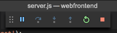

# <a name="quickstart-create-a-kubernetes-dev-space-with-azure-dev-spaces-nodejs"></a>Inicio rápido: Creación de un espacio de desarrollo de Kubernetes con Azure Dev Spaces (Node.js)

En esta guía, aprenderá a:

- Configurar Azure Dev Spaces con un clúster de Kubernetes administrado en Azure.
- Desarrollar código de forma iterativa en contenedores con VS Code y la línea de comandos.
- Depurar el código que se ejecuta en un clúster.

> [!Note]
> **Si se queda bloqueado** en cualquier momento, consulte la sección [Solución de problemas](troubleshooting.md) o publique un comentario en esta página. También puede probar con este [tutorial](get-started-nodejs.md), que es más detallado.

## <a name="prerequisites"></a>Requisitos previos

- Una suscripción de Azure. Si no tiene una suscripción a Azure, puede crear una [cuenta gratuita](https://azure.microsoft.com/free).
- [Visual Studio Code](https://code.visualstudio.com/download)
- [CLI de Azure ](/cli/azure/install-azure-cli?view=azure-cli-latest) versión 2.0.43 o superior.
- Un clúster de Kubernetes que ejecute Kubernetes 1.9.6 o posterior, en las regiones EastUS, EastUS2, CentralUS, WestUS2, WestEurope, SoutheastAsia, CanadaCentral o CanadaEast, con **Enrutamiento de aplicación HTTP** habilitado.

    ```cmd
    az group create --name MyResourceGroup --location <region>
    az aks create -g MyResourceGroup -n myAKS --location <region> --kubernetes-version 1.10.9 --enable-addons http_application_routing --generate-ssh-keys
    ```

## <a name="set-up-azure-dev-spaces"></a>Configuración de Azure Dev Spaces

La CLI de Azure y la extensión Azure Dev Spaces se pueden instalar y ejecutar en equipos Windows, Mac o Linux. Para Linux, se admiten las siguientes distribuciones: Ubuntu (18.04, 16.04 y 14.04), Debian 8 y 9, RHEL 7, Fedora 26+, CentOS 7, openSUSE 42.2 y SLES 12.

Siga estos pasos para configurar Azure Dev Spaces:

1. Configure Dev Spaces en su clúster de AKS: `az aks use-dev-spaces -g MyResourceGroup -n MyAKS`
1. Descargue el [extensión de Azure Dev Spaces](https://marketplace.visualstudio.com/items?itemName=azuredevspaces.azds) para VS Code. Haga clic en Instalar una vez que se encuentre en la página de Marketplace de la extensión, y de nuevo en VS Code.

## <a name="build-and-run-code-in-kubernetes"></a>Compilación y ejecución de código en Kubernetes

1. Descargue el código de ejemplo de GitHub:[https://github.com/Azure/dev-spaces](https://github.com/Azure/dev-spaces) 
1. Cambie el directorio a la carpeta webfrontend: `cd dev-spaces/samples/nodejs/getting-started/webfrontend`
1. Genere los recursos de Docker y del gráfico de Helm: `azds prep --public`
1. Compile y ejecute el código en AKS. En la ventana del terminal, ejecute este comando desde la **carpeta webfrontend**: `azds up`
1. Examine la salida de la consola para obtener información acerca de la dirección URL que creó el comando `up`. Tendrá el formato siguiente: 

   ```output
   (pending registration) Service 'webfrontend' port 'http' will be available at <url>
   Service 'webfrontend' port 80 (TCP) is available at http://localhost:<port>
   ```

   Abra esta dirección URL en una ventana del explorador y verá la aplicación web de carga. Mientras se ejecuta el contenedor, las salidas `stdout` y `stderr` se transmiten a la ventana de terminal.
   
   > [!Note]
   > En la primera ejecución, puede tardar varios minutos hasta que el DNS público esté preparado. Si no se resuelve la dirección URL pública, puede usar la dirección URL alternativa http://localhost:<portnumber> que se muestra en la salida de la consola. Si utiliza la dirección URL del host local, puede parecer que el contenedor se ejecuta localmente, pero en realidad se ejecuta en AKS. Para mayor comodidad y para facilitar la interacción con el servicio desde la máquina local, Azure Dev Spaces crea un túnel SSH temporal al contenedor que se ejecuta en Azure. Puede volver y probar la dirección URL pública más adelante cuando el registro DNS esté listo.

### <a name="update-a-content-file"></a>Actualización de un archivo de contenido
Con Azure Dev Spaces no se trata solo de conseguir que el código se ejecute en Kubernetes, sino de permitirle ver rápida e iterativamente que los cambios de código surtan efecto en un entorno de Kubernetes en la nube.

1. Busque el archivo `./public/index.html` y realice una edición en el código HTML. Por ejemplo, cambie el color de fondo de la página por un tono azul:

    ```html
    <body style="background-color: #95B9C7; margin-left:10px; margin-right:10px;">
    ```

1. Guarde el archivo. Momentos después, en la ventana de terminal verá un mensaje que indica que se ha actualizado un archivo en el contenedor en ejecución.
1. Regrese al explorador y actualice la página. Verá la actualización del color.

¿Qué ha ocurrido? Las ediciones en los archivos de contenido, como HTML y CSS, no requieren que se reinicie el proceso Node.js, por lo que un comando `azds up` activo sincronizará automáticamente cualquier archivo de contenido modificado directamente en el contenedor en ejecución en Azure, proporcionando así una forma rápida de ver las ediciones del contenido.

### <a name="test-from-a-mobile-device"></a>Prueba en un dispositivo móvil
Abra la aplicación web en un dispositivo móvil mediante la dirección URL pública para webfrontend. Se recomienda que copie y envíe la dirección URL desde el escritorio al dispositivo para no tener que escribir la dirección larga. Cuando la aplicación web se cargue en el dispositivo móvil, notará que la interfaz de usuario no se muestra correctamente en un dispositivo pequeño.

Para solucionar este problema, va a agregar una etiqueta META `viewport`:
1. Abra el archivo `./public/index.html`.
1. Agregue la etiqueta META `viewport` al elemento existente `head`:

    ```html
    <head>
        <!-- Add this line -->
        <meta name="viewport" content="width=device-width, initial-scale=1">
    </head>
    ```

1. Guarde el archivo.
1. Actualice el explorador del dispositivo. Ahora verá la aplicación web correctamente representada. 

Este es un ejemplo de cómo algunos problemas no se encuentran hasta que se realiza una prueba en los dispositivos en los que se debe usar una aplicación. Con Azure Dev Spaces de Visual Studio, puede iterar rápidamente su código y validar cualquier cambio en los dispositivos de destino.

### <a name="update-a-code-file"></a>Actualización de un archivo de código
Actualizar los archivos de código del lado servidor requiere un poco más de trabajo, porque hay que reiniciar la aplicación Node.js.

1. En la ventana de terminal, presione `Ctrl+C` (para detener `azds up`).
1. Abra el archivo de código denominado `server.js` y modifique el mensaje de saludo del servicio: 

    ```javascript
    res.send('Hello from webfrontend running in Azure!');
    ```

3. Guarde el archivo.
1. Ejecute `azds up` en la ventana de terminal. 

Se vuelve a crear la imagen del contenedor y se vuelve a implementar el gráfico de Helm. Vuelva a cargar la página del explorador para ver que los cambios de código surten efecto.

Pero hay un método *más rápido* para desarrollar código, que se verá en la siguiente sección. 

## <a name="debug-a-container-in-kubernetes"></a>Depuración de un contenedor en Kubernetes

En esta sección, usará VS Code para depurar directamente el contenedor que se ejecuta en Azure. También aprenderá a obtener un bucle de edición-ejecución-prueba más rápido.


### <a name="initialize-debug-assets-with-the-vs-code-extension"></a>Inicialización de activos de depuración con la extensión de VS Code
En primer lugar, debe configurar el proyecto de código para que VS Code se comunique con nuestro espacio de desarrollo en Azure. La extensión de VS Code para Azure Dev Spaces proporciona un comando auxiliar para establecer la configuración de depuración. 

Abra la **Paleta de comandos** (mediante el menú **Vista | Paleta de comandos**) y use Autocompletar para escribir y seleccionar este comando: `Azure Dev Spaces: Prepare configuration files for Azure Dev Spaces`.

Esto agrega la configuración de depuración para los espacios de Azure Dev Spaces en la carpeta `.vscode`. Este comando no se debe confundir con el comando `azds prep`, que configura el proyecto para la implementación.


### <a name="select-the-azds-debug-configuration"></a>Selección de la configuración de depuración de AZDS
1. Para abrir la vista de depuración, haga clic en el icono de depuración en la **barra de actividad** en el lateral de VS Code.
1. Seleccione **Launch Program (AZDS)** [Iniciar programa (AZDS)] como la configuración de depuración activa.


> [!Note]
> Si no ve ningún comando de Azure Dev Spaces en la paleta de comandos, asegúrese de haber instalado la extensión de Visual Studio Code para Azure Dev Spaces.

### <a name="debug-the-container-in-kubernetes"></a>Depuración del contenedor en Kubernetes
Presione **F5**  para depurar el código en Kubernetes.

De forma similar al comando `up`, el código se sincroniza con el espacio de desarrollo cuando comienza la depuración y se crea un contenedor que se implementa en Kubernetes. En esta ocasión, el depurador se asocia al contenedor remoto.

> [!Tip]
> La barra de estado de VS Code mostrará una dirección URL en la que se puede hacer clic.

Establezca un punto de interrupción en un archivo de código del lado servidor, por ejemplo, dentro de `app.get('/api'...` en `server.js`. Actualice la página del explorador o presione el botón "Say It Again" (Repetir); llegará al punto de interrupción y podrá ejecutar el código paso a paso.

Tiene acceso completo a la información de depuración, igual que si el código se ejecutara localmente, como la pila de llamadas, las variables locales o la información de excepción, por ejemplo.

### <a name="edit-code-and-refresh-the-debug-session"></a>Edición del código y actualización de la sesión de depuración
Con el depurador activo, realice una edición de código; por ejemplo, vuelva a modificar el mensaje de saludo:

```javascript
app.get('/api', function (req, res) {
    res.send('**** Hello from webfrontend running in Azure! ****');
});
```

Guarde el archivo y, en el **panel de acciones de depuración**, haga clic en el botón **Actualizar**. 



En lugar de volver a crear e implementar una nueva imagen de contenedor cada vez que se realizan ediciones en el código, lo que a menudo lleva un tiempo considerable, Azure Dev Spaces reinicia el proceso Node.js entre sesiones de depuración para proporcionar un bucle de edición/depuración más rápido.

Actualice la aplicación web en el explorador o presione el botón *Say It Again* (Repetir). Verá que aparece el mensaje personalizado en la interfaz de usuario.

### <a name="use-nodemon-to-develop-even-faster"></a>Uso de NodeMon para acelerar el desarrollo

El proyecto `webfrontend` de ejemplo se configuró para usar [nodemon](https://nodemon.io/), una conocida herramienta para acelerar el desarrollo de Node.js que es totalmente compatible con Azure Dev Spaces.

Realice estos pasos:
1. Detenga el depurador de VS Code.
1. Haga clic en el icono de depuración en la **barra de actividad** en el lateral de VS Code. 
1. Seleccione **Attach (AZDS)** [Asociar (AZDS)] como la configuración de depuración activa.
1. Presione F5.

En esta configuración, el contenedor está configurado para iniciar *nodemon*. Cuando se realizan ediciones del código de servidor, *nodemon* reinicia automáticamente el proceso de Node, tal y como lo hace en el desarrollo local. 
1. Edite el mensaje de saludo de nuevo en `server.js` y guarde el archivo.
1. Actualice el explorador o haga clic en el botón *Say It Again* (Repetir) para que los cambios surtan efecto.

**Ahora tiene un método para iterar rápidamente el código y depurarlo directamente en Kubernetes.**

## <a name="next-steps"></a>Pasos siguientes

> [!div class="nextstepaction"]
> [Trabajo con varios contenedores y desarrollo en equipo](team-development-nodejs.md)
