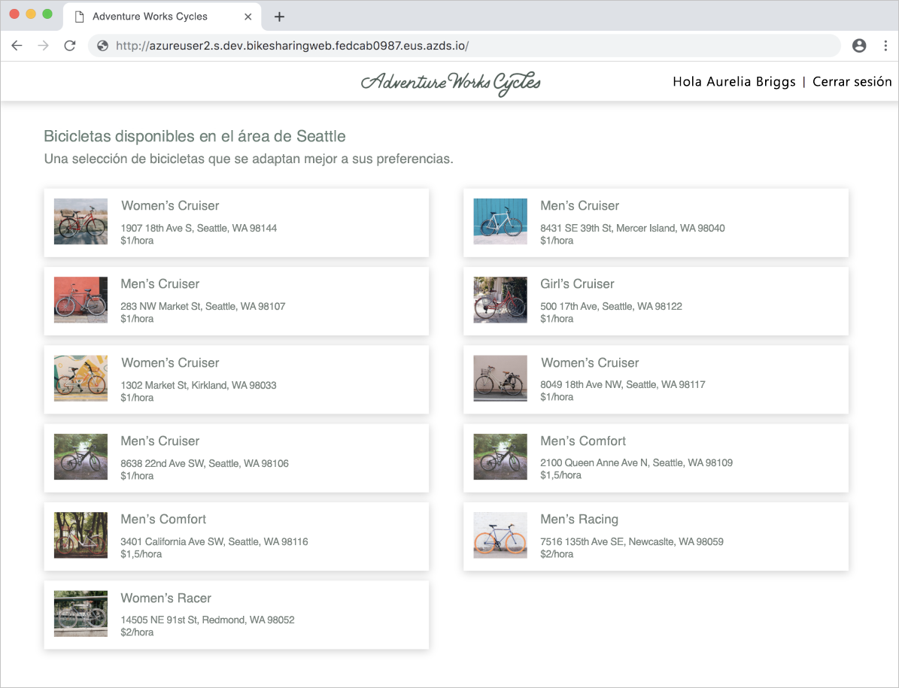
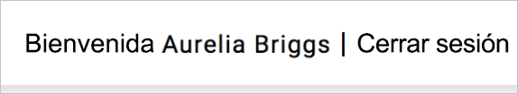

# <a name="quickstart-team-development-on-kubernetes---azure-dev-spaces"></a>Inicio rápido: Desarrollo en equipo en Kubernetes: Azure Dev Spaces

En esta guía, aprenderá a:

- Configurar Azure Dev Spaces en un clúster de Kubernetes administrado en Azure.
- Implementar una aplicación de gran tamaño con varios microservicios en un espacio de desarrollo.
- Probar un único microservicio en un espacio aislado de desarrollo dentro del contexto de la aplicación completa.


## <a name="prerequisites"></a>Prerrequisitos

- Suscripción a Azure. Si no tiene una suscripción a Azure, puede crear una [cuenta gratuita](https://azure.microsoft.com/free).
- [La CLI de Azure instalada](/cli/azure/install-azure-cli?view=azure-cli-latest).
- [Helm 3 instalado][helm-installed].

## <a name="create-an-azure-kubernetes-service-cluster"></a>Creación de un clúster de Azure Kubernetes Service

Debe crear un clúster de AKS en una [región admitida][supported-regions]. Los siguientes comandos permiten crear un grupo de recursos llamado *MyResourceGroup* y un clúster de AKS denominado *MyAKS*.

```azurecli
az group create --name MyResourceGroup --location eastus
az aks create -g MyResourceGroup -n MyAKS --location eastus --generate-ssh-keys
```

## <a name="enable-azure-dev-spaces-on-your-aks-cluster"></a>Habilitar Azure Dev Spaces en el clúster de AKS

Use el comando `use-dev-spaces` para habilitar Dev Spaces en el clúster de AKS y siga las indicaciones. El siguiente comando permite habilitar Dev Spaces en el clúster *MyAKS* del grupo *MyResourceGroup* y crea un espacio de desarrollo llamado *dev*.

> [!NOTE]
> El comando `use-dev-spaces` también instalará la CLI de Azure Dev Spaces si aún no se ha instalado. La CLI de Azure Dev Spaces no se puede instalar en Azure Cloud Shell.

```azurecli
az aks use-dev-spaces -g MyResourceGroup -n MyAKS --space dev --yes
```

## <a name="get-sample-application-code"></a>Obtención del código de la aplicación de ejemplo

En este artículo, puede usar la [aplicación de ejemplo Bike Sharing de Azure Dev Spaces](https://github.com/Azure/dev-spaces/tree/master/samples/BikeSharingApp) para demostrar el uso de Azure Dev Spaces.

Clone la aplicación desde GitHub y vaya a su directorio:

```cmd
git clone https://github.com/Azure/dev-spaces
cd dev-spaces/samples/BikeSharingApp/
```

## <a name="retrieve-the-hostsuffix-for-dev"></a>Recupere el valor HostSuffix de *dev*.

Use el comando `azds show-context` para mostrar el valor HostSuffix para *dev*.

```cmd
$ azds show-context

Name                ResourceGroup     DevSpace  HostSuffix
------------------  ----------------  --------  -----------------------
MyAKS               MyResourceGroup   dev       fedcab0987.eus.azds.io
```

## <a name="update-the-helm-chart-with-your-hostsuffix"></a>Actualización del gráfico de Helm con su valor HostSuffix

Abra [charts/values.yaml](https://github.com/Azure/dev-spaces/blob/master/samples/BikeSharingApp/charts/values.yaml) y reemplace todas las instancias de `<REPLACE_ME_WITH_HOST_SUFFIX>` por el valor de HostSuffix que recuperó anteriormente. Guarde los cambios y cierre el archivo.

## <a name="run-the-sample-application-in-kubernetes"></a>Ejecución de la aplicación de ejemplo en Kubernetes

Los comandos para ejecutar la aplicación de ejemplo en Kubernetes forman parte de un proceso existente y no tienen ninguna dependencia de las herramientas de Azure Dev Spaces. En este caso, Helm es la herramienta utilizada para ejecutar esta aplicación de ejemplo, pero podrían usarse otras herramientas para ejecutar toda la aplicación en un espacio de nombres dentro de un grupo. Los comandos de Helm están dirigidos al espacio de desarrollo llamado *dev* que creó anteriormente, pero este espacio de desarrollo también es un espacio de nombres de Kubernetes. Por lo tanto, los espacios de desarrollo pueden ser destino de otras herramientas igual que otros espacios de nombres.

Puede usar Azure Dev Spaces para el desarrollo en equipo después de que una aplicación se ejecute en un clúster, independientemente de la herramienta utilizada para implementarla.

Use el comando `helm install` para configurar e instalar la aplicación de ejemplo en el clúster.

```cmd
cd charts/
helm install bikesharingsampleappsampleapp . --dependency-update --namespace dev --atomic
```

El comando `helm install` puede tardar varios minutos en completarse. Una vez que la aplicación de ejemplo esté instalada en su clúster y puesto que tiene Dev Spaces habilitado en el clúster, utilice el comando `azds list-uris` para mostrar las direcciones URL de la aplicación de ejemplo en la instancia *dev* que está seleccionada actualmente.

```cmd
$ azds list-uris
Uri                                                 Status
--------------------------------------------------  ---------
http://dev.bikesharingweb.fedcab0987.eus.azds.io/  Available
http://dev.gateway.fedcab0987.eus.azds.io/         Available
```

Navegue hasta el servicio *bikesharingweb* abriendo la dirección URL pública con el comando `azds list-uris`. En el ejemplo anterior, la dirección URL pública para el servicio *bikesharingweb* es `http://dev.bikesharingweb.fedcab0987.eus.azds.io/`. Seleccione *Aurelia Briggs (customer)* (Aurelia Briggs [cliente]) como usuario. Compruebe que ve el texto *Hi Aurelia Briggs | Sign Out* (Hola Aurelia Briggs | Cerrar sesión) en la parte superior.



## <a name="create-child-dev-spaces"></a>Creación de espacios de desarrollo secundarios

Use el comando `azds space select` para crear dos espacios secundarios bajo *dev*:

```cmd
azds space select -n dev/azureuser1 -y
azds space select -n dev/azureuser2 -y
```

Los comandos anteriores crean dos espacios secundarios bajo *dev* denominados *azureuser1* y *azureuser2*. Estos dos espacios secundarios representan espacios de desarrollo diferentes para los nombres *azureuser1* y *azureuser2* de los desarrolladores, que se usarán para realizar cambios en la aplicación de ejemplo.

Use el comando `azds space list` para que aparezcan todos los espacios de desarrollo y confirme que *dev/azureuser2* está seleccionado.

```cmd
$ azds space list
   Name            DevSpacesEnabled
-  --------------  ----------------
   default         False
   dev             True
   dev/azureuser1  True
*  dev/azureuser2  True
```

Use `azds list-uris` para mostrar las direcciones URL de la aplicación de ejemplo en el espacio seleccionado actualmente; esto es, *dev/azureuser2*.

```cmd
$ azds list-uris
Uri                                                             Status
--------------------------------------------------              ---------
http://azureuser2.s.dev.bikesharingweb.fedcab0987.eus.azds.io/  Available
http://azureuser2.s.dev.gateway.fedcab0987.eus.azds.io/         Available
```

Confirme que las direcciones URL que muestra el comando `azds list-uris` tienen el prefijo *azureuser2.s.dev*. Este prefijo confirma que el espacio actual seleccionado es *azureuser2*, que es un elemento secundario de *dev*.

Navegue hasta el servicio *bikesharingweb* para el espacio de desarrollo *dev/azureuser2* abriendo la dirección URL pública con el comando `azds list-uris`. En el ejemplo anterior, la dirección URL pública para el servicio *bikesharingweb* es `http://azureuser2.s.dev.bikesharingweb.fedcab0987.eus.azds.io/`. Seleccione *Aurelia Briggs (customer)* (Aurelia Briggs [cliente]) como usuario. Compruebe que ve el texto *Hi Aurelia Briggs | Sign out* (Hola Aurelia Briggs | Cerrar sesión) en la parte superior.

## <a name="update-code"></a>Actualización del código

Abra *BikeSharingWeb/components/Header.js* con un editor de texto y cambie el texto del [elemento span con el valor className`userSignOut`](https://github.com/Azure/dev-spaces/blob/master/samples/BikeSharingApp/BikeSharingWeb/components/Header.js#L16).

```html
<span className="userSignOut">
    <Link href="/devsignin"><span tabIndex="0">Welcome {props.userName} | Sign out</span></Link>
</span>
```

Guarde los cambios y cierre el archivo.

## <a name="build-and-run-the-updated-bikesharingweb-service-in-the-devazureuser2-dev-space"></a>Compilación y ejecución del servicio actualizado bikesharingweb en el espacio de desarrollo *dev/azureuser2*

Vaya al directorio*BikeSharingWeb/* y ejecute el comando `azds up`.

```cmd
$ cd ../BikeSharingWeb/
$ azds up

Using dev space 'dev/azureuser2' with target 'MyAKS'
Synchronizing files...2s
...
Service 'bikesharingweb' port 'http' is available at http://azureuser2.s.dev.bikesharingweb.fedcab0987.eus.azds.io/
Service 'bikesharingweb' port 80 (http) is available at http://localhost:54256
...
```

Este comando compila y ejecuta el servicio *bikesharingweb* en el espacio de desarrollo *dev/azureuser2*. Este servicio se ejecuta además en el servicio *bikesharingweb* que se ejecuta en *dev* y se usa solo para las solicitudes con el prefijo URL *azureuser2.s*. Para más información acerca de cómo funciona el enrutamiento entre espacios de desarrollo primarios y secundarios, consulte [How Azure Dev Spaces works and is configured](how-dev-spaces-works.md) (Cómo funciona Azure Dev Spaces y cómo está configurado).

Navegue hasta el servicio *bikesharingweb* para el espacio de desarrollo *dev/azureuser2* abriendo la dirección URL pública que se muestra en la salida del comando `azds up`. Seleccione *Aurelia Briggs (customer)* (Aurelia Briggs [cliente]) como usuario. Compruebe que aparece el texto actualizado en la esquina superior derecha. Es posible que deba actualizar la página o borrar la caché del explorador si no ve inmediatamente este cambio.



> [!NOTE]
> Al ir al servicio mientras se ejecuta `azds up`, los seguimientos de solicitudes HTTP también se muestran en la salida del comando `azds up`. Estos seguimientos pueden ayudarle a solucionar problemas y depurar el servicio. Puede deshabilitar estos seguimientos con `--disable-http-traces` al ejecutar `azds up`.

## <a name="verify-other-dev-spaces-are-unchanged"></a>Comprobación de que otros espacios de desarrollo permanecen sin cambios

Si el comando `azds up` se está ejecutando todavía, presione *Ctrl + c*.

```cmd
$ azds list-uris --all
Uri                                                             Status
--------------------------------------------------              ---------
http://azureuser1.s.dev.bikesharingweb.fedcab0987.eus.azds.io/  Available
http://azureuser1.s.dev.gateway.fedcab0987.eus.azds.io/         Available
http://azureuser2.s.dev.bikesharingweb.fedcab0987.eus.azds.io/  Available
http://azureuser2.s.dev.gateway.fedcab0987.eus.azds.io/         Available
http://dev.bikesharingweb.fedcab0987.eus.azds.io/               Available
http://dev.gateway.fedcab0987.eus.azds.io/                      Available
```

Navegue a la versión *dev* de *bikesharingweb* en su explorador, elija  *Aurelia Briggs (customer)* (Aurelia Briggs [cliente]) como usuario y compruebe que ve el texto original en la esquina superior derecha. Repita estos pasos con la dirección URL *dev/azureuser1*. Observe que los cambios solo se aplican a la versión *dev/azureuser2* de *bikesharingweb*. Este aislamiento de los cambios en *dev/azureuser2* permite a *azureuser2* realizar cambios sin que *azureuser1* resulte afectado.

Para que estos cambios se reflejen en *dev* y *dev/azureuser1*, debe seguir el flujo de trabajo existente o la canalización de CI/CD de su equipo. Por ejemplo, este flujo de trabajo puede implicar la confirmación del cambio en su sistema de control de versiones y la implementación de la actualización mediante una canalización de CI/CD o herramientas como Helm.

## <a name="clean-up-your-azure-resources"></a>Limpieza de los recursos de Azure

```azurecli
az group delete --name MyResourceGroup --yes --no-wait
```

## <a name="next-steps"></a>Pasos siguientes

Obtenga información acerca de la forma en que Azure Dev Spaces le ayuda a desarrollar aplicaciones más complejas en varios contenedores y cómo puede simplificar el desarrollo en colaboración mediante el uso de distintas versiones o bifurcaciones del código en distintos espacios.

> [!div class="nextstepaction"]
> [Trabajo con varios contenedores y desarrollo en equipo](multi-service-nodejs.md)

[helm-installed]: https://helm.sh/docs/intro/install/
[supported-regions]: https://azure.microsoft.com/global-infrastructure/services/?products=kubernetes-service
