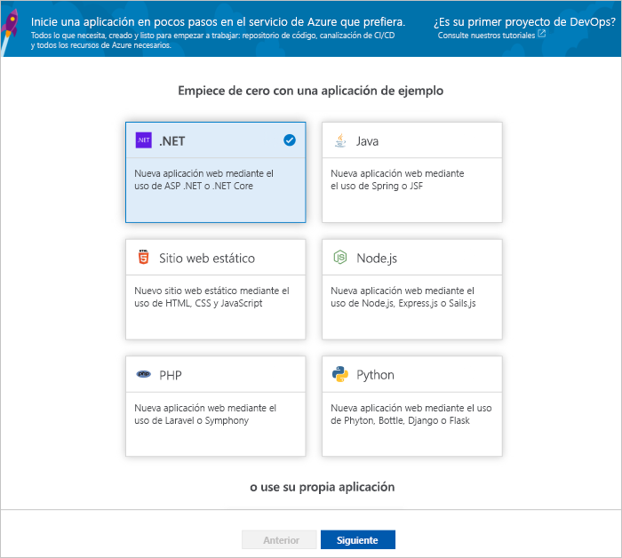
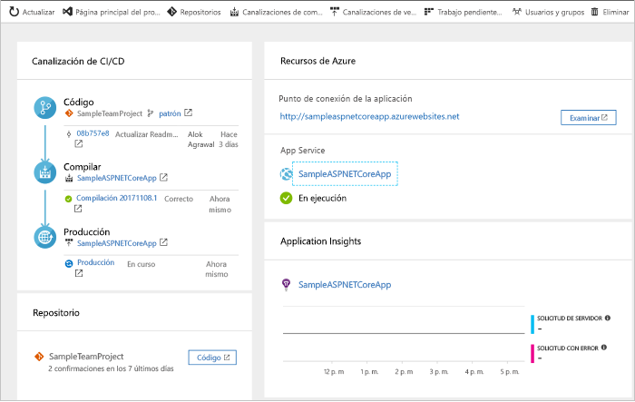
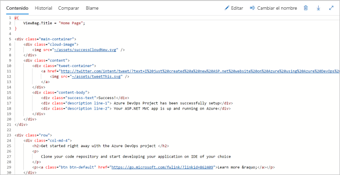
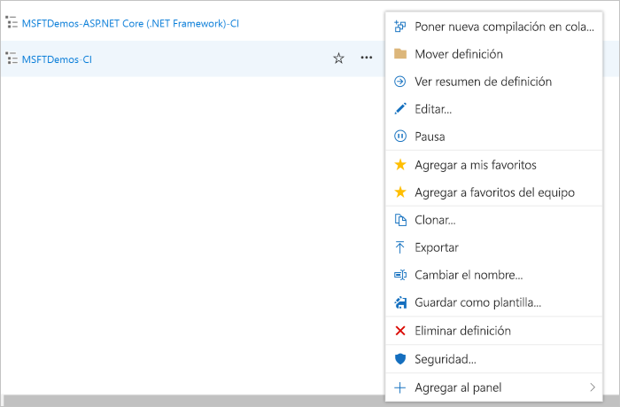

# Creación de una canalización de CI/CD para .NET con Azure DevOps Projects

Configure la integración continua (CI) y la entrega continua (CD) para su aplicación .NET Core o ASP.NET con DevOps Projects. DevOps Projects simplifica la configuración inicial de una canalización de compilación y de versión en Azure Pipelines.

Si no tiene una suscripción de Azure, puede obtener una gratuita mediante [Visual Studio Dev Essentials](https://visualstudio.microsoft.com/dev-essentials/).

## Inicio de sesión en Azure Portal

DevOps Projects crea una canalización de CI/CD en Azure DevOps. Puede crear una organización de Azure DevOps o usar una existente. DevOps Projects también crea recursos de Azure en la suscripción de Azure que prefiera.

1. Inicie sesión en el [Portal de Microsoft Azure](https://portal.azure.com).

1. En el panel izquierdo, seleccione el icono **Crear un recurso** en la barra de navegación izquierda y busque **DevOps Projects**.  

3.  Seleccione **Crear**.

    

## Seleccione una aplicación de ejemplo y el servicio de Azure

1. Seleccione la aplicación de ejemplo de **.NET**. Los ejemplos de.NET incluyen la opción de elegir entre el marco ASP.NET de código abierto o el marco .NET Core multiplataforma.

   

2. Este ejemplo es una aplicación de MVC de ASP.NET Core. Seleccione el marco de trabajo de la aplicación **.NET Core** y, a continuación, seleccione **Siguiente**.    
    
3. Seleccione **Aplicación web de Windows** como destino de implementación y, a continuación, seleccione **Siguiente**. De forma opcional, puede elegir otros servicios de Azure para su implementación. El marco de trabajo de la aplicación que ha elegido antes determina el tipo de destino de implementación del servicio de Azure disponible aquí.

## Configuración de Azure DevOps y una suscripción de Azure 

1. Escriba un **nombre de proyecto**.

2. Cree una **organización de Azure DevOps** gratuita o elija una existente en la lista desplegable.

3. Seleccione la **suscripción de Azure**, escriba el nombre de la **aplicación web** o use el predeterminado y, a continuación, seleccione **Listo**. En unos minutos, la descripción general de la implementación de DevOps Projects se muestra en Azure Portal. 

4. Seleccione **Ir al recurso** para ver el panel de DevOps Projects. En la esquina superior derecha, ancle el **proyecto** a su panel para un acceso rápido. Una aplicación de ejemplo se configura en un repositorio de su **organización de Azure DevOps**. Una compilación se ejecuta y su aplicación se implementa en Azure.

5. El panel proporciona visibilidad del repositorio de código, la canalización de CI/CD y la aplicación de Azure. A la derecha, en Recursos de Azure, seleccione **Examinar** para ver su aplicación en ejecución.

    

## Confirmación de los cambios de código y ejecución de CI/CD

DevOps Projects ha creado un repositorio Git en Azure Repos o GitHub. Para ver el repositorio y realizar cambios en el código de la aplicación, siga estos pasos:

1. En el lado izquierdo del panel de DevOps Projects, seleccione el vínculo de la rama **maestra**. Este vínculo abre una vista al repositorio de Git recién creado.

2. En los pasos siguientes, puede usar el explorador web para realizar los cambios en el código y confirmarlos directamente en la rama **maestra**. También puede clonar su repositorio de Git de su IDE favorito seleccionando **Clonar** en la esquina superior derecha de la página del repositorio. 

3. A la izquierda, vaya a la estructura de archivos de aplicación en **Application/aspnet-core-dotnet-core/Pages/Index.cshtml**.

4. Seleccione **Editar** y, a continuación, realice un cambio en el encabezado h2. Por ejemplo, escriba **Empezar a trabajar de inmediato con Azure DevOps Projects** o haga cualquier otro cambio.

      

5. Seleccione **Confirmar**, deje un comentario y seleccione **Confirmar** de nuevo.

6. En el explorador, vaya al panel de proyectos de Azure DevOps.  Debería ver que hay una compilación en curso. Los cambios que ha realizado se compilan e implementan automáticamente a través de una canalización de CI/CD.

## Examen de la canalización de CI/CD

En el paso anterior, Azure DevOps Projects configuró automáticamente una canalización de CI/CD completa. Explore y personalice la canalización según sea necesario. Para familiarizarse con las canalizaciones de compilación y versión de Azure DevOps, siga estos pasos:

1. En la parte superior del panel de DevOps Projects, seleccione **Compilar canalizaciones**.  
Este vínculo abre una pestaña del explorador y la canalización de compilación de Azure DevOps del nuevo proyecto.

1. Seleccione los puntos suspensivos (...).  Esta acción abre un menú en el que se pueden iniciar varias actividades, como poner en cola una nueva compilación, pausar una compilación y editar la canalización de compilación.

1. Seleccione **Editar**.

    

1. En este panel puede examinar las distintas tareas de la canalización de compilación.  
 La compilación ejecuta varias tareas, como capturar códigos fuente del repositorio de Git, restaurar dependencias y publicar salidas usadas para implementaciones.

1. En la parte superior de la canalización de compilación, seleccione el nombre de esta.

1. Cambie el nombre de la canalización de compilación por otro más descriptivo, seleccione **Guardar y poner en cola** y, luego, **Guardar**.

1. En el nombre de la canalización de compilación, seleccione **Historial**.   
En el panel **Historial** verá un registro de auditoría de los cambios recientes en la compilación.  Azure Pipelines realiza un seguimiento de los cambios que se realizan en la canalización de compilación y permite comparar versiones.

1. Seleccione **Desencadenadores**.  
DevOps Projects creó automáticamente un desencadenador de integración continua y cada confirmación en el repositorio inicia una compilación.  Si lo desea, puede elegir incluir o excluir ramas del proceso de CI.

1. Seleccione **Retención**.  
En función del escenario, puede especificar directivas para conservar o quitar un determinado número de compilaciones.

1. Seleccione **Compilación y versión** y, después, **Versiones**.  
DevOps Projects crea una canalización de versión para administrar implementaciones en Azure.

1.  En la parte izquierda, seleccione los puntos suspensivos (...) que se encuentran junto a la canalización de versión, y, después, **Editar**.  
La canalización de versión contiene una canalización que define el proceso de versión.  

1. En **Artefactos**, seleccione **Colocar**.  La canalización de compilación que ha examinado en los pasos anteriores genera la salida usada por el artefacto. 

1. Al lado del icono **Colocar**, seleccione **Desencadenador de implementación continua**.  
Esta canalización de versión tiene un desencadenador de implementación continua habilitado que ejecuta una implementación cada vez que hay un nuevo artefacto de compilación disponible. Opcionalmente, puede deshabilitar el desencadenador, con lo que las implementaciones van a requerir una ejecución manual.  

1. En el lado izquierdo, seleccione **Tareas**.   
Las tareas son las actividades que ejecuta el proceso de implementación. En este ejemplo, se ha creado una tarea que se implementa en Azure App Service.

1. A la derecha, seleccione **Ver versiones**. Esta vista muestra un historial de versiones.

1. Seleccione los puntos suspensivos (...) junto a una de las versiones y, luego, seleccione **Abrir**.  
Hay varios menús para explorar, como un resumen de las versiones, elementos de trabajo asociados y las pruebas.

1. Seleccione **Confirmaciones**.   
Esta vista muestra las confirmaciones de código asociadas a la implementación concreta. 

1. Seleccione **Registros**.  
Los registros contienen información útil sobre el proceso de implementación. Pueden verse durante y después de las implementaciones.

## Limpieza de recursos

Azure App Service y otros recursos relacionados que haya creado se pueden eliminar cuando no se necesiten. Use la funcionalidad de **eliminación** del panel de DevOps Projects.

## Pasos siguientes

Para más información sobre cómo modificar las canalizaciones de compilación y de versión para satisfacer las necesidades de su equipo, consulte este tutorial:

> [!div class="nextstepaction"]
> [Personalización del proceso de CD](https://docs.microsoft.com/azure/devops/pipelines/release/define-multistage-release-process?view=vsts)

## Vídeos

> [!VIDEO https://www.youtube.com/embed/itwqMf9aR0w]
