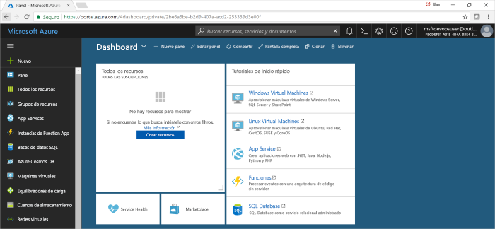

#  <a name="quickstart-create-a-cicd-pipeline-in-azure-pipelines-for-nodejs-with-azure-devops-projects"></a>Inicio rápido: Creación de una canalización de CI/CD en Azure Pipelines para Node.js con Azure DevOps Projects
En este inicio rápido, va a crear una aplicación web progresiva (PWA) de NodeJS mediante [GatsbyJS](https://www.gatsbyjs.org/) y la experiencia simplificada de creación de proyectos de Azure DevOps. Cuando termine, tendrá una canalización de integración continua (CI) y entrega continua (CD) para la PWA en Azure Pipelines. Azure DevOps Projects configura los componentes necesarios para el desarrollo, la implementación y la supervisión.

## <a name="prerequisites"></a>Prerrequisitos

- Una cuenta de Azure con una suscripción activa. [Cree una cuenta gratuita](https://azure.microsoft.com/free/?ref=microsoft.com&utm_source=microsoft.com&utm_medium=docs&utm_campaign=visualstudio). 
- Una organización de [Azure DevOps](https://azure.microsoft.com/services/devops/).

## <a name="sign-in-to-the-azure-portal"></a>Inicio de sesión en Azure Portal

DevOps Projects crea una canalización de CI/CD en Azure Pipelines. Puede crear una organización de Azure DevOps nueva o usar una existente. DevOps Projects también crea recursos de Azure en la suscripción de Azure que prefiera.

1. Inicie sesión en [Azure Portal](https://portal.azure.com) y, en el panel izquierdo, seleccione **Crear un recurso**. 

   

2. Busque **DevOps Project**, selecciónelo y, después, seleccione **Crear**.

  

## <a name="select-a-sample-application-and-azure-service"></a>Seleccione una aplicación de ejemplo y el servicio de Azure

1. Seleccione la aplicación de ejemplo de Node.js.   

  

2. El marco de trabajo de ejemplo predeterminado es **Express.js**. Cambie la selección a **Simple Node.js App** (Aplicación de Node.js sencilla) y seleccione **Siguiente**. 

  

3. Los destinos de implementación disponibles en este paso vienen determinados por el marco de trabajo de la aplicación seleccionado en el paso 2.  En este ejemplo, **Windows Web App** (Aplicación web de Windows) es el destino de implementación predeterminado.  Deje establecido **Web App for Containers** y seleccione **Siguiente**.

  

## <a name="configure-a-project-name-and-an-azure-subscription"></a>Configuración de un nombre de proyecto y una suscripción de Azure

1. En el paso final del flujo de trabajo de creación de proyectos de DevOps, asigne un nombre de proyecto, seleccione una suscripción de Azure y elija **Listo**.  

  

2. Mientras se compila el proyecto y la aplicación se implementa en Azure, se muestra una página de resumen. Después de un breve período, se crea un proyecto en la [organización de Azure DevOps](https://dev.azure.com/) que incluye un repositorio de Git, un panel Kanban, una canalización de implementación, planes de pruebas y los artefactos que requiere la aplicación.  

## <a name="managing-your-project"></a>Administración del proyecto

1. Vaya a **Todos los recursos** y busque el proyecto de DevOps. Seleccione su **proyecto de DevOps**.


2. Se le dirige a un panel donde puede ver la página principal del proyecto, el repositorio de código, la canalización de CI/CD y un vínculo a la aplicación en ejecución. Seleccione la **página principal del proyecto** para ver la aplicación en **Azure DevOps** y, en otra pestaña del explorador, seleccione el **punto de conexión de la aplicación** para ver la aplicación de ejemplo en vivo.  Más adelante se cambiará este ejemplo para usar la PWA generada por GatsbyJS.

 

3. En el proyecto de Azure DevOps, puede invitar a los miembros del equipo a colaborar y establecer un panel Kanban para empezar a realizar el seguimiento del trabajo.  Para más información, consulte [esta página](https://docs.microsoft.com/azure/devops/user-guide/what-is-azure-devops?view=azure-devops).


## <a name="clone-the-repo-and-install-your-gatsby-pwa"></a>Clonación del repositorio e instalación de la PWA de Gatsby

DevOps Projects crea un repositorio de Git en Azure Repos o GitHub. En este ejemplo se ha creado un repositorio de Azure.  El siguiente paso consiste en clonar el repositorio y realizar cambios.

1. Seleccione **Repos** en su **proyecto de DevOps** y, luego, haga clic en **Clonar**.  Hay varios mecanismos para clonar el repositorio de Git en el escritorio.  Elija el que mejor se adapte a su experiencia de desarrollo.  


2. Después de clonar el repositorio en el escritorio, realice algunos cambios en la plantilla de inicio. Para empezar, instale la CLI de GatsbyJS desde el terminal.
```powershell
npm install -g gatsby
```

3. En el terminal, vaya a la raíz del repositorio. Debe contener tres carpetas parecidas a estas:
```powershell
Mode                LastWriteTime         Length Name
----                -------------         ------ ----
d-----        2/23/2020  10:42 PM                Application
d-----        2/23/2020   3:05 PM                ArmTemplates
d-----        2/23/2020   3:05 PM                Tests
```

4. No se necesitan todos los archivos de la carpeta Application porque se va a reemplazar por una plantilla de inicio de Gatsby. Ejecute los siguientes comandos, en secuencia, para recortarla.
```powershell
cp .\Application\Dockerfile .
rmdir Application
```

5. Use la CLI de Gatsby para generar una PWA de ejemplo. Ejecute `gatsby new` desde el terminal para iniciar el asistente para PWA y seleccione `gatsby-starter-blog` como la plantilla de inicio. Debe parecerse a este ejemplo:
```powershell
c:\myproject> gatsby new
√ What is your project called? ... my-gatsby-project
? What starter would you like to use? » - Use arrow-keys. Return to submit.
    gatsby-starter-default
    gatsby-starter-hello-world
>   gatsby-starter-blog
    (Use a different starter)
```

6. Ahora tiene una carpeta denominada `my-gatsby-project`. Cambie su nombre por `Application` y copie en ella `Dockerfile`.
```powershell
mv my-gatsby-project Application
mv Dockerfile Application
```

7. En el editor que prefiera, abra Dockerfile y cambie la primera línea de `FROM node:8` a `FROM node:12`. Este cambio garantiza que el contenedor usa la versión 12.x de Node.js en lugar de la versión 8.x. GatsbyJS requiere versiones más modernas de Node.js.

8. A continuación, abra el archivo package.json en la carpeta Application y edite el [campo de scripts](https://docs.npmjs.com/files/package.json#scripts) para asegurarse de que los servidores de desarrollo y producción escuchan en todas las interfaces de red disponibles (por ejemplo, 0.0.0.0) y el puerto 80. Sin esta configuración, el servicio de aplicaciones de contenedor no puede enrutar el tráfico a la aplicación de Node.js que se ejecuta dentro del contenedor. El campo `scripts` debe parecerse al que se muestra a continuación. En concreto, quiere cambiar los valores predeterminados de `develop`, `serve` y `start`.
```json
  "scripts": {
    "build": "gatsby build",
    "develop": "gatsby develop  -H 0.0.0.0 -p 80",
    "format": "prettier --write \"**/*.{js,jsx,json,md}\"",
    "start": "npm run serve",
    "serve": "npm run build && gatsby serve -H 0.0.0.0 -p 80",
    "clean": "gatsby clean",
    "test": "echo \"Write tests! -> https://gatsby.dev/unit-testing\" && exit 1"
  }
```

## <a name="edit-your-cicd-pipelines"></a>Edición de las canalizaciones de CI/CD

1. Antes de confirmar el código de la sección anterior, realice algunos cambios en las canalizaciones de compilación y versión. Edite la canalización de compilación y actualice la tarea de Node para usar la versión 12.x de Node.js. Establezca el campo **Task version** (Versión de tarea) en 1.x y el campo **Version** (Versión) en 12.x.


2. En este inicio rápido, no se van a crear pruebas unitarias, así que se van a deshabilitar esos pasos en la canalización de compilación. Cuando escriba las pruebas, puede volver a habilitar estos pasos. Haga clic con el botón derecho para seleccionar las tareas etiquetadas **Install test dependencies** (Instalar dependencias de pruebas) y **Run unit tests** (Ejecutar pruebas unitarias) y deshabilitarlas.


3. Edite la canalización de versión.


4. Al igual que con la canalización de compilación, cambie la tarea de Node para usar 12.x y deshabilite las dos tareas de prueba. La versión debería parecerse a esta captura de pantalla.


1. En el lado izquierdo del explorador, vaya al archivo **views/index.pug**.

1. Seleccione **Editar** y, a continuación, realice un cambio en el encabezado h2.  
    Por ejemplo, escriba **Empezar a trabajar de inmediato con Azure DevOps Projects** o haga cualquier otro cambio.

1. Seleccione **Confirmar** y guarde los cambios.

1. En el explorador, vaya al panel de DevOps Projects.   
Debería ver que hay una compilación en curso. Los cambios que ha realizado se compilan e implementan automáticamente mediante una canalización de CI/CD.

## <a name="commit-your-changes-and-examine-the-azure-cicd-pipeline"></a>Confirmación de los cambios y examen de la canalización de CI/CD de Azure

En los dos pasos anteriores, ha agregado una PWA generada por Gatsby al repositorio de Git y ha editado las canalizaciones para compilar e implementar el código. Se puede confirmar el código y ver su progreso mediante la canalización de compilación y versión.

1. Desde la raíz del repositorio de Git del proyecto en un terminal, ejecute los siguientes comandos para insertar el código en el proyecto de Azure DevOps:
```powershell
git add .
git commit -m "My first Gatsby PWA"
git push
```

2. Se inicia una compilación en cuanto se completa `git push`. Puede seguir el progreso desde el **panel de Azure DevOps**.


3. Al cabo de unos minutos, las canalizaciones de compilación y versión finalizarán y la PWA se implementará en un contenedor. Haga clic en el vínculo **Application endpoint** (Punto de conexión de la aplicación) en el panel anterior; verá un proyecto de inicio de Gatsby para blogs.


## <a name="clean-up-resources"></a>Limpieza de recursos

Puede eliminar Azure App Service y otros recursos relacionados que haya creado cuando ya no los necesite. Use la funcionalidad de **eliminación** del panel de DevOps Projects.


## <a name="next-steps"></a>Pasos siguientes

Cuando configura el proceso de CI/CD, se crean automáticamente canalizaciones de compilación y versión. Puede modificar estas canalizaciones para satisfacer las necesidades de su equipo. Para más información acerca de la canalización de CI/CD, consulte:

> [!div class="nextstepaction"]
> [Personalización del proceso de CD](https://docs.microsoft.com/azure/devops/pipelines/release/define-multistage-release-process?view=vsts)

