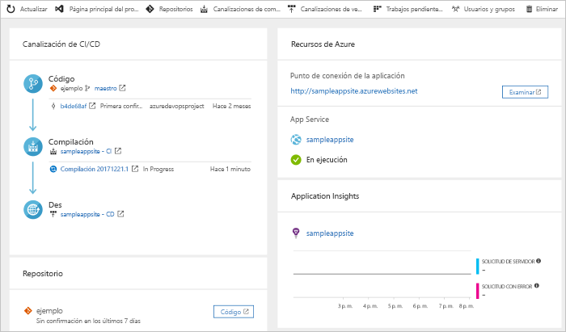

# Creación de una canalización de CI/CD para PHP con Azure DevOps Projects

Azure DevOps Projects ofrece una experiencia simplificada que crea recursos de Azure y configura una canalización de integración continua (CI) y entrega continua (CD) para la aplicación de PHP en Azure Pipelines.  

Si no tiene una suscripción de Azure, puede obtener una gratuita mediante [Visual Studio Dev Essentials](https://visualstudio.microsoft.com/dev-essentials/).

## Inicio de sesión en Azure Portal

 DevOps Projects crea una canalización de CI/CD en Azure Pipelines. Puede crear una organización de Azure DevOps gratuita o usar una existente. DevOps Projects también crea recursos de Azure en la suscripción de Azure que prefiera.

1. Inicie sesión en el [Portal de Microsoft Azure](https://portal.azure.com).

1. En el panel izquierdo, seleccione el icono **Crear un recurso** y, después, busque **DevOps Projects**.  

3. Seleccione **Crear**.

    

## Seleccione una aplicación de ejemplo y el servicio de Azure

1. Seleccione la aplicación de ejemplo de PHP.  
        Los ejemplos de PHP incluyen una opción de varios marcos de trabajo de la aplicación. El marco de trabajo de ejemplo predeterminado es Laravel. 
        
2. Deje la configuración predeterminada y seleccione **Siguiente**.  

1. Web App for Containers es el destino de implementación predeterminado.  
    El marco de trabajo de la aplicación que ha elegido antes determina el tipo de destino de implementación del servicio de Azure que está disponible aquí.  Deje el servicio predeterminado y seleccione **Siguiente**.
 
## Configuración de Azure DevOps y una suscripción de Azure 

1. Cree una organización de Azure DevOps o elija una existente. 

    a. Elija un nombre para el proyecto en Azure DevOps. 
    
    b. Seleccione la suscripción de Azure y la ubicación, escriba el nombre de la aplicación y seleccione **Listo**.   
        En unos minutos, el panel de DevOps Projects se muestra en Azure Portal. Una aplicación de ejemplo se configura en un repositorio en la organización de Azure DevOps, se ejecuta una compilación y la aplicación se implementa en Azure. Este panel proporciona visibilidad del repositorio de código, la canalización de CI/CD y la aplicación de Azure.  
        
2. Seleccione **Examinar** para ver la aplicación en ejecución.

     
    
   DevOps Projects ha configurado automáticamente una compilación de integración continua y un desencadenador de versión.  Ahora ya puede colaborar con un equipo en una aplicación de PHP con un proceso de CI/CD que implemente automáticamente el trabajo más reciente en su sitio web.

## Confirmación de los cambios de código y ejecución de CI/CD

 DevOps Projects crea un repositorio de Git en Azure Repos o GitHub. Para ver el repositorio y realizar cambios en el código de la aplicación, siga estos pasos:

1. En el lado izquierdo del panel de DevOps Projects, seleccione el vínculo de la rama maestra.   
    Este vínculo abre una vista al repositorio de Git recién creado.

1. Para ver la dirección URL de clonación del repositorio, seleccione **Clonar** en la parte superior derecha del explorador.   
    Puede clonar el repositorio de Git en su IDE favorito. En los pasos siguientes, use el explorador web para realizar y confirmar cambios en el código directamente en la rama maestra.

1. En el lado izquierdo, vaya al archivo **resources/views/welcome.blade.php**.

1. Seleccione **Editar** y realice un cambio en alguna parte del texto.  Por ejemplo, cambie parte del texto de una de las etiquetas div.

1. Seleccione **Confirmar** y guarde los cambios.

1. En el explorador, vaya al panel de DevOps Projects.  
Debería ver que hay una compilación en curso. Los cambios que acaba de realizar se compilan e implementan automáticamente a través de una canalización de CI/CD.

## Examen de la canalización de CI/CD

 DevOps Projects configura automáticamente una canalización de CI/CD completa en Azure Pipelines. Explore y personalice la canalización según sea necesario. Para familiarizarse con las canalizaciones de compilación y de versión, siga estos pasos:

1. En la parte superior del panel de DevOps Projects, seleccione **Compilar canalizaciones**.  
    Este vínculo abre una pestaña del explorador y la canalización de compilación del nuevo proyecto.

1. Elija el campo **Estado** y seleccione los **puntos suspensivos** (...).  
    Un menú muestra varias opciones, como poner en cola una nueva compilación, poner en pausa una compilación y editar la canalización de compilación.

1. Seleccione **Editar**.

1. En este panel puede examinar las distintas tareas de la canalización de compilación.  
    La compilación ejecuta varias tareas, como capturar códigos fuente del repositorio de Git, restaurar dependencias y publicar salidas que se usan para las implementaciones.

1. En la parte superior de la canalización de compilación, seleccione el nombre de esta.

1. Cambie el nombre de la canalización de compilación por otro más descriptivo, seleccione **Guardar y poner en cola** y, luego, **Guardar**.

1. En el nombre de la canalización de compilación, seleccione **Historial**.   
    Este panel muestra un registro de auditoría de los cambios recientes de la compilación. Azure Pipelines realiza un seguimiento de los cambios que se realizan en la canalización de compilación y permite comparar versiones.

1. Seleccione **Desencadenadores**.  
      DevOps Projects creó automáticamente un desencadenador de integración continua y cada confirmación en el repositorio inicia una compilación. Si lo desea, puede elegir incluir o excluir ramas del proceso de CI.

1. Seleccione **Retención**.   
    En función del escenario, puede especificar directivas para conservar o quitar un determinado número de compilaciones.

1. Seleccione **Compilación y versión** y, después, **Versiones**.  
     DevOps Projects crea una canalización de versión para administrar implementaciones en Azure.

1. Seleccione los puntos suspensivos (...) que se encuentran junto a la canalización de versión, y, después, **Editar**.  
    La canalización de versión contiene una canalización que define el proceso de versión. 

12. En **Artefactos**, seleccione **Colocar**.  
    La canalización de compilación que ha examinado en los pasos anteriores genera la salida que se usa para el artefacto. 

1. Al lado del icono **Colocar**, seleccione **Desencadenador de implementación continua**.   
    Esta canalización de versión tiene un desencadenador de implementación continua habilitado que ejecuta una implementación cada vez que hay un nuevo artefacto de compilación disponible.  Opcionalmente, puede deshabilitar el desencadenador, con lo que las implementaciones van a requerir una ejecución manual. 

1. En el lado izquierdo, seleccione **Tareas**.  
        Las tareas son las actividades que ejecuta el proceso de implementación.  En este ejemplo, se ha creado una tarea que se implementa en Azure App Service.

1. A la derecha, seleccione **Ver versiones** para mostrar un historial de las versiones.

1. Seleccione los puntos suspensivos (...) junto a una de las versiones y, luego, elija **Abrir**.  
        Hay varios menús para explorar desde esta vista, como un resumen de versiones, elementos de trabajo asociados y pruebas.

1. Seleccione **Confirmaciones**.  
        Esta vista muestra las confirmaciones de código asociadas a la implementación concreta. 

1. Seleccione **Registros**.  
        Los registros contienen información útil sobre el proceso de implementación. Pueden verse durante y después de las implementaciones.

## Limpieza de recursos

Azure App Service y otros recursos relacionados se pueden eliminar cuando no se necesiten. Use la funcionalidad de **eliminación** del panel de DevOps Projects.

## Pasos siguientes

Cuando configuró el proceso de CI/CD, se crearon automáticamente canalizaciones de compilación y de versión. Puede modificar estas canalizaciones de compilación y de versión para satisfacer las necesidades de su equipo. Para más información sobre la canalización de CI/CD, consulte este tutorial:

> [!div class="nextstepaction"]
> [Personalización del proceso de CD](https://docs.microsoft.com/azure/devops/pipelines/release/define-multistage-release-process?view=vsts)
