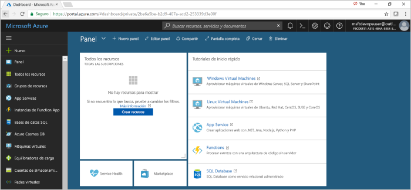

# Creación de una canalización de CI/CD para Python con Azure DevOps Projects

En este inicio rápido se usa la experiencia simplificada de Azure DevOps Projects para configurar una canalización de integración continua (CI) y entrega continua (CD) para una aplicación de Python en Azure Pipelines. Azure DevOps Projects se puede usar para configurar todo lo necesario para desarrollar, implementar y supervisar una aplicación. 

## Prerrequisitos

- Una cuenta de Azure con una suscripción activa. [Cree una cuenta gratuita](https://azure.microsoft.com/free/?ref=microsoft.com&utm_source=microsoft.com&utm_medium=docs&utm_campaign=visualstudio). 
- Una cuenta de [Azure DevOps](https://azure.microsoft.com/services/devops/) y una organización.

## Inicio de sesión en Azure Portal

DevOps Projects crea una canalización de CI/CD en Azure Pipelines. Puede crear una organización de Azure DevOps nueva o usar una existente. DevOps Projects también crea recursos de Azure en la suscripción de Azure que prefiera.

1. Inicie sesión en [Azure Portal](https://portal.azure.com) y, en el panel izquierdo, seleccione **Crear un recurso**. 

   

1. Busque **DevOps Project**, selecciónelo y, después, seleccione **Crear**.

## Seleccione una aplicación de ejemplo y el servicio de Azure

1. Seleccione la aplicación de ejemplo de Python. Los ejemplos de Python incluyen una opción de varios marcos de trabajo de la aplicación.

1. El marco de ejemplo predeterminado es Django. Deje la configuración predeterminada y seleccione **Siguiente**.    
Web App for Containers es el destino de implementación predeterminado. El marco de trabajo de la aplicación que ha elegido antes determina el tipo de destino de implementación del servicio de Azure disponible aquí. 

3. Deje el servicio predeterminado y seleccione **Siguiente**.
 
## Configuración de Azure DevOps y una suscripción de Azure 

1. Cree una organización de Azure DevOps nueva o elija una existente. 

    a. Escriba el nombre del proyecto en Azure DevOps.  

    b. Seleccione la suscripción de Azure y la ubicación, escriba el nombre de la aplicación y seleccione **Listo**.  
     En unos minutos, el panel del proyecto se muestra en Azure Portal. Una aplicación de ejemplo se configura en un repositorio en la organización de Azure DevOps, se ejecuta una compilación y la aplicación se implementa en Azure. Este panel proporciona visibilidad del repositorio de código, la canalización de CI/CD y la aplicación de Azure.  
    
2. Seleccione **Examinar** para ver la aplicación en ejecución.

     
    
   DevOps Projects configura automáticamente una compilación de integración continua y un desencadenador de versión. A partir de ese momento ya puede empezar a colaborar con un equipo en una aplicación de Python mediante el uso de un proceso de CI/CD que implemente automáticamente el trabajo más reciente en su sitio web.

## Confirmación de los cambios de código y ejecución de CI/CD

 DevOps Projects crea un repositorio de Git en Azure Repos o GitHub. Para ver el repositorio y realizar cambios en el código de la aplicación, siga estos pasos: 

1. En el lado izquierdo del panel de DevOps Projects, seleccione el vínculo de la rama maestra.  
        Este vínculo abre una vista al repositorio de Git recién creado.

1. Para ver la dirección URL de clonación del repositorio, seleccione **Clonar** en la parte superior derecha del explorador.   
Puede clonar el repositorio de Git en su IDE favorito.  En los pasos siguientes, puede usar el explorador web para realizar los cambios en el código y confirmarlos directamente en la rama maestra.

1. En el lado izquierdo, vaya al archivo **app/templates/app/index.html**.

1. Seleccione **Editar** y realice un cambio en algún texto. Por ejemplo, cambie parte del texto de una de las etiquetas div.

1. Seleccione **Confirmar** y guarde los cambios.

1. En el explorador, vaya al panel de DevOps Projects.   
    Debería ver que hay una compilación en curso. Los cambios que acaba de realizar se compilan e implementan automáticamente a través de una canalización de CI/CD.

## Examen de la canalización de CI/CD

En el paso anterior, DevOps Projects configuró automáticamente una canalización de CI/CD completa. Explore y personalice la canalización según sea necesario. Para familiarizarse con las canalizaciones de compilación y de versión, siga estos pasos:

1. En la parte superior del panel de DevOps Projects, seleccione **Compilar canalizaciones**.  
Una pestaña del explorador muestra la canalización de compilación del nuevo proyecto.

1. Elija el campo **Estado** y seleccione los **puntos suspensivos** (...).  
        Un menú muestra varias opciones, como poner en cola una nueva compilación, poner en pausa una compilación y editar la canalización de compilación.

1. Seleccione **Editar**.

1. En este panel puede examinar las distintas tareas de la canalización de compilación.  
        La compilación ejecuta varias tareas, como capturar códigos fuente del repositorio Git, restaurar dependencias y publicar salidas de implementaciones.

1. En la parte superior de la canalización de compilación, seleccione el nombre de esta.

1. Cambie el nombre de la canalización de compilación por otro más descriptivo, seleccione **Guardar y poner en cola** y, luego, **Guardar**.

1. En el nombre de la canalización de compilación, seleccione **Historial**.  
        Verá un registro de auditoría de los cambios recientes de la compilación.  Azure DevOps realiza un seguimiento de los cambios realizados en la canalización de compilación y permite comparar las versiones.

1. Seleccione **Desencadenadores**.  
         DevOps Projects crea automáticamente un desencadenador de integración continua y cada confirmación al repositorio inicia una compilación.  Si lo desea, puede elegir incluir o excluir ramas del proceso de CI.

1. Seleccione **Retención**.  
        En función del escenario, puede especificar directivas para conservar o quitar un determinado número de compilaciones.

1. Seleccione **Compilación y versión** y, después, elija **Versiones**.   
 DevOps Projects crea una canalización de versión para administrar implementaciones en Azure.

1. Seleccione los puntos suspensivos (...) que se encuentran junto a la canalización de versión, y, después, **Editar**.  
La canalización de versión define el proceso de versión.  
        
12. En **Artefactos**, seleccione **Colocar**.   
La canalización de compilación que ha examinado en los pasos anteriores genera la salida que se usa para el artefacto. 

1. Al lado del icono **Colocar**, seleccione **Desencadenador de implementación continua**.  
        La canalización de versión tiene un desencadenador de implementación continua habilitado que ejecuta una implementación cada vez que hay un nuevo artefacto de compilación disponible. Opcionalmente, puede deshabilitar el desencadenador, con lo que las implementaciones van a requerir una ejecución manual. 

1. En el lado izquierdo, seleccione **Tareas**.   
Las tareas son las actividades que ejecuta el proceso de implementación. En este ejemplo, se ha creado una tarea que se implementa en Azure App Service.

1. A la derecha, seleccione **Ver versiones** para mostrar un historial de las versiones.  
        
1. Seleccione los puntos suspensivos (...) junto a una de las versiones y, luego, seleccione **Abrir**.  
        Hay varios menús que se pueden explorar desde esta vista, como un resumen de versiones, elementos de trabajo asociados y pruebas.

1. Seleccione **Confirmaciones**. 
        Esta vista muestra las confirmaciones de código asociadas a la implementación concreta. 

1. Seleccione **Registros**.   
Los registros contienen información útil sobre el proceso de implementación. Se pueden ver tanto durante las implementaciones como después de ellas.

## Limpieza de recursos

Azure App Service y los recursos relacionados se pueden eliminar cuando no se necesiten. Use la funcionalidad de **eliminación** del panel de DevOps Projects.

## Pasos siguientes

Cuando configuró el proceso de CI/CD, se crearon automáticamente canalizaciones de compilación y de versión. Puede modificar estas canalizaciones de compilación y de versión para satisfacer las necesidades de su equipo. Para más información acerca de la canalización de CI/CD, consulte:

> [!div class="nextstepaction"]
> [Personalización del proceso de CD](https://docs.microsoft.com/azure/devops/pipelines/release/define-multistage-release-process?view=vsts)
