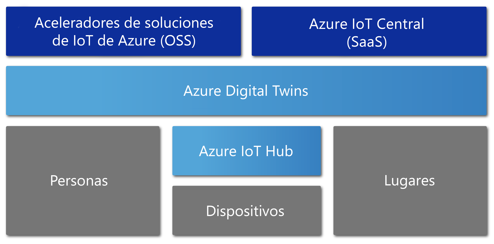

# Introducción a Azure Digital Twins

Azure Digital Twins es un servicio de Azure IoT que crea modelos completos del entorno físico. Entre sus muchas características está la posibilidad de crear grafos de inteligencia espacial para modelar las relaciones y las interacciones entre personas, espacios y dispositivos.

Azure Digital Twins permite consultar datos desde un espacio físico en lugar de hacerlo desde muchos sensores dispares. Este servicio le ayuda a crear experiencias reutilizables, muy escalables y conscientes del espacio que vinculan el streaming de los datos entre el mundo físico y digital. Tanto si va a predecir las necesidades de mantenimiento de una fábrica, mediante el análisis de los requisitos de energía en tiempo real de una red eléctrica, o a optimizar el uso del espacio disponible para una oficina, sus aplicaciones se mejoran gracias a estas características contextuales especialmente importantes.

Azure Digital Twins se aplica a todo tipo de entornos, por ejemplo, almacenes, oficinas, colegios, hospitales, bancos, estadios, fábricas, aparcamientos, parques, redes eléctricas inteligentes y ciudades. Piense en escenarios como realizar el seguimiento de la temperatura diaria en varios estados, supervisar las rutas de dron concurridas, identificar vehículos autónomos, analizar los niveles de ocupación de un edificio o encontrar la caja registradora más congestionada de la tienda. Sea cual sea su escenario empresarial real, se puede aprovisionar un caso digital correspondiente mediante Azure Digital Twins.

En el vídeo siguiente se analiza Digital Twins con mayor profundidad:

> [!VIDEO https://www.youtube.com/embed/TvN_NxpgyzQ]

## Principales capacidades

Las principales funcionalidades de Azure Digital Twins incluyen:

### Grafo de inteligencia espacial

El [*grafo de inteligencia espacial*](./concepts-objectmodel-spatialgraph.md) o *grafo espacial* es una representación virtual del entorno físico que permite modelar las relaciones entre personas, lugares y dispositivos.

Piense en una aplicación de servicios públicos inteligentes que podría suponer la conexión de varios metros de uso de electricidad en un barrio. Para supervisar y predecir con precisión el uso y la factura de electricidad, la empresa de servicios públicos inteligentes debe modelar cada dispositivo y sensor con contexto sobre la ubicación y el cliente al que se facturará. El grafo de inteligencia espacial le permite modelar estos tipos de relaciones complejas.

### Modelos de objetos gemelos digitales

Los [modelos de objetos gemelos digitales](./concepts-objectmodel-spatialgraph.md) son esquemas de datos y protocolos de dispositivo predefinidos que alinean las necesidades específicas del dominio de la solución para acelerar y simplificar el desarrollo.

Por ejemplo, una aplicación de ocupación de habitaciones podría usar tipos de espacios predefinidos, como campus, edificio, piso, habitación, etc.

### Inquilinos múltiples y anidados

Puede crear soluciones que se escalen de forma segura y que se puedan reutilizar para varios inquilinos. También puede crear varios subinquilinos cuyo acceso y uso se puede realizar de forma aislada y segura.

Por ejemplo, se podría configurar una aplicación de utilización del espacio para aislar los datos de un inquilino de los datos de otro inquilino dentro de un solo edificio, o para combinar los datos de un único inquilino con varios edificios.

### Funcionalidades de proceso avanzadas

Las funcionalidades de proceso avanzadas llamadas [funciones definidas por el usuario](./concepts-user-defined-functions.md) le permiten definir y ejecutar funciones personalizadas con [datos de dispositivo](./concepts-device-ingress.md) de entrada para enviar señales a puntos de conexión predefinidos. Esta funcionalidad mejora la personalización y la automatización de tareas de dispositivos.

Por ejemplo, una aplicación de agricultura inteligente podría incluir una función definida por el usuario para evaluar las lecturas del sensor de humedad del suelo, así como la previsión meteorológica, para luego enviar señales sobre las necesidades de riego.

### Control de acceso integrado

Las características de administración de acceso e identidad, como [control de acceso basado en rol](./security-role-based-access-control.md) y [Azure Active Directory](./security-authenticating-apis.md) le permiten controlar de forma segura el acceso de los individuos y los dispositivos.

Por ejemplo, una aplicación de administración de instalaciones se podría configurar para permitir que los ocupantes de una habitación ajusten la temperatura dentro de un intervalo especificado y que los responsables de las instalaciones ajusten la temperatura de cualquier habitación en cualquier valor.

### Ecosistema

Es posible conectar una instancia de Azure Digital Twins a muchos servicios de Azure eficaces, como: Azure Stream Analytics, AI y servicios de almacenamiento, así como Azure Maps, Microsoft Mixed Reality, Dynamics 365 u Office 365.

Por ejemplo, una aplicación de edificios de oficinas inteligentes podría usar Azure Digital Twins para representar los equipos y dispositivos que se encuentran en muchas plantas. A medida que los dispositivos transmiten los datos en vivo a la instancia de Digital Twin aprovisionada, Azure Stream Analytics puede procesar esos datos para proporcionar conclusiones clave a partir de las cuales poder actuar. Luego, los datos se pueden almacenar en Azure Storage y convertir en un formato de archivo que se puede compartir para distribuirlo a toda la organización mediante Office 365.

## Soluciones que se benefician de Azure Digital Twins

Azure Digital Twins resulta de utilidad para representar el mundo físico y sus muchas relaciones, dado que simplifica el modelado, el procesamiento de datos, el control de eventos y el seguimiento de dispositivos IoT. Piense solo en unos cuantos de los siguientes escenarios, de varios sectores industriales, que se benefician de su uso:

* Mostrar a una empresa de administración de propiedades los niveles de ocupación de un espacio a lo largo del tiempo para obtener conclusiones sobre las mejores maneras de configurar su edificio de oficinas.
* Desencadenar vales de órdenes de trabajo para una aplicación móvil que controla el envío de guardas de seguridad, programar servicios de conserjería y cualquier otro servicio en un espacio de comercio minorista o instalación deportiva.
* Mostrar al ocupante de un edificio qué habitaciones están ocupadas en un edificio en tiempo real. Luego, ayudar al ocupante a reservar espacios de trabajo que se ajusten a sus necesidades.
* Realizar un seguimiento del lugar donde se encuentran los recursos dentro de un espacio.
* Optimizar la carga de vehículos eléctricos mediante el modelado de las preferencias del usuario y las restricciones de la red eléctrica.

## Azure Digital Twins en el contexto de otros servicios de IoT

Azure Digital Twins usa Azure IoT Hub para conectar los dispositivos y sensores IoT que mantienen todo actualizado con el mundo físico. En el diagrama siguiente se muestra cómo se relaciona Azure Digital Twins con otros servicios de Azure IoT:

Para obtener una descripción más detallada sobre el resto del ecosistema de IoT, consulte [Soluciones y tecnologías de Azure IoT](https://docs.microsoft.com/azure/iot-fundamentals/iot-services-and-technologies).

## Pasos siguientes

Continúe con una pequeña demostración de las funcionalidades de Azure Digital Twins:

> [!div class="nextstepaction"]
> [Guía de inicio rápido: Búsqueda de habitaciones disponibles mediante Azure Digital Twins](./quickstart-view-occupancy-dotnet.md)

Profundice en una aplicación de administración de instalaciones mediante Azure Digital Twins:

> [!div class="nextstepaction"]
> [Tutorial: Implementación de Azure Digital Twins y configuración de un grafo espacial](./tutorial-facilities-setup.md)

Conozca los conceptos básicos de Azure Digital Twins:

> [!div class="nextstepaction"]
> [Modelo de objetos de Digital Twins y grafo de inteligencia espacial](./concepts-objectmodel-spatialgraph.md)
