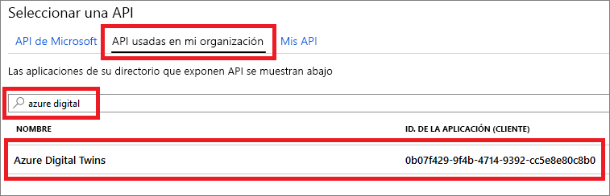
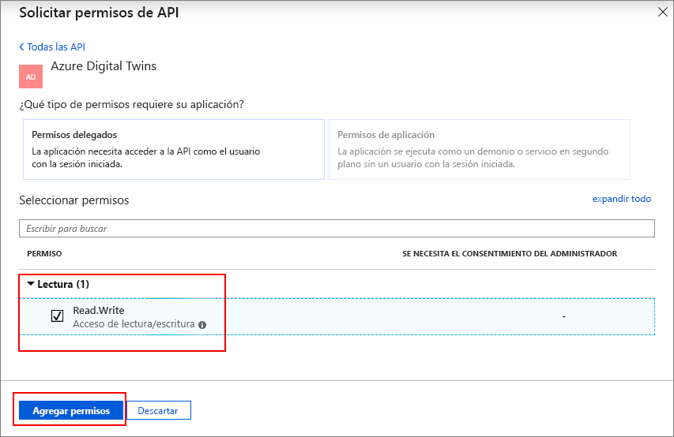
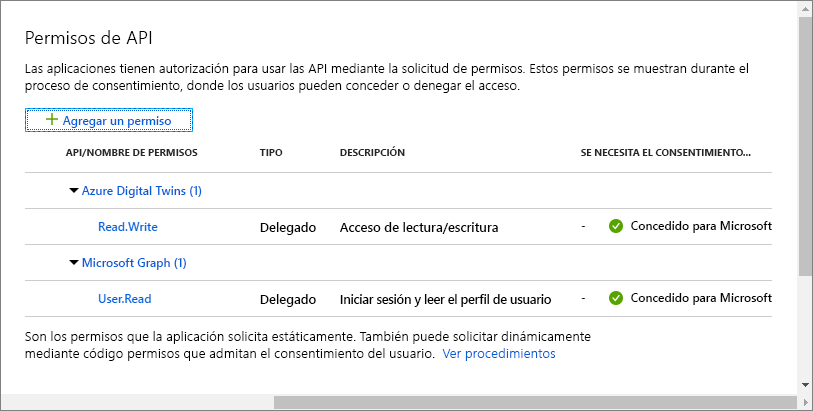
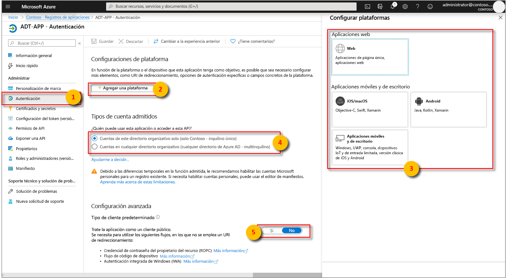
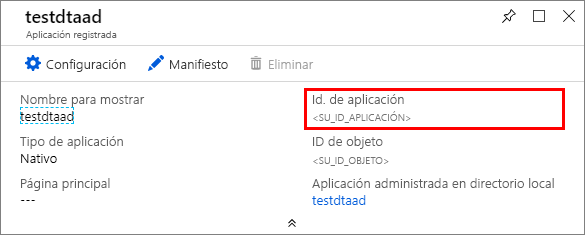

# <a name="how-to-configure-postman-for-azure-digital-twins"></a>Configuración de Postman para Azure Digital Twins

En este artículo se describe cómo configurar el cliente de REST de Postman para interactuar con las API de administración de Azure Digital Twins y probarlas. En concreto, trata:

* Cómo configurar una aplicación de Azure Active Directory para usar el flujo de concesión implícita de OAuth 2.0.
* Cómo usar el cliente REST de Postman para realizar solicitudes HTTP que admiten token a las API de administración.
* Cómo usar Postman para realizar solicitudes POST de varias partes en las API de administración.

## <a name="postman-summary"></a>Resumen de Postman

Empiece a trabajar en Azure Digital Twins mediante una herramienta de cliente REST, como [Postman](https://www.getpostman.com/), para preparar el entorno de pruebas local. El cliente de Postman le ayuda a crear rápidamente las solicitudes HTTP complejas. Descargue la versión de escritorio del cliente Postman visitando [www.getpostman.com/apps](https://www.getpostman.com/apps).

[Postman](https://www.getpostman.com/) es herramienta de pruebas REST que localiza funcionalidades clave de solicitudes HTTP en un escritorio útil y la interfaz gráfica de usuario basada en complementos.

A través del cliente Postman, los programadores de soluciones pueden especificar el tipo de solicitud HTTP (*POST*, *GET*, *UPDATE*, *PATCH* y *DELETE*), el punto de conexión API para llamar y el uso de SSL. Postman también admite la incorporación de encabezados de solicitud HTTP, parámetros, datos de formulario y cuerpos.

## <a name="configure-azure-active-directory-to-use-the-oauth-20-implicit-grant-flow"></a>Configuración de Azure Active Directory para usar el flujo de concesión implícita de OAuth 2.0

Configure la aplicación Azure Active Directory para usar el flujo de concesión implícita de OAuth 2.0.

1. Abra el panel **Permisos de API** para el registro de la aplicación. Seleccione el botón **Agregar un permiso**. En el panel **Solicitud de permisos de API**, seleccione la pestaña **API usadas en mi organización** y, a continuación, busque:
    
    1. `Azure Digital Twins`. Seleccione la API **Azure Digital Twins**.

        [](../../includes/media/digital-twins-permissions/aad-aap-search-api-dt.png#lightbox)

    1. También puede buscar `Azure Smart Spaces Service`. Seleccione la API de **Azure Smart Spaces Service**.

        [](../../includes/media/digital-twins-permissions/aad-app-search-api.png#lightbox)

    > [!IMPORTANT]
    > El nombre e identificador de la API de Azure AD que se muestran dependerán de su inquilino:
    > * Las cuentas de cliente y los inquilinos de prueba deben buscar `Azure Digital Twins`.
    > * Otras cuentas de Microsoft deben buscar `Azure Smart Spaces Service`.

1. La API seleccionada se muestra como **Azure Digital Twins** en el mismo panel **Solicitud de permisos de API**. Seleccione la lista desplegable **Read (1)** (Lectura [1]) y, a continuación, activa la casilla **Read.Write**. Seleccione el botón **Agregar permisos**.

    [](../../includes/media/digital-twins-permissions/aad-app-req-permissions.png#lightbox)

1. Dependiendo de la configuración de la organización, es posible que tenga que tomar medidas adicionales para conceder acceso de administrador a esta API. Para más información, póngase en contacto con el administrador. Una vez aprobado el acceso de administrador, la columna **CONSENTIMIENTO DEL ADMINISTRADOR NECESARIO** en el panel **Permisos de API** se mostrará de forma similar a lo siguiente para las API:

    [](../../includes/media/digital-twins-permissions/aad-app-admin-consent.png#lightbox)

1. Configure un segundo **URI de redirección** para `https://www.getpostman.com/oauth2/callback`.

    [](media/how-to-configure-postman/authentication-redirect-uri.png#lightbox)

1. Para asegurarse de que [la aplicación esté registrada como **cliente público**](https://docs.microsoft.com/azure/active-directory/develop/scenario-desktop-app-registration), abra el panel **Autenticación** para el registro de la aplicación y desplácese hacia abajo en ese panel. En la sección **Tipo de cliente predeterminado**, seleccione **Sí** para **Tratar la aplicación como cliente público** y elija **Guardar**.

    Consulte **Tokens de acceso** para habilitar la opción **oauth2AllowImplicitFlow** en el archivo Manifest.json.

    [](../../includes/media/digital-twins-permissions/aad-configure-public-client.png#lightbox)

1. Copie y mantenga el valor de **Id. de aplicación** de la aplicación de Azure Active Directory. Se usa en los pasos siguientes.

   [](../../includes/media//digital-twins-permissions/aad-app-reg-app-id.png#lightbox)


## <a name="obtain-an-oauth-20-token"></a>Obtención de un token de OAuth 2.0

[!INCLUDE [digital-twins-management-api](../../includes/digital-twins-management-api.md)]

Instale y configure Postman para obtener un token de Azure Active Directory. Después, realice una solicitud HTTP autenticada a Azure Digital Twins mediante el token adquirido:

1. Asegúrese de que el valor de **Dirección URL de autorización** es correcto. Debe tener el formato siguiente:

    ```plaintext
    https://login.microsoftonline.com/YOUR_AZURE_TENANT.onmicrosoft.com/oauth2/authorize?resource=0b07f429-9f4b-4714-9392-cc5e8e80c8b0
    ```

    | Nombre  | Reemplazar por | Ejemplo |
    |---------|---------|---------|
    | YOUR_AZURE_TENANT | El nombre de su inquilino u organización. Use el nombre descriptivo en lugar del **identificador de inquilino** alfanumérico del registro de la aplicación de Azure Active Directory. | `microsoft` |

1. Vaya a [www.getpostman.com](https://www.getpostman.com/) para descargar la aplicación.

1. Abra la aplicación Postman, haga clic en New | Create new (Nuevo | Crear nuevo) y seleccione Request (Solicitud). Escriba un nombre de solicitud. Seleccione una colección o carpeta donde guardarlo y haga clic en Guardar. 

1. Queremos realizar una solicitud GET. Seleccione la pestaña **Autorización**, seleccione OAuth 2.0 y luego **Get New Access Token** (Obtener nuevo token de acceso).

    | Campo  | Value |
    |---------|---------|
    | Tipo de concesión | `Implicit` |
    | Dirección URL de devolución de llamadas | `https://www.getpostman.com/oauth2/callback` |
    | Dirección URL de autenticación | Use la **Dirección URL de autorización** del **paso 2** |
    | Id. de cliente | Use el valor de **Id. de aplicación** para la aplicación de Azure Active Directory que se creó o se reutilizó en la sección anterior. |
    | Ámbito | Déjelo en blanco |
    | State | Déjelo en blanco |
    | Autenticación de clientes | `Send as Basic Auth header` |

1. Ahora, el cliente debe aparecer como:

    [](media/how-to-configure-postman/configure-postman-oauth-token.png#lightbox)

1. Seleccione **Request Token** (Solicitar token).
  
1. Desplácese hacia abajo y seleccione **Use Token** (Usar token).

## <a name="make-a-multipart-post-request"></a>Realizar una solicitud POST con varias partes

Después de completar los pasos anteriores, configure Postman para realizar una solicitud POST de varias partes HTTP autenticada:

1. En la pestaña **Encabezados**, agregue una clave de encabezado de solicitud HTTP **Content-Type** con el valor `multipart/mixed`.

   [](media/how-to-configure-postman/configure-postman-content-type.png#lightbox)

1. Serialice los datos no textuales en archivos. Los datos JSON se guardarían como archivo JSON.
1. En la pestaña **Cuerpo**, seleccione `form-data`. 
1. Agregue cada archivo; para ello, asigne un nombre de **clave`File` y seleccione** .
1. A continuación, seleccione cada archivo con el botón **Elegir archivo**.

   [](media/how-to-configure-postman/configure-postman-form-body.png#lightbox)

   >[!NOTE]
   > * El cliente de Postman no requiere que los fragmentos de varias partes tengan asignado manualmente **Content-Type** o **Content-Disposition**.
   > * No es necesario especificar esos encabezados para cada parte.
   > * Debe seleccionar `multipart/mixed` u otro **Content-Type** adecuado para toda la solicitud.

1. Por último, seleccione **Enviar** para enviar la solicitud HTTP POST con varias partes. Un código de estado de `200` o `201` indica una solicitud correcta. El mensaje de respuesta correspondiente aparecerá en la interfaz de cliente.

1. Valide los datos de la solicitud HTTP POST llamando al punto de conexión de la API: 

   ```URL
   YOUR_MANAGEMENT_API_URL/spaces/blobs?includes=description
   ```

## <a name="next-steps"></a>Pasos siguientes

- Para obtener información acerca de las API de administración de Digital Twins y cómo usarlas, lea [How to use Azure Digital Twins management APIs](how-to-navigate-apis.md) (Uso de las API de administración de Azure Digital Twins).

- Use las solicitudes de varias partes para [agregar blobs a las entidades de Azure Digital Twins](./how-to-add-blobs.md).

- Para aprender sobre la autenticación con la API de administración, lea [Conexión y autenticación en las API](./security-authenticating-apis.md).
