# <a name="quickstart-create-a-hybrid-mode-instance-with-azure-portal--azure-database-migration-service"></a>Inicio rápido: Creación de una instancia en modo híbrido con Azure Portal y Azure Database Migration Service

Azure Database Migration Service en modo híbrido administra las migraciones de base de datos mediante un trabajo de migración que se hospeda de forma local junto con una instancia de Azure Database Migration Service que se ejecuta en la nube. El modo híbrido es especialmente útil en escenarios en los que hay una falta de conectividad de sitio a sitio entre la red local y Azure, o si hay un ancho de banda limitado de conectividad de sitio a sitio.

>[!NOTE]
>Actualmente, cuando Azure Database Migration Service se ejecuta en modo híbrido admite migraciones de SQL Server a:
>
>- Una instancia de Azure SQL Database con un tiempo de inactividad próximo a cero (en línea).
>- Una base de datos única de Azure SQL Database con cierto tiempo de inactividad (sin conexión).
>- MongoDb a Azure CosmosDB con un tiempo de inactividad próximo a cero (en línea).
>- MongoDb a Azure CosmosDB con cierto tiempo de inactividad (sin conexión).

En este inicio rápido, puede usar Azure Portal para crear una instancia de Azure Database Migration Service en modo híbrido. Después, descargue, instale y configure Hybrid Worker en la red local. Durante la versión preliminar, puede usar Azure Database Migration Service en modo híbrido para migrar los datos de una instancia de SQL Server local a Azure SQL Database.

> [!NOTE]
> El instalador híbrido de Azure Database Migration Service se ejecuta en Microsoft Windows Server 2012 R2, Windows Server 2016, Windows Server 2019 y Windows 10.

> [!IMPORTANT]
> El instalador híbrido de Azure Database Migration Service requiere .NET 4.7.2, o cualquier versión posterior. Para encontrar las versiones más recientes de .NET, consulte la página de [descarga de .NET Framework](https://dotnet.microsoft.com/download/dotnet-framework).

Si no tiene una suscripción a Azure, cree una cuenta [gratuita](https://azure.microsoft.com/free/) antes de empezar.

## <a name="sign-in-to-the-azure-portal"></a>Inicio de sesión en Azure Portal

Abra el explorador web, vaya a [Microsoft Azure Portal](https://portal.azure.com/) y, a continuación, escriba sus credenciales para iniciar sesión en el portal.

La vista predeterminada es el panel del servicio.

## <a name="register-the-resource-provider"></a>Registrar el proveedor de recursos

Registre el proveedor de recursos Microsoft.DataMigration antes de crear su primera instancia de Azure Database Migration Service.

1. En Azure Portal, seleccione **Suscripciones**, seleccione la suscripción en la que quiere crear la instancia de Azure Database Migration Service y después seleccione **Proveedores de recursos**.

    

2. Busque la migración y después, a la derecha de **Microsoft.DataMigration**, seleccione **Registrar**.

    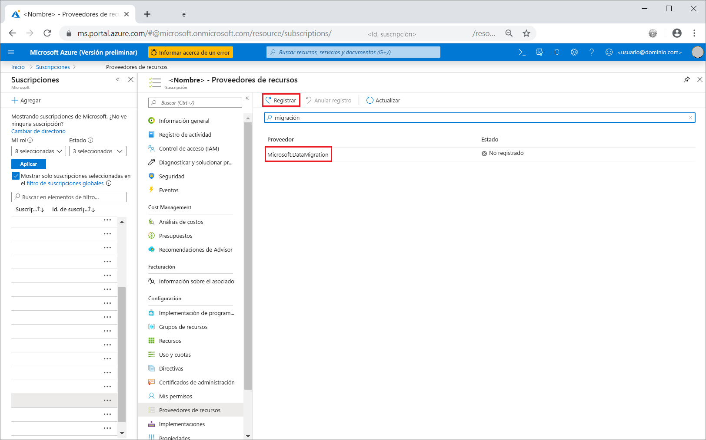

## <a name="create-an-instance-of-the-service"></a>Creación de una instancia del servicio

1. Seleccione +**Crear un recurso** para crear una instancia de Azure Database Migration Service.

2. Busque "migration" en Marketplace, seleccione **Azure Database Migration Service** y, luego, en la pantalla **Azure Database Migration Service**, seleccione **Crear**.

3. En la pantalla **Crear el servicio de migración**:

    - Elija un **nombre del servicio** que sea fácil de recordar y único para identificar la instancia de Azure Database Migration Service.
    - Seleccione la **suscripción** de Azure donde desea crear la instancia.
    - Seleccione un **Grupo de recursos** existente o cree uno.
    - Elija la **ubicación** más cercana a su servidor de origen o de destino.
    - Para el **Modo de servicio**, seleccione **Hybrid (versión preliminar)** .

         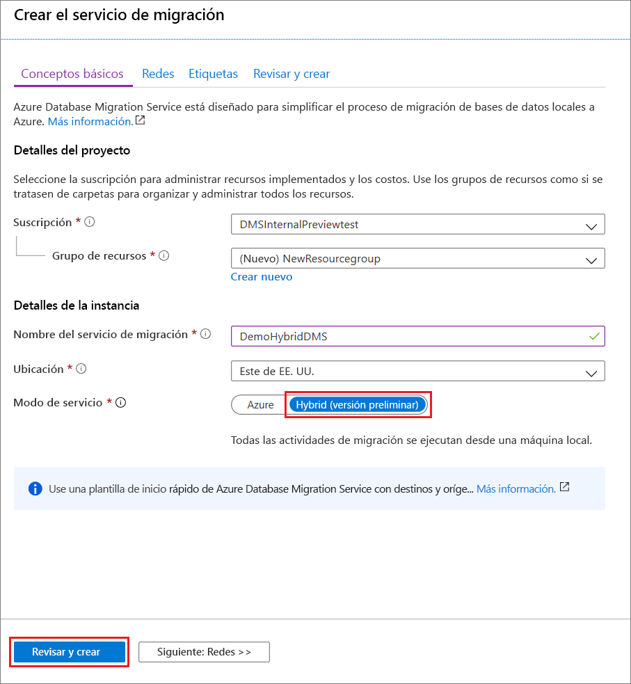

4. Seleccione **Revisar + crear**.

5. En la pestaña **Revisar + crear**, revise los términos, compruebe la información que se proporciona y, a continuación, seleccione **Crear**.

    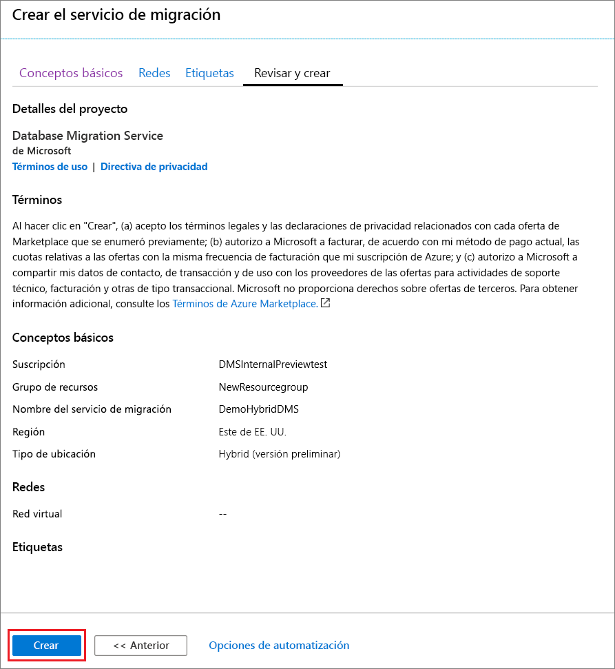

    Transcurridos unos instantes, se creará la instancia de Azure Database Migration Service en modo híbrido y estará lista para usarse. La instancia de Azure Database Migration Service se muestra tal como aparece en la imagen siguiente:

    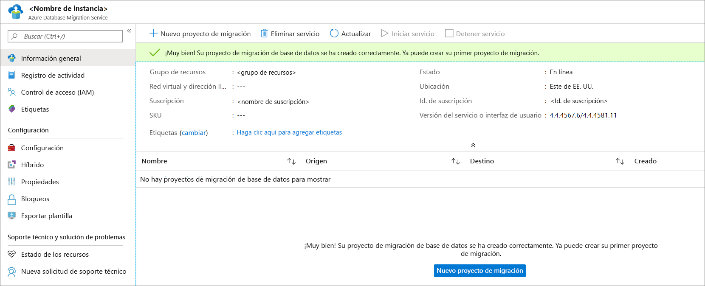

6. Después de crear el servicio, seleccione **Propiedades** y, después, copie el valor que se muestra en el cuadro **Id. de recurso**, que usará para instalar el trabajo híbrido de Azure Database Migration Service.

    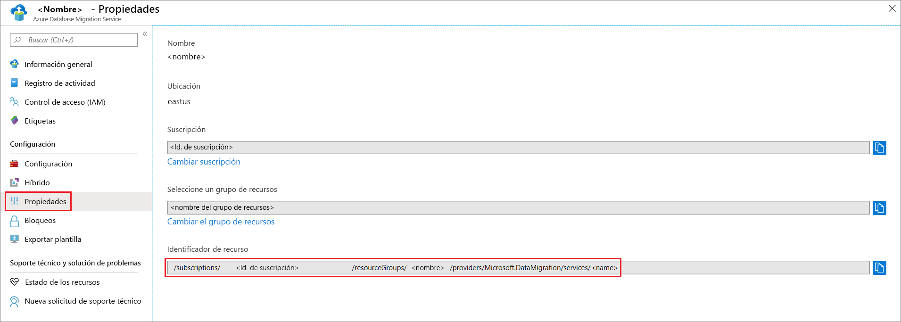

## <a name="create-azure-app-registration-id"></a>Creación de un Id. de registro de aplicación de Azure

Debe crear un Id. de registro de aplicación de Azure que Hybrid Worker local pueda usar para comunicarse con Azure Database Migration Service en la nube.

1. En Azure Portal, seleccione **Azure Active Directory**, **Registros de aplicaciones** y **Nuevo registro**.
2. Especifique un nombre para la aplicación y, a continuación, en **Tipos de cuenta admitidos**, seleccione el tipo de cuentas que quiere admitir para especificar quién puede usar la aplicación.

    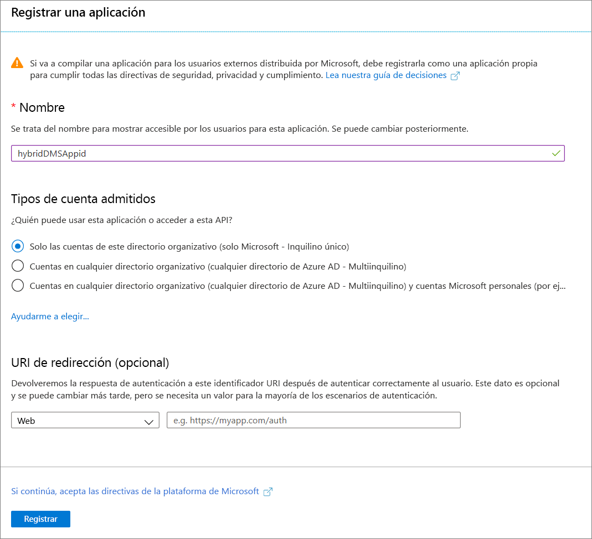

3. Use los valores predeterminados para los campos de **URI de redireccionamiento (opcional)** y, a continuación, seleccione **Registrar**.

4. Una vez completado el registro del Id. de la aplicación, tome nota del **Id. de la aplicación (cliente)** , que usará al instalar Hybrid Worker.

5. En Azure Portal, vaya a Azure Database Migration Service, seleccione **Control de acceso (IAM)** y, a continuación, seleccione **Agregar asignación de roles** para asignar el acceso de colaborador al Id. de la aplicación.

    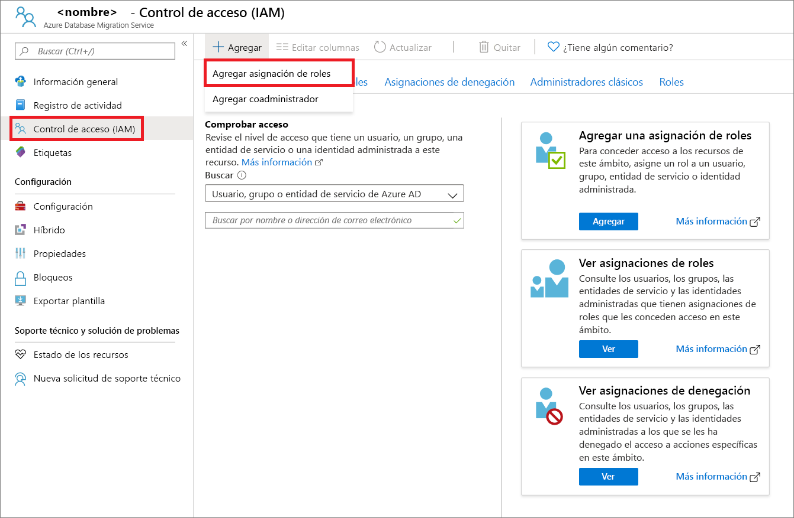

6. Seleccione **Colaborador** como rol, asigne el acceso a **Usuario de Azure AD o entidad de servicio** y, a continuación, seleccione el nombre del Id. de aplicación.

    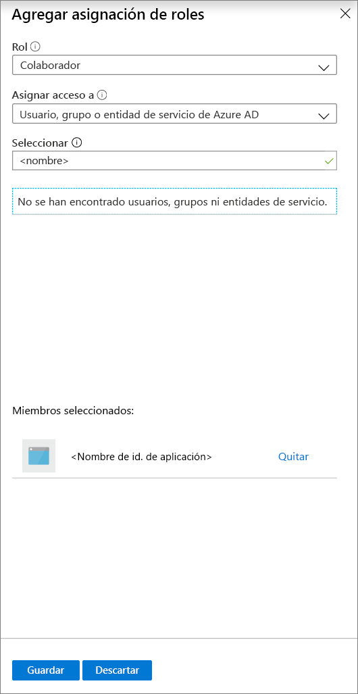

7. Seleccione **Guardar** para guardar la asignación de roles para el Id. de aplicación en el recurso de Azure Database Migration Service.

## <a name="download-and-install-the-hybrid-worker"></a>Descarga e instalación de Hybrid Worker

1. En Azure Portal, vaya a su instancia de Azure Database Migration Service

2. En **Configuración**, seleccione **Hybrid** y, a continuación, seleccione **Descarga del instalador** para descargar e instalar Hybrid Worker.

    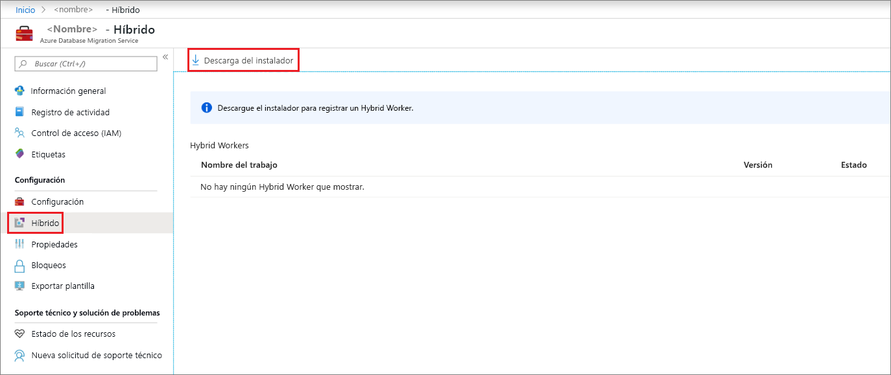

3. Extraiga el archivo ZIP en el servidor que hospedará al Hybrid Worker de Azure Database Migration Service.

    > [!IMPORTANT]
    > El instalador híbrido de Azure Database Migration Service requiere .NET 4.7.2, o cualquier versión posterior. Para encontrar las versiones más recientes de .NET, consulte la página de [descarga de .NET Framework](https://dotnet.microsoft.com/download/dotnet-framework).

4. En la carpeta de instalación, busque y abra el archivo **dmsSettings.json**, especifique los valores de **ApplicationId** y **resourceId**, y guarde el archivo.

    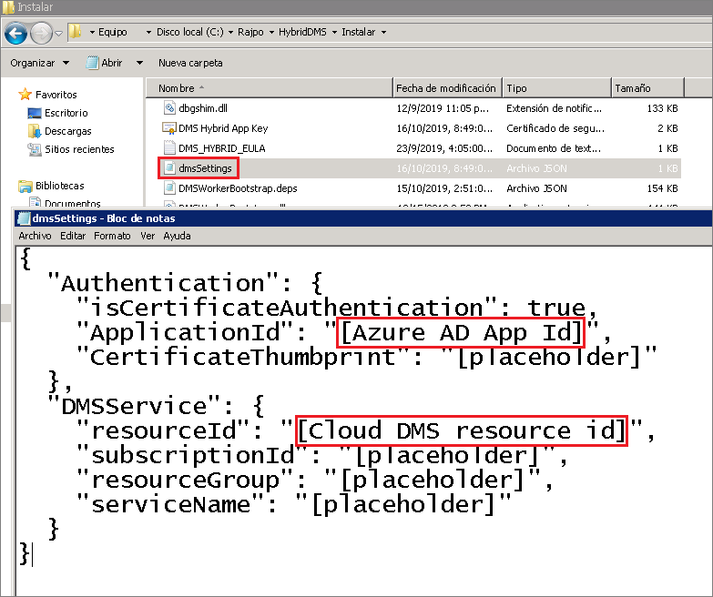

5. Genere un certificado que Azure Database Migration Service pueda utilizar para autenticar la comunicación desde Hybrid Worker mediante el siguiente comando.

    ```
    <drive>:\<folder>\Install>DMSWorkerBootstrap.exe -a GenerateCert
    ```

    Se genera un certificado en la carpeta Install.

    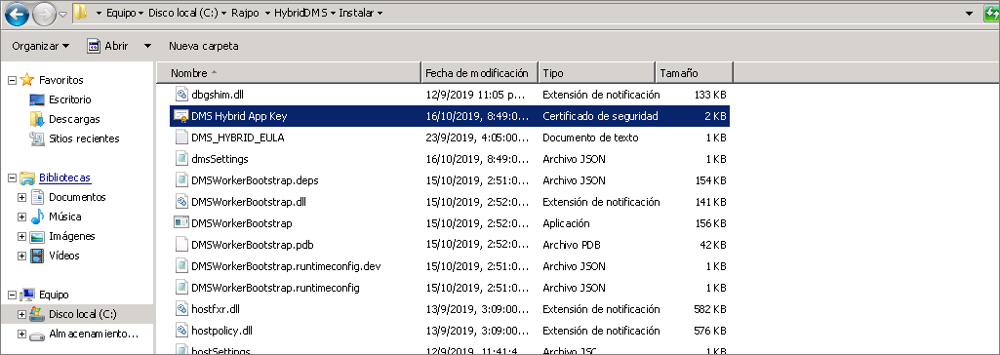

6. En Azure Portal, vaya al Id. de la aplicación; en **Administrar**, seleccione **Certificados y secretos** y, después, seleccione **Cargar certificado** para seleccionar el certificado público que ha generado.

    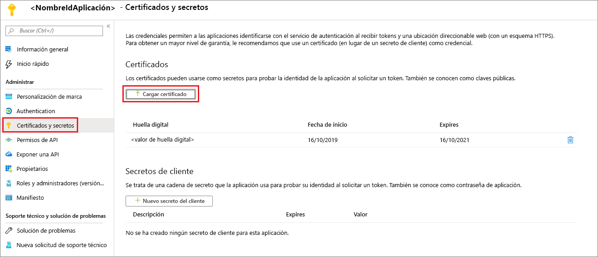

7. Instale Hybrid Worker de Azure Database Migration Service en el servidor local mediante el siguiente comando:

    ```
    <drive>:\<folder>\Install>DMSWorkerBootstrap.exe -a Install -IAcceptDMSLicenseTerms
    ```

    > [!NOTE]
    > Al ejecutar el comando de instalación, también puede usar los siguientes parámetros:
    >
    > - **-TelemetryOptOut**: detiene el envío de telemetría por parte del trabajo, pero continúa el registro de un entorno local de forma local mínima.  El instalador sigue enviando datos de telemetría.
    > - **-p {InstallLocation}** . Permite cambiar la ruta de instalación, que de forma predeterminada es "C:\Archivos de Files\DatabaseMigrationServiceHybrid".

8. Si el instalador se ejecuta sin errores, el servicio mostrará un estado en línea en Azure Database Migration Service y estará listo para migrar las bases de datos.

    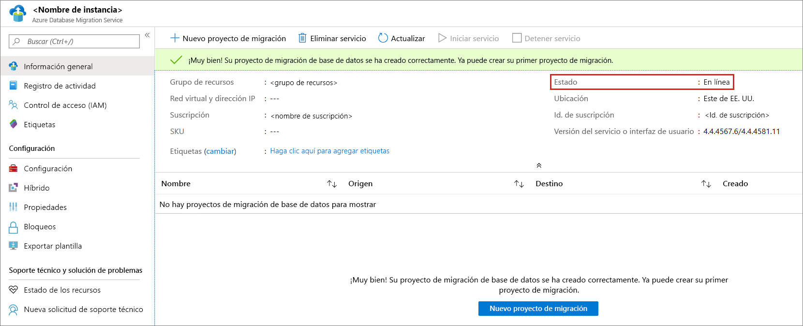

## <a name="uninstall-azure-database-migration-service-hybrid-mode"></a>Desinstalación del modo híbrido de Azure Database Migration Service

Actualmente, la desinstalación de Azure Database Migration Service en modo híbrido solo se admite a través del instalador de Hybrid Worker de Azure Database Migration Service en el servidor local mediante el comando siguiente:

```
<drive>:\<folder>\Install>DMSWorkerBootstrap.exe -a uninstall
```

> [!NOTE]
> Al ejecutar el comando de desinstalación, también puede usar el parámetro "-ReuseCert", que mantiene el certificado AdApp generado por el flujo de trabajo generateCert.  Esto permite usar el mismo certificado que se generó y cargó anteriormente.

## <a name="set-up-the-azure-database-migration-service-hybrid-worker-using-powershell"></a>Configuración del trabajo híbrido de Azure Database Migration Service mediante PowerShell

Además de instalar el trabajo híbrido de Azure Database Migration Service a través de la Azure Portal, proporcionamos un [script de PowerShell](https://techcommunity.microsoft.com/gxcuf89792/attachments/gxcuf89792/MicrosoftDataMigration/119/1/DMS_Hybrid_Script.zip) que se puede usar para automatizar los pasos de instalación del trabajo después de crear una nueva instancia de Azure Database Migration Service en modo híbrido. El script:

1. Crea un certificado AdApp.
2. Descarga el instalador.
3. Ejecuta el flujo de trabajo generateCert.
4. Carga el certificado.
5. Agrega AdApp como colaborador a la instancia de Azure Database Migration Service.
6. Ejecuta el flujo de trabajo de instalación.

Este script está diseñado para crear un prototipo de forma rápida cuando el usuario ya tiene todos los permisos necesarios en el entorno. Tenga en cuenta que en su entorno de producción, AdApp y Cert pueden tener requisitos diferentes, por lo que se podría producir un error en el script.

> [!IMPORTANT]
> En este script se supone que hay una instancia existente de Azure Database Migration Service en modo híbrido y que la cuenta de Azure usada tiene permisos para crear AdApps en el inquilino y para modificar RBAC en la suscripción.

Rellene los parámetros del principio del script y, después, ejecute el script desde una instancia de Administrator PowerShell.

## <a name="next-steps"></a>Pasos siguientes

> [!div class="nextstepaction"]
> [Migración de SQL Server a una instancia administrada de Azure SQL Database en línea](tutorial-sql-server-managed-instance-online.md)
> [Migración de SQL Server a una base de datos única o agrupada en Azure SQL Database sin conexión](tutorial-sql-server-to-azure-sql.md)
