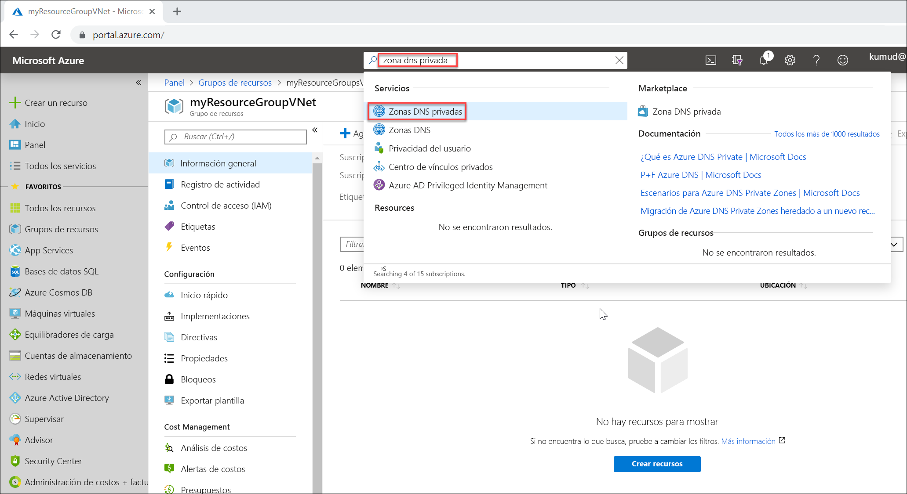

# <a name="quickstart-create-an-azure-private-dns-zone-using-the-azure-portal"></a>Inicio rápido: Creación de una zona DNS privada de Azure con Azure Portal

Este inicio rápido le guiará por los pasos necesarios para crear una zona DNS privada y un registro con Azure Portal.

Una zona DNS se usa para hospedar los registros DNS de un dominio concreto. Para iniciar el hospedaje de su dominio en DNS de Azure, debe crear una zona DNS para ese nombre de dominio. Cada registro DNS del dominio se crea luego en esta zona DNS. Para publicar una zona DNS privada en la red virtual, especifique la lista de redes virtuales que pueden resolver registros en ella.  Se denominan redes virtuales *vinculadas*. Cuando se habilita el registro automático, Azure DNS también actualiza los registros de zona cuando se crea una máquina virtual, se cambia su dirección IP o se elimina.

En esta guía de inicio rápido, ha aprendido a hacer lo siguiente:

> [!div class="checklist"]
> * Crear una zona DNS privada
> * Creación de una red virtual
> * Vincular la red virtual
> * Creación de máquinas virtuales de prueba
> * Creación de un registro de DNS adicional
> * Prueba de la zona privada

Si no tiene una suscripción a Azure, cree una [cuenta gratuita](https://azure.microsoft.com/free/?WT.mc_id=A261C142F) antes de empezar.

Si lo prefiere, puede completar este inicio rápido con [Azure PowerShell](private-dns-getstarted-powershell.md) o la [CLI de Azure](private-dns-getstarted-cli.md).

## <a name="create-a-private-dns-zone"></a>Crear una zona DNS privada

En el ejemplo siguiente, se crea una zona DNS llamada **private.contoso.com** en el grupo de recursos **MyAzureResourceGroup**.

Una zona DNS contiene las entradas de DNS para un dominio. Para iniciar el hospedaje de su dominio en Azure DNS, debe crear una zona DNS para ese nombre de dominio.



1. En la barra de búsqueda del portal, escribe **zonas dns privadas** en el cuadro de texto de búsqueda y presiona **ENTRAR**.
1. Selecciona **Zona DNS privada**.
2. Selecciona **Create private dns zone** (Crear zona dns privada).

1. En la página **Create Private DNS zone**, escribe o selecciona los siguientes valores:

   - **Grupo de recursos**: Selecciona **Crear nuevo**, escribe *MyAzureResourceGroup* y selecciona **Aceptar**. El nombre del grupo de recursos debe ser único dentro de la suscripción de Azure.
   -  **Name**: Escribe *private.contoso.com* para este ejemplo.
1. Para **Ubicación del grupo de recursos**, selecciona **Centro-oeste de EE. UU.** .

1. Seleccione **Revisar + crear**.

1. Seleccione **Crear**.

La creación de la zona puede tardar unos minutos.

## <a name="virtual-network-and-parameters"></a>Red virtual y parámetros

En los pasos de esta sección, tendrá que reemplazar los siguientes parámetros por la siguiente información:

| Parámetro                   | Value                |
|-----------------------------|----------------------|
| **\<resource-group-name>**  | MyAzureResourceGroup (seleccione el grupo de recursos existente) |
| **\<virtual-network-name>** | MyAzureVNet          |
| **\<region-name>**          | Centro-Oeste de EE. UU.      |
| **\<IPv4-address-space>**   | 10.2.0.0\16          |
| **\<subnet-name>**          | MyAzureSubnet        |
| **\<subnet-address-range>** | 10.2.0.0\24          |


[!INCLUDE [virtual-networks-create-new](../../includes/virtual-networks-create-new.md)]

## <a name="link-the-virtual-network"></a>Vincular la red virtual

Para vincular la zona DNS privada a una red virtual, crea un vínculo de red virtual.


1. Abre el grupo de recursos **MyAzureResourceGroup** y selecciona la zona privada **private.contoso.com**.
2. En el panel izquierdo, selecciona **Virtual network links** (Vínculos de red virtual).
3. Seleccione **Agregar**.
4. Escribe **myLink** para el **Nombre del vínculo**.
5. Como **Red virtual**, selecciona **myAzureVNet**.
6. Selecciona la casilla **Enable auto registration** (Habilitar registro automático).
7. Seleccione **Aceptar**.

## <a name="create-the-test-virtual-machines"></a>Creación de las máquinas virtuales de prueba

Ahora, cree dos máquinas virtuales para poder probar su zona DNS privada:

1. En la parte superior izquierda de la página del portal, selecciona **Crear un recurso** y luego selecciona **Windows Server 2016 Datacenter**.
1. Para el grupo de recursos, selecciona **MyAzureResourceGroup**.
1. Escribe **myVM01** como nombre de la máquina virtual.
1. Selecciona **Centro-oeste de EE. UU.** como **Región**.
1. Escriba un nombre de usuario para el administrador.
2. Escriba una contraseña y confírmela.
5. En **Puerto de entrada públicos**, en **Permitir los puertos seleccionados** y, luego, selecciona **RDP (3389)** para **Seleccionar puertos de entrada**.
10. Acepta los demás valores predeterminados para la página y, luego, haz clic en **Siguiente: Discos >** .
11. Acepta los demás valores predeterminados para la página **Discos** y, luego, haz clic en **Siguiente: Redes >** .
1. Asegúrate de que **myAzureVNet** esté seleccionada para la red virtual.
1. Acepta los demás valores predeterminados para la página y, luego, haz clic en **Siguiente: Administración >** .
2. Para **Diagnósticos de arranque**, selecciona **Desactivado**, acepta los demás valores predeterminados y selecciona **Revisar y crear**.
1. Revisa la configuración y, luego, haz clic en **Crear**.

Repite estos pasos para crear otra máquina virtual denominada **myVM02**.

Ambas máquinas virtuales tardarán algunos minutos en completarse.

## <a name="create-an-additional-dns-record"></a>Creación de un registro de DNS adicional

 En el ejemplo siguiente se crea un registro con el nombre relativo **db** en la zona DNS **private.contoso.com** del grupo de recursos **MyAzureResourceGroup**. El nombre completo del conjunto de registros es **db.private.contoso.com**. El tipo de registro es "A", con la dirección IP de **myVM01**.

1. Abre el grupo de recursos **MyAzureResourceGroup** y selecciona la zona privada **private.contoso.com**.
2. Seleccione **+ Conjunto de registros**.
3. En **Nombre**, escribe **db**.
4. Para **Dirección IP**, escribe la dirección IP que viste para **myVM01**. Debería registrarse de forma automática al iniciarse la máquina virtual.
5. Seleccione **Aceptar**.

## <a name="test-the-private-zone"></a>Prueba de la zona privada

Ya puede probar la resolución de nombres de la zona privada **private.contoso.com**.

### <a name="configure-vms-to-allow-inbound-icmp"></a>Configuración de máquinas virtuales para permitir ICMP de entrada

Puede usar el comando ping para probar la resolución de nombres. Por tanto, configure el firewall en ambas máquinas virtuales para permitir paquetes ICMP entrantes.

1. Conéctese a myVM01 y abra una ventana de Windows PowerShell con privilegios de administrador.
2. Ejecute el siguiente comando:

   ```powershell
   New-NetFirewallRule –DisplayName "Allow ICMPv4-In" –Protocol ICMPv4
   ```

Repita la operación con myVM02.

### <a name="ping-the-vms-by-name"></a>Realización de ping en las máquinas virtuales por nombre

1. En el símbolo del sistema de Windows PowerShell de myVM02, haga ping a myVM01 con el nombre de host registrado automáticamente:
   ```
   ping myVM01.private.contoso.com
   ```
   La salida es similar a esta:
   ```
   PS C:\> ping myvm01.private.contoso.com

   Pinging myvm01.private.contoso.com [10.2.0.4] with 32 bytes of data:
   Reply from 10.2.0.4: bytes=32 time<1ms TTL=128
   Reply from 10.2.0.4: bytes=32 time=1ms TTL=128
   Reply from 10.2.0.4: bytes=32 time<1ms TTL=128
   Reply from 10.2.0.4: bytes=32 time<1ms TTL=128

   Ping statistics for 10.2.0.4:
       Packets: Sent = 4, Received = 4, Lost = 0 (0% loss),
   Approximate round trip times in milli-seconds:
       Minimum = 0ms, Maximum = 1ms, Average = 0ms
   PS C:\>
   ```
2. Ahora haga ping en el nombre de la **base de datos** que creó anteriormente:
   ```
   ping db.private.contoso.com
   ```
   La salida es similar a esta:
   ```
   PS C:\> ping db.private.contoso.com

   Pinging db.private.contoso.com [10.2.0.4] with 32 bytes of data:
   Reply from 10.2.0.4: bytes=32 time<1ms TTL=128
   Reply from 10.2.0.4: bytes=32 time<1ms TTL=128
   Reply from 10.2.0.4: bytes=32 time<1ms TTL=128
   Reply from 10.2.0.4: bytes=32 time<1ms TTL=128

   Ping statistics for 10.2.0.4:
       Packets: Sent = 4, Received = 4, Lost = 0 (0% loss),
   Approximate round trip times in milli-seconds:
       Minimum = 0ms, Maximum = 0ms, Average = 0ms
   PS C:\>
   ```

## <a name="delete-all-resources"></a>Eliminación de todos los recursos

Cuando ya no lo necesite, elimine el grupo de recursos **MyAzureResourceGroup** para eliminar los recursos que ha creado en este inicio rápido.


## <a name="next-steps"></a>Pasos siguientes

> [!div class="nextstepaction"]
> [Escenarios de Azure DNS Private Zones](private-dns-scenarios.md)

