# <a name="quickstart-route-blob-storage-events-to-web-endpoint-with-the-azure-portal"></a>Inicio rápido: Enrutamiento de eventos de Blob Storage a un punto de conexión web personalizado con Azure Portal

Azure Event Grid es un servicio de eventos para la nube. En este artículo, se usará Azure Portal para crear una cuenta de Blob Storage, suscribirse a eventos de Blob Storage y desencadenar un evento para ver el resultado. Por lo general, se envían eventos a un punto de conexión que procesa los datos del evento y realiza acciones. Sin embargo, para simplificar en este artículo, los eventos se envían a una aplicación web que recopila y muestra los mensajes.

[!INCLUDE [quickstarts-free-trial-note.md](../../includes/quickstarts-free-trial-note.md)]

Cuando haya terminado, verá que los datos del evento se han enviado a la aplicación web.

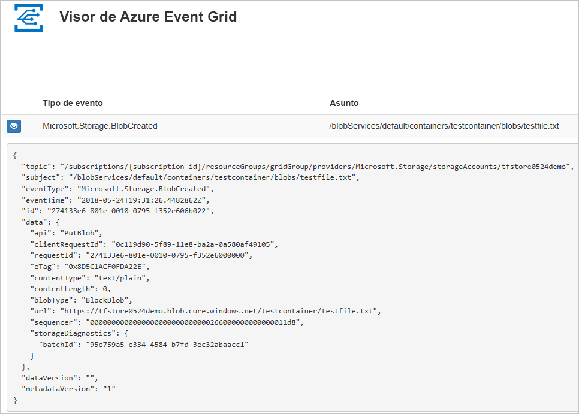

## <a name="create-a-storage-account"></a>Crear una cuenta de almacenamiento

1. Inicie sesión en el [portal de Azure](https://portal.azure.com/).

1. Para crear una instancia de Blob Storage, seleccione **Crear un recurso**. 

   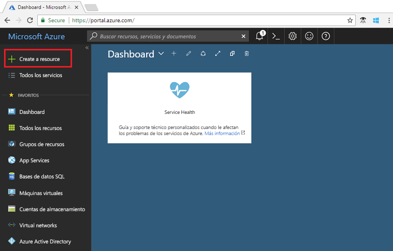

1. Seleccione **Storage** para filtrar las opciones disponibles y seleccione **Storage account - blob, file, table, queue** (Cuenta de almacenamiento: blob, archivo, tabla, cola).

   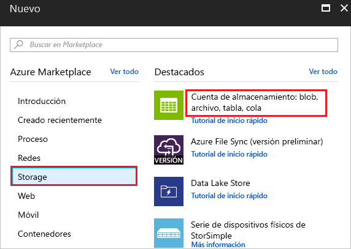

1. Para suscribirse a eventos, cree una cuenta de almacenamiento de uso general v2 o una cuenta de Blob Storage. Para obtener más información, consulte [Creación de una cuenta de almacenamiento](../storage/common/storage-account-create.md).

   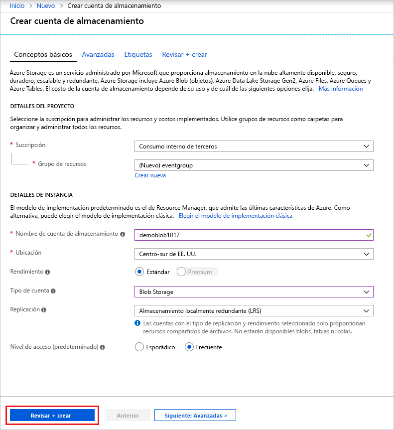

>[!NOTE]
> Solo las cuentas de almacenamiento de tipo **StorageV2 (uso general v2)** y **BlobStorage** admiten la integración de eventos. **Storage (uso general v1)** *no* admite la integración con Event Grid.

## <a name="create-a-message-endpoint"></a>Creación de un punto de conexión de mensaje

Antes de suscribirse a los eventos de Blob Storage, vamos a crear el punto de conexión para el mensaje del evento. Normalmente, el punto de conexión realiza acciones en función de los datos del evento. Para simplificar esta guía de inicio rápido, se implementa una [aplicación web pregenerada](https://github.com/Azure-Samples/azure-event-grid-viewer) que muestra los mensajes de los eventos. La solución implementada incluye un plan de App Service, una aplicación web de App Service y el código fuente desde GitHub.

1. Seleccione **Deploy to Azure** (Implementar en Azure) para implementar la solución en su suscripción. En Azure Portal, proporcione valores para los parámetros.

   <a href="https://portal.azure.com/#create/Microsoft.Template/uri/https%3A%2F%2Fraw.githubusercontent.com%2FAzure-Samples%2Fazure-event-grid-viewer%2Fmaster%2Fazuredeploy.json" target="_blank"></a>

1. La implementación puede tardar unos minutos en completarse. Después de que la implementación se haya realizado correctamente, puede ver la aplicación web para asegurarse de que se está ejecutando. En un explorador web, vaya a: `https://<your-site-name>.azurewebsites.net`

1. Verá el sitio, pero aún no se ha publicado en él ningún evento.

   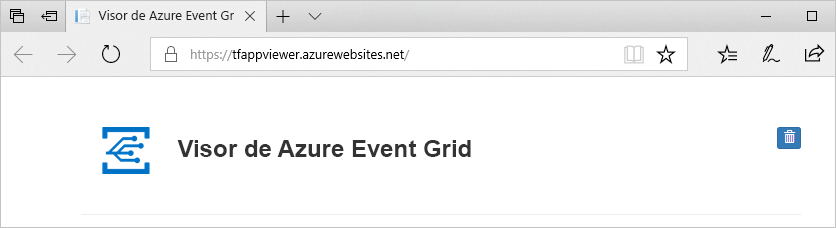

[!INCLUDE [event-grid-register-provider-portal.md](../../includes/event-grid-register-provider-portal.md)]

## <a name="subscribe-to-the-blob-storage"></a>Suscripción a Blob Storage

Suscríbase a un tema que indique a Event Grid los eventos cuyo seguimiento desea realizar y el lugar al que deben enviarse los eventos.

1. En el portal, seleccione su instancia de Blob Storage y seleccione **Eventos**.

   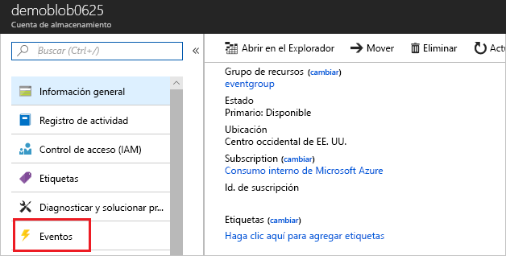

1. Para enviar eventos a la aplicación de visor, use un webhook como punto de conexión. Seleccione **Más opciones** y **Webhook**.

   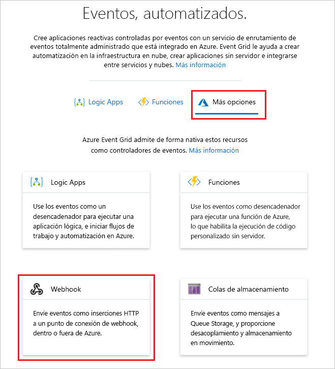

1. La suscripción de eventos se rellena previamente con valores para Blob Storage. Para el punto de conexión de webhook, proporcione la dirección URL de la aplicación web y agregue `api/updates` a la dirección URL de la página principal. Asigne un nombre a su suscripción. Cuando haya terminado, seleccione **Crear**.

   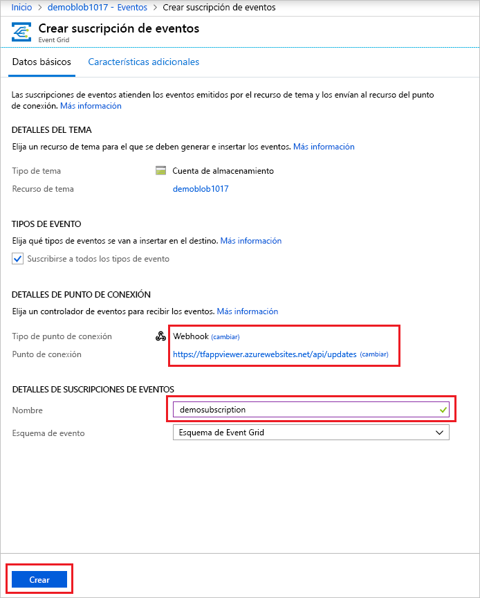

1. Vuelva a la aplicación web y observe que se ha enviado un evento de validación de suscripción. Seleccione el icono del ojo para expandir los datos del evento. Event Grid envía el evento de validación para que el punto de conexión pueda verificar que desea recibir datos de eventos. La aplicación web incluye código para validar la suscripción.

   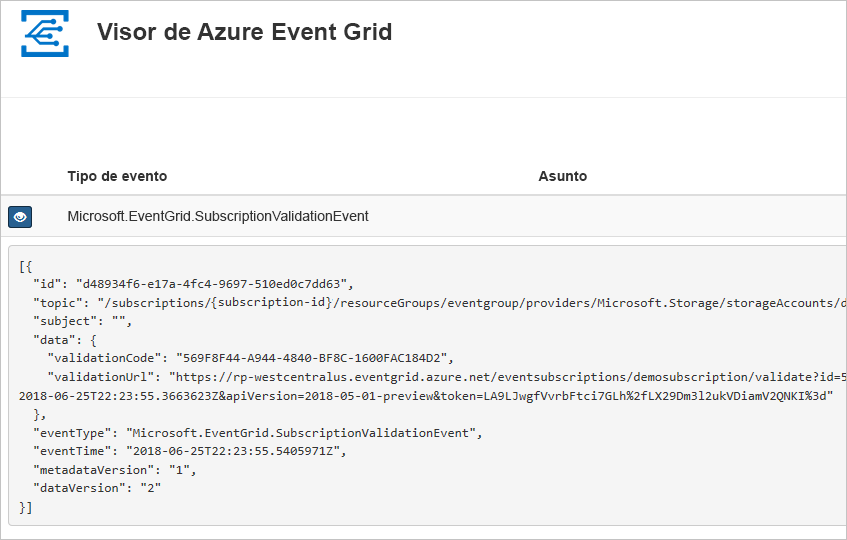

Ahora, vamos a desencadenar un evento para ver cómo Event Grid distribuye el mensaje al punto de conexión.

## <a name="send-an-event-to-your-endpoint"></a>Envío de un evento al punto de conexión

Desencadenará un evento para Blob Storage mediante la carga de un archivo. El archivo no necesita ningún contenido específico. En los artículos se da por hecho que tiene un archivo llamado testfile.txt, pero puede usar cualquier archivo.

1. Para su instancia de Blob Storage, seleccione **Blobs**.

   

1. Seleccione **+ Contenedor**. Asigne un nombre de contenedor y use cualquier nivel de acceso.

   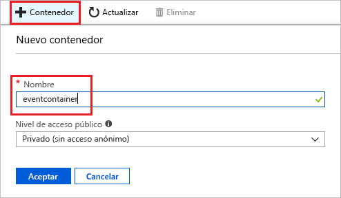

1. Seleccione el nuevo contenedor.

   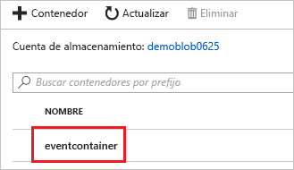

1. Para cargar un archivo, seleccione **Cargar**.

   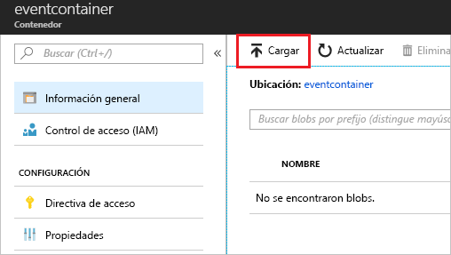

1. Busque el archivo de prueba y cárguelo.

1. Ha desencadenado el evento y Event Grid ha enviado el mensaje al punto de conexión que configuró al realizar la suscripción. El mensaje está en formato JSON y contiene una matriz con uno o más eventos. En el ejemplo siguiente, el mensaje JSON contiene una matriz con un evento. Vea la aplicación web y observe que se ha recibido un evento de blob creado. 

   ```json
   [{
    "topic": "/subscriptions/{subscription-id}/resourceGroups/eventgroup/providers/Microsoft.Storage/storageAccounts/demoblob0625",
    "subject": "/blobServices/default/containers/eventcontainer/blobs/testfile.txt",
    "eventType": "Microsoft.Storage.BlobCreated",
    "eventTime": "2018-06-25T22:50:41.1823131Z",
    "id": "89a2f9da-c01e-00bb-13d6-0c599506e4e3",
    "data": {
      "api": "PutBlockList",
      "clientRequestId": "41341a9b-e977-4a91-9000-c64125039047",
      "requestId": "89a2f9da-c01e-00bb-13d6-0c5995000000",
      "eTag": "0x8D5DAEE13C8F9ED",
      "contentType": "text/plain",
      "contentLength": 4,
      "blobType": "BlockBlob",
      "url": "https://demoblob0625.blob.core.windows.net/eventcontainer/testfile.txt",
      "sequencer": "00000000000000000000000000001C24000000000004712b",
      "storageDiagnostics": {
        "batchId": "ef633252-32fd-464b-8f5a-0d10d68885e6"
      }
    },
    "dataVersion": "",
    "metadataVersion": "1"
   }]
   ```

## <a name="clean-up-resources"></a>Limpieza de recursos

Si piensa seguir trabajando con este evento, no limpie los recursos creados en este artículo. De lo contrario, elimine los recursos que ha creado en este artículo.

Seleccione el grupo de recursos y seleccione **Eliminar grupo de recursos**.

## <a name="next-steps"></a>Pasos siguientes

Ahora que sabe cómo crear suscripciones a temas personalizados y eventos, aprenda más acerca de cómo puede ayudarle Event Grid:

- [Una introducción a Azure Event Grid](overview.md)
- [Enrutamiento de eventos de Blob Storage a un punto de conexión web personalizado](../storage/blobs/storage-blob-event-quickstart.md?toc=%2fazure%2fevent-grid%2ftoc.json)
- [Supervisión de los cambios en máquinas virtuales con Azure Event Grid y Logic Apps](monitor-virtual-machine-changes-event-grid-logic-app.md)
- [Transmisión de macrodatos a un almacén de datos](event-grid-event-hubs-integration.md)
