# <a name="quickstart-route-custom-events-to-web-endpoint-with-the-azure-portal-and-event-grid"></a>Inicio rápido: Enrutamiento de eventos personalizados a puntos de conexión web con Azure Portal y Event Grid

Azure Event Grid es un servicio de eventos para la nube. En este artículo, se usa Azure Portal para crear un tema personalizado, suscribirse al tema y desencadenar el evento para ver el resultado. Por lo general, se envían eventos a un punto de conexión que procesa los datos del evento y realiza acciones. Sin embargo, para simplificar en este artículo, los eventos se envían a una aplicación web que recopila y muestra los mensajes.

Cuando haya terminado, verá que los datos del evento se han enviado a la aplicación web.

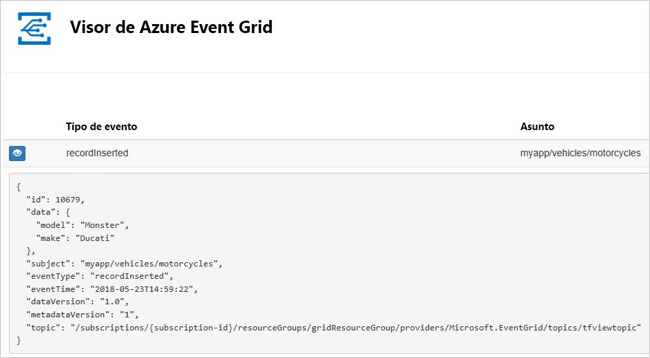

[!INCLUDE [quickstarts-free-trial-note.md](../../includes/quickstarts-free-trial-note.md)]

[!INCLUDE [event-grid-register-provider-portal.md](../../includes/event-grid-register-provider-portal.md)]

## <a name="create-a-custom-topic"></a>Creación de un tema personalizado

Un tema de cuadrícula de eventos proporciona un punto de conexión definido por el usuario en el que se registran los eventos. 

1. Inicie sesión en el [portal de Azure](https://portal.azure.com/).

1. Para crear un tema personalizado, seleccione **Crear un recurso**. 

   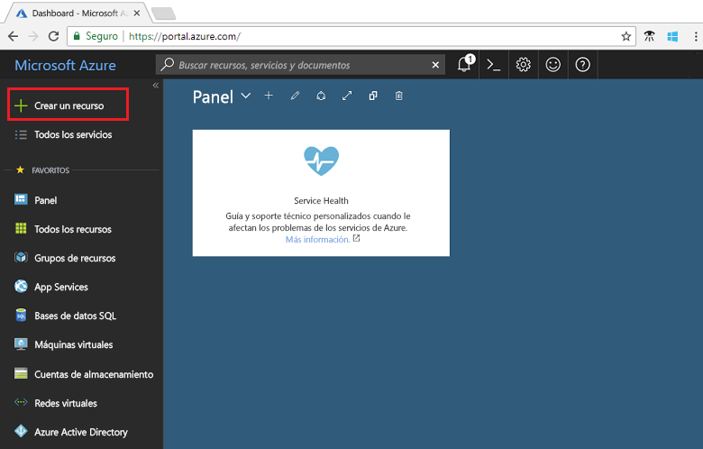

1. Busque *Event Grid Topic* y selecciónelo.

   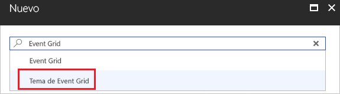

1. Seleccione **Crear**.

   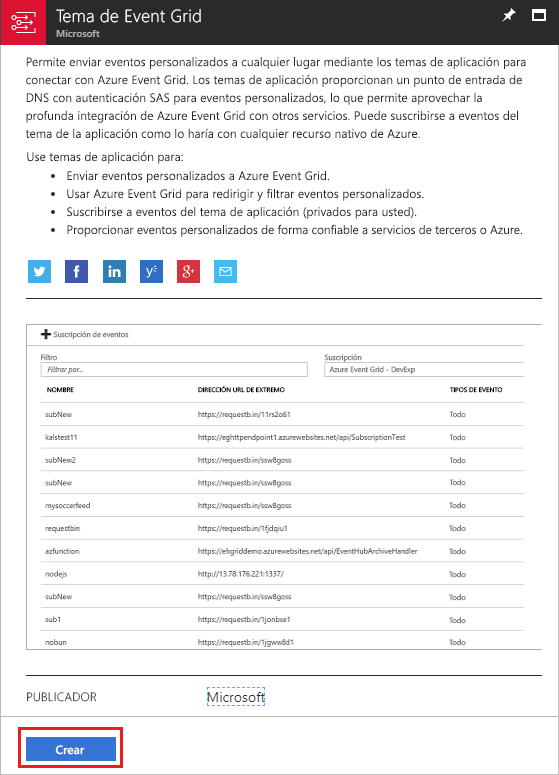

1. Escriba un nombre único para el tema personalizado. El nombre del tema debe ser único porque se representa mediante una entrada DNS. No use el nombre que se muestra en la imagen. En su lugar, cree su propio nombre: debe tener entre 3 y 50 caracteres y contener solo los valores a-z, A-Z, 0-9 y "-". Proporcione un nombre para el grupo de recursos. Seleccione **Crear**.

   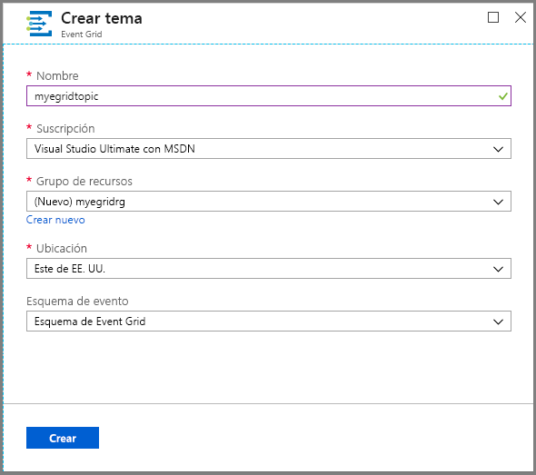

1. Cuando se ha creado el tema personalizado, se ve la notificación de que la operación se ha realizado correctamente.

   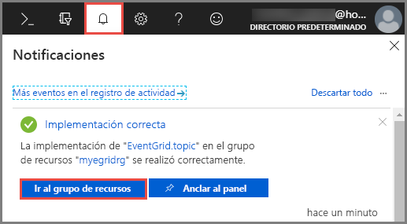

   Si la implementación no se ha realizado correctamente, averigüe la causa del error. Seleccione **Error de implementación**.

   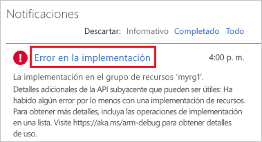

   Seleccione el mensaje de error.

   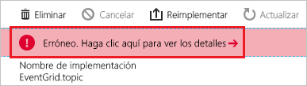

   La siguiente imagen muestra una implementación en que se produjo un error porque el nombre del tema personalizado ya estaba en uso. Si ve este error, vuelva a intentar realizar la implementación con otro nombre.

   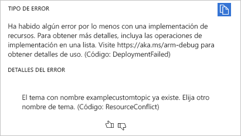

## <a name="create-a-message-endpoint"></a>Creación de un punto de conexión de mensaje

Antes de suscribirse al tema personalizado, vamos a crear el punto de conexión para el mensaje de evento. Normalmente, el punto de conexión realiza acciones en función de los datos del evento. Para simplificar esta guía de inicio rápido, se implementa una [aplicación web pregenerada](https://github.com/Azure-Samples/azure-event-grid-viewer) que muestra los mensajes de los eventos. La solución implementada incluye un plan de App Service, una aplicación web de App Service y el código fuente desde GitHub.

1. Seleccione **Deploy to Azure** (Implementar en Azure) para implementar la solución en su suscripción. En Azure Portal, proporcione valores para los parámetros.

   <a href="https://portal.azure.com/#create/Microsoft.Template/uri/https%3A%2F%2Fraw.githubusercontent.com%2FAzure-Samples%2Fazure-event-grid-viewer%2Fmaster%2Fazuredeploy.json" target="_blank"></a>

1. La implementación puede tardar unos minutos en completarse. Después de que la implementación se haya realizado correctamente, puede ver la aplicación web para asegurarse de que se está ejecutando. En un explorador web, vaya a: `https://<your-site-name>.azurewebsites.net`

1. Verá el sitio, pero aún no se ha publicado en él ningún evento.

   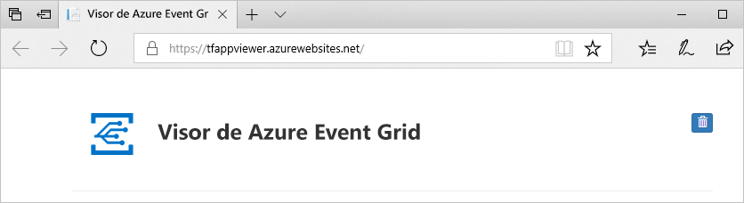

## <a name="subscribe-to-custom-topic"></a>Suscripción a un tema personalizado

Suscríbase a un tema de cuadrícula de eventos que indique a Event Grid los eventos cuyo seguimiento desea realizar y el lugar al que deben enviarse los eventos.

1. En el portal, seleccione su tema personalizado.

   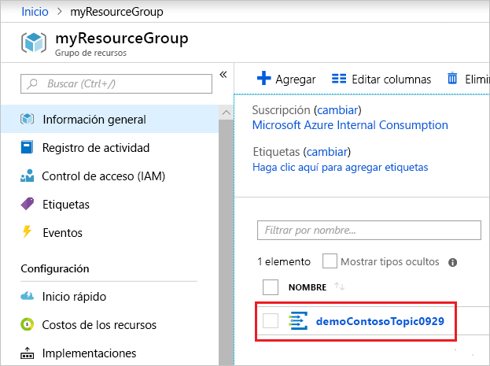

1. Seleccione **+ Suscripción de eventos**.

   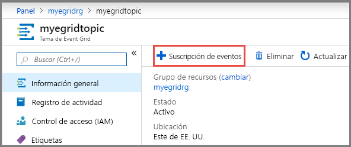

1. Seleccione **Webhook** como tipo de punto de conexión. Proporcione un nombre para la suscripción a eventos.

   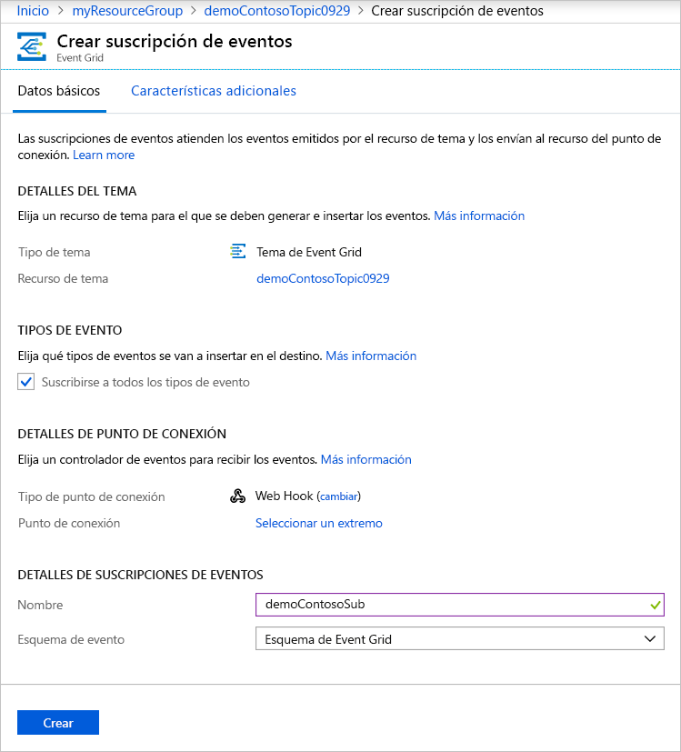

1. Seleccione **Select an endpoint** (Seleccionar un punto de conexión). 

1. Para el punto de conexión de webhook, proporcione la dirección URL de la aplicación web y agregue `api/updates` a la dirección URL de la página principal. Seleccione **Confirm Selection** (Confirmar selección).

   

1. Cuando termine de proporcionar los valores de suscripción a eventos, seleccione **Create** (Crear).

Vuelva a la aplicación web y observe que se ha enviado un evento de validación de suscripción. Seleccione el icono del ojo para expandir los datos del evento. Event Grid envía el evento de validación para que el punto de conexión pueda verificar que desea recibir datos de eventos. La aplicación web incluye código para validar la suscripción.

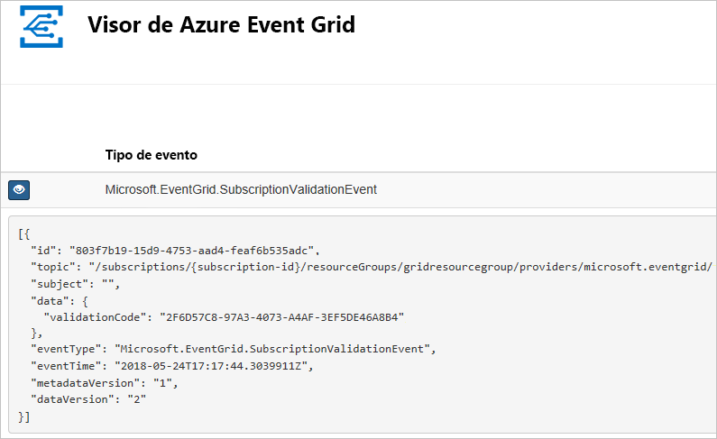

## <a name="send-an-event-to-your-topic"></a>Envío de un evento al tema

Ahora, vamos a desencadenar un evento para ver cómo Event Grid distribuye el mensaje al punto de conexión. Use la CLI de Azure o PowerShell para enviar un evento de prueba a su tema personalizado. Normalmente, una aplicación o servicio de Azure enviaría los datos del evento.

En el primer ejemplo se utiliza la CLI de Azure. Se obtiene la dirección URL y la clave del tema personalizado, y los datos de evento de ejemplo. Use su nombre de un tema personalizado para `<topic_name>`. Se crean datos de evento de ejemplo. El elemento `data` del archivo JSON es la carga del evento. En este campo, puede usar cualquier archivo JSON bien formado. También puede usar el campo de asunto para realizar enrutamiento y filtrado avanzados. CURL es una utilidad que envía solicitudes HTTP.

```azurecli-interactive
endpoint=$(az eventgrid topic show --name <topic_name> -g myResourceGroup --query "endpoint" --output tsv)
key=$(az eventgrid topic key list --name <topic_name> -g myResourceGroup --query "key1" --output tsv)

event='[ {"id": "'"$RANDOM"'", "eventType": "recordInserted", "subject": "myapp/vehicles/motorcycles", "eventTime": "'`date +%Y-%m-%dT%H:%M:%S%z`'", "data":{ "make": "Ducati", "model": "Monster"},"dataVersion": "1.0"} ]'

curl -X POST -H "aeg-sas-key: $key" -d "$event" $endpoint
```

El segundo ejemplo usa PowerShell para realizar pasos similares.

```azurepowershell-interactive
$endpoint = (Get-AzureRmEventGridTopic -ResourceGroupName gridResourceGroup -Name <topic-name>).Endpoint
$keys = Get-AzureRmEventGridTopicKey -ResourceGroupName gridResourceGroup -Name <topic-name>

$eventID = Get-Random 99999

#Date format should be SortableDateTimePattern (ISO 8601)
$eventDate = Get-Date -Format s

#Construct body using Hashtable
$htbody = @{
    id= $eventID
    eventType="recordInserted"
    subject="myapp/vehicles/motorcycles"
    eventTime= $eventDate   
    data= @{
        make="Ducati"
        model="Monster"
    }
    dataVersion="1.0"
}

#Use ConvertTo-Json to convert event body from Hashtable to JSON Object
#Append square brackets to the converted JSON payload since they are expected in the event's JSON payload syntax
$body = "["+(ConvertTo-Json $htbody)+"]"

Invoke-WebRequest -Uri $endpoint -Method POST -Body $body -Headers @{"aeg-sas-key" = $keys.Key1}
```

Ha desencadenado el evento y Event Grid ha enviado el mensaje al punto de conexión que configuró al realizar la suscripción. Vaya a la aplicación web para ver el evento que acaba de enviar.

```json
[{
  "id": "1807",
  "eventType": "recordInserted",
  "subject": "myapp/vehicles/motorcycles",
  "eventTime": "2017-08-10T21:03:07+00:00",
  "data": {
    "make": "Ducati",
    "model": "Monster"
  },
  "dataVersion": "1.0",
  "metadataVersion": "1",
  "topic": "/subscriptions/{subscription-id}/resourceGroups/{resource-group}/providers/Microsoft.EventGrid/topics/{topic}"
}]
```


## <a name="clean-up-resources"></a>Limpieza de recursos

Si piensa seguir trabajando con este evento, no limpie los recursos creados en este artículo. De lo contrario, elimine los recursos que ha creado en este artículo.

Seleccione el grupo de recursos y seleccione **Eliminar grupo de recursos**.

## <a name="next-steps"></a>Pasos siguientes

Ahora que sabe cómo crear suscripciones a temas personalizados y eventos, aprenda más acerca de cómo puede ayudarle Event Grid:

- [Una introducción a Azure Event Grid](overview.md)
- [Enrutamiento de eventos de Blob Storage a un punto de conexión web personalizado](../storage/blobs/storage-blob-event-quickstart.md?toc=%2fazure%2fevent-grid%2ftoc.json)
- [Supervisión de los cambios en máquinas virtuales con Azure Event Grid y Logic Apps](monitor-virtual-machine-changes-event-grid-logic-app.md)
- [Transmisión de macrodatos a un almacén de datos](event-grid-event-hubs-integration.md)
