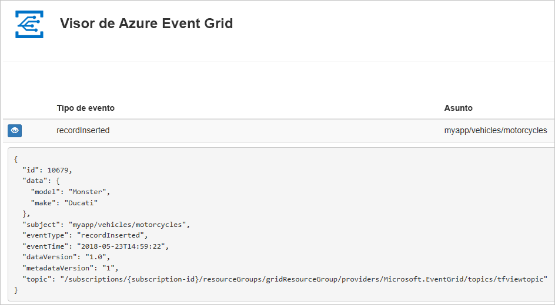
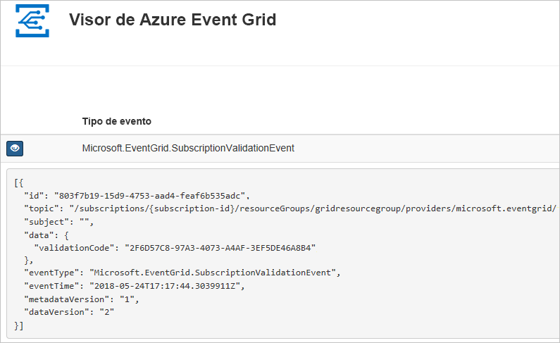

# <a name="quickstart-route-custom-events-to-web-endpoint-with-azure-cli-and-event-grid"></a>Inicio rápido: Enrutamiento de eventos personalizados al punto de conexión de web con la CLI de Azure y Event Grid

Azure Event Grid es un servicio de eventos para la nube. En este artículo, se usará la CLI de Azure para crear un tema personalizado, suscribirse a él y desencadenar el evento para ver el resultado.

Por lo general, se envían eventos a un punto de conexión que procesa los datos del evento y realiza acciones. Sin embargo, para simplificar en este artículo, los eventos se envían a una aplicación web que recopila y muestra los mensajes.

Cuando haya terminado, verá que los datos del evento se han enviado a la aplicación web.



[!INCLUDE [quickstarts-free-trial-note.md](../../includes/quickstarts-free-trial-note.md)]

[!INCLUDE [cloud-shell-try-it.md](../../includes/cloud-shell-try-it.md)]

Si decide instalar y usar la CLI de Azure localmente, para los fines de este artículo, es preciso que ejecute la versión más reciente (2.0.70 o posterior). Para encontrar la versión, ejecute `az --version`. Si necesita instalarla o actualizarla, vea [Instalación de la CLI de Azure](/cli/azure/install-azure-cli).

Si no usa Cloud Shell, primero debe iniciar sesión con `az login`.

## <a name="create-a-resource-group"></a>Crear un grupo de recursos

Los temas de Event Grid son recursos de Azure y se deben colocar en un grupo de recursos de Azure. El grupo de recursos de Azure es una colección lógica en la que se implementan y administran los recursos de Azure.

Para crear un grupo de recursos, use el comando [az group create](/cli/azure/group#az-group-create). 

En el ejemplo siguiente, se crea un grupo de recursos denominado *gridResourceGroup* en la ubicación *westus2*.

```azurecli-interactive
az group create --name gridResourceGroup --location westus2
```

[!INCLUDE [event-grid-register-provider-cli.md](../../includes/event-grid-register-provider-cli.md)]

## <a name="create-a-custom-topic"></a>Creación de un tema personalizado

Un tema de cuadrícula de eventos proporciona un punto de conexión definido por el usuario en el que se registran los eventos. En el ejemplo siguiente se crea el tema personalizado en el grupo de recursos. Reemplace `<your-topic-name>` por un nombre único para el tema. El nombre del tema personalizado debe ser único, ya que es parte de la entrada DNS. Además, debe tener entre 3 y 50 caracteres y contener solo los valores a-z, A-Z, 0-9 y "-".

```azurecli-interactive
topicname=<your-topic-name>

az eventgrid topic create --name $topicname -l westus2 -g gridResourceGroup
```

## <a name="create-a-message-endpoint"></a>Creación de un punto de conexión de mensaje

Antes de suscribirse al tema personalizado, vamos a crear el punto de conexión para el mensaje de evento. Normalmente, el punto de conexión realiza acciones en función de los datos del evento. Para simplificar esta guía de inicio rápido, se implementa una [aplicación web pregenerada](https://github.com/Azure-Samples/azure-event-grid-viewer) que muestra los mensajes de los eventos. La solución implementada incluye un plan de App Service, una aplicación web de App Service y el código fuente desde GitHub.

Reemplace `<your-site-name>` por un nombre único para la aplicación web. El nombre de la aplicación web debe ser único, ya que es parte de la entrada DNS.

```azurecli-interactive
sitename=<your-site-name>

az group deployment create \
  --resource-group gridResourceGroup \
  --template-uri "https://raw.githubusercontent.com/Azure-Samples/azure-event-grid-viewer/master/azuredeploy.json" \
  --parameters siteName=$sitename hostingPlanName=viewerhost
```

La implementación puede tardar unos minutos en completarse. Después de que la implementación se haya realizado correctamente, puede ver la aplicación web para asegurarse de que se está ejecutando. En un explorador web, vaya a: `https://<your-site-name>.azurewebsites.net`

Debería ver el sitio, que no muestra ningún mensaje actualmente.

## <a name="subscribe-to-a-custom-topic"></a>Suscripción a un tema personalizado

Suscríbase a un tema de cuadrícula de eventos personalizado para indicar a Event Grid los eventos cuyo seguimiento desea realizar y el lugar al que deben enviarse dichos eventos. En el ejemplo siguiente se suscribirá al tema personalizado que ha creado y pasará la dirección URL de la aplicación web como el punto de conexión de la notificación de eventos.

El punto de conexión de la aplicación web debe incluir el sufijo `/api/updates/`.

```azurecli-interactive
endpoint=https://$sitename.azurewebsites.net/api/updates

az eventgrid event-subscription create \
  --source-resource-id "/subscriptions/{subscription-id}/resourceGroups/{resource-group}/providers/Microsoft.EventGrid/topics/$topicname" 
  --name demoViewerSub 
  --endpoint $endpoint
  
```

Vuelva a la aplicación web y observe que se ha enviado un evento de validación de suscripción. Seleccione el icono del ojo para expandir los datos del evento. Event Grid envía el evento de validación para que el punto de conexión pueda verificar que desea recibir datos de eventos. La aplicación web incluye código para validar la suscripción.




## <a name="send-an-event-to-your-custom-topic"></a>Envío de un evento al tema personalizado

Vamos a desencadenar un evento para ver cómo Event Grid distribuye el mensaje al punto de conexión. En primer lugar, vamos a obtener la dirección URL y la clave del tema personalizado.

```azurecli-interactive
endpoint=$(az eventgrid topic show --name $topicname -g gridResourceGroup --query "endpoint" --output tsv)
key=$(az eventgrid topic key list --name $topicname -g gridResourceGroup --query "key1" --output tsv)
```

Para simplificar este artículo, usará datos de evento de ejemplo para enviar al tema personalizado. Normalmente, una aplicación o servicio de Azure enviaría los datos del evento. En el ejemplo siguiente se crean datos de evento de ejemplo:

```azurecli-interactive
event='[ {"id": "'"$RANDOM"'", "eventType": "recordInserted", "subject": "myapp/vehicles/motorcycles", "eventTime": "'`date +%Y-%m-%dT%H:%M:%S%z`'", "data":{ "make": "Ducati", "model": "Monster"},"dataVersion": "1.0"} ]'
```

El elemento `data` del archivo JSON es la carga del evento. En este campo, puede usar cualquier archivo JSON bien formado. También puede usar el campo de asunto para realizar enrutamiento y filtrado avanzados.

CURL es una utilidad que envía solicitudes HTTP. En este artículo, use CURL para enviar el evento al tema. 

```azurecli-interactive
curl -X POST -H "aeg-sas-key: $key" -d "$event" $endpoint
```

Ha desencadenado el evento y Event Grid ha enviado el mensaje al punto de conexión que configuró al realizar la suscripción. Vaya a la aplicación web para ver el evento que acaba de enviar.

```json
[{
  "id": "1807",
  "eventType": "recordInserted",
  "subject": "myapp/vehicles/motorcycles",
  "eventTime": "2017-08-10T21:03:07+00:00",
  "data": {
    "make": "Ducati",
    "model": "Monster"
  },
  "dataVersion": "1.0",
  "metadataVersion": "1",
  "topic": "/subscriptions/{subscription-id}/resourceGroups/{resource-group}/providers/Microsoft.EventGrid/topics/{topic}"
}]
```

## <a name="clean-up-resources"></a>Limpieza de recursos
Si piensa seguir trabajando con este evento o con la aplicación de visualización de eventos, no limpie los recursos creados en este artículo. En caso contrario, use el siguiente comando para eliminar los recursos creados en este artículo.

```azurecli-interactive
az group delete --name gridResourceGroup
```

## <a name="next-steps"></a>Pasos siguientes

Ahora que sabe cómo crear suscripciones a temas y eventos, aprenda más sobre cómo Event Grid puede ayudarle:

- [Una introducción a Azure Event Grid](overview.md)
- [Enrutamiento de eventos de Blob Storage a un punto de conexión web personalizado](../storage/blobs/storage-blob-event-quickstart.md?toc=%2fazure%2fevent-grid%2ftoc.json)
- [Supervisión de los cambios en máquinas virtuales con Azure Event Grid y Logic Apps](monitor-virtual-machine-changes-event-grid-logic-app.md)
- [Transmisión de macrodatos a un almacén de datos](event-grid-event-hubs-integration.md)
