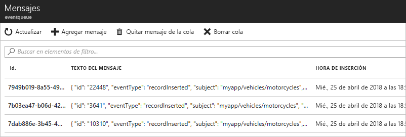

# <a name="quickstart-route-custom-events-to-azure-queue-storage-with-azure-cli-and-event-grid"></a>Inicio rápido: Enrutar eventos personalizados a Azure Queue Storage con la CLI de Azure y Event Grid

Azure Event Grid es un servicio de eventos para la nube. Azure Queue Storage es uno de los controladores de eventos compatibles. En este artículo, se usará la CLI de Azure para crear un tema personalizado, suscribirse a él y desencadenar el evento para ver el resultado. Envíe los eventos a Queue Storage.

[!INCLUDE [quickstarts-free-trial-note.md](../../includes/quickstarts-free-trial-note.md)]

[!INCLUDE [cloud-shell-try-it.md](../../includes/cloud-shell-try-it.md)]

Si va a usar la CLI de Azure o Azure PowerShell en la máquina local en lugar de usar Cloud Shell en Azure Portal, asegúrese de tener las siguientes versiones de la CLI de Azure y Azure PowerShell. 

- CLI de Azure versión 2.0.56 o posterior. Para instrucciones sobre cómo instalar la versión más reciente de la CLI de Azure, consulte [Instalación de la CLI de Azure](/cli/azure/install-azure-cli). 
- Azure PowerShell versión 1.1.0 o superior. Descargue la versión más reciente de Azure PowerShell en la máquina Windows desde [Descargas de Azure: herramientas de línea de comandos](https://azure.microsoft.com/downloads/). 

En este artículo se proporcionan los comandos para usar la CLI de Azure. 

## <a name="create-a-resource-group"></a>Crear un grupo de recursos

Los temas de Event Grid son recursos de Azure y se deben colocar en un grupo de recursos de Azure. El grupo de recursos de Azure es una colección lógica en la que se implementan y administran los recursos de Azure.

Cree un grupo de recursos con el comando [az group create](/cli/azure/group#az-group-create). 

En el ejemplo siguiente, se crea un grupo de recursos denominado *gridResourceGroup* en la ubicación *westus2*.

```azurecli-interactive
az group create --name gridResourceGroup --location westus2
```

[!INCLUDE [event-grid-register-provider-cli.md](../../includes/event-grid-register-provider-cli.md)]

## <a name="create-a-custom-topic"></a>Creación de un tema personalizado

Un tema de cuadrícula de eventos proporciona un punto de conexión definido por el usuario en el que se registran los eventos. En el ejemplo siguiente se crea el tema personalizado en el grupo de recursos. Reemplace `<topic_name>` por un nombre único para el tema personalizado. El nombre del tema de cuadrícula de eventos debe ser único porque se representa mediante una entrada DNS.

```azurecli-interactive
az eventgrid topic create --name <topic_name> -l westus2 -g gridResourceGroup
```

## <a name="create-queue-storage"></a>Creación de una instancia de Queue Storage

Antes de suscribirse al tema personalizado, vamos a crear el punto de conexión para el mensaje de evento. Cree una instancia de Queue Storage para recopilar los eventos.

```azurecli-interactive
storagename="<unique-storage-name>"
queuename="eventqueue"

az storage account create -n $storagename -g gridResourceGroup -l westus2 --sku Standard_LRS
az storage queue create --name $queuename --account-name $storagename
```

## <a name="subscribe-to-a-custom-topic"></a>Suscripción a un tema personalizado

Suscríbase a un tema personalizado para indicar a Event Grid los eventos cuyo seguimiento desea realizar. En el ejemplo siguiente se suscribirá al tema personalizado que creó y pasará el identificador del recurso de la instancia de Queue Storage para el punto de conexión. Con la CLI de Azure, se pasa el identificador de Queue Storage como punto de conexión. El punto de conexión tiene el formato:

`/subscriptions/<subscription-id>/resourcegroups/<resource-group-name>/providers/Microsoft.Storage/storageAccounts/<storage-name>/queueservices/default/queues/<queue-name>`

El siguiente script obtiene el identificador del recurso de la cuenta de almacenamiento de la cola. Construye el identificador de la cola de almacenamiento y se suscribe a un tema de Event Grid. Establece el tipo de punto de conexión en `storagequeue` y utiliza el identificador de la cola del punto de conexión.

```azurecli-interactive
storageid=$(az storage account show --name $storagename --resource-group gridResourceGroup --query id --output tsv)
queueid="$storageid/queueservices/default/queues/$queuename"
topicid=$(az eventgrid topic show --name <topic_name> -g gridResourceGroup --query id --output tsv)

az eventgrid event-subscription create \
  --source-resource-id $topicid \
  --name <event_subscription_name> \
  --endpoint-type storagequeue \
  --endpoint $queueid \
  --expiration-date "<yyyy-mm-dd>"
```

La cuenta que crea la suscripción de eventos debe tener acceso de escritura al almacenamiento en la cola. Tenga en cuenta que se ha establecido una [fecha de expiración](concepts.md#event-subscription-expiration) para la suscripción.

Si utiliza la API REST para crear la suscripción, pasa el identificador de la cuenta de almacenamiento y el nombre de la cola como un parámetro independiente.

```json
"destination": {
  "endpointType": "storagequeue",
  "properties": {
    "queueName":"eventqueue",
    "resourceId": "/subscriptions/<subscription-id>/resourcegroups/<resource-group-name>/providers/Microsoft.Storage/storageAccounts/<storage-name>"
  }
  ...
```

## <a name="send-an-event-to-your-custom-topic"></a>Envío de un evento al tema personalizado

Vamos a desencadenar un evento para ver cómo Event Grid distribuye el mensaje al punto de conexión. En primer lugar, vamos a obtener la dirección URL y la clave del tema personalizado. De nuevo, use su nombre de tema personalizado para `<topic_name>`.

```azurecli-interactive
endpoint=$(az eventgrid topic show --name <topic_name> -g gridResourceGroup --query "endpoint" --output tsv)
key=$(az eventgrid topic key list --name <topic_name> -g gridResourceGroup --query "key1" --output tsv)
```

Para simplificar este artículo, usará datos de evento de ejemplo para enviar al tema personalizado. Normalmente, una aplicación o servicio de Azure enviaría los datos del evento. CURL es una utilidad que envía solicitudes HTTP. En este artículo, usará CURL para enviar el evento al tema personalizado.  En el ejemplo siguiente se envían tres eventos al tema de Event Grid:

```azurecli-interactive
for i in 1 2 3
do
   event='[ {"id": "'"$RANDOM"'", "eventType": "recordInserted", "subject": "myapp/vehicles/motorcycles", "eventTime": "'`date +%Y-%m-%dT%H:%M:%S%z`'", "data":{ "make": "Ducati", "model": "Monster"},"dataVersion": "1.0"} ]'
   curl -X POST -H "aeg-sas-key: $key" -d "$event" $endpoint
done
```

Vaya a la instancia de Queue Storage en el portal y tenga en cuenta que Event Grid envió esos tres eventos a la cola.




## <a name="clean-up-resources"></a>Limpieza de recursos
Si piensa seguir trabajando con este evento, no limpie los recursos creados en este artículo. En caso contrario, use el siguiente comando para eliminar los recursos creados en este artículo.

```azurecli-interactive
az group delete --name gridResourceGroup
```

## <a name="next-steps"></a>Pasos siguientes

Ahora que sabe cómo crear suscripciones a temas y eventos, aprenda más sobre cómo Event Grid puede ayudarle:

- [Una introducción a Azure Event Grid](overview.md)
- [Enrutamiento de eventos de Blob Storage a un punto de conexión web personalizado](../storage/blobs/storage-blob-event-quickstart.md?toc=%2fazure%2fevent-grid%2ftoc.json)
- [Supervisión de los cambios en máquinas virtuales con Azure Event Grid y Logic Apps](monitor-virtual-machine-changes-event-grid-logic-app.md)
- [Transmisión de macrodatos a un almacén de datos](event-grid-event-hubs-integration.md)
