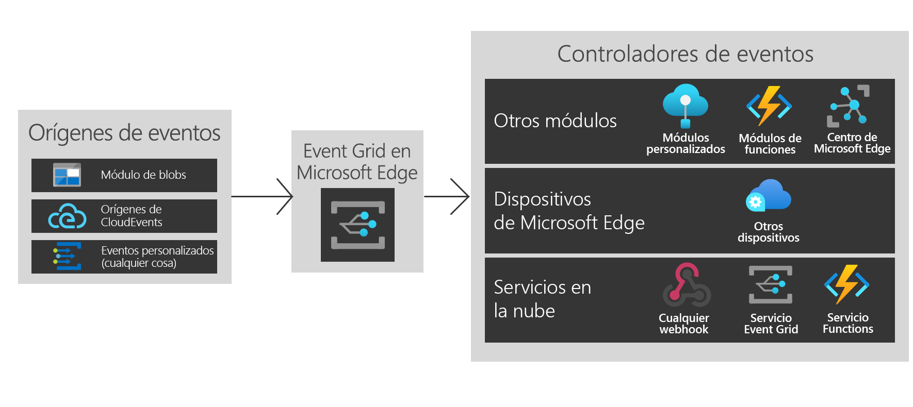

# ¿Qué es Azure Event Grid en Azure IoT Edge?
Event Grid en IoT Edge aporta la eficacia y flexibilidad de Azure Event Grid al borde. Cree temas, publique eventos y suscríbase a varios destinos, tanto si son módulos del mismo dispositivo, como otros dispositivos perimetrales o servicios en la nube.

Como en la nube, el módulo de Event Grid en IoT Edge controla el enrutamiento, el filtrado y la entrega fiable de eventos a escala. Filtre los eventos para asegurarse de que solo se envían los eventos pertinentes a distintos controladores de eventos mediante filtros de cadena, numéricos y booleanos avanzados. La lógica de reintento garantiza que el evento alcance el módulo de destino, incluso si no está disponible en el momento de la publicación. Permite usar Event Grid en IoT Edge como un eficaz mecanismo de almacenamiento y reenvío.

Event Grid en IoT Edge admite tanto CloudEvents v1.0 como esquemas de eventos personalizados. También admite la misma semántica de Pub/Sub que Event Grid en la nube para facilitar la interoperabilidad.

En este artículo se ofrece información general sobre Azure Event Grid en IoT Edge. Para obtener instrucciones paso a paso sobre cómo usar este módulo en Edge, consulte [Publicar y suscribirse a eventos localmente](pub-sub-events-webhook-local.md). 

En esta imagen se muestran algunas de las formas en que puede usar Event Grid en IoT Edge y no es una lista completa de la funcionalidad admitida.

## ¿Cuándo usar Event Grid en IoT Edge?

Event Grid en IoT Edge proporciona un modelo de eventos confiable y fácil de usar entre el perímetro y la nube.

Event Grid en IoT Edge se ha diseñado con un área expuesta del entorno en tiempo de ejecución simétrica al servicio en la nube de Azure para que pueda usar los mismos eventos y llamadas a la API donde lo necesite. Tanto si realiza publicaciones o suscripciones en la nube, como en Edge o ambos, ahora, Event Grid en IoT Edge puede ser la solución única.

Use Event Grid en IoT Edge para desencadenar flujos de trabajo sencillos entre módulos. Por ejemplo, cree un tema y publique eventos "creados en Storage Blob" del módulo de almacenamiento en el tema. Ahora puede suscribir una o varias funciones o módulos personalizados para los temas.

Amplíe su funcionalidad entre dispositivos perimetrales. Si va a publicar eventos del módulo de blob y quiere usar la capacidad de cálculo de varios dispositivos perimetrales cercanos, cree suscripciones entre dispositivos.

Finalmente, conéctese a la nube. Si los eventos del módulo de blobs se van a sincronizar periódicamente en la nube, use el mayor proceso disponible en la nube o envíe datos procesados y cree suscripciones de servicios en la nube adicionales.

Event Grid en IoT Edge proporciona una arquitectura de eventos desacoplados flexible y confiable.

## Orígenes de eventos

Al igual que en la nube, Event Grid en IoT Edge permite la integración directa entre módulos para crear arquitecturas basadas en eventos. Actualmente, los eventos se pueden enviar a Event Grid en IoT Edge desde:

* Azure Blob Storage en IoT Edge
* Orígenes de CloudEvents
* Módulos personalizados y contenedores a través de HTTP POST

## Controladores de eventos

Event Grid en IoT Edge se crea para enviar eventos donde quiera. Actualmente, se admiten los siguientes destinos:

* Otros módulos, como IoT Hub, funciones y módulos personalizados
* Otros dispositivos perimetrales
* WebHooks
* Servicio en la nube de Azure Event Grid
* Event Hubs
* Colas de Service Bus
* Temas de Service Bus
* Colas de almacenamiento

## Entornos admitidos
Actualmente, se admiten los entornos de Windows de 64 bits, Linux de 64 bits y ARM de 32 bits.

## Conceptos

Hay cinco conceptos en Azure Event Grid que le permiten empezar a trabajar:

* **Eventos**: ¿qué ha ocurrido?
* **Orígenes de eventos**: ¿dónde tuvo lugar el evento?
* **Temas**: el punto de conexión donde los publicadores envían los eventos.
* **Suscripciones a eventos**: el punto de conexión o mecanismo integrado para enrutar eventos, a veces a más de un controlador. Los controladores también usan las suscripciones para filtrar los eventos de entrada de forma inteligente.
* **Controladores de eventos**: la aplicación o servicio que reacciona al evento.

## Coste

Event Grid en IoT Edge es gratis durante la versión preliminar pública.

## Issues
Notifique cualquier problema con el uso de Event Grid en IoT Edge en [https://github.com/Azure/event-grid-iot-edge/issues](https://github.com/Azure/event-grid-iot-edge/issues).

## Pasos siguientes

* [Publicar eventos y suscribirse a ellos localmente](pub-sub-events-webhook-local.md)
* [Publicar eventos y suscribirse a ellos en la nube](pub-sub-events-webhook-cloud.md)
* [Desviar eventos a la nube de Event Grid](forward-events-event-grid-cloud.md)
* [Desviar eventos a IoTHub](forward-events-iothub.md)
* [Reacción a eventos de Blob Storage localmente](react-blob-storage-events-locally.md)