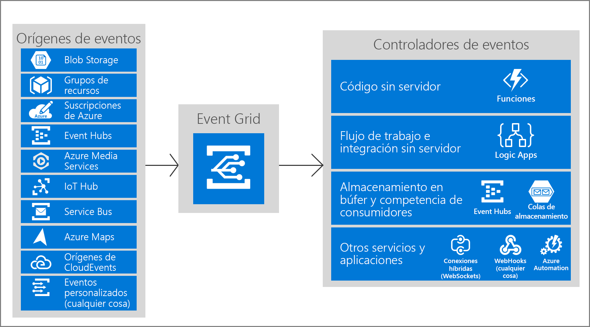

# ¿Qué es Azure Event Grid?

Azure Event Grid permite crear fácilmente aplicaciones con arquitecturas basadas en eventos. En primer lugar, seleccione el recurso de Azure al que le gustaría suscribirse y, posteriormente, asigne el controlador de eventos o el punto de conexión de WebHook para enviar el evento. Event Grid tiene compatibilidad integrada para eventos procedentes de los servicios de Azure, como los blobs de almacenamiento y los grupos de recursos. Event Grid también tiene compatibilidad para sus propios eventos mediante temas personalizados. 

Puede usar filtros para enrutar eventos específicos a distintos puntos de conexión, multidifusión a varios puntos de conexión y asegurarse de que los eventos se entregan de forma confiable.

Azure Event Grid se implementa para maximizar la disponibilidad mediante la distribución nativa por múltiples dominios de error en cada región, y por zonas de disponibilidad (en regiones que los admiten). Para obtener una lista de las regiones que admite Event Grid, consulte [Productos disponibles por región](https://azure.microsoft.com/global-infrastructure/services/?products=event-grid&regions=all).

Este artículo ofrece información general sobre Azure Event Grid. Para comenzar a usar rápidamente Event Grid, consulte [Creación y enrutamiento de eventos personalizados con Azure Event Grid](custom-event-quickstart.md). 

En esta imagen se muestra cómo se conectan los orígenes y los controladores en Event Grid, pero no proporciona una lista completa de las integraciones admitidas.

## Orígenes de eventos

Para obtener una información completa sobre las funcionalidades de cada origen, así como los artículos relacionados, consulte [orígenes de eventos](event-sources.md). Actualmente, los siguientes servicios de Azure admiten el envío de eventos a Event Grid:

* [Suscripciones de Azure (operaciones de administración)](event-sources.md#azure-subscriptions)
* [Container Registry](event-sources.md#container-registry)
* [Temas personalizados](event-sources.md#custom-topics)
* [Event Hubs](event-sources.md#event-hubs)
* [IoT Hub](event-sources.md#iot-hub)
* [Key Vault (versión preliminar)](event-sources.md#key-vault-preview)
* [Media Services](event-sources.md#media-services)
* [Grupos de recursos (operaciones de administración)](event-sources.md#resource-groups)
* [Service Bus](event-sources.md#service-bus)
* [Storage Blob](event-sources.md#storage)
* [Azure Maps](event-sources.md#maps)
* [App Configuration](event-sources.md#app-configuration)
* [SignalR](event-sources.md#azure-signalr)
* [Machine Learning](event-sources.md#azure-machine-learning)

## Controladores de eventos

Para obtener una información completa sobre las funcionalidades de cada controlador, así como los artículos relacionados, consulte [controladores de eventos](event-handlers.md). Actualmente, los siguientes servicios de Azure admiten el control de eventos de Event Grid: 

* [Azure Automation](event-handlers.md#azure-automation)
* [Funciones de Azure](event-handlers.md#azure-functions)
* [Event Hubs](event-handlers.md#event-hubs)
* [conexiones híbridas](event-handlers.md#hybrid-connections)
* [Logic Apps](event-handlers.md#logic-apps)
* [Power Automate (conocido anteriormente como Microsoft Flow)](https://preview.flow.microsoft.com/connectors/shared_azureeventgrid/azure-event-grid/)
* [Service Bus](event-handlers.md#service-bus)
* [Queue Storage](event-handlers.md#queue-storage)
* [Webhooks](event-handlers.md#webhooks)

## Conceptos

Hay cinco conceptos en Azure Event Grid que le permiten empezar a trabajar:

* **Eventos**: ¿qué ha ocurrido?
* **Orígenes de eventos**: ¿dónde tuvo lugar el evento?
* **Temas**: el punto de conexión donde los publicadores envían los eventos.
* **Suscripciones a eventos**: el punto de conexión o mecanismo integrado para enrutar eventos, a veces a más de un controlador. Los controladores también usan las suscripciones para filtrar los eventos de entrada de forma inteligente.
* **Controladores de eventos**: la aplicación o servicio que reacciona al evento.

Para más información acerca de estos conceptos, consulte [Conceptos en Azure Event Grid](concepts.md).

## Capacidades

Estas son algunas características clave de Azure Event Grid:

* **Simplicidad**: seleccione y haga clic para conseguir eventos desde el recurso de Azure a cualquier controlador de eventos o punto de conexión.
* **Filtrado avanzado**: filtre por tipo de evento o por ruta de acceso del publicador del evento para asegurarse de que los controladores de eventos solo reciben eventos pertinentes.
* **Distribución ramificada**: suscriba varios puntos de conexión al mismo evento para enviar copias del evento a tantos lugares como sea necesario.
* **Confiabilidad**: 24 horas de reintento con retroceso exponencial para asegurarse de que se entregan los eventos.
* **Pago por evento**: pague solo por la cantidad utilizada en Event Grid.
* **Alto rendimiento**: cree cargas de trabajo de gran volumen en Event Grid con soporte para millones de eventos por segundo.
* **Eventos integrados**: desarrolle y ejecute rápidamente con eventos integrados definidos por el recurso.
* **Eventos personalizados**: use Event Grid para enrutar, filtrar y entregar de forma confiable eventos personalizados en su aplicación.

Para obtener una comparación de Event Grid, Event Hubs y Service Bus, vea [Choose between Azure services that deliver message](compare-messaging-services.md) (Elección entre servicios de Azure de envío mensajes).

## ¿Qué puedo hacer con Event Grid?

Azure Event Grid proporciona varias características que mejoran considerablemente el trabajo sin servidor, la automatización de operaciones y la [integración](https://azure.com/integration): 

### Arquitecturas de aplicación sin servidor

Event Grid conecta orígenes de datos y controladores de eventos. Por ejemplo, usar Event Grid para desencadenar una función sin servidor que analiza imágenes cuando se agregan a un contenedor de almacenamiento de blobs. 

### Automatización de operaciones

Event Grid permite agilizar la automatización y simplificar el cumplimiento de directivas. Por ejemplo, usar Event Grid para enviar una notificación a Azure Automation cuando se crea una máquina virtual o una base de datos SQL. Use los eventos para comprobar de forma automática que la configuración del servicio es compatible, poner metadatos en herramientas de operaciones, etiquetar máquinas virtuales o archivar elementos de trabajo.

### Integración de aplicaciones

Event Grid conecta su aplicación con otros servicios. Por ejemplo, cree un tema personalizado para enviar los datos de eventos de su aplicación a Event Grid y aprovechar la entrega confiable, el enrutamiento avanzado y la integración directa con Azure que ofrece. También puede usar Event Grid con Logic Apps para procesar datos en cualquier parte, sin necesidad de escribir código. 

## ¿Cuánto cuesta Event Grid?

Azure Event Grid usa un modelo de precios de pago por evento, por lo que solo se paga por lo que usa. Los 100 000 primeras operaciones al mes son gratis. Las operaciones se definen como entrada de eventos, intentos de entrega de suscripción, llamadas de administración y filtrado por el sufijo de asunto. Para obtener información detallada, consulte la [página de precios](https://azure.microsoft.com/pricing/details/event-grid/).

## Pasos siguientes

* [Enrutamiento de los eventos de Storage Blob](../storage/blobs/storage-blob-event-quickstart.md?toc=%2fazure%2fevent-grid%2ftoc.json)  
  Permite responder a los eventos de Storage Blob mediante Event Grid.
* [Crear eventos personalizados y suscribirse a ellos](custom-event-quickstart.md)  
  Para comenzar de inmediato y empezar a enviar sus propios eventos personalizados a cualquier punto de conexión con el inicio rápido de Azure Event Grid.
* [Uso de Logic Apps como controlador de eventos](monitor-virtual-machine-changes-event-grid-logic-app.md)  
  Tutorial sobre la creación de una aplicación con Logic Apps para reaccionar ante eventos enviados por Event Grid.
* [Transmisión de macrodatos a un almacén de datos](event-grid-event-hubs-integration.md)  
  Tutorial en el que se usa Azure Functions para transmitir datos desde Event Hubs al SQL Data Warehouse.
* [Referencia de la API de REST de Event Grid](/rest/api/eventgrid)  
  Proporciona contenido de referencia para la administración de suscripciones a eventos, el enrutamiento y el filtrado.
