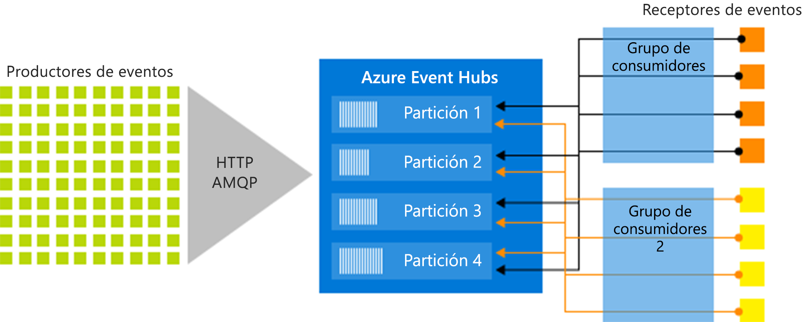

# Azure Event Hubs: una plataforma de streaming de macrodatos y un servicio de ingesta de eventos
Azure Event Hubs es una plataforma de streaming de macrodatos y un servicio de ingesta de eventos. Puede recibir y procesar millones de eventos por segundo. Los datos enviados a un centro de eventos se pueden transformar y almacenar con cualquier proveedor de análisis en tiempo real o adaptadores de procesamiento por lotes y almacenamiento.

Los siguientes escenarios son algunos de los casos donde se puede usar Event Hubs:

- Detección de anomalías (fraude/valores atípicos)
- Registro de aplicaciones
- Canalizaciones de análisis, como secuencias de clics
- Paneles en vivo
- Archivado de datos
- Procesamiento de transacciones
- Procesamiento de telemetría de usuario
- Streaming de telemetría de dispositivo

<iframe width="560" height="315" src="https://www.youtube.com/embed/45wgY-VSk9I" frameborder="0" allow="accelerometer; autoplay; encrypted-media; gyroscope; picture-in-picture" allowfullscreen></iframe>

## ¿Por qué usar Event Hubs?

Los datos solo son valiosos cuando existe una forma sencilla de procesarlos y obtener información oportuna a partir de los orígenes de datos. Event Hubs ofrece una plataforma distribuida de procesamiento de secuencias con baja latencia e integración perfecta, con servicios de datos y análisis dentro y fuera de Azure para crear una canalización de macrodatos completa.

Event Hubs representa la "puerta principal" de una canalización de eventos, conocida a menudo como un *agente de ingesta de eventos* en las arquitecturas de la solución. Un agente de ingesta de eventos es un componente o servicio que se encuentra entre los publicadores de eventos y los consumidores de eventos para desacoplar la producción de un flujo de eventos del consumo de esos eventos. Event Hubs ofrece una plataforma de streaming unificada con búfer de retención de tiempo, de forma que los productores de eventos se desacoplan de los consumidores de eventos.

En las secciones siguientes se describen las características clave del servicio Azure Event Hubs:

## PaaS completamente administrada

Event Hubs es una plataforma como servicio (PaaS) completamente administrada con poca sobrecarga de administración o configuración, para que pueda centrarse en las soluciones empresariales. [Event Hubs para ecosistemas de Apache Kafka](event-hubs-for-kafka-ecosystem-overview.md) le ofrece la experiencia de PaaS de Kafka sin tener que administrar, configurar ni ejecutar los clústeres.

## Compatibilidad con procesamiento por lotes y en tiempo real

Ingiera, almacene en búfer y procese la secuencia en tiempo real para obtener información práctica y útil. Event Hubs usa un [modelo de consumidor con particiones](event-hubs-scalability.md#partitions), que permite que varias aplicaciones procesen la secuencia de manera simultánea y le deja controlar la velocidad del procesamiento.

[Capture](event-hubs-capture-overview.md) los datos casi en tiempo real en una instancia de [Azure Blob Storage](https://azure.microsoft.com/services/storage/blobs/) o de [Azure Data Lake Storage](https://azure.microsoft.com/services/data-lake-store/) para la retención a largo plazo o el procesamiento por microlotes. Puede lograr este comportamiento en la misma secuencia que usa para derivar análisis en tiempo real. La configuración de la captura de datos de eventos es rápida. Su ejecución no conlleva gastos administrativos y se escala automáticamente con las  [unidades de procesamiento](event-hubs-scalability.md#throughput-units) de Event Hubs. Event Hubs le permite centrarse en el procesamiento de datos en lugar de hacerlo en la captura de datos.

Azure Event Hubs también se integra con [Azure Functions](/azure/azure-functions/) para una arquitectura sin servidor.

## Escalable

Con Event Hubs, puede comenzar con los flujos de datos en megabytes y aumentar a gigabytes o terabytes. La característica de [inflado automático](event-hubs-auto-inflate.md) es una de las muchas opciones disponibles para escalar el número de unidades de procesamiento con el fin de satisfacer las necesidades de uso.

## Ecosistema enriquecido

[Event Hubs para ecosistemas de Apache Kafka](event-hubs-for-kafka-ecosystem-overview.md) permite que aplicaciones y clientes de [Apache Kafka (1.0 y posteriores)](https://kafka.apache.org/) se comuniquen con Event Hubs. No es necesario configurar ni administrar sus propios clústeres de Kafka.

Con un ecosistema amplio disponible en diversos [lenguajes (.NET, Java, Python, Go, JavaScript)](https://github.com/Azure/azure-event-hubs), puede empezar a procesar fácilmente los flujos desde Event Hubs. Todos los lenguajes de cliente compatibles proporcionan integración de nivel bajo. El ecosistema también proporciona una perfecta integración con servicios de Azure como Azure Stream Analytics y Azure Functions, lo que permite crear arquitecturas sin servidor.

## Componentes clave de la arquitectura
Event Hubs contiene los siguientes [componentes clave](event-hubs-features.md):

- **Productores de eventos**: una entidad que envía datos a un centro de eventos. Los publicadores de eventos pueden publicar eventos mediante HTTPS, AMQP 1.0 o Apache Kafka (1.0 y posterior)
- **Particiones**: cada consumidor solo lee un subconjunto específico, o partición, de la secuencia de mensajes.
- **Grupos de consumidores**: vista (estado, posición o desplazamiento) de todo un centro de eventos. Los grupos de consumidores permiten consumir aplicaciones y que cada una tenga una vista independiente de la secuencia de eventos. Leen la secuencia de forma independiente, a su propio ritmo y con sus propios desplazamientos.
- **Unidades de procesamiento**: unidades de capacidad compradas previamente que controlan la capacidad de rendimiento de Event Hubs.
- **Receptores de eventos**: cualquier entidad que lea datos de evento de un centro de eventos. Todos los consumidores de Event Hubs se conectan a través de la sesión de AMQP 1.0. El servicio Event Hubs entrega eventos a través de una sesión a medida que están disponibles. Todos los consumidores de Kafka se conectan a través del protocolo de 1.0 de Kafka y las versiones posteriores.

La siguiente ilustración muestra la arquitectura de procesamiento del flujo de Event Hubs:

## Pasos siguientes

Para empezar a usar Event Hubs, consulte los tutoriales sobre **envío y recepción de eventos**:

- [.NET Core](get-started-dotnet-standard-send-v2.md)
- [Java](get-started-java-send-v2.md)
- [Python](get-started-python-send-v2.md)
- [JavaScript](get-started-java-send-v2.md)
- [Go](event-hubs-go-get-started-send.md)
- [C (solo enviar)](event-hubs-c-getstarted-send.md)
- [Apache Storm (solo recibir)](event-hubs-storm-getstarted-receive.md)

Para obtener más información sobre Event Hubs, consulte los siguientes artículos:

- [Información general de las características de Event Hubs](event-hubs-features.md)
- [Preguntas más frecuentes](event-hubs-faq.md).

