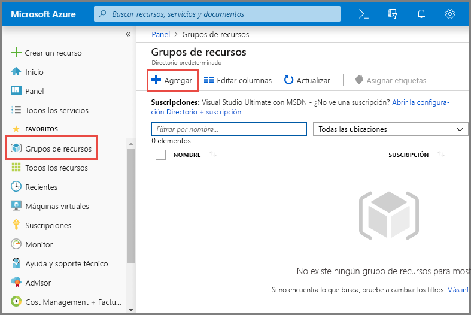
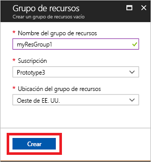
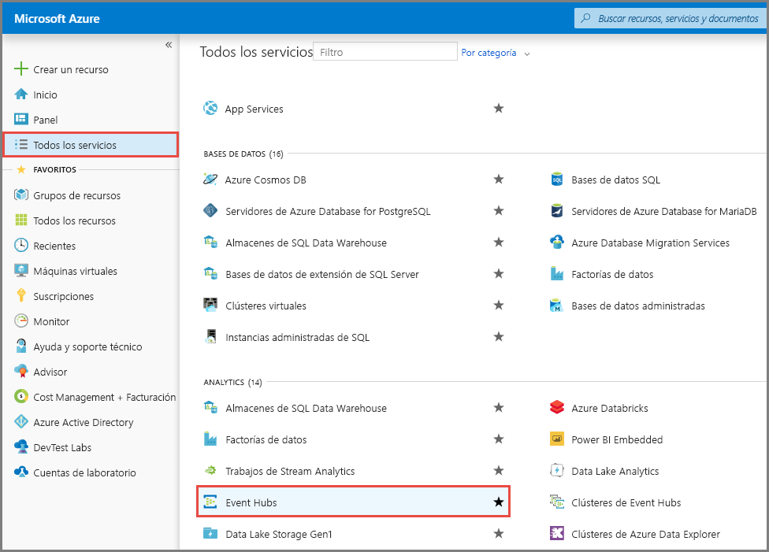
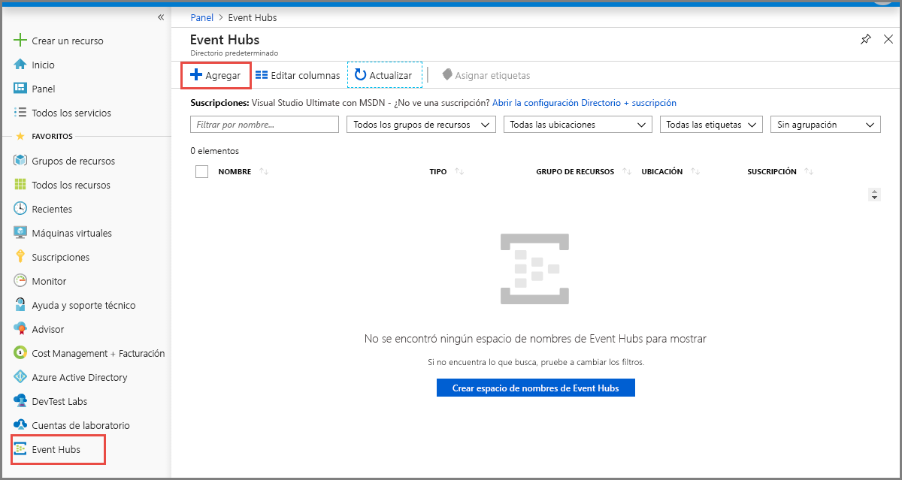
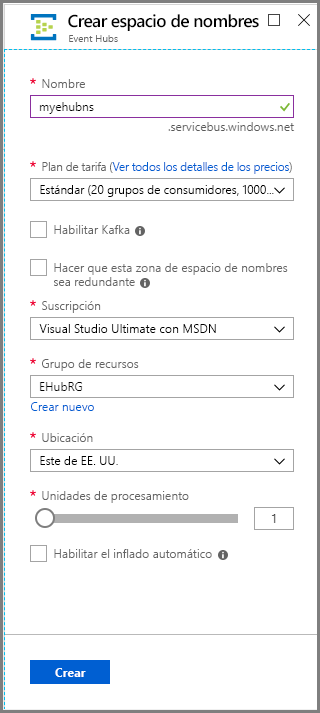
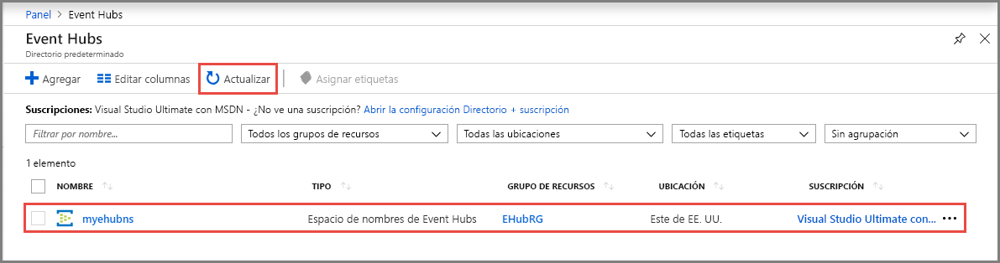
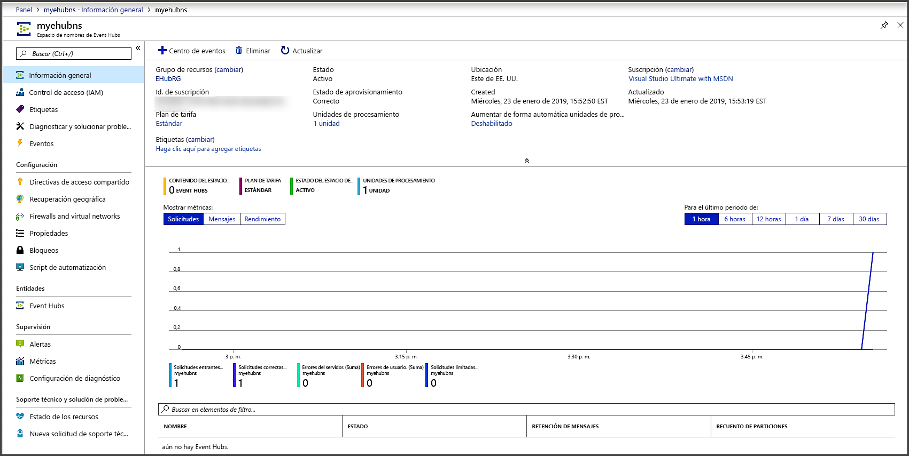
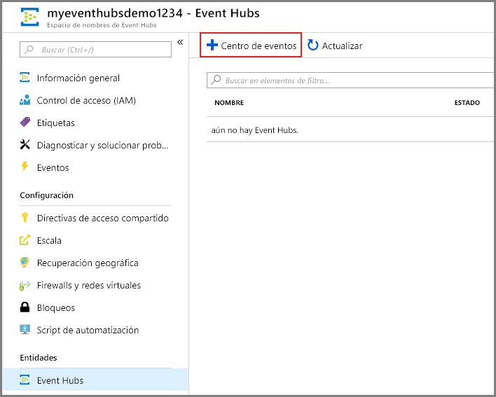
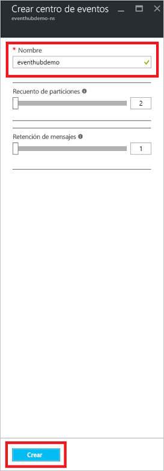
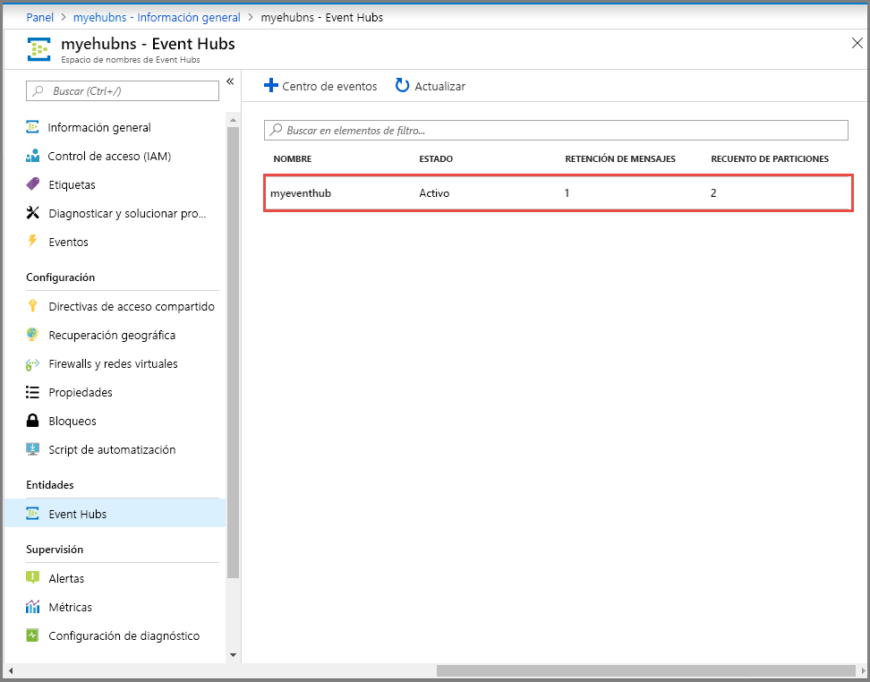

# Inicio rápido: Creación de un centro de eventos mediante Azure Portal
Azure Event Hubs es una plataforma de streaming de macrodatos y servicio de ingesta de eventos de gran escalabilidad capaz de recibir y procesar millones de eventos por segundo. Event Hubs puede procesar y almacenar eventos, datos o telemetría generados por dispositivos y software distribuido. Los datos enviados a un centro de eventos se pueden transformar y almacenar con cualquier proveedor de análisis en tiempo real o adaptadores de procesamiento por lotes y almacenamiento. Para más información sobre Event Hubs, consulte [Introducción a Event Hubs](event-hubs-about.md) y [Características de Event Hubs](event-hubs-features.md).

En esta guía de inicio rápido se crea un centro de eventos mediante [Azure Portal](https://portal.azure.com).

## Requisitos previos

Para completar esta guía de inicio rápido, asegúrese de que tiene:

- Suscripción de Azure. Si no tiene una, [cree una cuenta gratuita](https://azure.microsoft.com/free/) antes de empezar.
- [Visual Studio 2017 Update 3 (versión 15.3, 26730.01)](https://www.visualstudio.com/vs) o posterior.
- [SDK de .NET Standard](https://www.microsoft.com/net/download/windows), versión 2.0 o posterior.

## Creación de un grupo de recursos

Un grupo de recursos es una recopilación lógica de recursos de Azure. Todos los recursos se implementan y administran en un grupo de recursos. Para crear un grupo de recursos:

1. Inicie sesión en el [Azure Portal](https://portal.azure.com).
2. En el panel de la izquierda, seleccione **Grupos de recursos**. A continuación, haga clic en **Agregar**.

   

2. En **Suscripción** seleccione el nombre de la suscripción de Azure en la que desea crear el grupo de recursos.
3. Escriba un **nombre único para el grupo de recursos**. El sistema comprueba de forma inmediata para ver si el nombre está disponible en la suscripción de Azure seleccionada actualmente.
4. Seleccione una **región** para el grupo de recursos.
5. Seleccione **Revisar + crear**.

   
6. En la página **Revisar + crear**, seleccione **Crear**. 

## Creación de un espacio de nombres de Event Hubs

Un espacio de nombres de Event Hubs proporciona un contenedor con un único ámbito, al que hace referencia su nombre de dominio completo, en el que puede crear uno o varios centros de eventos. Para crear un espacio de nombres en el grupo de recursos mediante el portal, haga lo siguiente:

1. En Azure Portal, haga clic en **Crear un recurso** en la parte superior izquierda de la pantalla.
2. Seleccione **Todos los servicios** en el menú de la izquierda y seleccione el **asterisco (`*`)** junto a **Event Hubs** en la categoría **Análisis**. Confirme que **Event Hubs** se agrega a **FAVORITOS** en el menú de navegación de la izquierda. 
    
   
3. Seleccione **Event Hubs** en **FAVORITOS** en el menú de navegación de la izquierda y seleccione **Agregar** en la barra de herramientas.

   
4. En la página **Crear espacio de nombres**, realice los pasos siguientes:
    1. Escriba un nombre para el espacio de nombres. El sistema realiza la comprobación automáticamente para ver si el nombre está disponible.
    2. Elija el plan de tarifa (Básico o Estándar).
    3. Seleccione la **suscripción** en la que desea crear el espacio de nombres.
    4. Seleccione una **ubicación** para el espacio de nombres.
    5. Seleccione **Crear**. Puede que tenga que esperar unos minutos hasta que el sistema aprovisione totalmente los recursos.

       
5. Actualice la página de **Event Hubs** para ver el espacio de nombres del centro de eventos. Puede comprobar el estado de la creación del centro de eventos en las alertas. 

    
6. Seleccione el espacio de nombres. Puede ver la página principal del **espacio de nombres de Event Hubs** en el portal. 

   
    
## Creación de un centro de eventos

Para crear un centro de eventos en el espacio de nombres, haga lo siguiente:

1. En la página Espacio de nombres de Event Hubs, seleccione **Event Hubs** en el menú de la izquierda.
1. En la parte superior de la ventana, haga clic en **+ Centro de eventos**.
   
    
1. Escriba el nombre del centro de eventos y, a continuación, haga clic en **Crear**.
   
    
4. Puede comprobar el estado de la creación del centro de eventos en las alertas. Una vez creado el centro de eventos, puede verlo en la lista de centros de eventos como se muestra en la siguiente imagen:

    

Felicidades. Ha usado el portal para crear un espacio de nombres de Event Hubs y un centro de eventos dentro de ese espacio de nombres. 

## Pasos siguientes

En este artículo, ha creado un grupo de recursos, un espacio de nombres de Event Hubs y un centro de eventos. Puede encontrar instrucciones paso a paso para enviar eventos a un centro de eventos o recibirlos de este en los siguientes tutoriales:  

- **Envío de eventos a un centro de eventos**: [.NET Core](event-hubs-dotnet-standard-getstarted-send.md), [.NET Framework](event-hubs-dotnet-framework-getstarted-send.md), [Java](event-hubs-java-get-started-send.md), [Python](event-hubs-python-get-started-send.md), [Node.js ](event-hubs-node-get-started-send.md), [Go](event-hubs-go-get-started-send.md), [C](event-hubs-c-getstarted-send.md)
- **Recepción de eventos desde un centro de eventos**: [.NET Core](event-hubs-dotnet-standard-getstarted-receive-eph.md), [.NET Framework](event-hubs-dotnet-framework-getstarted-receive-eph.md), [Java](event-hubs-java-get-started-receive-eph.md), [Python](event-hubs-python-get-started-receive.md), [Node.js ](event-hubs-node-get-started-receive.md), [Go](event-hubs-go-get-started-receive-eph.md), [Apache Storm](event-hubs-storm-getstarted-receive.md)

[Azure portal]: https://portal.azure.com/
[3]: ./media/event-hubs-quickstart-portal/sender1.png
[4]: ./media/event-hubs-quickstart-portal/receiver1.png
