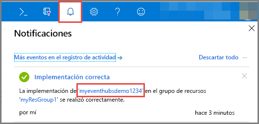

# Guía de inicio rápido: Creación de un centro de eventos mediante Azure Portal
Azure Event Hubs es una plataforma de streaming de macrodatos y servicio de ingesta de eventos de gran escalabilidad capaz de recibir y procesar millones de eventos por segundo. Event Hubs puede procesar y almacenar eventos, datos o telemetría generados por dispositivos y software distribuido. Los datos enviados a un centro de eventos se pueden transformar y almacenar con cualquier proveedor de análisis en tiempo real o adaptadores de procesamiento por lotes y almacenamiento. Información general detallada de Event Hubs, consulte [Introducción a Event Hubs](event-hubs-about.md) y [Características de Event Hubs](event-hubs-features.md).

En esta guía de inicio rápido se crea un centro de eventos mediante [Azure Portal](https://portal.azure.com).

## Requisitos previos

Para completar esta guía de inicio rápido, asegúrese de que tiene:

- Suscripción de Azure. Si no tiene una, [cree una cuenta gratuita](https://azure.microsoft.com/free/) antes de empezar.
- [Visual Studio 2017 Update 3 (versión 15.3, 26730.01)](http://www.visualstudio.com/vs) o posterior.
- [SDK de .NET Standard](https://www.microsoft.com/net/download/windows), versión 2.0 o posterior.

## Creación de un grupo de recursos

Un grupo de recursos es una recopilación lógica de recursos de Azure. Todos los recursos se implementan y administran en un grupo de recursos. Para crear un grupo de recursos haga lo siguiente:

1. Inicie sesión en el [Azure Portal](https://portal.azure.com).
2. En el panel de la izquierda, seleccione **Grupos de recursos**. A continuación, haga clic en **Agregar**.

   

2. Escriba un nombre único para el grupo de recursos. El sistema comprueba de forma inmediata para ver si el nombre está disponible en la suscripción de Azure seleccionada actualmente.

3. En **Suscripción** haga clic en el nombre de la suscripción de Azure en la que desea crear el grupo de recursos.

4. Seleccione una ubicación geográfica para el grupo de recursos.

5. Haga clic en **Create**(Crear).

   

## Crear un espacio de nombres de Event Hubs

Un espacio de nombres de Event Hubs proporciona un contenedor con un único ámbito, al que hace referencia su nombre de dominio completo, en el que puede crear uno o varios centros de eventos. Para crear un espacio de nombres en el grupo de recursos mediante el portal, haga lo siguiente:

1. En Azure Portal, haga clic en **Crear un recurso** en la parte superior izquierda de la pantalla.

2. Haga clic en **Internet de las cosas** y, luego, en **Event Hubs**.

3. En **Crear espacio de nombres**, especifique el nombre del espacio de nombres. El sistema realiza la comprobación automáticamente para ver si el nombre está disponible.

   

4. Después de asegurarse de que el nombre del espacio de nombres está disponible, elija el plan de tarifa (Básico o Estándar). Elija también una suscripción de Azure, el grupo de recursos y la ubicación en la que se va a crear el recurso.
 
5. Haga clic en **Crear** para crear el espacio de nombres. Puede que tenga que esperar unos minutos hasta que el sistema aprovisione totalmente los recursos.
6. Seleccione **Alertas**y, a continuación, seleccione la **implementación** con el mismo nombre que el nombre del espacio de nombres del centro de eventos. 

   
6. Seleccione el espacio de nombres del centro de eventos en la lista de recursos creados de la implementación. 

   
7. En la página **Espacio de nombres de Event Hubs**, seleccione **Directivas de acceso compartido** y, después, haga clic en **RootManageSharedAccessKey**.
    
8. Haga clic en el botón Copiar para copiar la cadena de conexión **RootManageSharedAccessKey** en el Portapapeles. Guarde esta cadena de conexión en una ubicación temporal, como el Bloc de notas, para usarla más adelante.
    
## Crear un centro de eventos

Para crear un centro de eventos en el espacio de nombres, haga lo siguiente:

1. En la página Espacio de nombres de Event Hubs, seleccione **Event Hubs**.
   
    

1. En la parte superior de la ventana, haga clic en **+ Centro de eventos**.
   
    
1. Escriba el nombre del centro de eventos y, a continuación, haga clic en **Crear**.
   
    

Felicidades. Ha usado el portal para crear un espacio de nombres de Event Hubs y un centro de eventos dentro de ese espacio de nombres. 

## Pasos siguientes

En este artículo, ha creado un grupo de recursos, un espacio de nombres de Event Hubs y un centro de eventos. Para obtener instrucciones paso a paso para enviar a un centro de eventos o recibirlos, consulte los siguientes tutoriales:  

- **Envío de eventos a un centro de eventos**: [.NET Standard](event-hubs-dotnet-standard-getstarted-send.md), [.NET Framework](event-hubs-dotnet-framework-getstarted-send.md), [Java](event-hubs-java-get-started-send.md), [Python](event-hubs-python-get-started-send.md), [Node.js ](event-hubs-node-get-started-send.md), [Go](event-hubs-go-get-started-send.md), [C](event-hubs-c-getstarted-send.md)
- **Recepción de eventos desde un centro de eventos**: [.NET Standard](event-hubs-dotnet-standard-getstarted-receive-eph.md), [.NET Framework](event-hubs-dotnet-framework-getstarted-receive-eph.md), [Java](event-hubs-java-get-started-receive-eph.md), [Python](event-hubs-python-get-started-receive.md), [Node.js ](event-hubs-node-get-started-receive.md), [Go](event-hubs-go-get-started-receive-eph.md), [Apache Storm](event-hubs-storm-getstarted-receive.md)

[Azure portal]: https://portal.azure.com/
[3]: ./media/event-hubs-quickstart-portal/sender1.png
[4]: ./media/event-hubs-quickstart-portal/receiver1.png
