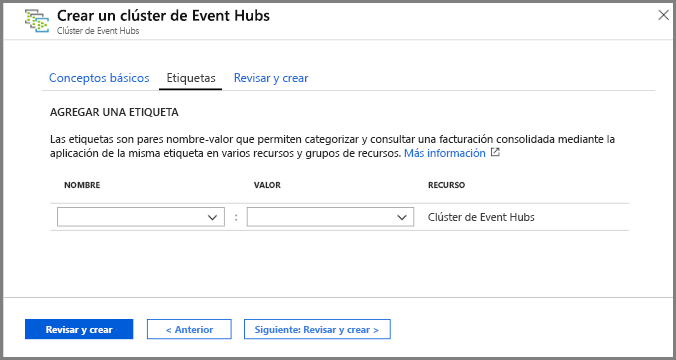
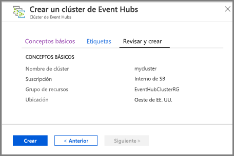
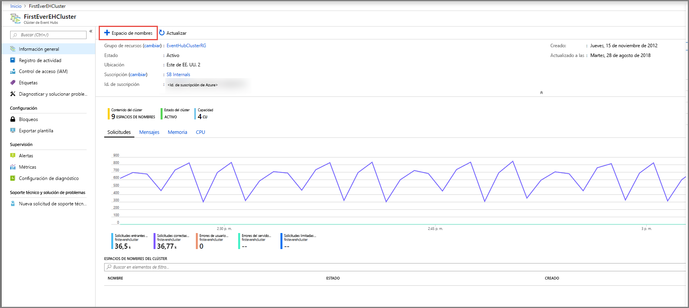
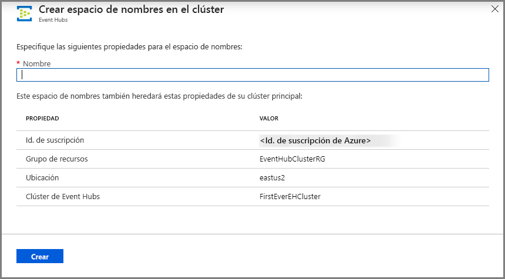
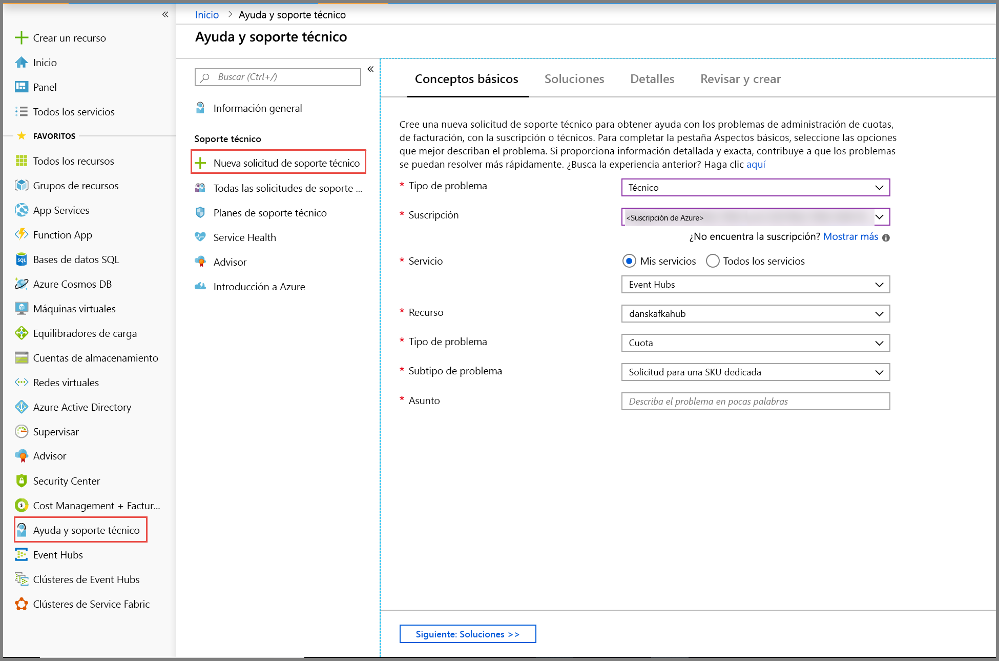
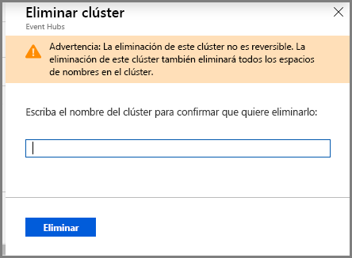

# Inicio rápido: Creación de un clúster de Event Hubs dedicado mediante Azure Portal 
Los clústeres de Event Hubs ofrecen implementaciones de inquilino único para los clientes con las necesidades de streaming más exigentes. Esta oferta tiene un Acuerdo de Nivel de Servicio garantizado del 99,99 % y solo está disponible en nuestro plan de tarifa dedicado. Un [clúster de Event Hubs](event-hubs-dedicated-overview.md) puede incorporar millones de eventos por segundo con capacidad garantizada y una latencia inferior a un segundo. Los espacios de nombres y centros de eventos creados en un clúster incluyen todas las características de la oferta estándar y mucho más, pero sin límites de entrada. La oferta dedicada también incluye la popular característica [Event Hubs Capture](event-hubs-capture-overview.md) sin costo adicional, que permite transferir por lotes secuencias de datos a [Azure Blob Storage](../storage/blobs/storage-blobs-introduction.md) o [Azure Data Lake Storage Gen 1](../data-lake-store/data-lake-store-overview.md) y registrarlas ahí automáticamente.

Los clústeres dedicados se aprovisionan y se facturan por **unidades de capacidad (CU)** , una cantidad de recursos de CPU y memoria asignada previamente. Puede adquirir 1, 2, 4, 8, 12, 16 o 20 CU para cada clúster. En este inicio rápido, le guiaremos por la creación de un clúster de Event Hubs de 1 unidad de capacidad (CU) mediante Azure Portal.

> [!NOTE]
> Esta experiencia de autoservicio está disponible actualmente en versión preliminar en [Azure Portal](https://aka.ms/eventhubsclusterquickstart). Si tiene alguna pregunta sobre la oferta dedicada, póngase en contacto con el [equipo de Event Hubs](mailto:askeventhubs@microsoft.com).

## Prerrequisitos
Para completar esta guía de inicio rápido, asegúrese de que tiene:

- Una cuenta de Azure. Si no dispone de una, puede [adquirir una cuenta](https://azure.microsoft.com/pricing/purchase-options/pay-as-you-go/) antes de comenzar. Esta característica no es compatible con una cuenta gratuita de Azure. 
- [Visual Studio](https://visualstudio.microsoft.com/vs/) 2017 Update 3 (versión 15.3, 26730.01) o posterior.
- [SDK de .NET Standard](https://dotnet.microsoft.com/download), versión 2.0 o posterior.
- [Un grupo de recursos creado](../event-hubs/event-hubs-create.md#create-a-resource-group).

## Creación de un clúster dedicado de Event Hubs
Un clúster de Event Hubs proporciona un único contenedor de ámbito en el que puede crear uno o varios espacios de nombres. En esta fase de versión preliminar de la experiencia de autoservicio del portal, puede crear clústeres de 1 CU en determinadas regiones. Si necesita un clúster mayor de 1 CU, puede enviar una solicitud de soporte técnico de Azure para escalar verticalmente el clúster después de crearlo.

Para crear un clúster en el grupo de recursos mediante Azure Portal, haga lo siguiente:

1. Siga [este vínculo](https://aka.ms/eventhubsclusterquickstart) para crear un clúster en Azure Portal. Por otro lado, seleccione **Todos los servicios** desde el panel de navegación izquierdo, escriba "Clústeres de Event Hubs" en la barra de búsqueda y seleccione "Clústeres de Event Hubs" en la lista de resultados.
2. En la página **Crear clúster**, configure lo siguiente:
    1. Escriba un **nombre para el clúster**. El sistema realiza la comprobación automáticamente para ver si el nombre está disponible.
    2. Seleccione la **suscripción** en la que desea crear el clúster.
    3. Seleccione el **grupo de recursos** en el que desea crear el clúster.
    4. Seleccione una **ubicación** para el clúster. Si su región preferida está atenuada, significa que se encuentra temporalmente sin capacidad y puede enviar una [solicitud de soporte técnico](#submit-a-support-request) al equipo de Event Hubs.
    5. Seleccione el botón **Siguiente: Etiquetas** situado en la parte inferior de la página. Puede que tenga que esperar unos minutos hasta que el sistema aprovisione totalmente los recursos.

        
3. En la página **Etiquetas**, configure lo siguiente:
    1. Escriba un **nombre** y un **valor** para la etiqueta que desea agregar. Este paso es **opcional**.  
    2. Seleccione el botón **Revisar y Crear**.

        
4. En la página **Revisar y crear**, revise los detalles y seleccione **Crear**. 

    

## Creación de un espacio de nombres y un centro de eventos dentro de un clúster

1. Para crear un espacio de nombres dentro de un clúster, en la página **Clúster de Event Hubs** del clúster, seleccione **+ Espacio de nombres** en el menú superior.

    
2. En la página de creación de un espacio de nombres, siga los pasos siguientes:
    1. Escriba **nombre para el espacio de nombres**.  El sistema comprueba si el nombre está disponible.
    2. El espacio de nombres hereda las propiedades siguientes:
        1. Id. de suscripción
        2. Grupo de recursos
        3. Location
        4. Cluster Name
    3. Seleccione **Crear** para crear el espacio de nombres. Ahora puede administrar el clúster.  

        
3. Una vez creado el espacio de nombres, puede [crear un centro de eventos](event-hubs-create.md#create-an-event-hub) tal y como crearía normalmente uno dentro de un espacio de nombres. 

## Enviar una solicitud de soporte técnico.

Si quiere cambiar el tamaño del clúster después de crearlo o si su región preferida no está disponible, envíe una solicitud de soporte técnico mediante estos pasos:

1. En [Azure Portal](https://portal.azure.com), seleccione **Ayuda y soporte técnico** en el menú izquierdo.
2. Seleccione **+ Nueva solicitud de soporte técnico** en el menú de soporte técnico.
3. En la página de soporte técnico, siga estos pasos:
    1. Para **Tipo de problema**, seleccione **Técnico** en la lista desplegable.
    2. En **Suscripción**, seleccione la suscripción.
    3. Para **Servicio**, seleccione **Mis servicios** y, a continuación, seleccione **Event Hubs**.
    4. Para **Recurso**, seleccione el clúster si ya existe, en caso contrario, seleccione **Pregunta general/Recurso no disponible**.
    5. Para **Tipo de problema**, seleccione **Cuota**.
    6. Para **Subtipo de problema**, seleccione uno de los siguientes valores en la lista desplegable:
        1. Seleccione **Solicitud de SKU dedicada** para solicitar que la característica sea admitida en la región.
        2. Seleccione **Solicitar escalar o reducir verticalmente el clúster dedicado** si desea escalar o reducir verticalmente el clúster dedicado. 
    7. En **Asunto**, describa el problema.

        

 ## Eliminación de un clúster dedicado
 
1. Para eliminar el clúster, seleccione **Eliminar** en el menú superior. Tenga en cuenta que, tras la creación del clúster, se le facturará un mínimo de cuatro horas de uso. 
2. Aparecerá un mensaje para confirmar su voluntad de eliminar el clúster.
3. Escriba el **nombre del clúster** y seleccione **Eliminar** para eliminar el clúster.

    

## Pasos siguientes
En este artículo, ha creado un clúster de Event Hubs. Para obtener instrucciones paso a paso para enviar y recibir eventos desde un centro de eventos y capturar eventos en Azure Storage o Azure Data Lake Store, consulte los siguientes tutoriales:

- Envío y recepción de eventos 
    - [.NET Core](get-started-dotnet-standard-send-v2.md)
    - [Java](get-started-java-send-v2.md)
    - [Python](get-started-python-send-v2.md)
    - [JavaScript](get-started-java-send-v2.md)
- [Uso de Azure Portal para habilitar Event Hubs Capture](event-hubs-capture-enable-through-portal.md)
- [Uso de Azure Event Hubs para Apache Kafka](event-hubs-for-kafka-ecosystem-overview.md)
