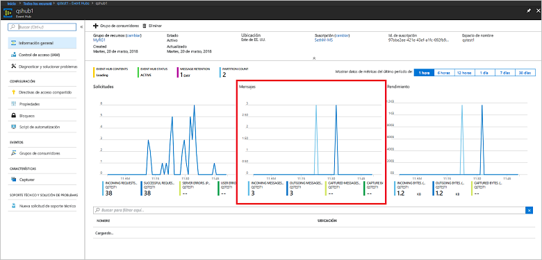

# <a name="quickstart-create-an-event-hub-using-azure-cli"></a>Guía de inicio rápido: Creación de un centro de eventos mediante la CLI de Azure

Azure Event Hubs es una plataforma de streaming de datos y servicio de ingesta de gran escalabilidad capaz de recibir y procesar millones de eventos por segundo. En esta guía de inicio rápido se muestra cómo crear recursos de Event Hubs mediante la CLI de Azure, y a continuación, enviar y recibir flujos de eventos desde un centro de eventos utilizando código Java.

Para completar esta guía de inicio rápido, necesita una suscripción de Azure. Si no tiene una, [cree una cuenta gratuita][] antes de empezar.

## <a name="prerequisites"></a>Requisitos previos

[!INCLUDE [cloud-shell-try-it.md](../../includes/cloud-shell-try-it.md)]

Si decide instalar y usar la CLI de Azure localmente, para este tutorial es preciso que esté ejecutando la CLI de Azure versión 2.0.4 o posterior. Ejecute `az --version` para comprobar la versión. Si necesita instalarla o actualizarla, consulte [Instalación de la CLI de Azure 2.0]( /cli/azure/install-azure-cli).

## <a name="log-on-to-azure"></a>Inicio de sesión en Azure

Los pasos siguientes no son necesarios si ejecuta comandos en Cloud Shell. Si está ejecutando la CLI localmente, realice los pasos a continuación para iniciar sesión en Azure y establecer su suscripción actual:

Ejecute el siguiente comando para iniciar sesión en Azure:

```azurecli-interactive
az login
```

Establezca el contexto de la suscripción actual. Reemplace `MyAzureSub` por el nombre de la suscripción de Azure que desea usar:

```azurecli-interactive
az account set --subscription MyAzureSub
``` 

## <a name="provision-resources"></a>Aprovisionamiento de recursos

Ejecute los siguientes comandos para aprovisionar recursos de Event Hubs. Asegúrese de reemplazar los marcadores de posición `myResourceGroup`, `namespaceName`, `eventHubName` y `storageAccountName` con los valores apropiados:

```azurecli-interactive
# Create a resource group
az group create --name myResourceGroup --location eastus

# Create an Event Hubs namespace
az eventhubs namespace create --name namespaceName --resource-group myResourceGroup -l eastus2

# Create an event hub
az eventhubs eventhub create --name eventHubName --resource-group myResourceGroup --namespace-name namespaceName

# Create a general purpose standard storage account
az storage account create --name storageAccountName --resource-group myResourceGroup --location eastus2 --sku Standard_RAGRS --encryption blob

# List the storage account access keys
az storage account keys list --resource-group myResourceGroup --account-name storageAccountName

# Get namespace connection string
az eventhubs namespace authorization-rule keys list --resource-group myResourceGroup --namespace-name namespaceName --name RootManageSharedAccessKey
```

Copie y pegue la cadena de conexión en una ubicación temporal, como el Bloc de notas, para usarla más adelante.

## <a name="stream-into-event-hubs"></a>Transmisión a Event Hubs

El siguiente paso es descargar el código de ejemplo que transmite los eventos a un centro de eventos y recibe esos eventos utilizando el host de procesador de eventos. En primer lugar, envíe los mensajes:

Clone el [repositorio de GitHub de Event Hubs](https://github.com/Azure/azure-event-hubs) mediante la emisión del comando siguiente:

```bash
git clone https://github.com/Azure/azure-event-hubs.git
```

Vaya a la carpeta **SimpleSend**: `\azure-event-hubs\samples\Java\Basic\SimpleSend\src\main\java\com\microsoft\azure\eventhubs\samples\SimpleSend`. Abra el archivo SimpleSend.java y reemplace la cadena `"Your Event Hubs namaspace name"` con el espacio de nombres de Event Hubs que obtuvo en la sección de "Creación de un espacio de nombres de Event Hubs".

Reemplace `"Your event hub"` con el nombre del centro de eventos que creó en ese espacio de nombres, y `"Your policy name"` con el nombre de la directiva de acceso compartido para el espacio de nombres. A menos que haya creado una nueva directiva, el valor predeterminado es **RootManageSharedAccessKey**. 

Por último, reemplace `"Your primary SAS key"` con el valor de la clave SAS para la directiva en el paso anterior.

### <a name="build-the-application"></a>Compilación de la aplicación 

Vuelva a la carpeta `\azure-event-hubs\samples\Java\Basic\SimpleSend` y ejecute el siguiente comando de compilación:

```shell
mvn clean package -DskipTests
```

### <a name="receive"></a>Recepción

Descargue ahora el ejemplo del host de procesador de eventos, que recibe los mensajes que acaba de enviar. Vaya a la carpeta **EventProcessorSample**: `\azure-event-hubs\samples\Java\Basic\EventProcessorSample\src\main\java\com\microsoft\azure\eventhubs\samples\eventprocessorsample`.

En el archivo EventProcessorSample.java y reemplace el valor `----EventHubsNamespaceName-----` con el espacio de nombres de Event Hubs que obtuvo en la sección dedicada a la creación de un espacio de nombres de Event Hubs de este artículo. 

Reemplace los otros valores de cadena en este archivo: reemplace `----EventHubName-----` con el nombre del centro de eventos que creó en ese espacio de nombres, y `-----SharedAccessSignatureKeyName-----` con el nombre de la directiva de acceso compartido para el espacio de nombres. A menos que haya creado una nueva directiva, el valor predeterminado es **RootManageSharedAccessKey**.

Reemplace `---SharedAccessSignatureKey----` con el valor de la clave SAS para la directiva en el paso anterior, reemplace `----AzureStorageConnectionString----` con la cadena de conexión para la cuenta de almacenamiento que creó, y `----StorageContainerName----` con el nombre del contenedor en la cuenta de almacenamiento que creó. 

Por último, sustituya `----HostNamePrefix----` por el nombre de la cuenta de almacenamiento.

### <a name="build-the-receiver"></a>Compilación del receptor 

Para compilar la aplicación receptora, vaya hasta la carpeta `\azure-event-hubs\samples\Java\Basic\EventProcessorSample` y ejecute el comando siguiente:

```shell
mvn clean package -DskipTests
```

### <a name="run-the-apps"></a>Ejecución de las aplicaciones

Si las compilaciones se realizan correctamente, está preparado para enviar y recibir eventos. En primer lugar, ejecute la aplicación **SimpleSend** y observe cómo se envían los eventos. Para ejecutar el programa, vaya a la carpeta `\azure-event-hubs\samples\Java\Basic\SimpleSend` y ejecute el comando siguiente:

```shell
java -jar ./target/simplesend-1.0.0-jar-with-dependencies.jar
```

A continuación, ejecute la aplicación **EventProcessorSample** y observe cómo se reciben los eventos. Para ejecutar el programa, vaya a la carpeta `\azure-event-hubs\samples\Java\Basic\EventProcessorSample` y ejecute el comando siguiente:
   
```shell
java -jar ./target/eventprocessorsample-1.0.0-jar-with-dependencies.jar
```

Después de ejecutar ambos programas, puede comprobar la página de información general de Azure Portal para el centro de eventos para ver el recuento de mensajes entrantes y salientes:



## <a name="clean-up-resources"></a>Limpieza de recursos

Ejecute el siguiente comando para quitar el grupo de recursos, el espacio de nombres, la cuenta de almacenamiento y todos los recursos relacionados. Sustituya `myResourceGroup` por el nombre del grupo de recursos que ha creado:

```azurecli
az group delete --resource-group myResourceGroup
```

## <a name="understand-the-sample-code"></a>Descripción del código de ejemplo

Esta sección contiene información más detallada acerca de lo que hace el código de ejemplo.

### <a name="send"></a>Envío

En el archivo SimpleSend.java, la mayoría del trabajo se realiza en el método main(). En primer lugar, el código usa una instancia de `ConnectionStringBuilder` para construir la cadena de conexión con los valores definidos por el usuario para el espacio de nombres, nombre del centro de eventos, nombre de la clave SAS y la propia clave SAS:

```java
final ConnectionStringBuilder connStr = new ConnectionStringBuilder()
        .setNamespaceName("Your Event Hubs namespace name")
        .setEventHubName("Your event hub")
        .setSasKeyName("Your policy name")
        .setSasKey("Your primary SAS key");
```

El objeto de Java que contiene la carga del evento, se convierte en Json:

```java
final Gson gson = new GsonBuilder().create();

final PayloadEvent payload = new PayloadEvent(1);
byte[] payloadBytes = gson.toJson(payload).getBytes(Charset.defaultCharset());
EventData sendEvent = EventData.create(payloadBytes);  
```

El cliente de Event Hubs se crea en esta línea de código:

```java
final EventHubClient ehClient = EventHubClient.createSync(connStr.toString(), executorService);
```

El bloque try/finally envía un evento round robin a una partición no especificada:

```java
try {
    for (int i = 0; i < 100; i++) {

        String payload = "Message " + Integer.toString(i);
        //PayloadEvent payload = new PayloadEvent(i);
        byte[] payloadBytes = gson.toJson(payload).getBytes(Charset.defaultCharset());
        EventData sendEvent = EventData.create(payloadBytes);

        // Send - not tied to any partition
        // Event Hubs service will round-robin the events across all EventHubs partitions.
        // This is the recommended & most reliable way to send to EventHubs.
        ehClient.sendSync(sendEvent);
    }

    System.out.println(Instant.now() + ": Send Complete...");
    System.in.read();
} finally {
    ehClient.closeSync();
    executorService.shutdown();
}
```

### <a name="receive"></a>Recepción 

La operación de recepción se produce en el archivo EventProcessorSample.java. En primer lugar, este declara constantes para mantener el espacio de nombres de Event Hubs y otras credenciales:

```java
String consumerGroupName = "$Default";
String namespaceName = "----NamespaceName----";
String eventHubName = "----EventHubName----";
String sasKeyName = "----SharedAccessSignatureKeyName----";
String sasKey = "----SharedAccessSignatureKey----";
String storageConnectionString = "----AzureStorageConnectionString----";
String storageContainerName = "----StorageContainerName----";
String hostNamePrefix = "----HostNamePrefix----";
```

Al igual que el programa SimpleSend, el código crea a continuación una instancia de ConnectionStringBuilder para construir la cadena de conexión:

```java
ConnectionStringBuilder eventHubConnectionString = new ConnectionStringBuilder()
    .setNamespaceName(namespaceName)
    .setEventHubName(eventHubName)
    .setSasKeyName(sasKeyName)
    .setSasKey(sasKey);
```

El *host de procesador de eventos* es una clase que simplifica la recepción de eventos desde Event Hubs mediante la administración de puntos de control persistentes y recepciones paralelas desde dichas instancias de Event Hubs. El código crea ahora una instancia de `EventProcessorHost`:

```java
EventProcessorHost host = new EventProcessorHost(
    EventProcessorHost.createHostName(hostNamePrefix),
    eventHubName,
    consumerGroupName,
    eventHubConnectionString.toString(),
    storageConnectionString,
    storageContainerName);
```

Después de declarar algún código de control de errores, la aplicación define la clase `EventProcessor`, una implementación de la interfaz `IEventProcessor`. Esta clase procesa los eventos recibidos:

```java
public static class EventProcessor implements IEventProcessor
{
    private int checkpointBatchingCount = 0;
    ...
```

Se llama al método `onEvents()` cuando se reciben eventos en esta partición del centro de eventos:

```java
@Override
public void onEvents(PartitionContext context, Iterable<EventData> events) throws Exception
{
    System.out.println("SAMPLE: Partition " + context.getPartitionId() + " got event batch");
    int eventCount = 0;
    for (EventData data : events)
    {
        try
        {
         System.out.println("SAMPLE (" + context.getPartitionId() + "," + data.getSystemProperties().getOffset() + "," +
                data.getSystemProperties().getSequenceNumber() + "): " + new String(data.getBytes(), "UTF8"));
             eventCount++;
                
         // Checkpointing persists the current position in the event stream for this partition and means that the next
         // time any host opens an event processor on this event hub+consumer group+partition combination, it will start
         // receiving at the event after this one. Checkpointing is usually not a fast operation, so there is a tradeoff
         // between checkpointing frequently (to minimize the number of events that will be reprocessed after a crash, or
         // if the partition lease is stolen) and checkpointing infrequently (to reduce the impact on event processing
         // performance). Checkpointing every five events is an arbitrary choice for this sample.
         this.checkpointBatchingCount++;
         if ((checkpointBatchingCount % 5) == 0)
         {
            System.out.println("SAMPLE: Partition " + context.getPartitionId() + " checkpointing at " +
                    data.getSystemProperties().getOffset() + "," + data.getSystemProperties().getSequenceNumber());
            // Checkpoints are created asynchronously. It is important to wait for the result of checkpointing
            // before exiting onEvents or before creating the next checkpoint, to detect errors and to ensure proper ordering.
            context.checkpoint(data).get();
         }
    }
        catch (Exception e)
        {
            System.out.println("Processing failed for an event: " + e.toString());
        }
    }
    System.out.println("SAMPLE: Partition " + context.getPartitionId() + " batch size was " + eventCount + " for host " + context.getOwner());
}
```

## <a name="next-steps"></a>Pasos siguientes

En este artículo, ha creado un espacio de nombres de Event Hubs y otros recursos necesarios para enviar y recibir eventos de su centro de eventos. Para más información, continúe con el siguiente tutorial:

> [!div class="nextstepaction"]
> [Visualización de anomalías de datos en flujos de datos de Event Hubs](event-hubs-tutorial-visualize-anomalies.md)

[cree una cuenta gratuita]: https://azure.microsoft.com/free/?ref=microsoft.com&utm_source=microsoft.com&utm_medium=docs&utm_campaign=visualstudio
[Install Azure CLI 2.0]: /cli/azure/install-azure-cli
[az group create]: /cli/azure/group#az-group-create
[fully qualified domain name]: https://wikipedia.org/wiki/Fully_qualified_domain_name
